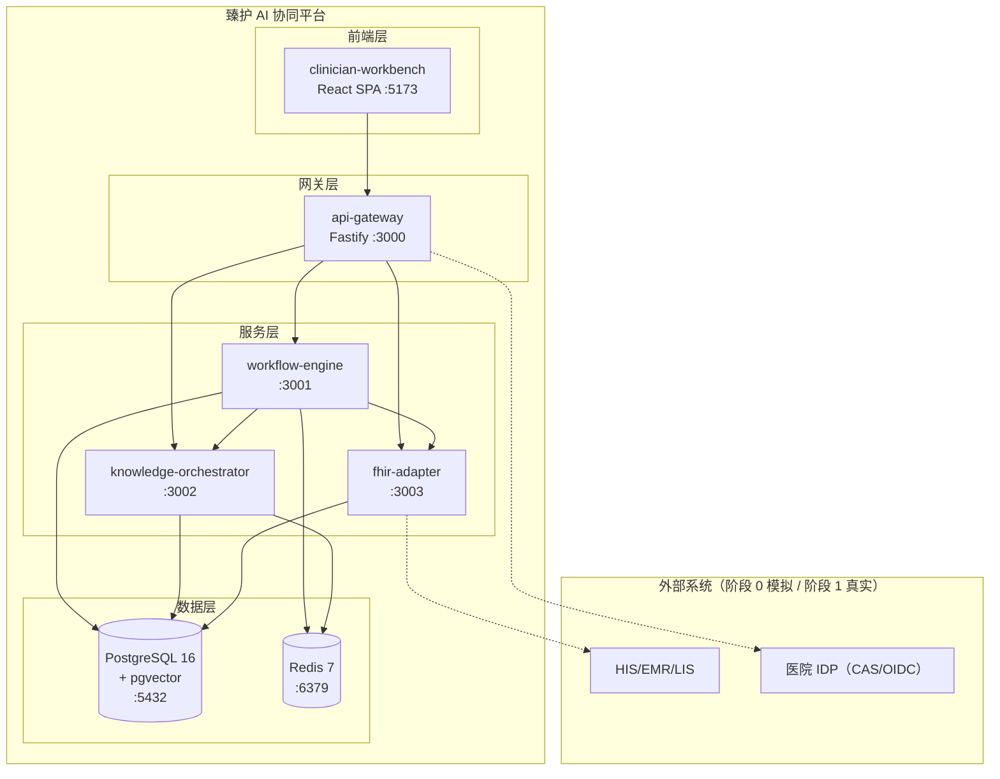
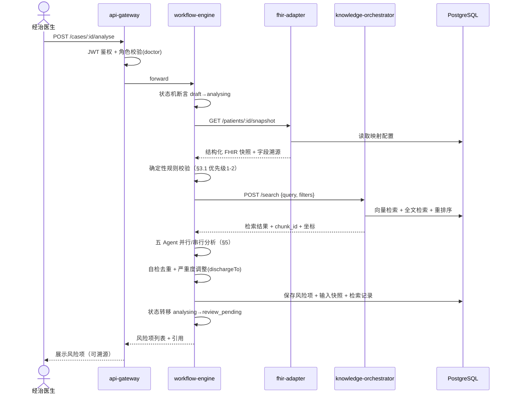
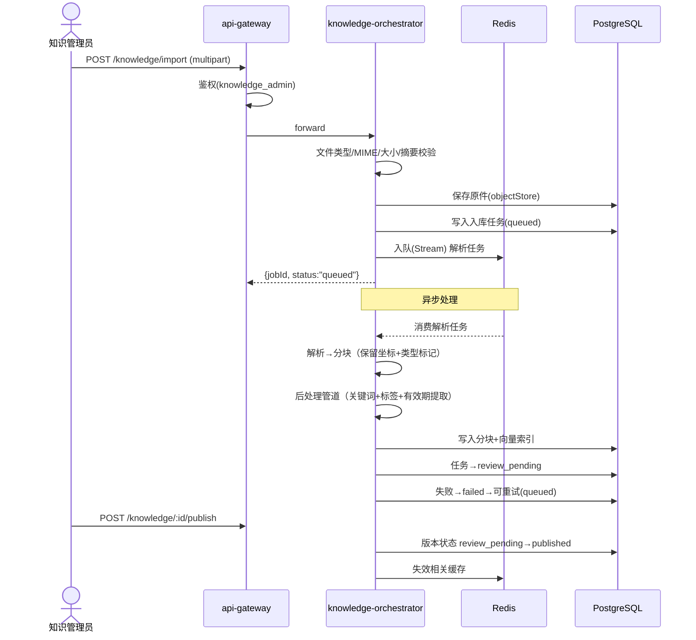
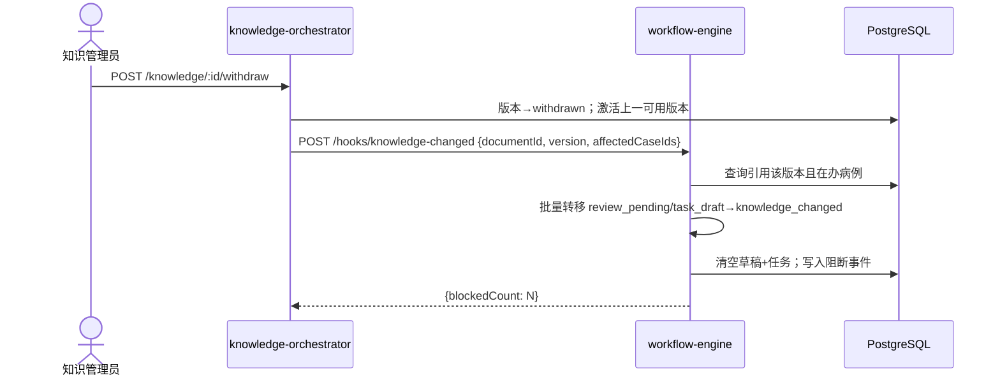

# 臻护 系统架构总览 v0.1

**状态：** 正式工程架构基线，基于需求 v0.2 + PoC 工程基线
**原则：** 双轨隔离（正式代码不 import poc/）、需求可追溯（每个设计决策标注需求条款）

---

## 1. 架构原则

| # | 决策 | 理由 | 需求依据 |
|---|------|------|----------|
| P1 | **模块化单体**：monorepo 内按服务目录拆分，进程内 REST 调用；阶段 2 可拆为独立部署单元 | 阶段 0-1 团队规模小，微服务运维成本高于收益；但必须保留清晰服务边界以便后续拆分 | §0.1 分阶段交付 |
| P2 | **同步为主 + 异步补齐**：病例分析同步返回（用户等待），知识入库异步处理（parsing→indexing 后台任务） | 出院审核是同步交互场景；知识导入不阻塞用户操作 | §4.2 摄取、§4.4 入库任务状态机 |
| P3 | **服务端状态机强制**：所有状态转移由 clinical-contracts 包断言，不允许调用方绕过 | 病例 `knowledge_changed` 阻断（§4.4）、知识版本发布/撤回（§4.4）必须后端强制执行 | §3.4 状态机、§4.4 反向阻断 |
| P4 | **证据链不可变**：每次检索、Agent 输出、人工决策均写入审计库，已保存记录不可覆盖 | "谁在何时基于什么证据做了什么决定"是可追溯的闭合链路 | §7 审计、§4.3 知识资产 |
| P5 | **LLM 只读原则**：Agent 不得直接写数据库/外部接口；输出经 JSON Schema 校验后由服务端写入 | 防止幻觉污染业务数据 | §5.1 Agent 输出校验、§3.3 工具白名单 |

---

## 2. 服务拆分

```
apps/clinician-workbench/        # React 前端（phase 0：PoC 风格工作台 → phase 1：正式医生工作台）
services/api-gateway/            # 统一入口：鉴权、限流、请求关联、审计事件发射
services/workflow-engine/        # 病例状态机 + Agent 编排 + 审核流 + 任务草稿
services/knowledge-orchestrator/ # 知识导入/生命周期/混合检索/后处理/反向阻断钩子（已有骨架）
services/fhir-adapter/           # 医院数据映射、Patient Compartment、资源校验、Consent/AuditEvent
packages/clinical-contracts/     # 共享契约：状态机、角色、权限边界（已有）
```

| 服务 | 目录 | 核心职责 | 数据所有权 | 依赖 |
|------|------|----------|-----------|------|
| **api-gateway** | `services/api-gateway/` | JWT/OIDC 鉴权、角色→权限映射、速率限制、请求关联 ID 注入、审计事件发射、路由转发 | 会话状态、限流计数器 | 无（基础设施层） |
| **workflow-engine** | `services/workflow-engine/` | 病例 CRUD（§3.4 状态机）、五 Agent 编排（§5）、风险项审核（confirm/reject/edit/escalate）、交接单/随访任务草稿生成、`knowledge_changed` 阻断检测、`reconcile` 恢复 | cases、risk_items、reviews、task_drafts、workflow_audit | knowledge-orchestrator（检索）、fhir-adapter（数据获取） |
| **knowledge-orchestrator** | `services/knowledge-orchestrator/` | 知识导入（§4.2：类型校验→解析→分块→后处理→索引）、生命周期（§4.4：published→superseded→withdrawn）、混合检索（向量+全文+重排序）、反向阻断钩子（知识撤回→通知 workflow-engine）、预置样例管理 | documents、chunks、vectors、ingestion_jobs、knowledge_audit | 无业务服务依赖（独立知识域） |
| **fhir-adapter** | `services/fhir-adapter/` | HIS/EMR/LIS → FHIR 资源映射（§6.1：Patient/Encounter/Condition/Observation/MedicationRequest/CarePlan/Task）、Patient Compartment 范围计算、资源校验、Consent 管理、AuditEvent 标准化 | fhir_mappings、consent_records、validation_schemas | 无（仅对接外部系统） |

**服务间通信：** REST over HTTP，同步调用。api-gateway 负责请求路由；workflow-engine 调用 knowledge-orchestrator 的检索 API 和 fhir-adapter 的数据获取 API。每个请求携带 `X-Request-ID` 和 `X-Actor`（操作者身份），由各服务独立记录审计。

**已有骨架：** `services/knowledge-orchestrator/` 已定义 10 个端口（identityGateway、policyRepository、documentRepository 等），正式工程需为这些端口提供 PostgreSQL/Redis 实现。

---

## 3. 技术选型

| 关注点 | 推荐 | 候选 | 理由 |
|--------|------|------|------|
| 后端运行时 | **Node.js ≥22 (ESM)** | Python/FastAPI, Go | monorepo 已 Node.js；前后端同语言降低协作成本；现有 PoC 测试和契约包均为 ESM |
| API 框架 | **Fastify v5** | Express, FastAPI | JSON Schema 内置校验（对齐 §5.1 Agent 输出校验）；插件体系支持按服务拆分；性能优于 Express |
| 数据库 | **PostgreSQL 16 + pgvector** | MySQL, MongoDB | 关系型（工作流、审计）+ 向量检索统一存储；pgvector 在百万级分块规模下有成熟 HNSW 索引支持（§4.2 混合检索） |
| 缓存/队列 | **Redis 7** | RabbitMQ, Kafka | 轻量；同时满足会话缓存（§6.3）+ 异步任务队列（§4.4 入库任务）；Redis Streams 支持消费者组和重试 |
| LLM 管线 | **LangChain.js + 自研编排** | Dify, 纯自研 | §9 已列出 langgraph 为候选参考；LangChain 生态与 Node.js 兼容；自定义 Agent 编排由 workflow-engine 实现，只借用 LangChain 的模型调用/检索链抽象 |
| 嵌入模型 | **阶段 0 预置向量 → 阶段 1 按评测选定** | text2vec, bge-m3 | 需求 §4.2 要求首期以评测通过的模型建立基线，不定死 |
| 身份鉴权 | **Keycloak (OIDC)** | 医院 CAS, Auth0 | 开源、自托管、支持 OIDC/SAML 双协议（对接医院 CAS）；§2 角色资源级权限通过 JWT claims + 服务端 policyRepository 实现 |
| 部署 | **Docker Compose（阶段 0）→ K8s（阶段 2）** | 纯进程, Nomad | 阶段 0 只需单机复现；阶段 1 单科试点 3-5 个容器足够；阶段 2 生产再上 K8s |
| 前端框架 | **Vite + React 18 + MUI + Tailwind** | Next.js | 轻量 SPA 足够（非 SSR 场景）；MUI 医疗表单组件成熟；Tailwind 用于布局微调 |

---

## 4. 部署拓扑



- **阶段 0：** 全部 Docker Compose 单机部署；HIS/IDP 为 mock 服务
- **阶段 1：** api-gateway 对接医院 IDP；fhir-adapter 对接医院只读接口
- **阶段 2：** 各服务独立扩缩容；K8s + Ingress + 持久卷

---

## 5. 数据流与时序

### 5.1 出院分析流程（核心链路）



### 5.2 知识入库流程



### 5.3 知识反向阻断（§4.4 核心安全机制）



---

## 6. 安全边界

```
┌────────────────────────────────────────────┐
│  互联网/院内网络                              │
│  ┌──────────┐  HTTPS + JWT                  │
│  │ 浏览器     │───────┬──────────────────────┐│
│  └──────────┘       │                      ││
│                  ┌──▼────────┐  内部网络    ││
│                  │api-gateway│  (Docker     ││
│                  │  :3000    │  network)    ││
│                  └──┬───┬───┘              ││
│            ┌────────┘   └────────┐         ││
│      ┌─────▼────┐  ┌────────────▼──┐      ││
│      │workflow   │  │knowledge-     │      ││
│      │-engine    │  │orchestrator   │      ││
│      └─────┬─────┘  └──────┬────────┘      ││
│            │               │               ││
│      ┌─────▼────┐         │               ││
│      │fhir-      │         │               ││
│      │adapter    │         │               ││
│      └──────────┘         │               ││
│                            │               ││
│         ┌──────────────────▼──┐            ││
│         │   PostgreSQL+Redis  │            ││
│         └─────────────────────┘            ││
└────────────────────────────────────────────┘
```

| 安全控制点 | 机制 | 需求依据 |
|-----------|------|----------|
| 网络分区 | 前端↔网关 HTTPS/TLS；网关↔服务 HTTP（Docker 内部网络）；数据库不暴露对外端口 | §3.2 逻辑分层 |
| 服务间认证 | api-gateway 签发内部 JWT（短 TTL）或 mTLS（阶段 2）；服务间调用携带 `X-Request-ID` + `X-Actor` | §7 审计、§2 权限 |
| 数据脱敏 | fhir-adapter 输出前脱敏：患者姓名→token、身份证号→hash、地址→模糊化；原始字段保留于脱敏映射表 | §7 脱敏/令牌化 |
| 审计采集点 | api-gateway（请求入口）、workflow-engine（状态转移、人工决策）、knowledge-orchestrator（知识发布/撤回）、fhir-adapter（数据访问） | §7 AuditEvent |
| LLM 数据边界 | Agent 仅接收经 fhir-adapter 脱敏的结构化快照，不接收原始病历全文；模型调用记录输入摘要+输出版本 | §7 外部模型数据流向 |
| 查询审计 | 每次 search/read 操作记录查询 URL + 参数（`who queried whose what data`），与增删改同等追溯 | §7 + 参考 medplum AuditEvent |

---

## 7. 工程化基建

### 7.1 Monorepo 结构（npm workspaces）

```
zhenhu-care-handoff/
├── package.json              # workspaces: ["apps/*","services/*","packages/*"]
├── tsconfig.base.json        # 共享 TS 配置（target:ES2023, module:NodeNext）
├── eslint.config.mjs         # 共享 ESLint 扁平配置
├── vitest.workspace.ts       # Vitest workspace 配置
├── docker-compose.yml        # 阶段 0 统一部署描述
├── apps/
│   └── clinician-workbench/  # Vite + React + MUI + Tailwind
├── services/
│   ├── api-gateway/          # Fastify + @fastify/jwt + @fastify/rate-limit
│   ├── workflow-engine/      # Fastify + langchain + zod（Schema 校验）
│   ├── knowledge-orchestrator/ # Fastify（已有骨架） + pgvector
│   └── fhir-adapter/         # Fastify + fhir-schema-validator
├── packages/
│   └── clinical-contracts/   # 已有：状态机 + 角色权限（扩展为 TS）
└── tests/
    ├── contracts/            # 契约测试（已有 7/7）
    ├── integration/          # 服务间集成测试
    └── e2e/                  # Playwright 端到端测试
```

### 7.2 CI 策略

| 触发器 | 动作 |
|--------|------|
| PR → main | contracts:test + lint + typecheck + unit tests |
| PR + label:`e2e` | 上述 + integration tests + e2e smoke |
| main push | 上述全部 + Docker 镜像构建 + 推送到私有 Registry |
| 阶段 1 发布 | 附加：金标准评测集自动评分、知识版本兼容性检查 |

### 7.3 测试金字塔

```
        /\
       /E2E\         Playwright：出院分析→审核→发布→待办 完整链路
      /------\
     / 集成测试 \      服务间 REST 调用：workflow-engine → knowledge-orchestrator
    /----------\
   /  单元测试    \    Vitest：状态机转移、Agent 输出 Schema 校验、知识检索权重
  /--------------\
 /  契约测试(已有)  \  clinical-contracts 状态转移断言
/------------------\
```

---

## 8. 待明确事项

| # | 事项 | 影响范围 | 建议决策者 |
|---|------|----------|-----------|
| A | **clinical-contracts 迁移 TypeScript：** 当前为 `.mjs`，需决定是否保持 ESM `.mjs` 还是迁移到 `.ts` | 全仓库类型安全 | 架构+工程 |
| B | **LLM 网关选型：** 使用 LangChain.js 原生模型调用还是统一模型网关（如 LiteLLM）？影响多模型切换与成本追踪 | workflow-engine | 架构+运维 |
| C | **嵌入模型评测基准：** 需在阶段 1 启动前确定评测集和评测流程（§4.2 首期基线） | knowledge-orchestrator | 临床+架构 |
| D | **checkpoint 持久化实现：** §6.2 要求 langgraph 式 Checkpoint + INTERRUPT/RESUME，正式工程是否内置 langgraph.js 还是自研？ | workflow-engine | 架构 |
| E | **Patient Compartment 范围：** 阶段 1 接入真实数据后，哪些关联资源纳入可见范围由医院确认（§6.1） | fhir-adapter | 医院信息科 |
| F | **escalate 后处理流程：** 升级项的接收角色、响应时限、超时自动放行或升级策略（§3.3） | workflow-engine | 临床+医院 |

---

## 附录 A：需求追溯矩阵

| 架构决策 | 需求条款 |
|----------|----------|
| 服务端状态机强制（P3） | §3.4 病例状态机、§4.4 知识状态机 |
| evidence 不可变（P4） | §4.3 引用不可变审计证据 |
| LLM 只读原则（P5） | §5.1 输出校验、§3.3 工具白名单 |
| PostgreSQL+pgvector 统一存储 | §6.3 逻辑存储边界（知识索引库 + 工作流审计库） |
| 混合检索三级降级 | §8.4 检索降级链（重排序→默认排序→纯BM25→规则兜底） |
| knowledge_changed 反向阻断钩子 | §4.4 已发布知识被撤回→在办病例阻断 |
| CarePlan 双模式 | §6.1 CarePlan（出院交接 short-term vs 慢病照护 long-term） |
| 查询审计 | §7 + 需求增强建议 P1-8 |

## 附录 B：与 PoC 关键差异

| 维度 | PoC | 正式工程 |
|------|-----|----------|
| 状态持久化 | 进程内存（病例）+ 本地文件（知识） | PostgreSQL 统一持久化 |
| Agent 实现 | 确定性规则模拟 | LLM 驱动 + LangChain 编排 |
| 前端 | 单文件 HTML（`poc/web/app.js`） | React SPA 组件化 |
| 类型安全 | JSDoc 注释 | TypeScript strict mode |
| 测试 | 手动场景 + 基础单元测试 | 测试金字塔（契约→单元→集成→E2E） |
| 部署 | `node poc/api/server.mjs` 单进程 | Docker Compose 多服务 |
