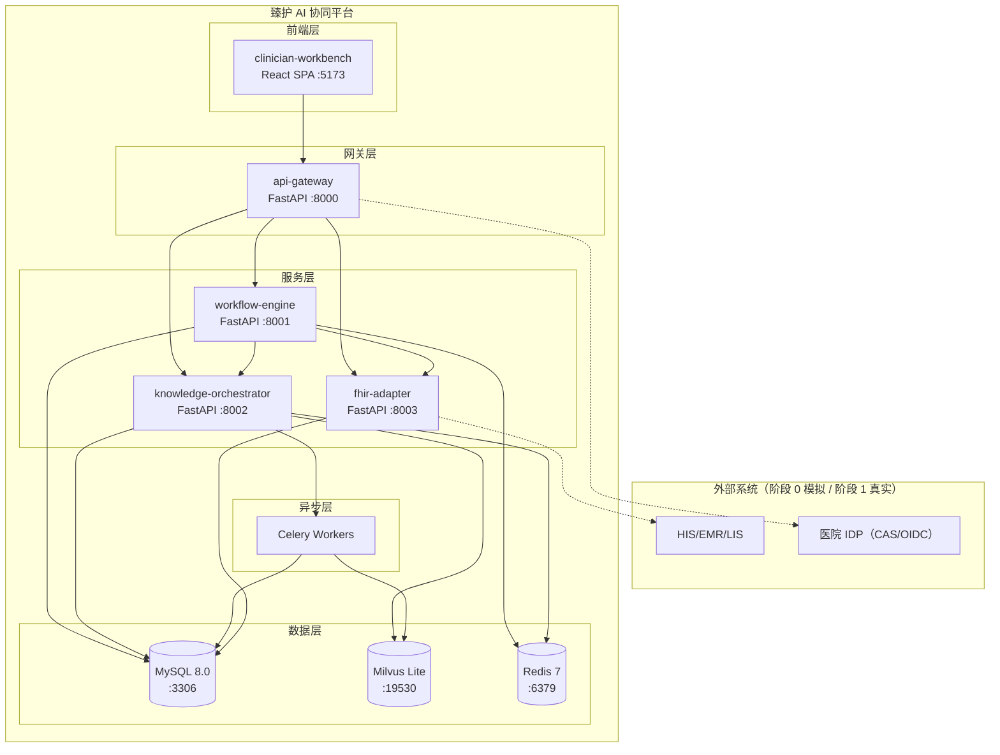
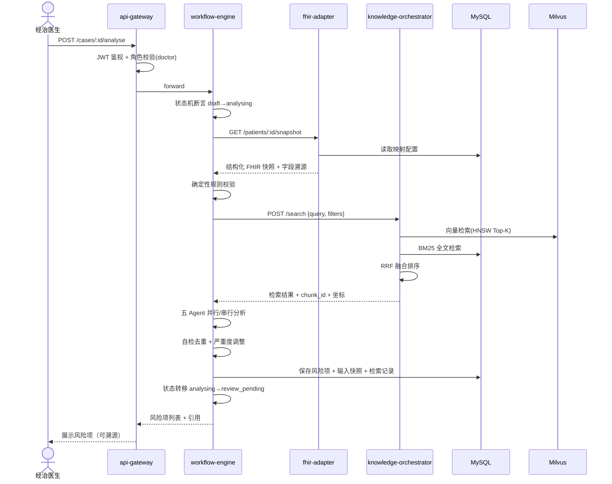
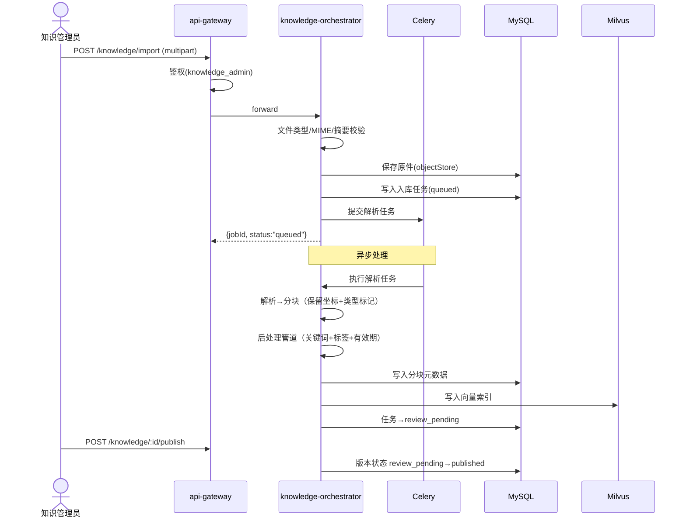
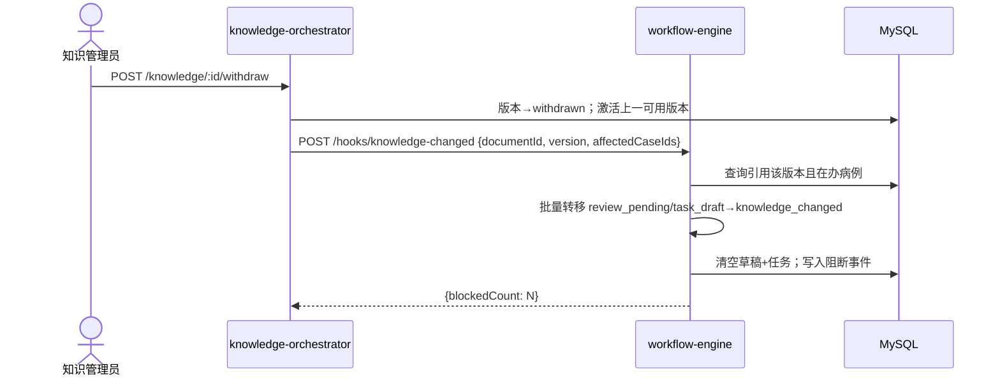

# 臻护 系统架构总览 v0.2

**状态：** 正式工程架构基线 v0.2，基于需求 v0.2 + 技术选型重评估
**原则：** 双轨隔离、需求可追溯、每个决策标注"为何不用 v0.1 选项"

---

## v0.1 → v0.2 主要变更

| # | 变更 | v0.1 | v0.2 | 驱动因素 |
|---|------|------|------|----------|
| 1 | 后端运行时 | Node.js+Fastify | **FastAPI (Python 3.12+)** | LLM 生态天然主场；sentence-transformers 一等公民 |
| 2 | 业务数据库 | PostgreSQL 16 | **MySQL 8.0** | 医院 DBA 标配；运维生态成熟 |
| 3 | 向量数据库 | pgvector | **Milvus Lite 2.4** | 独立扩容不拖累业务库；HNSW 性能更优 |
| 4 | 数据校验 | ajv+zod | **Pydantic v2** | 天然对齐 Agent 输出 JSON Schema 校验 |
| 5 | FHIR 库 | 无成熟方案 | **fhir.resources + fhirpy** | Python FHIR 生态远强于 Node.js |
| 6 | 异步队列 | Redis Streams | **Celery + Redis** | Celery 成熟的任务重试/监控体系 |
| 7 | ORM | 无 | **SQLAlchemy 2.0 async** | MySQL 读写分离、连接池管理 |
| 8 | 嵌入模型 | 子进程调用 | **sentence-transformers 原生加载** | 无跨进程开销，内存共享 |
| 9 | 契约包 | TypeScript .mjs | **Python Pydantic models** | 与后端同语言，零跨语言序列化 |
| 10 | 前端 | Vite+React+MUI | **同左（评估确认）** | 见 §3 前端方案评估 |

---

## 1. 架构原则

| # | 决策 | 理由 | 需求依据 |
|---|------|------|----------|
| P1 | **模块化单体**：monorepo 内按服务目录拆分，进程内 REST 调用；阶段 2 可拆为独立部署单元 | 阶段 0-1 团队规模小，微服务运维成本高于收益 | §0.1 分阶段交付 |
| P2 | **同步为主 + 异步补齐**：病例分析同步返回，知识入库 Celery 异步处理 | 出院审核是同步交互；知识导入不阻塞用户 | §4.2、§4.4 |
| P3 | **服务端状态机强制**：所有状态转移由 clinical-contracts 断言，不允许调用方绕过 | 病例阻断、知识撤回必须后端强制执行 | §3.4、§4.4 |
| P4 | **证据链不可变**：检索、Agent 输出、人工决策均写入审计库，已保存记录不可覆盖 | 可追溯闭合链路 | §7、§4.3 |
| P5 | **LLM 只读原则**：Agent 不得直接写数据库；输出经 Pydantic 校验后由服务端写入 | 防止幻觉污染业务数据 | §5.1、§3.3 |

---

## 2. 服务拆分

```
apps/clinician-workbench/        # React 前端（Vite + MUI + Tailwind）
services/api-gateway/            # FastAPI 统一入口：鉴权、限流、审计发射
services/workflow-engine/        # FastAPI 病例状态机 + Agent 编排 + 审核流
services/knowledge-orchestrator/ # FastAPI 知识导入/检索/生命周期/反向阻断
services/fhir-adapter/           # FastAPI 医院数据映射、FHIR 校验
packages/clinical-contracts/     # Python 共享契约：Pydantic 状态机/角色/权限
```

| 服务 | 目录 | 核心职责 | 数据所有权 | 依赖 |
|------|------|----------|-----------|------|
| **api-gateway** | `services/api-gateway/` | JWT/OIDC 鉴权、角色→权限映射、速率限制、请求关联 ID、审计事件发射 | 会话状态、限流计数器 | 无 |
| **workflow-engine** | `services/workflow-engine/` | 病例 CRUD（状态机）、五 Agent 编排、风险项审核、交接单/随访任务草稿、knowledge_changed 阻断检测 | cases、risk_items、reviews、task_drafts、workflow_audit | knowledge-orchestrator、fhir-adapter |
| **knowledge-orchestrator** | `services/knowledge-orchestrator/` | 知识导入、生命周期、混合检索（向量+BM25+重排序）、反向阻断钩子、预置样例管理 | documents、chunks、ingestion_jobs、knowledge_audit | 无业务依赖 |
| **fhir-adapter** | `services/fhir-adapter/` | HIS/EMR/LIS → FHIR 映射、Patient Compartment、资源校验、Consent/AuditEvent | fhir_mappings、consent_records | 无（仅对接外部） |

**服务间通信：** REST over HTTP。api-gateway 路由转发；workflow-engine 调用 knowledge-orchestrator 检索 API 和 fhir-adapter 数据 API。每个请求携带 `X-Request-ID` + `X-Actor`。

**Python 项目结构（各服务统一）：**
```
services/workflow-engine/
├── pyproject.toml       # uv 管理依赖
├── src/
│   ├── __init__.py
│   ├── main.py          # FastAPI app 入口
│   ├── api/             # 路由 handlers
│   ├── models/          # SQLAlchemy ORM models
│   ├── schemas/         # Pydantic v2 请求/响应 schema
│   ├── services/        # 业务逻辑
│   └── agents/          # Agent 定义（仅 workflow-engine）
└── tests/
```

---

## 3. 技术选型

### 3.1 后端技术栈

| 关注点 | v0.1 | v0.2 | 为何不用 v0.1 |
|--------|------|------|---------------|
| 后端运行时 | Node.js+Fastify | **FastAPI (Python 3.12+)** | LangChain/sentence-transformers 为 Python 一等公民；Node.js 版 LangChain 功能滞后、社区小 |
| API 框架 | Fastify v5 | **FastAPI + Uvicorn** | Pydantic 原生集成 → Agent JSON Schema 校验零额外代码 |
| 业务数据库 | PostgreSQL+pgvector | **MySQL 8.0** | 医院 DBA 标配 MySQL；pgvector 运维经验稀缺 |
| 向量数据库 | pgvector | **Milvus Lite 2.4** | 独立扩容不影响业务库；HNSW/IVF 索引性能优于 pgvector |
| 数据校验 | ajv+zod | **Pydantic v2** | 与 FastAPI 深度集成；性能比 zod 快 5-10x |
| FHIR 库 | 无 | **fhir.resources + fhirpy** | Python 有成熟 FHIR R4 模型库；Node.js 仅实验性项目 |
| 异步队列 | Redis Streams | **Celery + Redis** | Celery 自带重试、监控、任务链；Redis Streams 需手动实现 |
| ORM | 无 | **SQLAlchemy 2.0 async** | 连接池管理、读写分离内置；Node.js 无同等成熟方案 |
| 嵌入模型 | 子进程调用 | **sentence-transformers 原生** | 内存共享无 IPC 开销；子进程方案序列化损耗大 |
| 契约包 | TypeScript .mjs | **Python Pydantic models** | 与后端同语言，消除跨语言序列化与同步问题 |
| 身份鉴权 | Keycloak | **Keycloak（保留）** | 自托管+OIDC/SAML 双协议，v0.1 决策无需更改 |
| LLM 管线 | LangChain.js | **LangChain Python + 自研编排** | Python 生态 LangChain 版本领先、文档完善 |

### 3.2 前端方案评估与推荐

| 方案 | 框架 | UI 库 | 路由 | 状态 | 评估 |
|------|------|------|------|------|------|
| **A** | Vite+React 18 | MUI v6 + Tailwind | React Router v7 | Zustand | ⭐ **推荐** |
| B | Vite+React 18 | Ant Design 5 | React Router v7 | Zustand | 组件定制困难，医疗场景风格不匹配 |
| C | Next.js 14 | MUI v6 + Tailwind | App Router | Zustand | SSR 对医生工作台无收益，复杂度>收益 |
| D | Vite+React 18 | shadcn/ui + Tailwind | TanStack Router | Zustand | DatePicker/DataGrid 需从零搭建，医疗表单成本过高 |

**推荐方案 A，理由：**
- MUI v6 DataGrid/DatePicker/Autocomplete 是医疗表单刚需，Ant Design 组件风格重且难定制，shadcn/ui 需从零搭建
- Tailwind 仅用于布局微调（间距/响应式），核心组件仍用 MUI，不重复造轮子
- React Router v7 类型安全的路由参数；Zustand 比 Redux 轻量，适合单页工作台
- 打包体积偏高可通过 MUI tree-shaking + lazy loading 缓解

### 3.3 完整前端技术栈

| 关注点 | 选型 | 理由 |
|--------|------|------|
| 框架 | Vite 5 + React 18 | 快速 HMR；SPA 场景最优 |
| UI 库 | MUI v6 | 医疗表单组件成熟（DataGrid/DatePicker） |
| 样式 | Tailwind CSS 3 | 布局微调、响应式间距 |
| 路由 | React Router v7 | 类型安全、嵌套路由、loader/action |
| 状态管理 | Zustand | 轻量（<1KB），无 boilerplate |
| 数据请求 | TanStack Query v5 | 缓存/去重/乐观更新，与 REST 天然匹配 |
| 表单校验 | React Hook Form + Zod | 性能最优（非受控）；Zod 类型推导 |
| 类型 | TypeScript 5.x | strict mode，与后端 Pydantic 类型对齐 |
| 构建 | Vite 5 | Rollup 底层，ESM 原生 |
| 测试 | Vitest + Playwright | 与 Vite 共享配置；Playwright 覆盖 E2E |

---

## 4. 数据库：MySQL + Milvus 双库方案

```
MySQL 8.0（业务数据）              Milvus Lite 2.4（向量检索）
├── cases                        ├── knowledge_chunks（向量 + HNSW 索引）
├── risk_items                   └── 混合检索：向量相似度 + MySQL BM25 全文
├── reviews
├── task_drafts
├── audit_events
├── documents（元数据）
├── users / roles / permissions
├── ingestion_jobs
└── fhir_mappings
```

**检索流程：** knowledge-orchestrator 接收查询 → Milvus 向量检索（Top-K）→ MySQL `MATCH...AGAINST` BM25 全文 → 融合排序（RRF）→ 返回结果 + chunk_id + 坐标。

**部署：** Docker Compose 中 `mysql:8.0` + `milvusdb/milvus:2.4-lite`（standalone 模式），阶段 0 两个容器足够。

---

## 5. 部署拓扑



- **阶段 0：** Docker Compose 单机（5 容器：MySQL + Milvus + Redis + API + Frontend）
- **阶段 1：** api-gateway 对接医院 IDP；fhir-adapter 对接医院只读接口
- **阶段 2：** 各服务独立扩缩容；K8s + Ingress + 持久卷

---

## 6. 数据流与时序

### 6.1 出院分析流程



### 6.2 知识入库流程



### 6.3 知识反向阻断



---

## 7. 安全边界

```
┌────────────────────────────────────────────┐
│  互联网/院内网络                              │
│  ┌──────────┐  HTTPS + JWT                  │
│  │ 浏览器     │───────┬──────────────────────┐│
│  └──────────┘       │                      ││
│                  ┌──▼────────┐  内部网络    ││
│                  │api-gateway│  (Docker     ││
│                  │FastAPI    │  network)    ││
│                  │  :8000    │              ││
│                  └──┬───┬───┘              ││
│            ┌────────┘   └────────┐         ││
│      ┌─────▼────┐  ┌────────────▼──┐      ││
│      │workflow   │  │knowledge-     │      ││
│      │-engine    │  │orchestrator   │      ││
│      └─────┬─────┘  └──────┬────────┘      ││
│            │               │               ││
│      ┌─────▼────┐         │               ││
│      │fhir-      │         │               ││
│      │adapter    │         │               ││
│      └──────────┘         │               ││
│                            │               ││
│   ┌────────────────────────▼───────────┐   ││
│   │  MySQL 8.0  │  Milvus  │  Redis   │   ││
│   └────────────────────────────────────┘   ││
└────────────────────────────────────────────┘
```

| 安全控制点 | 机制 | 需求依据 |
|-----------|------|----------|
| 网络分区 | 前端↔网关 HTTPS；网关↔服务 HTTP（Docker 内网）；数据库不暴露对外端口 | §3.2 |
| 服务间认证 | api-gateway 签发内部 JWT（短 TTL）；服务间调用携带 `X-Request-ID` + `X-Actor` | §7、§2 |
| 数据脱敏 | fhir-adapter 输出前脱敏：患者姓名→token、身份证→hash、地址→模糊化 | §7 |
| 审计采集点 | api-gateway（入口）、workflow-engine（状态转移）、knowledge-orchestrator（知识发布/撤回）、fhir-adapter（数据访问） | §7 |
| LLM 数据边界 | Agent 仅接收脱敏快照，不接收原始病历全文 | §7 |
| 查询审计 | 每次 search/read 记录查询 URL + 参数（who queried whose what data） | §7 |

---

## 8. 工程化基建

### 8.1 Monorepo 结构

```
zhenhu-care-handoff/
├── pyproject.toml             # Python monorepo（uv workspaces）
├── package.json               # 前端 npm workspaces
├── docker-compose.yml         # 阶段 0 统一部署
├── apps/
│   └── clinician-workbench/   # Vite + React + MUI + Tailwind
│       ├── package.json
│       ├── vite.config.ts
│       └── src/
├── services/
│   ├── api-gateway/           # FastAPI + python-jose + slowapi
│   ├── workflow-engine/       # FastAPI + LangChain + Pydantic v2
│   ├── knowledge-orchestrator/# FastAPI + pymilvus + sentence-transformers
│   └── fhir-adapter/          # FastAPI + fhir.resources + fhirpy
├── packages/
│   └── clinical-contracts/    # Python Pydantic：状态机 + 角色 + 权限
└── tests/
    ├── contracts/             # 契约测试
    ├── integration/           # 服务间集成测试
    └── e2e/                   # Playwright 端到端测试
```

### 8.2 关键依赖

```
[Python monorepo - pyproject.toml]
dependencies = [
    "fastapi>=0.109", "uvicorn[standard]", "sqlalchemy[asyncio]>=2.0",
    "pydantic>=2.5", "langchain>=0.1", "sentence-transformers>=2.7",
    "pymilvus>=2.4", "fhir.resources>=7.0", "fhirpy>=2.0",
    "celery[redis]>=5.3", "python-jose[cryptography]", "slowapi"
]

[前端 - package.json]
dependencies: react, @mui/material, @mui/x-data-grid, @mui/x-date-pickers,
              tailwindcss, react-router-dom, zustand, @tanstack/react-query,
              react-hook-form, zod
```

### 8.3 CI 策略

| 触发器 | 动作 |
|--------|------|
| PR → main | contracts:test + lint(ruff) + typecheck(mypy) + pytest |
| PR + label:`e2e` | 上述 + integration tests + e2e smoke |
| main push | 上述全部 + Docker 镜像构建 + 推送到私有 Registry |
| 阶段 1 发布 | 附加：金标准评测集自动评分、知识版本兼容性检查 |

### 8.4 测试金字塔

```
        /\
       /E2E\         Playwright：出院分析→审核→发布→待办 完整链路
      /------\
     / 集成测试 \      pytest + httpx：服务间 REST 调用
    /----------\
   /  单元测试    \    pytest：状态机转移、Agent 输出 Schema 校验、知识检索
  /--------------\
 /  契约测试       \  clinical-contracts Pydantic 状态转移断言
/------------------\
```

---

## 9. 待明确事项

| # | 事项 | 影响范围 | 建议决策者 |
|---|------|----------|-----------|
| A | **clinical-contracts Python 迁移：** 当前为 .mjs，需转为 Pydantic models | 全仓库类型安全 | 架构+工程 |
| B | **LLM 网关选型：** LangChain 原生调用 vs LiteLLM 统一网关？ | workflow-engine | 架构+运维 |
| C | **嵌入模型评测基准：** 阶段 1 前需确定评测集和流程 | knowledge-orchestrator | 临床+架构 |
| D | **Checkpoint 持久化：** LangGraph Python Checkpoint + INTERRUPT/RESUME vs 自研？ | workflow-engine | 架构 |
| E | **Patient Compartment 范围：** 阶段 1 接入真实数据后由医院确认 | fhir-adapter | 医院信息科 |
| F | **MySQL 全文索引中文分词：** 需确认使用内置 ngram parser 还是接入 Elasticsearch | knowledge-orchestrator | 架构+运维 |

---

## 附录 A：需求追溯矩阵

| 架构决策 | 需求条款 |
|----------|----------|
| 服务端状态机强制（P3） | §3.4、§4.4 |
| 证据链不可变（P4） | §4.3 |
| LLM 只读原则（P5） | §5.1、§3.3 |
| MySQL+Milvus 双库 | §6.3 逻辑存储边界 |
| 混合检索三级降级 | §8.4 检索降级链 |
| knowledge_changed 反向阻断 | §4.4 |
| CarePlan 双模式 | §6.1 |

## 附录 B：与 v0.1 关键差异

| 维度 | v0.1 | v0.2 |
|------|------|------|
| 后端语言 | Node.js+TypeScript | Python 3.12+ |
| API 框架 | Fastify | FastAPI + Uvicorn |
| 业务数据库 | PostgreSQL 16+pgvector | MySQL 8.0 |
| 向量数据库 | pgvector 扩展 | Milvus Lite 2.4 |
| 异步任务 | Redis Streams | Celery + Redis |
| ORM | 无（手动 SQL） | SQLAlchemy 2.0 async |
| 嵌入模型 | 子进程调用 | sentence-transformers 原生 |
| 契约包 | TypeScript .mjs | Python Pydantic |
| 部署 | 4 容器 | 5 容器（+Milvus +Celery） |
