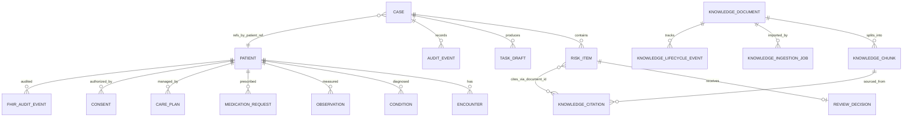

# 数据模型与存储方案 v0.2

**状态：** 正式工程基线，基于 `models.py`/`schemas.py` 现有实现扩展。
**覆盖：** workflow-engine（4 表）+ knowledge-orchestrator（5 表）+ fhir-adapter（8 表）
**依据：** 需求 §3.4/§4.4/§6.1，架构总览 §4

---

## 1. ER 图（全服务逻辑视图）

---

## 2. 表结构

### 2.1 workflow-engine（MySQL: `zhenhu_workflow`）

| 表 | 核心字段 | 类型 | 约束 | 索引 | 来源 |
|---|---|---|---|---|---|
| **cases** | `id`（PK, INT, AUTO） `case_id`（UQ） `state` `patient_ref` `input_snapshot_id` `workflow_version` `created_at`, `updated_at` | INTEGER VARCHAR(64) VARCHAR(32) VARCHAR(255) VARCHAR(64) VARCHAR(16) DATETIME(tz) | PK, UQ(case_id) | `idx_case_id` `idx_state` `idx_created_at` | `models.py` 已有 |
| **risk_items** | `id`（PK, INT, AUTO） `risk_id`（UQ） `case_id`（FK→cases.case_id） `category` `severity`, `severity_label` `title`, `summary` `status`（pending/confirmed/rejected） `decision`, `decision_note` `evidence_snippet` `citation_excerpt`, `citation_document_id` `created_at` | INTEGER VARCHAR(64) VARCHAR(64) VARCHAR(64) VARCHAR(16), VARCHAR(64) VARCHAR(256), TEXT VARCHAR(32) TEXT, TEXT TEXT TEXT, VARCHAR(128) DATETIME(tz) | PK, UQ(risk_id) FK(case_id) | `idx_risk_id` `idx_case_id` | `models.py` 已有 |
| **task_drafts** | `id`（PK, INT, AUTO） `draft_id`（UQ） `case_id`（FK→cases.case_id） `status`（ready/simulated_published） `sop_version` `tasks_json`（JSON array） `created_at` | INTEGER VARCHAR(64) VARCHAR(64) VARCHAR(32) VARCHAR(32) TEXT DATETIME(tz) | PK, UQ(draft_id) FK(case_id) | `idx_draft_id` `idx_case_id` | `models.py` 已有 |
| **audit_events** | `id`（PK, INT, AUTO） `audit_id`（UQ） `case_id`（FK→cases.case_id） `actor`, `event_type` `title`, `detail` `before_state`, `after_state` `workflow_version` `occurred_at` | INTEGER VARCHAR(64) VARCHAR(64) VARCHAR(64), VARCHAR(64) VARCHAR(256), TEXT VARCHAR(32), VARCHAR(32) VARCHAR(16) DATETIME(tz) | PK, UQ(audit_id) FK(case_id) | `idx_audit_id` `idx_case_id` `idx_audit_case_ts`(case_id, occurred_at) | `models.py` 已有 |
| **review_decisions** | `id`（PK, INT, AUTO） `decision_id`（UQ） `risk_id`（FK→risk_items.risk_id） `action`（confirm/reject/escalate） `note` `actor_id` `decided_at` | INTEGER VARCHAR(64) VARCHAR(64) VARCHAR(16) TEXT VARCHAR(64) DATETIME(tz) | PK, UQ(decision_id) FK(risk_id) | `idx_risk_id` | ✦ 新增：审核决策不可变记录 |

### 2.2 knowledge-orchestrator（MySQL: `zhenhu_knowledge`）

| 表 | 核心字段 | 类型 | 约束 | 索引 |
|---|---|---|---|---|
| **knowledge_documents** | `id`（PK, INT, AUTO） `document_id`（UQ） `title`, `version` `owner` `status`（ENUM: review_pending/published/expired/withdrawn/superseded/archived/review_rejected） `effective_from`, `effective_until` `source_format`（txt/md/pdf/docx） `source_mime`, `source_hash` `source_byte_length` `content_hash` `created_at`, `updated_at` | INTEGER VARCHAR(128) VARCHAR(256), VARCHAR(32) VARCHAR(64) VARCHAR(32) DATETIME, DATETIME VARCHAR(8) VARCHAR(64), VARCHAR(128) INTEGER VARCHAR(128) DATETIME(tz) | PK, UQ(document_id) | `idx_doc_id` `idx_status` `idx_owner` |
| **knowledge_chunks** | `id`（PK, INT, AUTO） `chunk_id`（UQ） `document_id`（FK→knowledge_documents.document_id） `location`（页码/段落坐标） `text` `chunking_version` `vector_id`（Milvus 索引 ID） `created_at` | INTEGER VARCHAR(128) VARCHAR(128) VARCHAR(64) MEDIUMTEXT VARCHAR(16) VARCHAR(128) DATETIME(tz) | PK, UQ(chunk_id) FK(document_id) | `idx_chunk_id` `idx_document_id` `idx_vector_id` |
| **knowledge_ingestion_jobs** | `id`（PK, INT, AUTO） `job_id`（UQ） `status`（ENUM: queued/parsing/review_pending/failed） `attempt` `document_id`（FK, nullable） `input_title`, `input_version`, `input_owner` `source_file_name` `error_code`, `error_message`, `error_retryable` `started_at`, `completed_at` | INTEGER VARCHAR(128) VARCHAR(32) INTEGER VARCHAR(128) VARCHAR(256), VARCHAR(32), VARCHAR(64) VARCHAR(255) VARCHAR(32), TEXT, BOOLEAN DATETIME(tz) | PK, UQ(job_id) FK(document_id) | `idx_job_id` `idx_status` |
| **knowledge_citations** | `id`（PK, INT, AUTO） `citation_id`（UQ） `document_id`（FK） `chunk_id`（FK→knowledge_chunks.chunk_id） `location`, `coordinates` `excerpt` `retrieved_at` `retrieval_strategy_version` | INTEGER VARCHAR(128) VARCHAR(128) VARCHAR(128) VARCHAR(64), VARCHAR(128) TEXT DATETIME(tz) VARCHAR(16) | PK, UQ(citation_id) FK(document_id, chunk_id) | `idx_document_id` |
| **knowledge_lifecycle_events** | `id`（PK, INT, AUTO） `audit_id`（UQ） `document_id`（FK） `event_type`, `actor` `detail` `before_state`, `after_state` `occurred_at` | INTEGER VARCHAR(128) VARCHAR(128) VARCHAR(64), VARCHAR(64) TEXT VARCHAR(32), VARCHAR(32) DATETIME(tz) | PK, UQ(audit_id) FK(document_id) | `idx_doc_id` `idx_occurred` |

### 2.3 fhir-adapter（MySQL: `zhenhu_fhir`）

| 表 | 核心字段 | 类型 | 约束 | 索引 |
|---|---|---|---|---|
| **patients** | `id`（PK, INT, AUTO） `patient_id`（UQ） `identifier_token`（脱敏后 token） `name_token` `gender`, `birth_date` `address_city`（模糊化） `created_at` | INTEGER VARCHAR(128) VARCHAR(255) VARCHAR(128) VARCHAR(8), DATE VARCHAR(64) DATETIME(tz) | PK, UQ(patient_id) | `idx_patient_id` `idx_name_token` |
| **encounters** | `id`（PK, INT, AUTO） `encounter_id`（UQ） `patient_id`（FK→patients.patient_id） `status`, `class` `period_start`, `period_end` `service_type` | INTEGER VARCHAR(128) VARCHAR(128) VARCHAR(32), VARCHAR(32) DATETIME, DATETIME VARCHAR(64) | PK, UQ(encounter_id) FK(patient_id) | `idx_encounter_id` `idx_patient_id` |
| **conditions** | `id`（PK, INT, AUTO） `condition_id`（UQ） `patient_id`（FK） `encounter_id`（FK, nullable） `code`, `code_system` `clinical_status`, `onset_date` `recorded_at` | INTEGER VARCHAR(128) VARCHAR(128) VARCHAR(128) VARCHAR(64), VARCHAR(128) VARCHAR(32), DATE DATETIME(tz) | PK, UQ(condition_id) FK(patient_id, encounter_id) | `idx_patient_id` |
| **observations** | `id`（PK, INT, AUTO） `observation_id`（UQ） `patient_id`（FK） `encounter_id`（FK, nullable） `code`, `code_system` `value_quantity`, `value_unit` `effective_at` | INTEGER VARCHAR(128) VARCHAR(128) VARCHAR(128) VARCHAR(64), VARCHAR(128) DECIMAL(12,4), VARCHAR(32) DATETIME | PK, UQ(observation_id) FK(patient_id) | `idx_patient_id` `idx_code` |
| **medication_requests** | `id`（PK, INT, AUTO） `med_req_id`（UQ） `patient_id`（FK） `medication_code`, `medication_name` `dosage_text` `authored_on` | INTEGER VARCHAR(128) VARCHAR(128) VARCHAR(64), VARCHAR(256) TEXT DATETIME | PK, UQ(med_req_id) FK(patient_id) | `idx_patient_id` |
| **care_plans** | `id`（PK, INT, AUTO） `care_plan_id`（UQ） `patient_id`（FK） `title`, `status` `category` `period_start`, `period_end` `created_at` | INTEGER VARCHAR(128) VARCHAR(128) VARCHAR(256), VARCHAR(32) VARCHAR(64) DATETIME, DATETIME DATETIME(tz) | PK, UQ(care_plan_id) FK(patient_id) | `idx_patient_id` |
| **consents** | `id`（PK, INT, AUTO） `consent_id`（UQ） `patient_id`（FK） `scope` `status`（active/proposed/rejected） `provision_json` `date_time` | INTEGER VARCHAR(128) VARCHAR(128) VARCHAR(64) VARCHAR(32) TEXT DATETIME | PK, UQ(consent_id) FK(patient_id) | `idx_patient_id` |
| **fhir_audit_events** | `id`（PK, INT, AUTO） `audit_id`（UQ） `patient_id`（FK） `entity_type`（Patient/Observation/…） `entity_id` `action`（C/R/U/D） `actor`, `occurred_at` | INTEGER VARCHAR(128) VARCHAR(128) VARCHAR(32) VARCHAR(128) VARCHAR(8) VARCHAR(64), DATETIME(tz) | PK, UQ(audit_id) FK(patient_id) | `idx_patient_id` `idx_entity_type` |

---

## 3. 存储策略

| 层 | 引擎 | 数据库/集合 | 内容 | 关键配置 |
|---|---|---|---|---|
| 业务库 | MySQL 8.0 | `zhenhu_workflow` | cases, risk_items, task_drafts, audit_events, review_decisions | InnoDB, utf8mb4, `sql_mode=STRICT_TRANS_TABLES` |
| 知识库 | MySQL 8.0 | `zhenhu_knowledge` | knowledge_documents, chunks, ingestion_jobs, citations, lifecycle_events | InnoDB, utf8mb4, `FULLTEXT INDEX` on `text` (ngram) |
| FHIR 库 | MySQL 8.0 | `zhenhu_fhir` | patients, encounters, conditions, observations, medication_requests, care_plans, consents, fhir_audit_events | InnoDB, utf8mb4 |
| 向量库 | Milvus Lite 2.4 | `knowledge_chunks` | 向量 + HNSW 索引（dim=768, metric=IP） | standalone, 阶段 0 与 ko 同进程 |
| 缓存/队列 | Redis 7 | — | 会话缓存（JWT 黑名单）+ Celery broker/result | `maxmemory-policy=allkeys-lru` |

---

## 4. 数据隔离

| 原则 | 实现 |
|---|---|
| 服务间不直连数据库 | 每个服务独立 MySQL database；跨服务数据通过 REST API 获取 |
| 逻辑引用可追溯 | `cases.patient_ref` 持有 `patients.patient_id`，无 FK 约束 |
| 输入快照不可变 | `input_snapshot_id` 仅作只读引用，不可被 workflow-engine 覆写 |
| 审计追加不覆盖 | `audit_events` / `knowledge_lifecycle_events` / `fhir_audit_events` 均 INSERT-only |

**服务 → DB 访问矩阵：**

| 服务 | zhenhu_workflow | zhenhu_knowledge | zhenhu_fhir | Milvus | Redis |
|---|---|---|---|---|---|
| workflow-engine | RW | — | — | — | R（缓存） |
| knowledge-orchestrator | — | RW | — | RW | RW（Celery） |
| fhir-adapter | — | — | RW | — | — |
| api-gateway | — | — | — | — | R（会话） |
