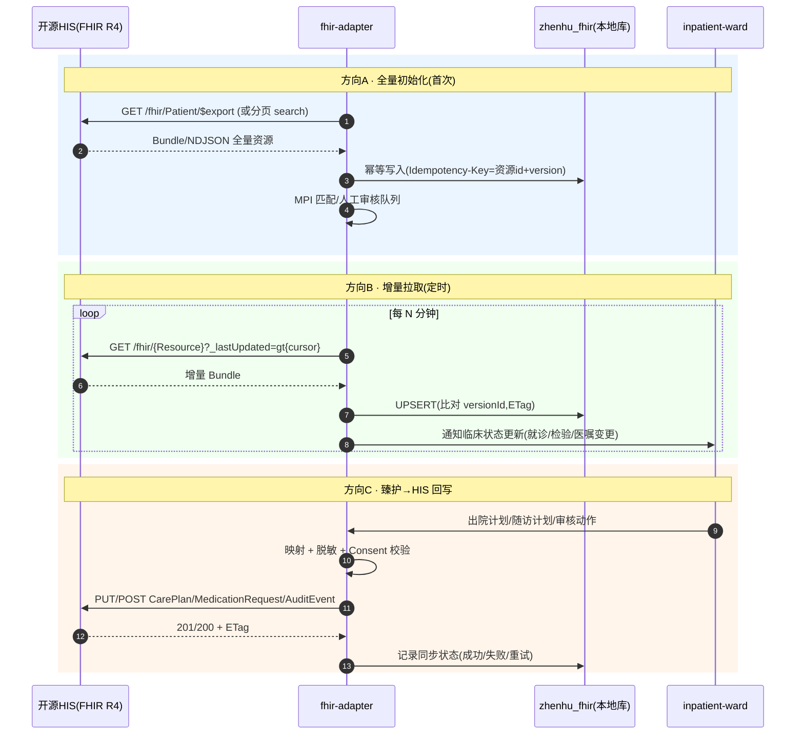

# 16 · 开源 HIS 对接可行性方案

> 臻护 · 全病程数智医护平台 — 对接真实开源 HIS 系统与 API 的可行性研究
> 日期:2026-08-10 | 作者:高见远(系统架构师)
> 依据:WebSearch 调研(2026-08-10)+ 对 fhir-adapter/inpatient-ward 源码的现状核实。

---

## 1. 结论先行(TL;DR)

- **主选:HAPI FHIR**(Apache-2.0,Java,FHIR R4/R4B/R5 完整实现)作为 **FHIR 交换层服务器**——臻护的 fhir-adapter 升级为标准 FHIR 客户端,数据落 HAPI,再与 HIS 双向同步。
- **备选:OpenMRS**(MPL-2.0,Java,社区全球最大)作为 **"真实医院侧"仿真 HIS**——用其 FHIR2 模块(R4)做端到端对接验证;许可证与 MIT 兼容,无传染风险。
- **明确排除 OpenEMR 为主选**:GPL-v3 许可证在"深度集成/嵌入"场景有传染性;国内 OpenHIS(.NET,31 commits,无 FHIR API)成熟度不足以支撑标准互操作,仅作国内部署参考。
- 当前 fhir-adapter 是 **"FHIR 风格"自定义 API,不是标准 FHIR 服务器**,直接对接任何标准系统均不可行,必须先做互操作层升级(详见 §4)。

---

## 2. 候选系统可对接性评估表

| 系统 | 许可证 | 技术栈 | API 形态 | FHIR 支持 | 社区活跃度 | 容器化 | 对接复杂度 |
|---|---|---|---|---|---|---|---|
| **HAPI FHIR** | Apache-2.0 ✅ | Java/Spring | 标准 FHIR REST(CRUD/search/`$everything`/`$validate`/subscription/bulk export) | R4/R4B/R5 完整,JPA(PostgreSQL/MySQL) | 高(Smile Digital Health 维护,~2.3k stars,生产广泛) | 官方 Docker ✅ | **低**:直接可用作 FHIR 仓库 |
| **OpenMRS** | MPL-2.0 ✅(与 MIT 兼容) | Java/Spring/Hibernate | REST(`/ws/rest/v1`)+ FHIR2 模块(`/ws/fhir2/R4`,基于 HAPI FHIR) | R4+R3,Patient/Encounter/Observation/Condition 等核心资源,双向导入导出 | 高(3000+ 成员、8000+ 设施、70+ 国、1500 万患者) | Docker/Reference App ✅ | 中:需部署完整 EMR + FHIR2 模块 |
| **OpenEMR** | **GPL-v3** ⚠️ | PHP | REST + FHIR API(30+ 资源,`$export` 批量导出,SMART on FHIR,CCDA) | R4,ONC 2015 认证,资源覆盖全 | 高(5k+ 美国诊所、全球 9 千万患者) | Docker ✅ | 中:API 质量好,但许可证限制深度集成 |
| **Medplum** | Apache-2.0 ✅ | TypeScript/Node + PostgreSQL | FHIR R4 + GraphQL + 订阅;OAuth2/OIDC/RBAC/行级 ACL/审计 | R4 完整,search/history/compartment/transactions | 高(ONC/SOC2/HITRUST,20M+ 患者) | Docker/Helm ✅ | 低:现代 FHIR 平台,但偏"平台"而非"医院系统" |
| **FHIR Server for Azure(OSS)** | MIT ✅ | C#/.NET | 标准 FHIR REST(R4),`$export`/`$reindex` | R4,Cosmos DB/SQL Server/PostgreSQL | 中 | Docker ✅ | 低,但依赖 Azure 生态心智 |
| **IBM FHIR Server** | Apache-2.0 ✅ | Java | 标准 FHIR REST,R4,多租户,`$export` | R4,PostgreSQL/CouchDB | 中(更新放缓,2024 后低活跃) | Docker ✅ | 中 |
| **OpenHIS(新致开源,国内)** | 未明示开源许可证(建议核实) ⚠️ | C#/.NET | 自有 REST 模块(`Newtouch.HIS.WebAPI`);**无 FHIR** | **无** | 低(31 commits,面向二级以下医院/基层,武汉 2025 十大开源) | 私有化部署 | 高:需自建映射,无标准互操作 |

> 许可证判断依据:臻护为 MIT;Apache-2.0/MIT/MPL-2.0 均兼容;GPL-v3 仅在"链接/嵌入/修改分发"时传染,**纯 HTTP API 数据交换不触发传染**,但为规避未来深度集成的法律风险,不建议作为主选。

---

## 3. 推荐论证

### 主选:HAPI FHIR(作为 FHIR 交换层)
1. **许可证**:Apache-2.0,与臻护 MIT 完全兼容,可自由嵌入/修改/商用。
2. **FHIR R4 完整实现**:标准 CRUD/search/history/`$everything`/subscription/bulk `$export`,是行业事实标准参考实现(OpenMRS FHIR2 内部即基于它)。
3. **可容器化**:官方 Docker 镜像 + JPA 支持 MySQL——与臻护现有 MySQL 技术栈一致,部署成本低。
4. **社区与生产证明**:Smile Digital Health 维护,全球 HIE/国家项目生产使用,更新活跃。
5. **为什么不用 Medplum 当主选**:Medplum 是出色的 FHIR 平台,但本任务目标是"对接**真实开源 HIS**",需要模拟医院侧完整临床流程;Medplum 缺 HIS 业务闭环,更适合作为臻护未来自身的数据底座而非对接目标。

### 备选:OpenMRS(作为完整 EMR 仿真与生产备选)
1. **MPL-2.0** 与 MIT 兼容(文件级 copyleft,API 对接无传染)。
2. FHIR2 模块基于 HAPI FHIR,R4 双向导入导出,与主选技术同源,映射心智一致。
3. 全球最大开源 EMR 社区,中文资料与案例相对丰富(相对 OpenEMR)。
4. **使用方式**:作为 POC 阶段"仿真 HIS"提供真实临床数据形态(患者/就诊/检验/医嘱),验证臻护对接管线;生产阶段若客户院内使用 OpenMRS 可直接复用。

### 明确排除
- **OpenEMR**:API 成熟度甚至高于 OpenMRS,但 GPL-v3 + PHP 技术栈与团队(JVM/Python)不匹配;仅保留"客户已部署 OpenEMR"时的适配预案(纯 HTTP 对接合法)。
- **FHIR Server for Azure / IBM FHIR**:偏云托管/企业多租户,与臻护轻量自托管定位不符。
- **OpenHIS**:国内落地有参考价值,但无 FHIR、许可证不透明、社区小,不满足"标准互操作"验收。

---

## 4. 对接架构设计

### 4.1 总体架构

现状:fhir-adapter = 自定义 FHIR 风格 API + demo 数据,无真实源。
目标:三明治结构——**HIS(FHIR 服务器)⇄ fhir-adapter(标准 FHIR 客户端 + 映射)⇄ 臻护业务服务**。

```
┌─────────────────────────────┐        ┌──────────────────────────────┐
│  开源 HIS 侧(FHIR 服务器)     │        │  臻护侧(FHIR 消费者/生产者)     │
│                             │        │                              │
│  OpenMRS / OpenEMR / 真实HIS│        │  fhir-adapter(升级)           │
│  ┌───────────────────────┐  │  HTTPS │  ┌────────────────────────┐  │
│  │ FHIR R4 API           │◄┼────────┼──┤ FHIR Client(标准R4)     │  │
│  │ Patient/Encounter/    │  │        │  │  + 增量同步引擎(_lastUpdated│
│  │ Observation/Condition/│  │        │  │    + Idempotency-Key)   │  │
│  │ MedicationRequest/    │  │        │  └───────────┬────────────┘  │
│  │ CarePlan/Consent      │  │        │              │ 映射/脱敏/审计  │
│  └───────────────────────┘  │        │  ┌───────────▼────────────┐  │
│         ▲                   │        │  │ zhenhu_fhir 库(本地缓存) │  │
│         │ 推送(CarePlan/    │        │  └───────────┬────────────┘  │
│         │ 随访/审计)         │        │              │               │
└─────────┼───────────────────┘        └──────────────┼───────────────┘
          │                                           │
          └──── HAPI FHIR(交换层,可选前置) ────────────┘
                用于:标准 FHIR 端点暴露给第三方/测试
```

> 说明:主选方案中 HAPI FHIR 可作为**可选前置交换层**(面向第三方标准 FHIR 消费方、或 HIS 侧无 FHIR 时的归一化网关);最小可行方案可先让 fhir-adapter 直连 OpenMRS/OpenEMR 的 FHIR API。

### 4.2 fhir-adapter 升级清单(对接前置条件)

| 能力 | 现状 | 目标 |
|---|---|---|
| 客户端能力 | 仅 HTTP POST 推送(`fhir_sync.py`) | 标准 FHIR R4 客户端:GET/search/`_lastUpdated` 增量/`$export`/ETag |
| 服务端能力 | 自定义 `/fhir/Patient` 等 | 保持现有内部 API(业务兼容),**新增标准 FHIR R4 端点**(或前置 HAPI) |
| 资源映射 | demo 数据 | 双向映射表:HIS↔臻护(患者/就诊/检验/诊断/医嘱/照护计划/同意) |
| 增量同步 | 无 | `_lastUpdated` 轮询 + `since` 游标 + 全量 `$export` 初始化 |
| 幂等 | Idempotency-Key(仅审计) | 所有写入统一 Idempotency-Key + 本地去重表 |
| MPI | patient_id 直连 | 患者主索引映射表 + 匹配算法(见 §4.4) |
| Consent | 仅 CRUD | 写入决策流强制校验 + HIS 侧同步 |

### 4.3 数据流图(双向同步,时序)



### 4.4 关键机制设计

**幂等与增量**
- 所有写 HIS 请求带 `Idempotency-Key`(哈希:`{resourceType}:{sourceId}:{sourceVersion}`);fhir-adapter 本地 `sync_outbox` 表记录投递状态(复用 inpatient-ward outbox 模式,指数退避重试)。
- 增量统一走 `_lastUpdated` 游标(记录每资源类型游标);HIS 不支持 `_lastUpdated` 时降级为 `_since`(历史版本)或全量对账。
- 冲突:本地与 HIS 同资源并发修改 → 以 `meta.versionId` 比对,冲突进人工队列,不自动覆盖。

**患者主索引(MPI)匹配策略**
1. `mpi_mapping` 表:`{source_system, source_patient_id, local_patient_id, match_confidence, match_status(pending/auto_matched/manual_confirmed/rejected), matched_at, matched_by}`。
2. 匹配顺序(置信度递减):① 精确 identifier 匹配(院内住院号/身份证/医保号)→ ② 归一化姓名+出生日期(±1 天)→ ③ 姓名+性别+科室 → ④ 未匹配进人工审核队列。
3. 人工审核结果回写状态机,后续同步自动复用映射;不自动合并患者档案(臻护侧患者与 HIS 侧患者始终经映射表关联,不跨库合并)。

**隐私与 Consent 边界**
- 数据最小化:仅同步臻护场景所需字段(人口学、就诊、检验、诊断、医嘱、照护计划),不拉取全量病历文本。
- Consent:臻护侧 Consent 状态决定**外发**内容(如患者未同意随访,则不外发 CarePlan);HIS 侧 Consent 状态决定**拉取**范围;双向同步 Consent 资源本身。
- 传输 TLS(mTLS 可选)+ fhir-adapter 输出脱敏(沿用现有 `_mask_name`/`_mask_identifier`)+ 全链路审计(FHIR AuditEvent,INSERT-only)。

---

## 5. 对接验收标准(POC)

| # | 验收项 | 判定 |
|---|---|---|
| 1 | 与 HAPI FHIR 建立标准 R4 连接 | 通过 `GET /fhir/metadata` 拿到 CapabilityStatement |
| 2 | 全量初始化 | 从 HIS 拉取 1 万级患者/10 万级 Observation 幂等入库,无重复 |
| 3 | 增量同步 | 定时同步延迟 ≤5min,变更在 HIS 修改后 1 轮内到达臻护 |
| 4 | 双向写回 | 臻护 CarePlan 回写 HIS 且 HIS 可查询;失败重试后最终一致 |
| 5 | MPI | 自动匹配准确率 ≥95%,其余进人工队列可确认 |
| 6 | Consent/审计 | 越权拉取被拒;每次访问有 AuditEvent 可追溯 |
| 7 | 演示 | docker compose 一键拉起"HAPI/OpenMRS + 臻护"仿真环境 |

---

## 6. 待明确事项

1. **目标医院 HIS 侧真实情况**:若为国内医院,通常不是 OpenMRS/OpenEMR 而是厂商 HIS(东华/卫宁等),需确认是否提供 FHIR 或仅 HL7 v2/webservice——本方案以"标准 FHIR 优先 + 厂商适配器扩展"为原则。
2. OpenHIS 许可证需向新致开源正式确认后再评估国内化部署。
3. HAPI 交换层是否为必选项:若 HIS 侧 FHIR 成熟,可直连省去 HAPI;若 HIS 侧无 FHIR,HAPI 作为"归一化入口"价值更大(需再评估 HL7 v2 通道)。
4. 数据保留与去标识化粒度需合规确认(PIPL/个人信息保护)。
