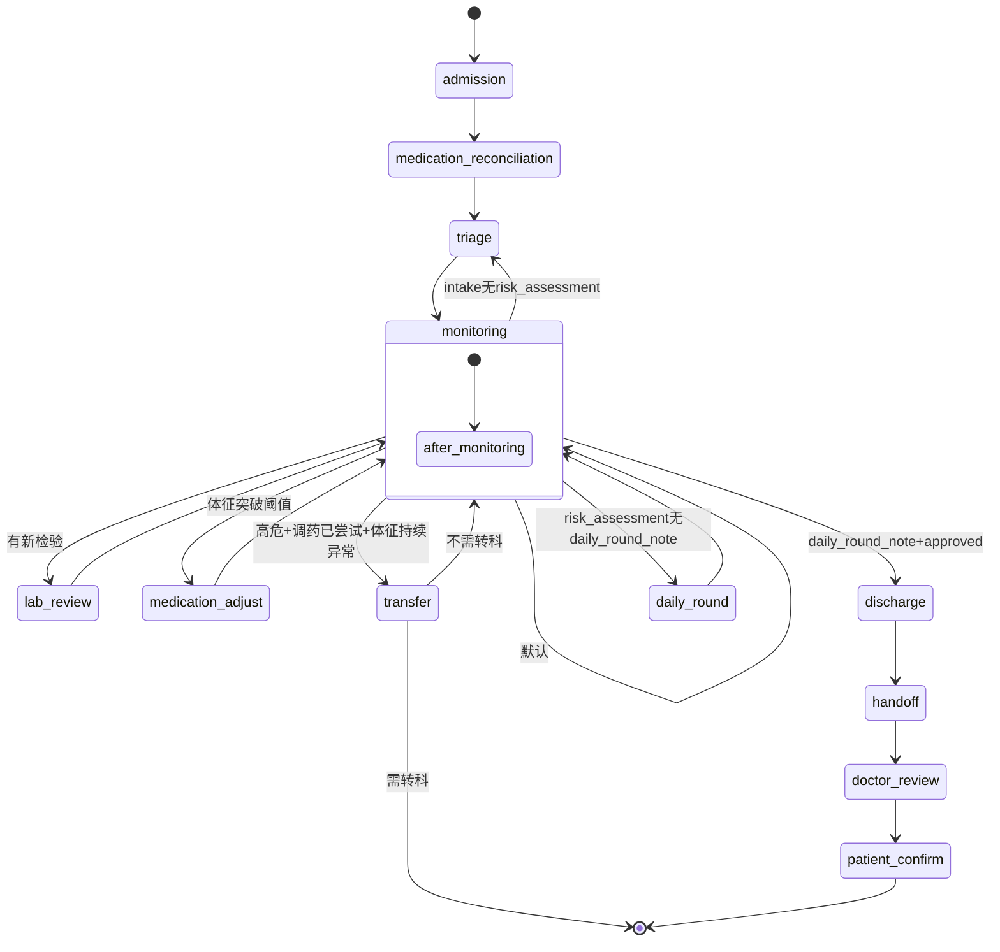
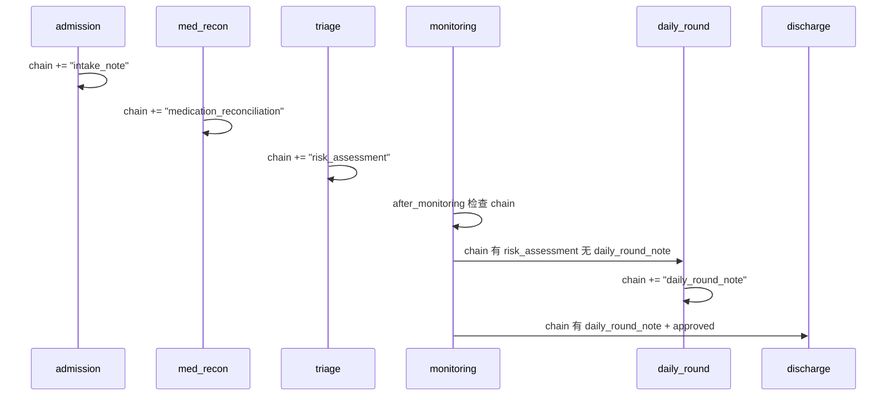

# 臻护平台 P0 临床精度修复：架构设计与任务分解 v1.0

**设计人**：高见远（系统架构师）
**日期**：2025-07-16
**关联审计**：临床精度审计报告 v1.0（评分 52/100，7 个 P0）

---

## 1. 实现方案（概述）

P0 修复分 **三个协同批次** 推进：

- **Batch A（基础修复）**：统一模板字段名（P0-4）+ 修复文档链追踪（P0-6）+ 基于真实患者数据分层（P0-5）。这三者共享 state 字段，必须协同设计。
- **Batch B（临床逻辑修复）**：重构出院批准逻辑（P0-1）+ 调药安全护栏（P0-2）+ 入院过敏史采集（P0-7）。
- **Batch C（药物安全）**：建立药物相互作用规则库（P0-3），新增独立模块 `medication_rules.py`。

Batch A 优先执行——它是 Batch B 和 C 的前置条件。每批次内部任务可部分并行。

---

## 2. 文件变更清单

| 文件 | 变更类型 | 预估行数 | 所属 P0 |
|------|----------|----------|---------|
| `disease_templates/hypertension.json` | 修改 | ~15 | P0-4 |
| `disease_templates/heart_failure.json` | 修改 | ~15 | P0-4 |
| `disease_templates/diabetes.json` | 修改 | ~20 | P0-4 |
| `agent/nodes.py` | 重度修改 | ~120 | P0-1/2/5/6/7 |
| `agent/graph.py` | 中度修改 | ~30 | P0-6 + P0-4 |
| `agent/harness.py` | 扩展 | ~40 | — |
| `agent/__init__.py` | 新增导出 | ~10 | P0-3 |
| `agent/medication_rules.py` | **新增** | ~200 | P0-3 |
| `tests/test_agent_nodes.py` | 重度修改 | ~100 | 全部 |
| `tests/test_agent_harness.py` | 中度修改 | ~60 | P0-3 |
| `tests/test_medication_rules.py` | **新增** | ~120 | P0-3 |

---

## 3. 数据结构与接口变更

### 3.1 模板字段名统一（P0-4 核心）

**决策**：将 3 个不兼容模板改为与其余 11 个模板一致的 `name`/`alert_above`/`alert_below`。

**为何不改代码来兼容两种命名**：代码中已有 11 个模板使用 `name` 且已被测试验证，改动模板成本低、风险小；代码层做双命名兼容会导致后续维护混乱，且审计报告已明确指出模板字段名就是不规范的。

同时，在 `load_template()` 中增加 **模板标准化层**，自动将加载的模板规范化：

```python
# harness.py 或 nodes.py 新增
def normalize_template(template: dict) -> dict:
    """标准化模板字段名，确保兼容性。"""
    vs = template.get("vital_signs", [])
    for v in vs:
        # key -> name 映射
        if "key" in v and "name" not in v:
            v["name"] = v.pop("key")
        # alert_high/alert_low -> alert_above/alert_below 映射
        if "alert_high" in v and "alert_above" not in v:
            v["alert_above"] = v.pop("alert_high")
        if "alert_low" in v and "alert_below" not in v:
            v["alert_below"] = v.pop("alert_low")
    return template
```

这个标准化层在 `load_template()` 调用后执行，确保即使未来有新模板使用旧命名也能兼容。

### 3.2 State 字段扩展（InpatientState TypedDict）

新增字段：

```python
class InpatientState(TypedDict):
    # ... 现有字段 ...
    allergies: list[str]              # P0-7: 过敏史列表
    patient_history: dict | None      # P0-5: 患者病史（年龄、合并症等）
    triage_matched_factors: list[str] # P0-5: 实际匹配的风险因子
    medication_adjust_history: list[dict]  # P0-2: 连续异常记录
    consecutive_abnormal_count: int   # P0-2: 连续异常计数
```

### 3.3 药物相互作用规则模型（P0-3 新增）

新文件 `agent/medication_rules.py`，Pydantic 模型：

```python
class DrugInteractionRule(BaseModel):
    drug_a: str           # 药物A通用名
    drug_b: str           # 药物B通用名
    severity: Literal["contraindicated", "major", "moderate", "minor"]
    mechanism: str        # 相互作用机制
    clinical_consequence: str  # 临床后果
    recommendation: str   # 处理建议
    evidence_level: str   # 证据等级 A/B/C
    source: str           # 来源指南
```

规则库至少 30 对核心配对，覆盖高血压+心衰+糖尿病+冠心病常用药物组合。

---

## 4. 各 P0 详细修复方案

### P0-4：模板字段名兼容（前置条件）

**修改文件**：
- `disease_templates/hypertension.json` L4-6：`key`→`name`, `alert_high`→`alert_above`, `alert_low`→`alert_below`
- `disease_templates/heart_failure.json` L4-9：同上
- `disease_templates/diabetes.json` L4-9：同上
- `agent/nodes.py` `load_template()`：调用后追加 `normalize_template()` 标准化

**验收**：所有 14 个模板的 `vital_signs[].name` 可通过 `v_def.get("name")` 读取；所有阈值可通过 `alert_above`/`alert_below` 读取。

---

### P0-6：3 条路由不可达修复（与 P0-5 协同）

**根因分析**：
- R1：`node_triage` 不写 `"risk_assessment"` 到 `document_chain` → 条件 4/6 永不触发
- R2：因 R1 导致 `daily_round_note` 永不产生 → 条件 5 永不触发
- R3：transfer 条件在第一位优先触发 → 高危患者全部过度转科

**修改 `node_triage`（nodes.py L87-113）**：

```python
async def node_triage(state: dict) -> dict:
    template = state.get("disease_template", {})
    patient_data = state.get("patient_data", {})
    patient_history = state.get("patient_history", {})
    
    # P0-5修复: 基于实际患者数据匹配风险因子
    template_risks = template.get("risk_factors", [])
    matched = _match_patient_risk_factors(patient_data, patient_history, template_risks)
    
    # 分层逻辑不变，但基于 matched 而非 len(template[...])
    risk_count = len(matched)
    if risk_count >= 3:
        level = "high"
    elif risk_count >= 2:
        level = "medium"
    else:
        level = "low"
    
    result = {
        "risk_level": level,
        "phase": "triage",
        "triage_matched_factors": matched,
        # P0-6修复: 写入 document_chain
        "document_chain": state.get("document_chain", []) + ["risk_assessment"],
    }
    # ... MDT 逻辑不变 ...
    return result
```

**修改 `after_monitoring`（graph.py L48-95）**：

```python
def after_monitoring(state: InpatientState) -> str:
    chain = state.get("document_chain", [])
    
    # P0-6 R3修复: transfer 移到 medication 之后
    # 先尝试药物控制，无效再转科
    
    # 条件1: 有新检验结果 → lab_review
    if labs and len(labs) > len(state.get("reviewed_labs", [])):
        return "lab_review"
    
    # 条件2: 体征突破警报 → medication_adjust（在 transfer 之前）
    for v_def in template.get("vital_signs", []):
        # ... 阈值检测逻辑 ...
        if triggered:
            return "medication"
    
    # 条件3: 高危 + 持续异常 + 调药已尝试 → transfer（增加调药已尝试条件）
    if (state.get("risk_level") == "high" 
        and len(vs) >= 3 
        and state.get("medication_adjustments")):
        return "transfer"
    
    # 条件4: 入院完成未分层 → triage（现在 node_triage 会写 risk_assessment）
    if "intake_note" in chain and "risk_assessment" not in chain:
        return "triage"
    
    # 条件5: 查房完成 + approved → discharge
    if "daily_round_note" in chain and state.get("discharge_decision") == "approved":
        return "discharge"
    
    # 条件6: 已分层未查房 → daily_round
    if "risk_assessment" in chain and "daily_round_note" not in chain:
        return "daily_round"
    
    return "monitoring"
```

---

### P0-5：基于实际患者数据分层

在 `nodes.py` 中新增辅助函数 `_match_patient_risk_factors()`：

```python
# 风险因子匹配映射表
_RISK_FACTOR_MATCHERS: dict[str, Callable] = {
    "age>60": lambda pd, ph: pd.get("age", 0) > 60,
    "age>65": lambda pd, ph: pd.get("age", 0) > 65,
    "age_gt_65": lambda pd, ph: pd.get("age", 0) > 65,
    "age_gt_70": lambda pd, ph: pd.get("age", 0) > 70,
    "smoking": lambda pd, ph: ph.get("smoking", False),
    "current_smoker": lambda pd, ph: ph.get("smoking", False),
    "diabetes_comorbid": lambda pd, ph: "diabetes" in ph.get("comorbidities", []),
    "diabetes_comorbidity": lambda pd, ph: "diabetes" in ph.get("comorbidities", []),
    "obesity": lambda pd, ph: pd.get("bmi", 0) >= 28,
    "family_history": lambda pd, ph: ph.get("family_history_cvd", False),
    "hypertension_comorbidity": lambda pd, ph: "hypertension" in ph.get("comorbidities", []),
    # ... 其余按需扩展
}

def _match_patient_risk_factors(
    patient_data: dict,
    patient_history: dict,
    template_risks: list[str],
) -> list[str]:
    """基于实际患者数据逐条匹配模板风险因子。"""
    matched = []
    for factor in template_risks:
        matcher = _RISK_FACTOR_MATCHERS.get(factor)
        if matcher and matcher(patient_data, patient_history):
            matched.append(factor)
    return matched
```

**注意**：当 `patient_data` 和 `patient_history` 为空时（无真实数据），`matched` 返回空列表，患者被正确分层为 `low`——这比旧代码将所有人判为高危更安全。

---

### P0-1：出院批准逻辑

**修改 `node_monitoring`（nodes.py L116-126）**：

```python
async def node_monitoring(state: dict) -> dict:
    template = state.get("disease_template", {})
    vs = state.get("vital_signs", [])
    
    # 逐条检查 discharge_criteria
    criteria = template.get("discharge_criteria", [])
    criteria_met = _check_discharge_criteria(criteria, vs, state)
    
    result = {
        "phase": "monitoring",
        "monitoring_strategy": f"risk_{state.get('risk_level', 'low')}",
        "discharge_criteria_check": criteria_met,
    }
    
    # 只有全部条件满足才批准出院
    if criteria_met.get("all_met", False):
        result["discharge_decision"] = "approved"
    
    return result
```

新增 `_check_discharge_criteria()`：

```python
def _check_discharge_criteria(
    criteria: list,
    vital_signs: list[dict],
    state: dict,
) -> dict:
    """逐条检查出院标准，返回条件检查结果。
    
    criteria 支持两种格式：
    - 对象数组：[{"condition": "bp_stable_24h", "description": "..."}]
    - 字符串数组：["bp_stable_24h", "spo2_stable_above_90"]
    """
    if not criteria:
        return {"all_met": False, "checked": [], "unmet": ["无出院标准定义"]}
    
    checked = []
    unmet = []
    
    for c in criteria:
        cond_key = c if isinstance(c, str) else c.get("condition", "")
        
        # 基于条件键名做语义匹配
        if _evaluate_criterion(cond_key, vital_signs, state):
            checked.append(cond_key)
        else:
            unmet.append(cond_key)
    
    return {
        "all_met": len(unmet) == 0,
        "checked": checked,
        "unmet": unmet,
    }
```

`_evaluate_criterion()` 基于条件键名做规则匹配（如 `bp_stable_24h` 检查是否所有血压记录在正常范围），Phase 5 可升级为 LLM 评估。

---

### P0-2：调药安全护栏

**修改 `node_medication_adjust`（nodes.py L277-307）**：

```python
async def node_medication_adjust(state: dict) -> dict:
    template = state.get("disease_template", {})
    vs = state.get("vital_signs", [])
    alert_history = state.get("consecutive_abnormal_count", 0)
    alerts = []
    
    for v_def in _normalized_vital_signs(template):
        name = v_def.get("name")
        alert_above = v_def.get("alert_above")
        alert_below = v_def.get("alert_below")
        
        # 只检查最近2条记录
        recent = vs[-2:] if len(vs) >= 2 else vs
        triggered = False
        for v in recent:
            val = v.get(name, 0)
            if not isinstance(val, (int, float)):
                continue
            if alert_above is not None and val > alert_above:
                triggered = True
            if alert_below is not None and val < alert_below:
                triggered = True
        
        if triggered:
            alert_history += 1
            alerts.append({"sign": name, "consecutive_count": alert_history})
        else:
            alert_history = 0
    
    adjustments = state.get("medication_adjustments", [])
    # 仅连续>=2次异常才生成调药建议
    if alerts and alert_history >= 2:
        adjustments.append({
            "reason": alerts,
            "action": "建议医生评估调药(连续异常)",
            "timestamp": datetime.now().isoformat(),
            "requires_doctor_confirm": True,  # 必须医生确认
        })
    
    return {
        "phase": "medication_adjust",
        "medication_alerts": alerts,
        "medication_adjustments": adjustments,
        "consecutive_abnormal_count": alert_history,
    }
```

---

### P0-7：入院过敏史采集

**修改 `node_admission`（nodes.py L41-84）**，在 patient_data 查询后增加：

```python
# P0-7: 过敏史强制采集
allergies = []
try:
    from zhenhu.fhir.models import AllergyIntolerance as FhirAllergy
    async with fhir_session_factory() as session:
        result = await session.execute(
            sa_select(FhirAllergy).where(FhirAllergy.patient_id == patient_id)
        )
        fhir_allergies = result.scalars().all()
        allergies = [a.display or a.code for a in fhir_allergies]
except (ImportError, Exception):
    allergies = patient_data.get("allergies", [])

return {
    # ... 现有字段 ...
    "allergies": allergies,
    "allergy_status": "collected" if allergies else "none_recorded",
}
```

---

### P0-3：药物相互作用规则库

**新增 `agent/medication_rules.py`**，含：

1. `DrugInteractionRule` Pydantic 模型
2. `MEDICATION_INTERACTION_RULES` 常量列表（≥30对）
3. `detect_interactions(med_list: list[str]) -> list[DrugInteractionRule]` 检测函数
4. `check_contraindication(med_list, allergies)` 过敏禁忌检查

**修改 `node_medication_reconciliation`（nodes.py L350-400）**：替换 fixture 占位为真实调用：

```python
from .medication_rules import detect_interactions, check_allergy_contraindications

# 冲突检测（替换 fixture 占位）
all_meds = [m.get("content", "") for m in handoff_meds]
findings["conflicts"] = [
    {
        "drug_pair": f"{r.drug_a} + {r.drug_b}",
        "severity": r.severity,
        "consequence": r.clinical_consequence,
        "recommendation": r.recommendation,
    }
    for r in detect_interactions(all_meds)
]

# 过敏禁忌检查
allergies = state.get("allergies", [])
allergy_risks = check_allergy_contraindications(all_meds, allergies)
if allergy_risks:
    findings["allergy_contraindications"] = allergy_risks
```

**规则库覆盖的核心药物对**（≥30对）：

| 类别 | 典型配对 | 数量 |
|------|----------|------|
| 抗凝+NSAID | 华法林-布洛芬、阿司匹林-氯吡格雷+布洛芬 | 4 |
| ACEi/ARB+保钾 | 培哚普利-螺内酯、缬沙坦-氨苯蝶啶 | 3 |
| β-blocker+CCB | 美托洛尔-维拉帕米（禁忌） | 2 |
| 降糖+其他 | 二甲双胍-造影剂、胰岛素-喹诺酮 | 3 |
| 他汀+CYP3A4 | 阿托伐他汀-克拉霉素、辛伐他汀-胺碘酮 | 4 |
| 利尿剂+其他 | 呋塞米-庆大霉素、呋塞米-NSAID | 3 |
| 心衰特需 | 地高辛-胺碘酮、地高辛-呋塞米(低钾) | 2 |
| 抗血小板+PPI | 氯吡格雷-奥美拉唑 | 2 |
| 抗凝+抗血小板 | 华法林-阿司匹林、NOAC-阿司匹林 | 3 |
| 其他关键 | 甲氨蝶呤-NSAID、锂剂-NSAID等 | 4 |

---

## 5. 任务列表

### Batch A：基础修复（P0-4 + P0-6 + P0-5）

| ID | 任务 | 文件 | 依赖 | 验收标准 |
|----|------|------|------|----------|
| A01 | 统一3个模板字段名 | `disease_templates/{hypertension,heart_failure,diabetes}.json` | — | `name`/`alert_above`/`alert_below`字段，JSON合法 |
| A02 | 新增 `normalize_template()` + 修改 `load_template()` | `agent/harness.py`, `agent/nodes.py` | A01 | 任意格式模板加载后统一为标准化字段 |
| A03 | 新增 `_match_patient_risk_factors()` + 映射表 | `agent/nodes.py` | A02 | 基于 patient_data/history 逐条匹配 |
| A04 | 重写 `node_triage`：真实匹配+写 document_chain | `agent/nodes.py` | A03 | triage 后 chain 含 `risk_assessment`，risk_level 由匹配数决定 |
| A05 | 重写 `after_monitoring` 路由优先级 | `agent/graph.py` | A04 | 调整 transfer 在 medication 之后，增加调药已尝试条件 |
| A06 | 更新节点测试以验证新 triage + 路由 | `tests/test_agent_nodes.py`, `tests/test_agent_harness.py` | A04, A05 | 所有现有测试通过 + 新增路由覆盖 |

### Batch B：临床逻辑修复（P0-1 + P0-2 + P0-7）

| ID | 任务 | 文件 | 依赖 | 验收标准 |
|----|------|------|------|----------|
| B01 | 新增 `_check_discharge_criteria()` + `_evaluate_criterion()` | `agent/nodes.py` | A04 | 支持对象/字符串两种 criteria 格式 |
| B02 | 重写 `node_monitoring`：逐条检查 discharge_criteria | `agent/nodes.py` | B01 | 仅全部满足时 `discharge_decision=approved` |
| B03 | 重写 `node_medication_adjust`：连续异常+医生确认 | `agent/nodes.py` | A02 | ≥2次连续异常才生成建议；`requires_doctor_confirm=True` |
| B04 | 重写 `node_admission`：采集过敏史 | `agent/nodes.py` | A02 | `allergies` 字段非空；含 FHIR 查询 + fallback |
| B05 | 更新 State TypedDict 新增字段 | `agent/graph.py` | B03, B04 | `allergies`/`consecutive_abnormal_count`/`triage_matched_factors`/`patient_history` |
| B06 | 更新测试 | `tests/test_agent_nodes.py` | B02, B03, B04 | 出院标准未满足不批准、单次异常不调药、过敏史已采集 |

### Batch C：药物安全（P0-3）

| ID | 任务 | 文件 | 依赖 | 验收标准 |
|----|------|------|------|----------|
| C01 | 新建 `medication_rules.py`：模型+规则库(≥30对)+检测函数 | `agent/medication_rules.py` | — | Pydantic 模型合法，规则≥30对 |
| C02 | 重写 `node_medication_reconciliation`：替换 fixture 占位 | `agent/nodes.py` | C01, B04 | 冲突检测输出结构化结果；过敏禁忌联动 |
| C03 | 导出更新 | `agent/__init__.py` | C01 | `from zhenhu.inpatient.agent import medication_rules` 可用 |
| C04 | 新建测试 | `tests/test_medication_rules.py` | C01 | 覆盖已知禁忌配对检测、无冲突场景、边界情况 |
| C05 | 更新 reconciliation 测试 | `tests/test_agent_nodes.py` | C02 | 验证冲突检测非空、过敏禁忌联动 |

---

## 6. 依赖包变更

**无新增依赖**。所有变更使用现有技术栈（Pydantic v2 + FastAPI + httpx）。

药物规则库使用 Pydantic `BaseModel`，无需引入规则引擎（`durable_rules` 或 `business-rules`）。理由：
- 30-50 对药物规则属于静态知识库，不需要推理引擎
- Pydantic 提供足够的类型安全和序列化能力
- 后续如果需要 Rete 网络推理（>500 规则），再引入规则引擎不迟

---

## 7. 测试影响评估

### 7.1 现有 48 个测试影响分析

**必断测试（需同步修改）**：

| 测试函数 | 影响原因 | 修改策略 |
|----------|----------|----------|
| `test_node_monitoring_triggers_discharge` | P0-1：不再按体征数量批准出院 | 改为构造满足所有 discharge_criteria 的 state |
| `test_node_triage_risk_high_on_many_factors` | P0-5：不再按模板定义数量 | 需传入 `patient_data`/`patient_history` 触发真实匹配 |
| `test_node_triage_risk_low_on_empty` | P0-5：空模板默认 low（行为不变，需验证） | 可能无需修改 |
| `test_node_triage_mdt_on_high_risk` | P0-5 | 同上 |
| `test_node_medication_adjust_on_alert` | P0-2：单次异常不再触发 | 需构造连续 2 次异常 |
| `test_node_medication_adjust_no_alert` | P0-2 | 行为不变 |
| `test_event_routing_after_monitoring_discharge` | P0-6：路由优先级调整 | 需验证仍可达 discharge |
| `test_event_routing_after_monitoring_to_triage` | P0-6：现在 node_triage 写 risk_assessment | 需调整测试 state |
| `test_node_medication_reconciliation_adds_findings` | P0-3：findings 结构变化 | 更新断言字段 |
| `test_node_transfer_high_risk` | P0-6 R3：transfer 条件增加 medication_adjustments 检查 | 需传入 medication_adjustments |

**不受影响的测试**（约 15 个）：
`test_node_admission_initializes`, `test_node_handoff_*`, `test_node_doctor_review_*`, `test_node_patient_confirm_*`, `test_node_daily_round_*`, `test_node_lab_review`, `test_node_transfer_low_risk` 等。

Harness 测试基本不受影响（`test_validate_*`, `test_source_*`, `test_fallback_*`, `test_circuit_breaker_*`, `test_agent_loop_*`）。

### 7.2 需新增测试

| 测试 | 覆盖 P0 |
|------|---------|
| `test_template_normalization_key_to_name` | P0-4 |
| `test_template_normalization_alert_fields` | P0-4 |
| `test_triage_based_on_patient_data_not_template_count` | P0-5 |
| `test_triage_writes_risk_assessment_to_chain` | P0-6 |
| `test_monitoring_checks_all_discharge_criteria` | P0-1 |
| `test_monitoring_rejects_if_criteria_unmet` | P0-1 |
| `test_medication_adjust_requires_consecutive_abnormal` | P0-2 |
| `test_medication_adjust_single_abnormal_no_action` | P0-2 |
| `test_admission_collects_allergies` | P0-7 |
| `test_medication_reconciliation_detects_warfarin_nsaid` | P0-3 |
| `test_medication_reconciliation_allergy_contraindication` | P0-3 |
| `test_routing_transfer_requires_medication_attempted` | P0-6 |
| `test_routing_triage_and_daily_round_reachable` | P0-6 |
| `test_routing_discharge_reachable_with_chain` | P0-6 |

---

## 8. 数据流 / 时序图

### 8.1 修复后的完整路由图



### 8.2 document_chain 追踪流



---

## 9. 待明确事项

1. **patient_history 数据来源**：P0-5 的 `_match_patient_risk_factors` 需要 `patient_data.age`、`patient_data.bmi`、`patient_history.smoking` 等字段。当前 `node_admission` 仅从 FHIR 拉取 `name` 和 `gender`。需要确认：
   - 是否扩展 FHIR Patient 查询以获取 `birthDate`（计算年龄）？
   - `patient_history`（吸烟史、合并症等）数据源是 FHIR Condition 还是本地病史表 `medical_histories`？
   - **建议**：在 `node_admission` 中并行查询 FHIR Patient + Condition + 本地 `medical_histories`，组装 `patient_history`

2. **discharge_criteria 格式不统一**：11 个模板中 3 个用字符串数组（copd/cad/ckd 等）、8 个用对象数组。`_check_discharge_criteria` 设计为兼容两种，但"满足条件"的评估逻辑目前依赖键名语义匹配——Phase 5 是否用 LLM 替代？

3. **药物规则库 maintenance**：30 对规则由开发人员手写 Pydantic 模型。后续是否需要一个管理界面让药师维护？建议 Batch C 先硬编码，Phase 2 再考虑管理后台。

4. **过敏史 FHIR 资源**：`AllergyIntolerance` 资源是否已在 fhir-adapter 中建模？需要确认字段映射（`code`/`display`/`clinicalStatus`）。如未建模，先用 `patient_data.allergies` 字段 fallback。

5. **node_triage 分层后 MDT 触发条件**：当前"高危自动 MDT"逻辑沿用，但 P0-5 修复后高危判定更严格（需真实匹配≥3），可能导致 MDT 触发率显著下降。需与临床确认：是否高危阈值应降为≥2？
