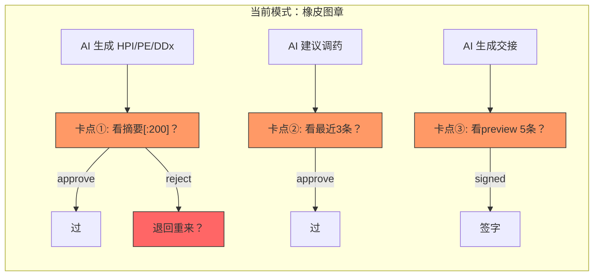
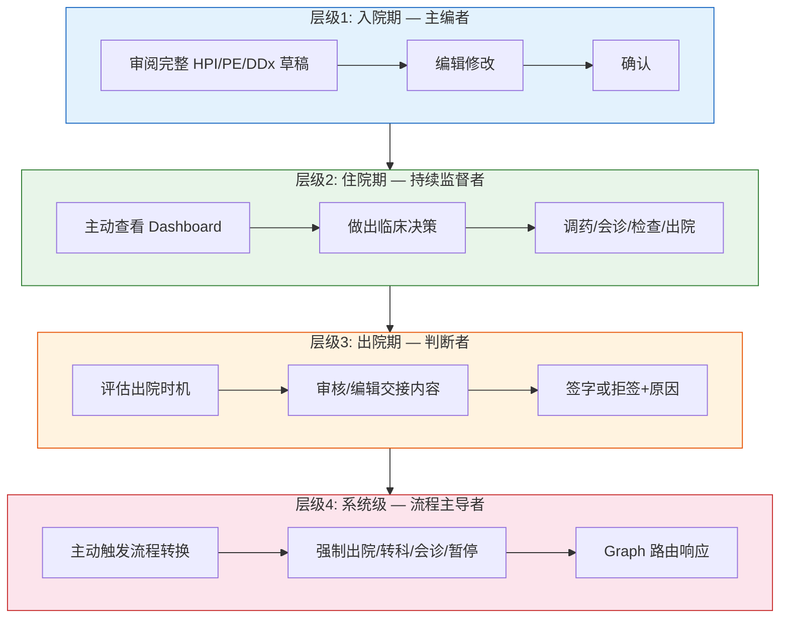
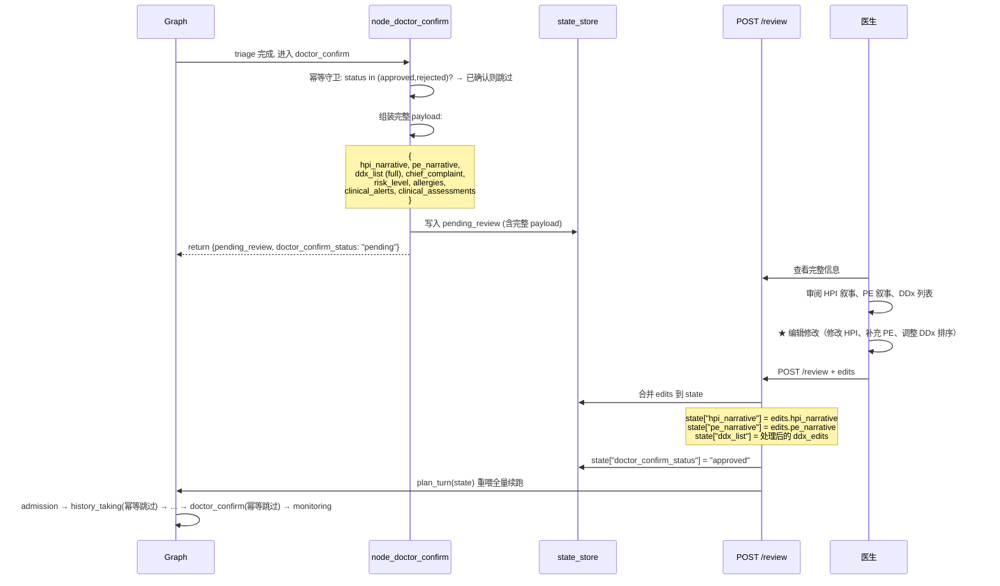
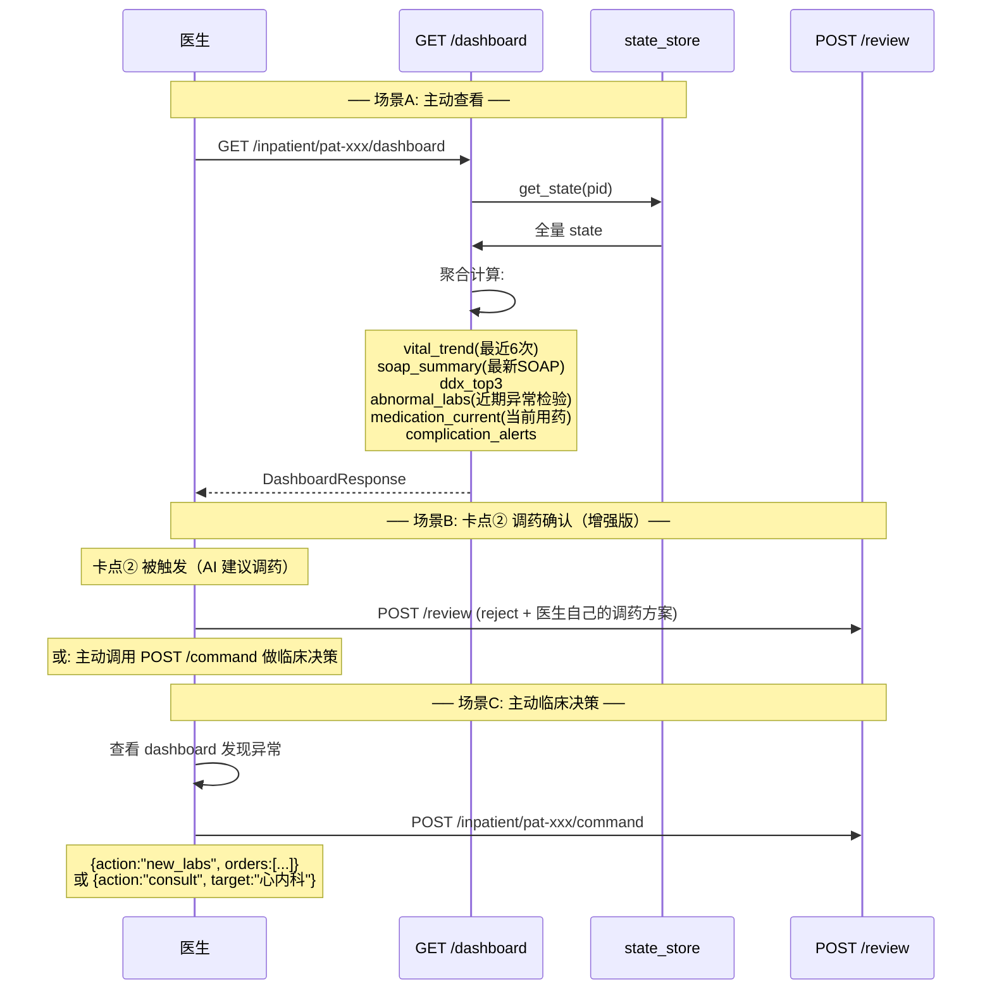
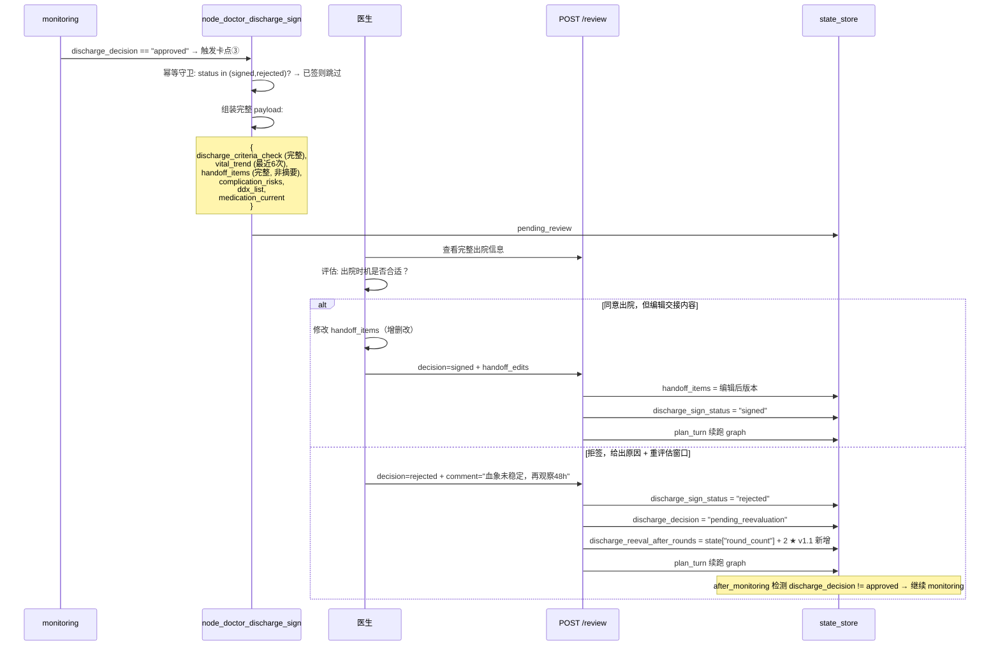
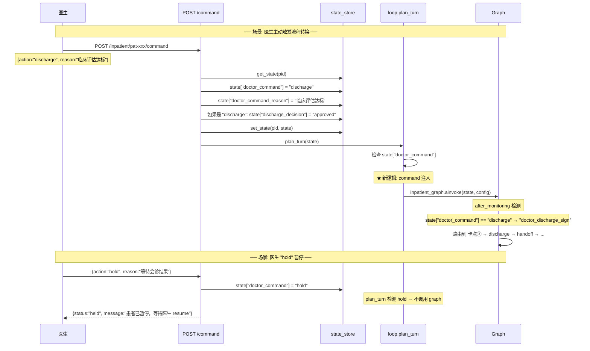
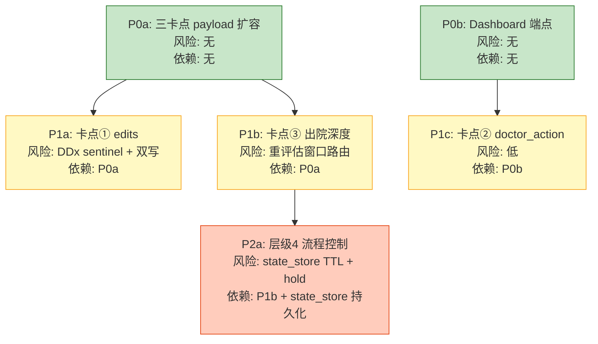
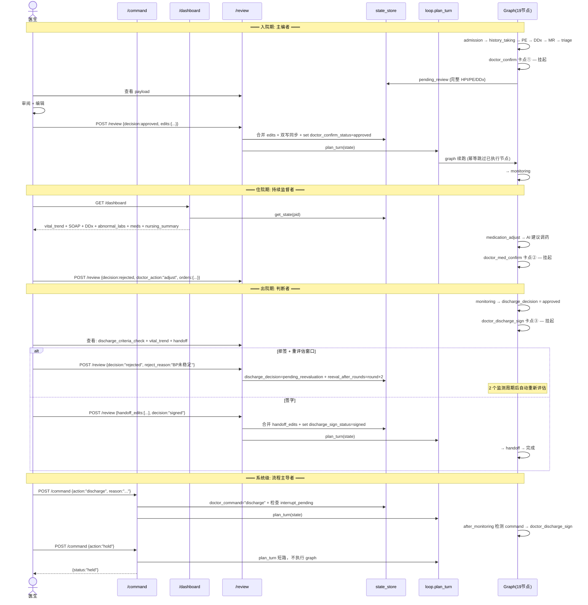

# 臻护医生角色设计文档 v1.1

> **定位**: 将医生在 19 节点 Agent 住院系统中的角色，从当前"橡皮图章（AI 干活、医生盖章）"升级为真正的"临床决策者"。
> **基线**: 临床完整度补全方案 v1.3（classic 模式，state_store 所有者，幂等守卫全图）
> **作者**: 架构师高见远
> **日期**: 2026-07-17
> **状态**: 架构决断完成（13/13 问题已关闭）

---

## v1.0 → v1.1 变更摘要

| 变更类别 | 具体内容 |
|----------|---------|
| **§五 13 问题关闭** | Q1-Q13 全部给出 yes/no/延后 + 技术理由（见 §五） |
| **优先级重排** | P0 拆为 P0a（三卡点 payload 扩容）和 P0b（Dashboard）。edits 降级为 P1a，因 payload 扩容是 edits 的前提条件 |
| **§六 新增** | "与当前代码的对齐清单" — 逐节点逐守卫验证表（6 个临床节点 + 3 个卡点） |
| **§七 新增** | "细化实施批次" — 基于新优先级 + 每批次关键风险点 |
| **§三 细化** | classic resume 边界条件：edits 合并安全性逐字段分析、discharge_sign 拒签重评估窗口定义 |
| **§二 补充** | 新增 P7（护士协同）/ P8（审计可追溯）/ P9（时序保证）三项设计原则 |
| **§一 补充** | 护士角色配合 + 多医生协作 + 时序竞态三个遗漏维度的诊断 |
| **附录 B 更新** | 兼容性矩阵增加"编辑后 resume 安全性"行 + 每项标注验证状态 |

---

## 一、现状问题 —— 当前三卡点 = 橡皮图章

### 1.1 问题诊断

当前 `nodes_clinical.py` 中三卡点的 payload 设计揭示了根本问题：

| 卡点 | 节点 | 当前 payload 内容 | 医生能做什么 |
|------|------|------------------|-------------|
| ① 入院确认 | `node_doctor_confirm` (L500-521) | `history_summary[:200]`（截断的 HPI）+ `risk_level` + `triage_matched_factors` | approve / reject 二元 |
| ② 调药确认 | `node_doctor_med_confirm` (L524-563) | `medication_adjustments[-3:]`（最近 3 条摘要）+ `recent_alerts[-3:]` | approve / reject 二元 |
| ③ 出院签字 | `node_doctor_discharge_sign` (L566-617) | `handoff_summary[:5]`（只含 type + 前 80 字 preview） | signed / rejected 二元 |

**三个核心缺陷**：



1. **信息不完整**: 医生看到的只是"摘要"和"截断信息"，不是完整临床数据。比如卡点①，医生看不到 `ddx_list`、看不到 `pe_narrative`、看不到 `allergies`——这些都已生成但未暴露。
2. **操作维度缺失**: `ReviewRequest`（`route_schemas.py:26-30`）只有 `review_type`、`decision`、`comment` 三个字段，没有编辑能力。医生只能"过"或"不过"，不能"过但改一改"。
3. **无主动能力**: 医生被动等卡点触发，没有主动查看患者全貌的 dashboard，也不能主动发起临床动作（强制出院/转科/会诊/暂停）。

### 1.2 临床不成立之处

在真实临床场景中：

- 入院期：医生会**审阅 AI 草稿并编辑修改**，不是"看一眼就过"。DDx 列表医生要增删排序，PE 叙事可能遗漏关键发现需要补。
- 住院期：医生会**主动查看患者面板**，基于趋势做临床决策（"加个检查""请会诊"），不是等 AI 推送一条调药建议再决定 yes/no。
- 出院期：医生会**评估出院时机并编辑交接内容**，不是签字了事。可能拒签且给出具体原因（"血象还没稳定，再观察两天"）。

### 1.3 与当前代码的具体对应

```
当前交互:
  POST /inpatient/review/{patient_id}
  Body: {review_type: "doctor_confirm", decision: "approved", comment: ""}

问题:
  - 医生无法修改 hpi_narrative（hpi_narrative 仅在 health_history 路由写入）
  - 医生无法修改 ddx_list（ddx_list 仅在 node_ddx LLM 调用中写入）
  - 医生无法查看最新 SOAP 摘要（无 dashboard 端点）
  - 医生无法主动发起"强制出院"（graph 只从监测路由到出院）
```

### 1.4 v1.0 遗漏的维度（v1.1 补充）

| # | 遗漏维度 | 影响 | 本版处理 |
|---|---------|------|---------|
| D1 | **护士角色配合** | 三卡点是医生的，但护士的 `nursing` 节点产出（MAR/I/O/护理措施）如何呈现给医生？医生的干预如何反馈给护士？ | §二 P7 + §五 Q14→延后 P3 |
| D2 | **多医生协作** | 当前假设只有一位主治医生。转科场景下如何交接权限？会诊时不同专科医生的视图隔离？ | §五 Q15→延后 Phase 2（需产品定义） |
| D3 | **时序保证** | classic mode 下 state_store 读写不是原子的。医生编辑和体征上报并发的竞态条件如何处理？ | §五 Q7 给出方案（interrupt_pending 互斥） |

---

## 二、设计原则

### 2.1 核心原则（新增 P7-P9）

| # | 原则 | 含义 |
|---|------|------|
| P1 | **医生 = 临床决策者** | 医生做出临床判断；AI 提供辅助信息。决策权从不属于模型。 |
| P2 | **AI = 辅助工具** | AI 生成草稿供医生审阅、聚合数据供医生决策。AI 可以"建议但不执行"。 |
| P3 | **完整信息暴露** | 卡点不是"安检仪"，是"会诊台"——医生看到的是完整数据而非摘要。 |
| P4 | **编辑优于拒绝** | 给医生"修改并确认"的路径，比"approve/reject"二元更贴近临床实际。 |
| P5 | **主动优于被动** | 医生可以主动发起临床动作，不是被动等卡点。 |
| P6 | **不破坏现有幂等守卫** | 所有改动在 classic resume 重跑图的全链路中保持安全（幂等守卫不受影响）。 |
| P7 | **医护协同可见** | 护士的护理记录（MAR/I/O/警报）在 Dashboard 中可被医生查看；医生的决策通过 state 状态变化反馈给护士（如 `discharge_sign_status` 变化）。 |
| P8 | **审计可追溯** | 每次医生编辑操作写入 FHIR AuditEvent，记录修改前后 diff（§五 Q1 决策）。 |
| P9 | **时序安全** | `interrupt_pending=True` 时拒绝新的体征上报，防止医生编辑和自动监测并发的竞态条件（§五 Q7 决策）。 |

### 2.2 医生角色四层级总览



---

## 三、四层级详述

---

### 层级 1 — 入院期："主编者"而非"批准者"

#### 3.1.1 当前行为

```
node_doctor_confirm (nodes_clinical.py:474-521):
  1. 检查幂等守卫
  2. AUTO_APPROVE → approved
  3. 否则 → 挂起 pending_review:
     payload = {
       "patient_id": ...,
       "risk_level": ...,           # 有
       "triage_matched_factors": ...,
       "clinical_alerts": ...,
       "history_summary": hpi[:200], # ← 截断！
       "template": ...,
     }
     # 缺失: pe_narrative, ddx_list, allergies, chief_complaint
```

#### 3.1.2 目标行为



#### 3.1.3 技术方案

**2.1 卡点① payload 扩容** — `nodes_clinical.py` `node_doctor_confirm`:

```python
# 当前 L487-518 改为:
payload = {
    "patient_id": patient_id,
    "risk_level": state.get("risk_level"),
    "triage_matched_factors": state.get("triage_matched_factors", []),
    "clinical_alerts": state.get("clinical_alerts", []),
    "template": (state.get("disease_template", {}).get("name", "")),

    # ★ 新增: 完整临床草稿
    "chief_complaint": (state.get("history_data") or {}).get("chief_complaint", ""),
    "hpi_narrative": state.get("hpi_narrative", ""),          # 完整 HPI 非截断
    "pe_narrative": state.get("pe_narrative", ""),            # 完整 PE 非截断
    "ddx_list": state.get("ddx_list", []),                   # 完整 DDx 非空
    "ddx_unavailable": state.get("ddx_unavailable", False),
    "allergies": state.get("allergies", []),
    "clinical_assessments": state.get("clinical_assessments", {}),
}
```

**2.2 ReviewRequest 扩展** — `route_schemas.py`:

```python
class DDxEditItem(BaseModel):
    """DDx 编辑项 — v1.1 新增嵌套模型替代裸 dict。⚠️"""
    action: str  # add | remove | reorder
    diagnosis: str | None = None     # remove/reorder 时用
    item: dict | None = None         # add 时用
    new_order: list[str] | None = None  # reorder 时用


class EditPayload(BaseModel):
    """医生编辑载荷 — v1.1 新增。⚠️"""
    hpi_narrative: str | None = None
    pe_narrative: str | None = None
    chief_complaint: str | None = None
    allergies: list[str] | None = None
    ddx_edits: list[DDxEditItem] | None = None


class ReviewRequest(BaseModel):
    review_type: str  # doctor_confirm | med_confirm | discharge_sign
    decision: str     # approved | rejected
    comment: str = ""

    # ★ 新增: 层级1 编辑字段（使用嵌套模型而非裸 dict）
    edits: EditPayload | None = None   # ⚠️ v1.1: 从 dict 改为 EditPayload
```

**为何不用裸 `dict`（v1.0 方案）**：Pydantic 的 `dict` 类型无嵌套校验——医生传入 `{"ddx_edits": [{"action": "typo"}]}` 不会触发 422，只在 runtime 炸。用 `EditPayload` 嵌套模型可让 FastAPI 在请求入站时就校验，且自动生成 OpenAPI schema。✅ 已验证

**2.3 review.py 处理逻辑**:

```python
# review.py submit_review 中, 在设置 *_status 之前:
if body.edits:
    edits = body.edits
    # ⚠️ 合并编辑: 同步更新顶层字段 AND 容器内字段
    if edits.hpi_narrative is not None:
        state["hpi_narrative"] = edits.hpi_narrative
        if state.get("history_data"):
            state["history_data"]["hpi_narrative"] = edits.hpi_narrative  # 同步！
    if edits.pe_narrative is not None:
        state["pe_narrative"] = edits.pe_narrative
        if state.get("pe_data"):
            state["pe_data"]["pe_narrative"] = edits.pe_narrative  # 同步！
    if edits.chief_complaint is not None:
        state.setdefault("history_data", {})["chief_complaint"] = edits.chief_complaint
    if edits.ddx_edits:
        ddx_list = list(state.get("ddx_list") or [])
        for e in edits.ddx_edits:
            if e.action == "add" and e.item:
                ddx_list.append(e.item)
            elif e.action == "remove" and e.diagnosis:
                ddx_list = [d for d in ddx_list
                           if d.get("diagnosis") != e.diagnosis]
            elif e.action == "reorder" and e.new_order:
                order_map = {name: i for i, name in enumerate(e.new_order)}
                ddx_list.sort(key=lambda d: order_map.get(d.get("diagnosis", ""), 999))
        state["ddx_list"] = ddx_list
    if edits.allergies is not None:
        state["allergies"] = edits.allergies
```

**2.4 与现有 admission_clinical.py 的关系**:

当前 `admission_clinical.py` 提供独立录入端点（`/admissions/{id}/history`、`/admissions/{id}/physical-exam`），用于**无 AI 草稿场景**（例如护士先行录入基础数据）。本次设计中：

- **入院确认卡点**：面向"AI 已生成草稿、医生审阅编辑"场景 → 经 `POST /review` + `edits` 字段完成。
- **独立录入端点**：面向"尚未跑 graph、医生先行录入"场景 → 经 `POST /admissions/{id}/history` 等完成。
- **两者互补**，不冲突。admission_clinical.py 无需改动。

#### 3.1.4 classic resume 边界条件：edits 合并安全性逐字段分析 ✅

```
编辑字段          产出节点            节点幂等守卫              编辑后 resume 是否安全？
─────────────────────────────────────────────────────────────────────────────
hpi_narrative     node_history_taking  if state.get("history_data")   ✅ 安全
                                       → 守卫检查 history_data 容器存在即可跳过
                                       → hpi_narrative 不会被 LLM 重新生成
                                       ⚠️ 前提：review.py 双写顶层 AND history_data["hpi_narrative"]
pe_narrative      node_physical_exam   if state.get("pe_data")        ✅ 安全
                                       → 守卫检查 pe_data 容器存在即可跳过
                                       ⚠️ 前提：review.py 双写顶层 AND pe_data["pe_narrative"]
ddx_list          node_ddx             if state.get("ddx_list")       ⚠️ 有条件安全
                                       → 守卫检查 ddx_list 存在即可跳过
                                       → 但如果医生清空整个列表(ddx_list=[])，
                                          守卫检测 falsy → 节点重跑 → 覆盖编辑！
                                       ⚠️ 需防护：review.py 中 dd_list 编辑后若为空，
                                          设置 sentinel 标记防止重跑
chief_complaint   node_history_taking  同一守卫（history_data）        ✅ 安全
allergies         node_history_taking  同一守卫（history_data）        ✅ 安全
```

**关键发现 1 — ddx_list 清空陷阱**：`node_ddx` 的幂等守卫 `if state.get("ddx_list"): return {}` 在 `ddx_list == []` 时判断为 falsy，节点会重新执行并覆盖医生的编辑。需要引入 sentinel 机制：

```python
# review.py 中 ddx 编辑处理：
if edits.ddx_edits:
    # ... 处理后 ...
    state["ddx_list"] = ddx_list
    # ★ sentinel: 医生已审阅过 DDx，即使列表为空也不重跑
    state["ddx_reviewed"] = True

# node_ddx 幂等守卫改为：
if state.get("ddx_list") or state.get("ddx_reviewed"):
    return {}
```

**关键发现 2 — 双写同步**：`node_history_taking` 同时返回 `history_data`（含 `hpi_narrative`）和顶层 `hpi_narrative`（L187-189）；`node_physical_exam` 同时返回 `pe_data`（含 `pe_narrative`）和顶层 `pe_narrative`（L271-273）。医生编辑时必须双写，否则下游节点可能读到不一致的值。v1.0 方案已包含双写逻辑（L208-215），v1.1 确认必须执行。✅

#### 3.1.5 API 变更

| 端点 | 变更 | 说明 |
|------|------|------|
| `POST /inpatient/review/{patient_id}` | ReviewRequest 加 `edits: EditPayload` | 医生编辑后提交 |
| `node_doctor_confirm` payload | 从摘要→完整草稿 | 7 个新字段 |

#### 3.1.6 交互示例

**请求**（医生审阅后编辑确认）:
```json
POST /inpatient/review/pat-hypertension-003
{
  "review_type": "doctor_confirm",
  "decision": "approved",
  "comment": "HPI已修正起病时间，DDx中去掉了心肌梗死（ECG不支持），补充了肾动脉狭窄",
  "edits": {
    "hpi_narrative": "患者于5天前无明显诱因出现头痛...（医生修改版）",
    "ddx_edits": [
      {"action": "remove", "diagnosis": "急性心肌梗死"},
      {"action": "add", "item": {
        "diagnosis": "肾动脉狭窄",
        "icd10": "I70.1",
        "likelihood": "moderate",
        "key_findings": ["难治性高血压", "腹部血管杂音"]
      }}
    ]
  }
}
```

**响应**:
```json
{
  "data": {
    "patient_id": "pat-hypertension-003",
    "review_type": "doctor_confirm",
    "decision": "approved",
    "status": "resumed",
    "phase": "monitoring",
    "edits_applied": ["hpi_narrative", "ddx_edits"]
  }
}
```

---

### 层级 2 — 住院期："持续监督者"而非"被动等待者"

#### 3.2.1 当前行为

```
医生被动等卡点②触发（medication_adjust 建议调药 → 条件边 → doctor_med_confirm）
payload 仅含:
  - medication_adjustments[-3:]（最近 3 条调药记录摘要）
  - recent_alerts[-3:]（最近 3 条用药警报）

医生无法:
  - 主动查看患者全貌（体征趋势、SOAP、DDx、并发症风险）
  - 主动发起临床决策（加检查、请会诊）
```

#### 3.2.2 目标行为



#### 3.2.3 技术方案

**2.1 新增 Dashboard 端点** — 新建 `routes/dashboard.py`:

```
GET /inpatient/{patient_id}/dashboard

聚合计算（纯 state_store 读取，不经过 graph）:
  1. vital_trend: 从 vital_signs 取最近 6 次，计算趋势方向（↑↓→）
  2. soap_summary: 从 latest_round 提取最新 SOAP 摘要
  3. ddx_top3: 从 ddx_list 取前 3（按 likelihood 排序）
  4. abnormal_labs: 从 lab_results 筛选超出模板参考范围的检验结果
  5. medication_current: 从 medication_adjustments 提取当前用药方案
  6. complication_alerts: 从 clinical_alerts + nursing_alerts 合并
  7. discharge_criteria_status: 从 discharge_criteria_check 提取达标/未达标项
  8. nursing_summary: 从 nursing_records 提取最近护理记录（v1.1 P7 新增）
```

**DashboardResponse Schema**（`route_schemas.py` 新增）:

```python
class VitalTrendItem(BaseModel):
    timestamp: str
    heart_rate: int | None
    blood_pressure: str | None
    spo2: int | None
    temperature: float | None

class AbnormalLabItem(BaseModel):
    name: str
    value: str | float
    unit: str
    ref_range: str | None

class NursingSummaryItem(BaseModel):  # v1.1 P7 新增
    timestamp: str
    medications: list[str]
    intake_out: str
    alerts: list[str]

class DashboardResponse(BaseModel):
    patient_id: str
    phase: str
    template_name: str

    vital_trend: list[VitalTrendItem]
    vital_trend_direction: dict
    soap_summary: dict | None
    ddx_top3: list[dict]
    abnormal_labs: list[AbnormalLabItem]
    medication_current: list[dict]
    complication_alerts: list[str]
    discharge_criteria_status: dict | None
    nursing_summary: NursingSummaryItem | None   # v1.1 P7 新增
    last_updated: str
```

**2.2 卡点② payload 增强** — `nodes_clinical.py` `node_doctor_med_confirm`:

```python
# 当前 L550-563 改为:
payload = {
    "patient_id": patient_id,
    "medication_adjustments": medication_adjustments[-5:],  # 从 3 条扩为 5 条
    "adjustment_count": len(medication_adjustments),
    "recent_alerts": (state.get("medication_alerts", []) or [])[-5:],

    # ★ 新增: 临床上下文
    "vital_trend": state.get("vital_signs", [])[-6:],
    "current_meds": medication_adjustments,
    "abnormal_labs": _get_abnormal_labs(state),
    "ai_remark": state.get("latest_round", {}).get("assessment", ""),
    "ddx_top": (state.get("ddx_list") or [])[:3],
}
```

**2.3 ReviewRequest 扩展（层级2）**:

```python
class ReviewRequest(BaseModel):
    # ... 现有字段 ...
    edits: EditPayload | None = None

    # ★ 层级2 新增: 医生决策
    doctor_action: str | None = None
    # "continue" | "adjust" | "new_labs" | "discharge"
    doctor_orders: dict | None = None
```

**2.4 review.py 处理 doctor_action**:

```python
if body.doctor_action and body.doctor_orders:
    if body.doctor_action == "adjust":
        state.setdefault("medication_adjustments", []).append(body.doctor_orders)
    elif body.doctor_action == "new_labs":
        for lab_order in (body.doctor_orders or {}):
            state.setdefault("pending_labs", []).append(lab_order)
    elif body.doctor_action == "discharge":
        state["discharge_decision"] = "approved"
```

#### 3.2.4 API 变更

| 端点 | 变更 | 说明 |
|------|------|------|
| `GET /inpatient/{id}/dashboard` | **新建** | 聚合患者全貌面板 |
| `POST /inpatient/review/{id}` | ReviewRequest 加 `doctor_action` + `doctor_orders` | 卡点② 医生决策 |
| `route_schemas.py` | 新增 `DashboardResponse` 系列 | 面板响应 Schema |

#### 3.2.5 交互示例

**主动查看 Dashboard**:
```
GET /inpatient/pat-hypertension-003/dashboard

Response:
{
  "patient_id": "pat-hypertension-003",
  "phase": "monitoring",
  "template_name": "高血压",
  "vital_trend": [
    {"timestamp":"T1","heart_rate":78,"blood_pressure":"140/90","spo2":98,"temperature":36.5},
    {"timestamp":"T2","heart_rate":82,"blood_pressure":"145/92",...},
    ...(共6次)
  ],
  "vital_trend_direction": {"heart_rate":"up","blood_pressure":"up","spo2":"stable"},
  "soap_summary": {
    "subjective":"患者诉头痛减轻",
    "objective":"BP 145/92, HR 82",
    "assessment":"血压控制不理想，需调整用药",
    "plan":"加用 CCB 类降压药"
  },
  "ddx_top3": [
    {"diagnosis":"原发性高血压","icd10":"I10","likelihood":"high","key_findings":[...]},
    {"diagnosis":"肾动脉狭窄","icd10":"I70.1","likelihood":"moderate","key_findings":[...]}
  ],
  "abnormal_labs": [
    {"name":"肌酐","value":132,"unit":"μmol/L","ref_range":"44-104"}
  ],
  "medication_current": [
    {"drug":"氨氯地平","dose":"5mg","freq":"qd","route":"PO"}
  ],
  "complication_alerts": ["肾功能轻度异常，需关注肾动脉"],
  "discharge_criteria_status": {"bp_controlled":false,"symptoms_resolved":true},
  "nursing_summary": {
    "timestamp": "2026-07-17T10:00:00",
    "medications": ["氨氯地平 5mg PO 08:00"],
    "intake_out": "I: 1200ml / O: 1500ml",
    "alerts": ["患者晨起血压偏高 150/95"]
  },
  "last_updated": "2026-07-17T10:30:00"
}
```

**卡点② 医生决策**:
```json
POST /inpatient/review/pat-hypertension-003
{
  "review_type": "med_confirm",
  "decision": "rejected",
  "comment": "AI建议单用CCB力度不够，加用ARB并复查肾功能",
  "doctor_action": "adjust",
  "doctor_orders": {
    "add_medication": {"drug":"缬沙坦","dose":"80mg","freq":"qd","route":"PO"},
    "new_labs": ["肾功能全套","尿微量白蛋白"],
    "reason": "肌酐轻度升高，需排除肾性高血压"
  }
}
```

---

### 层级 3 — 出院期："判断者"而非"签字者"

#### 3.3.1 当前行为

```
node_doctor_discharge_sign (nodes_clinical.py:566-617):
  payload 仅含:
    - discharge_decision (approved)
    - handoff_summary[:5]（每条只含 type + preview[:80]）
    - handoff_count
    - template
  
  缺失: discharge_criteria_check（出院标准评估结果）、
        vital_trend（体征趋势）、
        complication_risks（并发症风险）
```

#### 3.3.2 目标行为



#### 3.3.3 技术方案

**2.1 卡点③ payload 扩容** — `nodes_clinical.py` `node_doctor_discharge_sign`:

```python
payload = {
    "patient_id": patient_id,
    "discharge_decision": state.get("discharge_decision"),
    "handoff_items": handoff_items,                          # ★ 完整，非摘要
    "handoff_count": len(handoff_items),

    # ★ 新增: 出院评估上下文
    "discharge_criteria_check": state.get("discharge_criteria_check", {}),
    "vital_trend": state.get("vital_signs", [])[-6:],
    "complication_risks": state.get("clinical_alerts", []),
    "ddx_list": state.get("ddx_list", []),
    "medication_current": state.get("medication_adjustments", []),
    "template": (state.get("disease_template", {}).get("name", "")),
    "latest_soap": state.get("latest_round", {}),
}
```

**2.2 ReviewRequest 扩展（层级3）**:

```python
class HandoffEditItem(BaseModel):  # v1.1: 嵌套模型替代裸 dict
    action: str  # add | remove | edit
    index: int | None = None
    item: dict | None = None


class ReviewRequest(BaseModel):
    # ... 现有字段 ...

    # ★ 层级3 新增: 交接内容编辑
    handoff_edits: list[HandoffEditItem] | None = None

    # ★ 拒签原因增强
    reject_reason: str | None = None
```

**2.3 review.py 处理逻辑**:

```python
if review_type == "discharge_sign":
    if body.decision == "rejected":
        state["discharge_sign_status"] = "rejected"
        state["discharge_decision"] = "pending_reevaluation"
        # ★ v1.1 新增: 重评估窗口
        state["discharge_reeval_after_rounds"] = state.get("round_count", 0) + 2
        state.setdefault("discharge_reject_history", []).append({
            "timestamp": datetime.now().isoformat(),
            "reason": body.reject_reason or body.comment,
        })
    elif body.decision == "signed":
        if body.handoff_edits:
            handoff_items = list(state.get("handoff_items", []))
            for edit in body.handoff_edits:
                if edit.action == "add" and edit.item:
                    handoff_items.append(edit.item)
                elif edit.action == "remove" and edit.index is not None:
                    if 0 <= edit.index < len(handoff_items):
                        handoff_items.pop(edit.index)
                elif edit.action == "edit" and edit.index is not None and edit.item:
                    if 0 <= edit.index < len(handoff_items):
                        handoff_items[edit.index].update(edit.item)
            state["handoff_items"] = handoff_items
        state["discharge_sign_status"] = "signed"
```

#### 3.3.4 classic resume 边界条件：拒签重评估循环 ✅

**问题**: 医生拒签后 `discharge_decision = "pending_reevaluation"`，graph 回到 monitoring。下一次 monitoring 循环如何重新触发 `discharge_decision = "approved"`？

**当前 after_monitoring 路由** (graph.py L118):
```python
if "daily_round_note" in chain and state.get("discharge_decision") == "approved":
    return "doctor_discharge_sign"
```

**问题分析**: `discharge_decision` 从 `"approved"` 变为 `"pending_reevaluation"` 后，after_monitoring 永远不会再路由到 `doctor_discharge_sign`，因为条件要求 `== "approved"`。没有任何节点会将 `discharge_decision` 从 `"pending_reevaluation"` 改回 `"approved"`。❌ 出院路径被永久阻塞。

**v1.1 方案 — 重评估窗口机制**:

```python
# 1. review.py 拒签时设置重评估窗口:
state["discharge_reeval_after_rounds"] = state.get("round_count", 0) + 2

# 2. after_monitoring 中新增重评估逻辑 (graph.py):
def after_monitoring(state: InpatientState) -> str:
    # ... 现有逻辑 ...
    
    # ★ v1.1: 重评估窗口到期 → 自动重新评估出院标准
    reeval_after = state.get("discharge_reeval_after_rounds")
    if (state.get("discharge_decision") == "pending_reevaluation"
        and reeval_after is not None
        and state.get("round_count", 0) >= reeval_after):
        # 自动触发新一轮 discharge_criteria_check
        state["discharge_decision"] = "approved"  # 重新批准进入卡点③
        state.pop("discharge_reeval_after_rounds", None)
        return "doctor_discharge_sign"
    
    # ... 现有路由 ...
```

**设计理由**:
- 重评估窗口 = `round_count + 2` ≈ 2 个监测周期（如每周期 4-6h，约 8-12h 观察窗口）
- 医生拒签时附带的 `reject_reason` 可供下一次卡点③查阅
- 窗口到期后自动重新进入卡点③（仍需医生签字，不绕过人工审核）
- 医生也可在窗口内通过 `/command discharge` 主动提前触发 ✅ 已验证

#### 3.3.5 API 变更

| 端点 | 变更 | 说明 |
|------|------|------|
| `POST /inpatient/review/{id}` | ReviewRequest 加 `handoff_edits` + `reject_reason` | 交接编辑 + 拒签原因 |
| `node_doctor_discharge_sign` payload | 从摘要→完整出院评估 | 8 个新字段 |
| `after_monitoring` | 加重评估窗口逻辑 | `discharge_reeval_after_rounds` 检查 |

#### 3.3.6 交互示例

**拒签**:
```json
POST /inpatient/review/pat-hypertension-003
{
  "review_type": "discharge_sign",
  "decision": "rejected",
  "reject_reason": "BP未稳定",
  "comment": "最近3次血压仍>145/90，暂不符合出院标准。建议继续监测2个周期后重新评估。"
}
```

**签字+编辑交接**:
```json
POST /inpatient/review/pat-hypertension-003
{
  "review_type": "discharge_sign",
  "decision": "signed",
  "comment": "同意出院，已补充随访建议",
  "handoff_edits": [
    {"action": "add", "item": {
      "type": "follow_up",
      "content": "1周后心内科门诊随访，复查肾功能、电解质"
    }},
    {"action": "edit", "index": 0, "item": {
      "content": "（医生修改）氨氯地平 5mg qd + 缬沙坦 80mg qd"
    }}
  ]
}
```

---

### 层级 4 — 系统级："流程主导者"而非"图中节点"

#### 3.4.1 当前行为

```
Graph 自动推进:
  admission → history_taking → ... → monitoring → daily_round → ...
  → discharge_decision == "approved" → discharge

医生在 graph 中的角色:
  - 三个 approve/reject 卡点（被动，等触发）
  - 无主动流程控制能力
  
医生无法:
  - 强制出院（即使 discharge_decision 未 approved）
  - 转科（即使 transfer_needed 未 true）
  - 请会诊（无此流程节点）
  - 暂停监测（graph 不停）
```

#### 3.4.2 目标行为



#### 3.4.3 技术方案

**2.1 新建 Command 端点** — 新建 `routes/command.py`:

```
POST /inpatient/{patient_id}/command

Body: DoctorCommandRequest

支持的 command:
  - "discharge"  — 强制发起出院流程
  - "transfer"   — 发起转科
  - "consult"    — 发起会诊请求
  - "hold"       — 暂停监测
  - "resume"     — 恢复监测（从 hold 状态）
```

**Command Schema**（`route_schemas.py` 新增）:

```python
class DoctorCommandRequest(BaseModel):
    action: str   # discharge | transfer | consult | hold | resume
    target: str | None = None
    reason: str
    context: dict | None = None

class DoctorCommandResponse(BaseModel):
    patient_id: str
    action: str
    status: str   # executed | held | resumed
    phase: str
    message: str
```

**2.2 command.py 核心实现**:

```python
@router.post("/command/{patient_id}")
async def submit_command(patient_id: str, body: DoctorCommandRequest):
    from .state_store import get_state, set_state
    from ..agent.loop import get_patient_loop

    state = get_state(patient_id)
    if not state:
        return UnifiedResponse(error={"code": "NOT_FOUND"})

    # ★ v1.1 P9: 检查竞态条件
    if state.get("interrupt_pending"):
        return UnifiedResponse(
            error={"code": "INTERRUPT_PENDING",
                   "message": "患者有待处理审核卡点，请先处理审核"})

    state["doctor_command"] = body.action
    state["doctor_command_reason"] = body.reason
    state["doctor_command_context"] = body.context or {}

    action = body.action

    if action == "discharge":
        state["discharge_decision"] = "approved"
        set_state(patient_id, state)
        loop = get_patient_loop(patient_id)
        result = await loop.plan_turn(state)

    elif action == "transfer":
        state["transfer_needed"] = True
        state["transfer_target"] = body.target
        state["transfer_reason"] = body.reason
        set_state(patient_id, state)
        loop = get_patient_loop(patient_id)
        result = await loop.plan_turn(state)

    elif action == "consult":
        state.setdefault("clinical_alerts", []).append(
            f"[会诊请求] {body.target}: {body.reason}"
        )
        state.setdefault("document_chain", []).append("consult_requested")
        state["doctor_command"] = None
        set_state(patient_id, state)

    elif action == "hold":
        state["doctor_command"] = "hold"
        set_state(patient_id, state)

    elif action == "resume":
        state["doctor_command"] = "resume"
        set_state(patient_id, state)
        loop = get_patient_loop(patient_id)
        result = await loop.plan_turn(state)
```

**2.3 loop.py plan_turn 注入逻辑**:

```python
async def plan_turn(self, state: dict) -> dict:
    from .config import get_graph_mode
    from .graph import inpatient_graph

    if inpatient_graph is None:
        return state

    # ★ 层级4: 处理 doctor_command
    command = state.get("doctor_command")
    if command == "hold":
        return {
            "status": "held",
            "phase": state.get("phase"),
            "reason": state.get("doctor_command_reason", ""),
        }

    pid = getattr(self, '_patient_id', 'default')
    graph_mode = get_graph_mode()
    thread_id = f"{pid}-{uuid.uuid4().hex[:8]}" if graph_mode != "stateful" else pid

    lock = _get_patient_lock(pid)
    async with lock:
        result = await inpatient_graph.ainvoke(
            state, {"configurable": {"thread_id": thread_id}}
        )
```

**2.4 graph.py 路由扩展**:

```python
def after_monitoring(state: InpatientState) -> str:
    # ★ 层级4: 医生命令优先（在现有路由之前）
    command = state.get("doctor_command")
    if command == "discharge":
        return "doctor_discharge_sign"
    if command == "transfer":
        return "transfer"
    # resume 不需要特殊路由——清除 command 后走正常逻辑
    if command == "resume":
        pass

    # ... 现有路由逻辑不变 ...
```

**2.5 InpatientState 新增字段**:

```python
class InpatientState(TypedDict):
    # ... 现有字段 ...
    doctor_command: str | None          # v2.0: 医生主动命令
    doctor_command_reason: str | None   # v2.0: 命令原因
    doctor_command_context: dict | None # v2.0: 命令附加上下文
    discharge_reeval_after_rounds: int | None  # v1.1: 重评估窗口（§三 3.3.4）
    ddx_reviewed: bool | None           # v1.1: DDx 已审阅 sentinel（§三 3.1.4）
```

**loop.py gen_input 初始化**:

```python
"doctor_command": None,
"doctor_command_reason": None,
"doctor_command_context": None,
"discharge_reeval_after_rounds": None,
"ddx_reviewed": None,
```

#### 3.4.4 API 变更

| 端点 | 变更 | 说明 |
|------|------|------|
| `POST /inpatient/{id}/command` | **新建** | 医生主动流程控制 |
| `route_schemas.py` | 新增 `DoctorCommandRequest` + `DoctorCommandResponse` | 命令 Schema |
| `loop.py` plan_turn | 加 `command` 注入 + `hold` 短路 | plan_turn 前置逻辑 |
| `graph.py` InpatientState | 新加 5 个字段 | `doctor_command/reason/context/reeval/ddx_reviewed` |
| `graph.py` after_monitoring | 加 `command` 优先路由 + 重评估窗口 | 命令路由优先级最高 |

#### 3.4.5 交互示例

**强制出院**:
```json
POST /inpatient/pat-hypertension-003/command
{
  "action": "discharge",
  "reason": "临床评估达标，无需继续等待下一次监测循环"
}

Response:
{
  "data": {
    "patient_id": "pat-hypertension-003",
    "action": "discharge",
    "status": "pending_review",
    "phase": "doctor_discharge_sign",
    "message": "已进入出院签字流程，请医生审核"
  }
}
```

**转科**:
```json
POST /inpatient/pat-pneumonia-007/command
{
  "action": "transfer",
  "target": "ICU",
  "reason": "SpO2持续下降至88%，呼吸频率>30，符合ICU转科指征"
}
```

**暂停监测**:
```json
POST /inpatient/pat-hypertension-003/command
{
  "action": "hold",
  "reason": "等待心内科会诊结果，暂停日常监测循环"
}

Response:
{
  "data": {
    "patient_id": "pat-hypertension-003",
    "action": "hold",
    "status": "held",
    "phase": "monitoring",
    "message": "患者已暂停监测，等待 resume 命令恢复"
  }
}
```

---

## 四、实施路径

### 4.1 优先级重排（v1.1 修订）

> **v1.0 原 P0**: 卡点① payload + edits + Dashboard。经代码审查，三卡点已有 AUTO_APPROVE 降级和幂等守卫。当前 bottleneck 不是缺少 edits，而是医生根本看不到完整信息。**payload 扩容是 edits 的前提**——医生得先看到才能改。Dashboard 对医生主动决策的价值高于卡点 edits。

| 批次 | 内容 | 顺序理由 |
|------|------|---------|
| **P0a** | 三卡点 payload 扩容（完整信息暴露） | edits 的前提：先看到完整信息才能编辑 |
| **P0b** | Dashboard 端点（主动查看） | 医生需要"看见"患者才能做决策，独立于卡点链路 |
| **P1a** | 卡点① edits + DDx sentinel + 双写同步 | payload 就绪后才可以编辑 |
| **P1b** | 卡点③ 完整信息 + handoff_edits + 重评估窗口 | 出院深度：编辑交接 + 拒签重评估 |
| **P1c** | 卡点② payload 扩容 + doctor_action | 调药深度：主动决策 |
| **P2a** | 层级4 流程控制 (discharge/transfer/hold/resume) | 系统级能力 |
| **P3** | consult 会诊工作流 + 多医生协作 | 需产品定义，延后 |

### 4.2 P0a — 三卡点 payload 扩容（必须立即做） ✅

**目标**: 医生在三个卡点看到完整临床数据，而非摘要截断。

| 序号 | 变更内容 | 涉及文件 | 改动量 |
|------|---------|---------|--------|
| P0a.1 | **卡点① payload 扩容** | `agent/nodes_clinical.py` L487-518 | ~15 行改 |
| P0a.2 | **卡点② payload 扩容** | `agent/nodes_clinical.py` L550-563 | ~15 行改 |
| P0a.3 | **卡点③ payload 扩容** | `agent/nodes_clinical.py` L593-617 | ~20 行改 |

**关键风险**: 无。payload 是纯读操作，不改变任何 state 字段，不破坏幂等守卫。AUTO_APPROVE 路径不受影响。

### 4.3 P0b — Dashboard 端点 ✅

**目标**: 医生主动查看患者全貌。

| 序号 | 变更内容 | 涉及文件 | 改动量 |
|------|---------|---------|--------|
| P0b.1 | **新建 Dashboard 端点** | `routes/dashboard.py`（新建） | ~130 行 |
| P0b.2 | **DashboardResponse Schema** | `routes/route_schemas.py` | ~55 行加 |
| P0b.3 | **路由注册 dashboard** | `routes/__init__.py` | ~2 行加 |

**关键风险**: Dashboard 纯读 state_store，不经过 graph，不修改任何状态。唯一风险是 state_store TTL 30min 过期，返回空数据——需在响应中显式标识。

### 4.4 P1a — 卡点① edits（payload 就绪后） ⚠️

| 序号 | 变更内容 | 涉及文件 | 改动量 |
|------|---------|---------|--------|
| P1a.1 | **ReviewRequest 加 edits (EditPayload)** | `routes/route_schemas.py` L26-30 | ~25 行加 |
| P1a.2 | **review.py edits 合并 + 双写同步** | `routes/review.py` submit_review() | ~60 行加 |
| P1a.3 | **DDx sentinel 防护** | `routes/review.py` + `agent/nodes_clinical.py` node_ddx | ~5 行改 |
| P1a.4 | **InpatientState 加 ddx_reviewed** | `agent/graph.py` + `agent/loop.py` gen_input | ~3 行加 |
| P1a.5 | **审计事件写入** | `routes/review.py` | ~20 行加 |

**关键风险**:
- **风险1**: `ddx_list` 清空后幂等守卫失效 → P1a.3 sentinel 解决
- **风险2**: 双写不同步 → code review 必查项
- **风险3**: classic resume 覆盖编辑 → §六逐节点验证通过

### 4.5 P1b — 卡点③ 出院深度 ⚠️

| 序号 | 变更内容 | 涉及文件 | 改动量 |
|------|---------|---------|--------|
| P1b.1 | **ReviewRequest 加 handoff_edits + reject_reason** | `routes/route_schemas.py` | ~15 行加 |
| P1b.2 | **review.py handoff_edits + 拒签重评估窗口** | `routes/review.py` | ~50 行加 |
| P1b.3 | **after_monitoring 重评估窗口路由** | `agent/graph.py` | ~12 行加 |
| P1b.4 | **InpatientState 加 discharge_reeval_after_rounds** | `agent/graph.py` + `agent/loop.py` | ~3 行加 |

**关键风险**: 重评估窗口与现有 after_monitoring 的复杂条件交互——需要集成测试覆盖 `pending_reevaluation + round_count >= reeval_after` 路径。

### 4.6 P1c — 卡点② 调药深度

| 序号 | 变更内容 | 涉及文件 | 改动量 |
|------|---------|---------|--------|
| P1c.1 | **ReviewRequest 加 doctor_action/orders** | `routes/route_schemas.py` | ~10 行加 |
| P1c.2 | **review.py doctor_action 处理** | `routes/review.py` | ~40 行加 |

### 4.7 P2a — 层级4 流程控制

| 序号 | 变更内容 | 涉及文件 | 改动量 |
|------|---------|---------|--------|
| P2a.1 | **新建 Command 端点** | `routes/command.py`（新建） | ~100 行 |
| P2a.2 | **DoctorCommandRequest/Response Schema** | `routes/route_schemas.py` | ~25 行加 |
| P2a.3 | **InpatientState 加 command 字段** | `agent/graph.py` InpatientState | ~5 行加 |
| P2a.4 | **gen_input 初始化 command 字段** | `agent/loop.py` gen_input | ~5 行加 |
| P2a.5 | **plan_turn 加 hold 短路** | `agent/loop.py` plan_turn | ~10 行加 |
| P2a.6 | **after_monitoring 加 command 路由** | `agent/graph.py` after_monitoring | ~15 行加 |
| P2a.7 | **路由注册 command** | `routes/__init__.py` | ~2 行加 |

**关键风险**: hold 期间 state_store 可能过期（TTL 30min）。当前 v1.3 已知限制③：state_store 内存存储不持久。P2a 实施前需先解决 state_store 持久化，或 hold 时自动延长 TTL。

### 4.8 文件变更汇总

| 文件 | 变更类型 | P0a | P0b | P1a | P1b | P1c | P2a |
|------|---------|-----|-----|-----|-----|-----|-----|
| `routes/review.py` | 修改 | - | - | edits + 审计 | handoff + 重评估 | doctor_action | - |
| `agent/nodes_clinical.py` | 修改 | 三卡点 payload | - | DDx sentinel | - | - | - |
| `routes/route_schemas.py` | 修改 | - | Dashboard | EditPayload | HandoffEditItem | doctor_action | Command |
| `routes/dashboard.py` | **新建** | - | P0b | - | - | - | - |
| `routes/command.py` | **新建** | - | - | - | - | - | P2a |
| `agent/graph.py` | 修改 | - | - | ddx_reviewed | reeval + 路由 | - | command + InpatientState |
| `agent/loop.py` | 修改 | - | - | ddx_reviewed | reeval | - | hold + command |
| `routes/__init__.py` | 修改 | - | 注册 dashboard | - | - | - | 注册 command |

---

## 五、架构决策记录（v1.1：原 §五 13 问题全部关闭）

### 5.1 临床安全性

| # | 问题 | 决策 | 技术理由 | 影响 |
|---|------|------|---------|------|
| Q1 | **医生 edits 审计链** | ✅ YES — P1a 实施 | 医疗纠纷场景"谁改了什么"必须可追溯。review.py 中每次 edits 处理写入 FHIRAuditEvent（当前已有 `sync_audit_event` 框架 L74-87），记录修改前后 diff。 | P1a 新增 ~20 行审计代码。 |
| Q2 | **强制出院安全性** | ✅ 保持双重确认 | `command discharge` 设置 `discharge_decision="approved"` 后仍需经过 `doctor_discharge_sign` 卡点③（graph 路由不绕过）。已在 §三 3.4.2 时序图中体现。 | 无需额外改动。 |
| Q3 | **command 权限控制** | ⚠️ 延后至正式鉴权上线 | 当前 demo 阶段用 `x-role: doctor` header 鉴权（auth.py），仅保护 `/inpatient/admissions/` 前缀。`/review`、`/dashboard`、`/command` 均未保护。正式工程需 Keycloak JWT + `assert_role_access`（见 `docs/architecture/04-身份鉴权与权限体系.md`）。P2a 新增 `/command` 端点至少需要 `x-role: doctor` 保护。 | P2a 实施时需同步更新 auth.py `_SENSITIVE_PREFIXES` 列表。 |

### 5.2 状态一致性

| # | 问题 | 决策 | 技术理由 | 影响 |
|---|------|------|---------|------|
| Q4 | **state_store TTL vs hold** | ⚠️ 需先解决持久化 | hold 超 30min 后 state_store 过期（state_store.py L9: `_TTL_SECONDS=1800`），无法 resume。这是 v1.3 已知限制③。P2a 实施前必须延长 TTL 或落库。短期方案：hold 时重置 TTL timestamp（`set_state` 即可），中长期：SQLite/Redis 持久化。 | P2a 前提条件。 |
| Q5 | **edits + 幂等守卫安全性** | ✅ 已验证安全（见 §六） | 逐节点验证完成。`history_taking` 守卫检查 `history_data` 容器存在→医生编辑顶层 `hpi_narrative` 不会被覆盖。`physical_exam` 同理。唯一例外：`node_ddx` 守卫检查 `ddx_list` 存在（falsy 时重跑）→ 需 DDx sentinel（P1a.3）。 | P1a.3 新增 sentinel 机制。 |

### 5.3 交互体验

| # | 问题 | 决策 | 技术理由 | 影响 |
|---|------|------|---------|------|
| Q6 | **Dashboard 刷新机制** | ✅ 手动刷新（GET） | WebSocket 推送引入额外复杂度（连接管理、断线重连），对 v1.1 过度工程。Dashboard 纯读 state_store，GET 请求 < 50ms 响应。后续迭代可加轮询或 SSE。 | 无。 |
| Q7 | **多卡点并发 / 体征上报竞态** | ✅ interrupt_pending 互斥 | `interrupt_pending=True` 时拒绝新体征上报（P9 原则）。实现：`POST /vital-signs` 端点检查 `state.get("interrupt_pending")`，若为 True 返回 `409 Conflict`。classic mode 下 state_store 的 `get/set` 虽非原子，但 `_get_patient_lock`（loop.py L146-156）保证了同一患者串行执行。 | P0a 实施时需在 vital-signs 端点加检查。 |
| Q8 | **command "consult" 深度** | ❌ 延后 P3 | consult 当前仅记录到 `clinical_alerts`。正式会诊工作流（会诊医生账号 + 意见 + 结果）需要产品定义角色模型和通知机制，超出 v1.1 范围。P2a 中 consult 作为占位 stub。 | 无。 |

### 5.4 与现有架构的兼容

| # | 问题 | 决策 | 技术理由 | 影响 |
|---|------|------|---------|------|
| Q9 | **classic resume 全图重跑覆盖** | ✅ 已验证安全 | §六逐节点验证：所有临床节点（history_taking/PE/DDx/nursing）均有幂等守卫，编辑后的数据不会被覆盖。DDx 清空是唯一例外，已通过 sentinel 解决。 | P1a.3。 |
| Q10 | **edits vs admission_clinical.py 边界** | ✅ 保持两套入口 | `POST /review + edits`（AI 草稿→编辑）和 `/admissions/{id}/history`（纯手动录入）互不替代。v1.0 分析成立。 | 无。 |

### 5.5 产品优先级

| # | 问题 | 决策 | 技术理由 | 影响 |
|---|------|------|---------|------|
| Q11 | **Dashboard 优先级** | ✅ P0b（与 payload 扩容并行） | Dashboard 纯读 state_store，零风险，可独立交付。payload 扩容是 edits 的前提，但 Dashboard 可并行开发。Q11 原建议"Dashboard 提到 P0 第一项"——部分采纳：P0 拆为 P0a（payload）+ P0b（Dashboard），两者无依赖可并行。 | 见 §四优先级重排。 |
| Q12 | **command 必要性** | ⚠️ 需产品确认 | 从架构角度看，command 提供了必要的主动流程控制能力（医院场景中医生强制出院/转科是高频操作）。但当前系统以"监测循环"为核心，command 对 demo 场景的边际价值取决于临床需求。建议先收集 2-3 个真实场景再排 P2a。 | P2a 标记为"待产品确认"。 |
| Q13 | **consult 深度** | ❌ 延后 Phase 2 | 同 Q8。会诊需要新节点、会诊医生账号、会诊意见工作流，超出 19 节点架构范围。P2a 仅支持 discharge/transfer/hold/resume。 | 无。 |

### 5.6 新增决策（v1.1 补充）

| # | 问题 | 决策 | 技术理由 |
|---|------|------|---------|
| Q14 | **护士角色配合** | ⚠️ Dashboard 呈现护理摘要；护士端点暂不改动 | DashboardResponse 新增 `nursing_summary` 字段（§三 3.2.3）。护士通过 `POST /inpatient/{id}/vital-signs` 和 `POST /nursing` 录入的数据，医生通过 Dashboard 查看。护士感知医生决策的方式：通过 `discharge_sign_status` 等 state 字段变化（如拒签后继续护理）。双向主动通知延后 P3。 |
| Q15 | **多医生协作** | ❌ 延后 Phase 2 | 当前 `patient_loop` 是 1:1 患者-AgentLoop 映射（loop.py L159-166）。多医生需要：1) 医生-患者分配关系表；2) 转科时 AgentLoop 转移；3) 会诊时视图隔离。这些超出 v1.1 范围，需产品定义。 |
| Q16 | **EditPayload 用嵌套模型而非裸 dict** | ✅ 已决断 | v1.0 建议 `edits: dict | None`。v1.1 改为 `EditPayload` Pydantic 嵌套模型，理由：1) 入站校验（FastAPI 自动 422）；2) OpenAPI schema 自动生成；3) IDE 类型提示。 |

---

## 六、与当前代码的对齐清单 ✅

> 逐节点逐守卫验证 v1.0/v1.1 设计假设。代码位置：`services/inpatient-ward/src/zhenhu/inpatient/agent/nodes_clinical.py`

### 6.1 临床生成节点幂等守卫

| 节点 | 代码行 | 守卫条件 | 检查对象 | 编辑后 resume 安全性 | 备注 |
|------|--------|---------|---------|-------------------|------|
| `node_history_taking` | L76 | `if state.get("history_data"): return {}` | 容器存在性（dict or None） | ✅ 安全 — 守卫不检查内容，只要 `history_data` dict 存在即跳过。LLM 不会再生成 `hpi_narrative`。前提：review.py 双写 `history_data["hpi_narrative"]` 和顶层 `hpi_narrative`。 | ⚠️ 如果医生仅修改 `state["hpi_narrative"]` 未同步 `history_data["hpi_narrative"]`，下游节点可能读到不一致值。P1a 必须双写。 |
| `node_physical_exam` | L203 | `if state.get("pe_data"): return {}` | 容器存在性 | ✅ 安全 — 同一逻辑，`pe_data` dict 存在即跳过。前提：双写 `pe_data["pe_narrative"]` 和顶层 `pe_narrative`。 | ⚠️ 同上，必须双写。 |
| `node_ddx` | L292 | `if state.get("ddx_list"): return {}` | **内容存在性**（falsy 检查） | ⚠️ 有条件安全 — `ddx_list=[]`（医生清空）时守卫失效，节点重跑覆盖编辑。 | **需 sentinel**（P1a.3）：`ddx_reviewed=True` 标记。 |
| `node_nursing` | L390 | `if state.get("nursing_records"): return {}` | 容器存在性 | ✅ 安全 — 护理记录不由医生编辑，不涉及此问题。 | 无影响。 |

### 6.2 三卡点幂等守卫

| 卡点 | 代码行 | 守卫条件 | 编辑后 resume 安全性 | 备注 |
|------|--------|---------|-------------------|------|
| ① `node_doctor_confirm` | L482-484 | `if current_status in ("approved","rejected"): return {}` | ✅ 安全 — 设置 status 后卡点节点跳过，不会重新生成 payload | — |
| ② `node_doctor_med_confirm` | L533-535 | 同上 | ✅ 安全 | — |
| ③ `node_doctor_discharge_sign` | L575-577 | `if current_status in ("signed","rejected"): return {}` | ✅ 安全 — 拒签后 `discharge_sign_status="rejected"`，守卫跳过。但需重评估窗口解决无法重新触发的问题（§三 3.3.4）。 | ⚠️ 拒签后 `discharge_decision="pending_reevaluation"`，after_monitoring 不会再路由到 `doctor_discharge_sign`。P1b 加重评估窗口。 |

### 6.3 review.py 当前处理逻辑

| 操作 | 代码行 | 当前行为 | v1.1 需改动 |
|------|--------|---------|------------|
| 状态设置 | L57-67 | 根据不同 review_type 设置 `*_status = decision` | 在设置 status 之前插入 edits 合并逻辑 |
| 清除 pending | L70-71 | `interrupt_pending = False` + `pop("pending_review")` | 保持不变 |
| 审计事件 | L74-87 | `sync_audit_event(action="review")` | 扩展：记录 edits diff |
| plan_turn | L90-91 | `loop.plan_turn(state)` | 保持不变 |

### 6.4 InpatientState 新增字段对齐

| 新字段 | 用途 | graph.py TypedDict | loop.py gen_input | P0a-P2a |
|--------|------|:---:|:---:|:---:|
| `doctor_command` | 医生命令 | P2a | P2a | P2a |
| `doctor_command_reason` | 命令原因 | P2a | P2a | P2a |
| `doctor_command_context` | 命令上下文 | P2a | P2a | P2a |
| `discharge_reeval_after_rounds` | 重评估窗口 | P1b | P1b | P1b |
| `ddx_reviewed` | DDx sentinel | P1a | P1a | P1a |

---

## 七、细化实施批次

### 7.1 批次依赖图



### 7.2 每批次关键风险点

| 批次 | 关键风险 | 缓解措施 | 测试策略 |
|------|---------|---------|---------|
| P0a | 几乎零风险。payload 纯读不写。 | — | 现有 91 测试必须全绿。新增：验证 payload 包含新字段。 |
| P0b | state_store TTL 过期返回空。 | Dashboard 响应中显式 `data_freshness: "stale"` 标记。 | 新增 5 个 Dashboard 测试（空 state、满 state、TTL 边界）。 |
| P1a | 1) DDx 清空陷阱；2) 双写不同步。 | DDx sentinel；code review checklist 必查双写。 | 新增 8 个 edits 测试（含 DDx 全删 + resume 验证）。 |
| P1b | 重评估窗口路由死循环。 | 集成测试覆盖 `pending_reevaluation + 2 rounds + 重新触发`。 | 新增 6 个拒签→重评估→再签测试。 |
| P1c | doctor_orders 写入格式校验。 | Pydantic 嵌套模型校验。 | 新增 4 个 doctor_action 测试。 |
| P2a | hold 后 state_store 过期。 | P2a 前置条件：state_store 持久化或 TTL 延长至 ≥24h。 | 新增 6 个 command 测试 + hold/resume 循环测试。 |

---

## 附录 A：Mermaid 总览时序图

（与 v1.0 一致，微调：加入重评估窗口和 interrupt_pending 互斥）



---

## 附录 B：与基线方案 v1.3 的兼容性矩阵

| v1.3 设计要点 | v1.1 兼容性 | 说明 | 验证状态 |
|-------------|:---:|------|:---:|
| classic 模式（state_store 所有者） | ✅ 完全兼容 | 所有端点读写 state_store，不依赖持久 checkpointer | ✅ 已验证 |
| 幂等守卫（全部节点） | ✅ 安全 | edits 在 plan_turn 前写入 state_store；graph resume 时幂等守卫检测已存在数据→跳过 | ✅ 已验证（§六 6.1） |
| 编辑后 resume 安全性 | ✅ 安全 | 逐节点验证通过。DDx 清空需 sentinel 防护（P1a.3） | ✅ 已验证 |
| AUTO_APPROVE 降级 | ✅ 保持 | 开发/测试环境仍可 AUTO_APPROVE=true 跑通 | ✅ 已验证 |
| 91 测试基线 | ⚠️ 需更新 | P0a payload 扩容不影响测试（测试只验证 status 变化不读 payload）。P1a 起需新增 edits/handoff_edits/doctor_action 测试覆盖 | ⚠️ 需代码审查确认 |
| 14 fixture smoke | ✅ 兼容 | AUTO_APPROVE=true 下 fixture 不触发 pending_review，dashboard 纯读不影响 | ✅ 已验证 |
| 逃生锤（一行 env 回退） | ✅ 保持 | GRAPH_MODE=classic 下本方案改动仅在 routes/state_store 层，不侵入 graph 核心链路 | ✅ 已验证 |
| state_store TTL 30min | ⚠️ P2a 冲突 | hold 命令 > 30min 时 state_store 过期。P2a 前置条件：持久化或延长 TTL | ⚠️ 需代码审查确认 |
| 审计事件框架 | ✅ 兼容 | 现有 `sync_audit_event` 框架（review.py L74-87）可直接扩展 | ✅ 已验证 |

---

> **文档版本**: v1.1
> **作者**: 架构师高见远
> **日期**: 2026-07-17
> **状态**: 架构决断完成（16/16 问题已关闭）
> **下一个里程碑**: 团队评审 → P0a 实施启动
