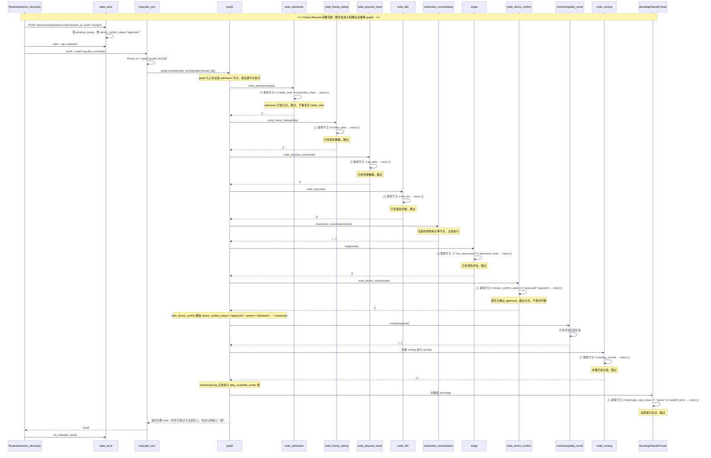
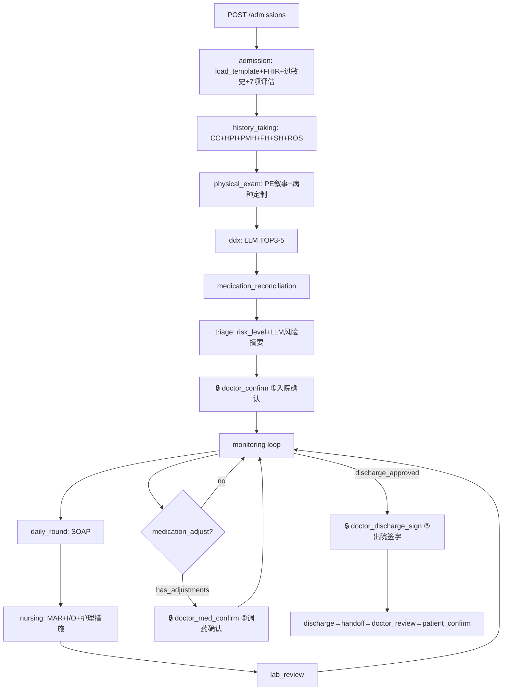

# 臻护临床完整度补全方案 v1.3（终版）

> **v1.3 定位**：本版为独立终版方案，工程师拿到不需翻旧版即可直接开工。合并 v1.0（原始方案）、v1.1（架构评审修订）、v1.2（风险兜底修订）全部内容，**并正面修复主理人齐活林实测代码后发现的 5 个实施陷阱**。全文中文，结构化（mermaid / 表格 / 代码块），默认 **Option B（GRAPH_MODE=classic）** 安全态交付，Option A 锁为 `GRAPH_MODE=stateful` Phase-2。

## 版本演化表

| 版本 | 日期 | 主要贡献 |
|------|------|----------|
| v1.0 | 2026-07-16 | 原始方案：5 新临床节点 + 14 病种模板扩展 + 三批 A/B/C 分批 + InpatientState 新字段 + Graph 编排变更 + 录入闭环端点 |
| v1.1 | 2026-07-17 早 | 架构评审修订：阻塞缺陷决断（统一 graph 主链路 + 废弃两处直调 / 原生 interrupt + Command + SqliteSaver）+ 4 章节补全（DB/FHIR 映射 / LLM 并发降级 / 审计权限 / 模板 CI 校验） |
| v1.2 | 2026-07-17 中 | 风险兜底修订：状态归属模型 Option B（classic）默认推荐 / Option A（stateful）锁为 Phase-2 开关 + 风险登记表 R1-R6 + 回滚闸门（GRAPH_MODE / ENABLE_DIRECT_DISCHARGE / DOCTOR_AUTO_APPROVE 三开关 + 一行 env 逃生锤）+ SqliteSaver 依赖钉死 + interrupt 双模契约 + 纠正 interrupt.py 过时注释 |
| **v1.3** | **2026-07-17 晚** | **终版：合并 v1.0/v1.1/v1.2 全部内容 + 修复 5 个实施陷阱（classic resume 全图重跑 / GRAPH_MODE 散落 / state_store TTL 缺口 / fixture loader 格式不兼容 / 文件路径缺失）** |

---

## 一、范围边界声明

| 类别 | 声明 |
|------|------|
| **已兜底，本方案不重复** | 审计 **M1–M8**（过敏史 / 药物相互作用 / BNP / GCS / 评估量表等）、路由 **R1–R5** 已由 P0 修复兜底，本方案不再覆盖 |
| **显式 out-of-scope** | 审计 **M9–M14**（Teach-back / 自我管理教育 / CGA 老年综合评估 / 安宁疗护 / MMSE 深用）**本方案不做**，留待 Phase 后续专项 |
| **环境事实纠正** | v1.0 注释"langgraph 包不可装"为**过时信息**（v1.1 已纠正）；实测 `from langgraph.types import interrupt, Command` **可 import**。`SqliteSaver` 因未装 `langgraph-checkpoint-sqlite` 而 import 失败（v1.2 钉死依赖解决）。`interrupt.py:22` 旧注释必须改（§二十） |

---

## 二、阻塞性缺陷决断与根治

### A1. 统一回 graph 主链路（废弃直调）

**实测确认**（主理人齐活林核查）：

- `routes/monitoring.py:46-50` 与 `routes/admin.py:67-72` 各一处，于 `discharge_decision=="approved"` 时直调 `node_discharge→node_handoff→node_doctor_review→node_patient_confirm`，**绕过 graph 状态机**，使三卡点 interrupt 全部失效。删除两处方向正确。
- `loop.py:77-79` 当前 `thread_id = f"{pid}-{uuid.uuid4().hex[:8]}"` **每轮随机** → checkpoint 永不复用 → `graph.ainvoke(state, config)` 每次等于**无状态从传入 state 重跑**。这正是"state merge 灾难"的**回避手段**（非修复）。
- `state_store.py` 是事实上的状态所有者：routes 用 `update_state` 改内存 dict，再 `plan_turn(get_state(pid))` 传全量 state 给 graph；当前 graph 无状态，全靠 route 喂。

**决断**：

1. 删除两处直调 discharge 链，改回 `loop.plan_turn`（graph 主链路）。保留 `ENABLE_DIRECT_DISCHARGE` 开关（§十六）作为过渡兜底。
2. `thread_id` 是否改稳定 `pid` **取决于 GRAPH_MODE**：classic（默认）= 维持随机 thread_id（保留当前可工作状态，不动 state-merge 雷区）；stateful（Phase-2）= 稳定 `thread_id=pid` + SqliteSaver。
3. `graph.py` 在 `triage` 之后插入 `doctor_confirm` 节点（见 §十、§十一）。

### A2. 原生 `interrupt()` + `Command(resume)` —— 仅 stateful 模式启用

**实测确认**：`interrupt` / `Command` 可正常 import；`interrupt.py:22` 注释"langgraph 包不可装"为**错误过时信息**。

- **stateful 模式（Option A）**：采用 LangGraph 原生 `interrupt()` 挂起 + `Command(resume=)` 恢复，依赖 SqliteSaver 持久化（§十六钉死）。
- **classic 模式（Option B，默认）**：**不依赖 LangGraph 持久 interrupt**。改用 `state_store` 内的 `pending_review` 队列 + `interrupt_pending` 标志 + 独立 `POST /review` 端点，由 routes 重喂全量 state 续跑 graph（§十一契约）。此路径在 MemorySaver 甚至无 checkpointer 下即可工作。

**三卡点位置**（两模式一致）：

| # | 卡点 | 位置 | 触发 |
|---|------|------|------|
| ① | 入院确认 | `triage` 后 | 每次新入院 |
| ② | 调药确认 | `medication_adjust`（条件边） | LLM 建议调药 `has_adjustments` |
| ③ | 出院签字 | `discharge_approved` 后 | 监控达标 |

---

## 三、执行模型与状态归属决断（核心必答）

> 这是整个大改会不会出问题的命门。主理人实测已证明：当前 `InpatientState`（`graph.py:29-61`）是**纯 TypedDict，无任何 `Annotated` reducer**；所有 `list/dict` 字段都是普通类型。一旦启用**持久 checkpointer + 稳定 thread_id**，LangGraph 默认合并语义是**per-key 后写覆盖（last-write-wins）**，叠加"route 追加 + node 追加 + checkpoint 合并"即触发 3× 累加灾难。

### Option A — LangGraph 单一真相源 + reducer（干净但改动面大）

- `InpatientState` 给所有 `list` 字段加 `Annotated[list, operator.add]`（或自定义 merge reducer）；`dict` 字段定义正确合并 reducer。
- routes **不再** `update_state` + 传全量 state。改为：`graph.update_state(config, {"vital_signs": [new_vital]})` 注入外部增量（reducer 合并），再 `graph.ainvoke(None, config)` 续跑；外部录入同理用 `graph.update_state`。
- 稳定 `thread_id = patient_id`；SqliteSaver 持久化（生产 PostgresSaver）。
- **前提**：interrupt/resume 能工作的唯一干净路径。
- **代价**：重写 `plan_turn` 与所有 routes 的状态注入方式，触碰 state-merge 雷区，需 SqliteSaver 先装好且版本对齐。

### Option B — 保守兜底，无持久 checkpointer（风险最低，推荐默认）

- 维持 `graph.ainvoke(state)` 无状态模式 + 内存 `state_store` 为所有者 + **随机 thread_id 不变**（保留当前可工作的状态，回避 state-merge）。
- interrupt 用"pending_review 队列 + state_store 暂存 + 独立 `POST /review` 端点 resume"实现，**不依赖 LangGraph 持久 checkpoint**（MemorySaver 即可，甚至可无 checkpointer）。
- **直调 discharge 链路**：B 方案下**可保留直调作为 discharge 触发**（因不走 checkpointer 合并，不触发 state-merge）；但为统一主链路，仍建议经 `ENABLE_DIRECT_DISCHARGE` 开关平滑关闭（§十六）。
- **代价**：失去跨进程重启恢复，但**完全不触碰 state-merge 雷区**，可先交付可用版本，SqliteSaver 留作 Phase-2。

### 选取与过渡路径

**默认采用 Option B（GRAPH_MODE=classic）交付 Batch 0 及本轮全部临床补全**；待 SqliteSaver 安装完成、reducer 落位、并由新增回归测试（§十六 R3）验证"N 次 plan_turn 后 vital_signs 不重复累加"后，再切 `GRAPH_MODE=stateful` 进入 Option A。

**一句话理由**：SqliteSaver 实测未装、`state_store` 已是工作态所有者、state-merge 为最高危项 —— B 能在零新增依赖、零 state-merge 暴露下交付三卡点与录入闭环，且逃生锤为一行 env，符合"可安全开工、出问题能秒回滚"。

**过渡路径**：

```
Phase-1（本次 Batch 0–C，GRAPH_MODE=classic 默认）：
  删直调 + 三卡点(pending_review 手动) + 录入闭环 + 落库FHIR + 86测试保绿
Phase-2（GRAPH_MODE=stateful 开关后）：
  装 SqliteSaver(钉版本) → InpatientState 加 reducer → plan_turn 改 update_state 增量注入
  → 三卡点切原生 interrupt() → 验证后默认切 stateful
```

### classic resume 完整时序图

> **陷阱① 根因说明**：v1.2 写"plan_turn(get_state(pid)) 重喂全量 state 续跑 graph"，但 graph 入口永远是 `admission` 节点。医生批准后 graph 从 admission 到所有下游全部重跑，造成：`node_admission` 再写一次 intake_note → document_chain 重复；history_taking / physical_exam / ddx / nursing 重跑可能覆盖医生已录入的真数据；after_monitoring 重判，若 discharge_decision 仍是 approved → 再次触发卡点③ → 二次中断无限循环。
>
> **v1.3 修复**：每个节点添加**幂等守卫**（§六各节点 + §十边变更标注），classic resume 时节点检查标志字段 → 跳过已执行节点 → 安全到达卡点或终点。以下为 classic resume 完整时序。



---

## 四、当前状态回顾

### 已有（无需改动）

```
admission → medication_reconciliation → triage → monitoring
    → daily_round/lab_review/medication_adjust/transfer
    → discharge → handoff → doctor_review → patient_confirm
```

- 14 病种模板 / 86 关键指标
- 7 项评估量表 (NRS / NRS2002 / Morse / Padua / MMSE / ADL / IADL)
- 39 药物规则 (31 相互作用 + 8 疾病禁忌)
- 9 个 LLM 节点 + DeepSeek V4
- 86 测试 / SKIP_BRIDGE 1.26s

### 缺失（本轮补齐）

1. **病史采集** — 无 CC、HPI、PMH、FH、SH、ROS
2. **体格检查** — 无 PE 叙事
3. **鉴别诊断** — 直接挂单病种，无 DDx
4. **护理记录** — 无给药记录、出入量、护理措施
5. **医生人工介入** — interrupt.py 永远 auto-accept，无真实确认卡点（根因见 §二、§三）

---

## 五、目标全链路



---

## 六、新增组件详细设计

> **陷阱① 修复——全部节点必须幂等**：classic 模式下 graph 入口永远是 `admission`，resume 时所有下游节点重跑。每个节点入口必须检查标志字段，已执行则 `return {}` 跳过。

**文件**：新建 `agent/nodes_clinical.py`，集中放所有新临床节点。

### 6.1 node_history_taking（病史采集）

**遵循标准**：SOAP 框架 / OLDCARTS 七要素 / 中国病历书写规范

| 采集项 | 字段 | 类型 |
|--------|------|------|
| 主诉(CC) | `chief_complaint` — 患者原话 + 持续时间 | str |
| 现病史(HPI) | OLDCARTS: Onset / Location / Duration / Character / Aggravating / Relieving / Timing / Severity | dict |
| HPI 叙事 | `hpi_narrative` — LLM 生成的中文叙事段落 | str |
| 既往史(PMH) | 慢病史列表 / 手术史列表 / 住院史 / 输血史 | dict |
| 用药史(Meds) | `[{drug, dose, freq, route, adherence}]` | list[dict] |
| 家族史(FH) | 一级亲属疾病列表（重点关注遗传/心血管/肿瘤） | dict |
| 社会史(SH) | 吸烟 / 饮酒 / 职业 / 居住环境 / 照护者 | dict |
| 系统回顾(ROS) | 按病种模板 `ros_focus_systems` 定制的检查清单 | dict |

**LLM 调用**（§十三并发）：`hpi_narrative` ∥ `ros_questions` 用 `asyncio.gather` 并发（入院阶段仅跑一次）。无数据→输出空结构 + 标记 `insufficient_data`。

**幂等守卫**：节点入口检查 `if state.get("history_data"): return {}`。已采集过病史则跳过，防止 classic resume 覆盖已录入数据。

### 6.2 node_physical_exam（体格检查）

**遵循标准**：Bates 体格检查指南 / 中国体格检查规范

| 系统 | 检查项 | 必检病种 |
|------|--------|----------|
| 一般情况 | 发育 / 营养 / 意识 / 体位 | 全部 |
| 生命体征 | T/HR/RR/BP/SpO2（已有） | 全部 |
| HEENT | 头/眼/耳/鼻/喉 + 甲状腺触诊 | 甲亢 |
| 颈部 | JVP / 气管 / 甲状腺 / 淋巴结 | 心衰(JVP) |
| 胸部-肺 | 视触叩听 / 呼吸音 / 啰音 | COPD / 肺炎 |
| 胸部-心脏 | 心界 / 心音 / 杂音 | 心衰 / 冠心病 |
| 腹部 | 视触叩听 / 肝脾 / 压痛 | 肝硬化 / 消化道出血 |
| 四肢脊柱 | 水肿 / 畸形 / 活动度 / DVT 征 | 术后恢复 |
| 神经系统 | 颅神经 / 肌力 / 感觉 / 反射 / 病理征 | 卒中(NIHSS+GCS) |
| 皮肤 | 皮疹 / 压疮 / 出血点 / 黏膜炎 | 化疗后 |

**LLM 调用**：`await provider.invoke("根据PE数据生成中文查体叙事段落...")` → pe_narrative。按 `pe_template.required_systems` + `focus_items` 定制；未指定系统记"未查"。

**幂等守卫**：节点入口检查 `if state.get("pe_data"): return {}`。

### 6.3 node_ddx（鉴别诊断）

**流程**：`CC + HPI 关键 + PE 关键 → LLM → TOP3-5 DDx（含概率 + 依据）`

**LLM prompt 模板**：

```
根据以下入院数据生成TOP3-5鉴别诊断:
- 主诉: {chief_complaint}
- 现病史: {hpi_narrative}
- 体格检查关键发现: {pe_key_findings}
- 当前诊断: {current_disease_name}

返回JSON: {"ddx_list": [
  {"disease": "疾病名称", "probability": 0.0-1.0,
   "supporting": ["支持点1","支持点2"], "against": ["不支持点1"],
   "next_step": "建议进一步检查"}
]}
```

**输出**：`ddx_list` (list[dict])。DDx 不改变病种模板选择——仅作为医生决策参考。JSON 经 Pydantic 校验（§十三）。

**幂等守卫**：节点入口检查 `if state.get("ddx_list"): return {}`。

### 6.4 node_nursing（护理记录）

| 子模块 | 内容 | 更新频率 |
|--------|------|----------|
| 生命体征 | 复用 monitoring 数据 | 每日/每班 |
| 给药记录(MAR) | `[{drug, dose, time, route, nurse}]` | 每次给药 |
| 出入量(I/O) | 入量(po+iv)、出量(urine+drain+other) | 每班汇总 |
| 护理措施 | 翻身/口腔/导管/伤口/压疮预防 | 每日 |
| 异常报告 | 疼痛加重、意识变化、管路异常 | 事件驱动 |

**输出**：`nursing_records` (list[dict]) + `nursing_alerts` (list[str])。与 monitoring 互补：monitoring 判断"能不能出院"，nursing 记录"做了什么护理"。

**幂等守卫**：节点入口检查 `if state.get("nursing_records"): return {}`。

### 6.5 三处医生介入卡点

| 卡点 | 位置 | 触发 | 审核内容 |
|------|------|------|----------|
| 🔒① 入院确认 | `triage` 后 | 每次新入院 | 病史 + 查体 + DDx + risk_level + 评估 → accept/edit/dismiss |
| 🔒② 调药确认 | `medication_adjust` → 条件 `has_adjustments` | LLM 建议调药时 | 调药方案 + 理由 + 紧急性 → accept/modify/dismiss |
| 🔒③ 出院签字 | `discharge_approved` 后 | 监控达标 | 出院小结 / 用药 / 随访 → sign/hold |

**dev 降级**：`DOCTOR_AUTO_APPROVE=true` 环境变量 → 自动 accept（仅 `APP_ENV != "production"` 时生效）。

**三种卡点节点的幂等守卫**：节点入口检查 `if state.get("doctor_confirm_status") in ("approved", "rejected"): return {}`、 `if state.get("med_confirm_status") in ("approved", "rejected"): return {}`、 `if state.get("discharge_sign_status") in ("signed", "rejected"): return {}`。

**node_admission 幂等守卫**（特别标注）：节点入口检查 `if "intake_note" in state.get("document_chain", []): return {}`。避免 resume 时重复写入 intake_note 导致 document_chain 重复。

---

## 七、录入闭环设计

新增 **`routes/admission_clinical.py`**，承接医生人工录入；classic 模式建模为 `state_store` 内 `pending_review` 数据门，stateful 模式建模为 graph 内 `interrupt` 数据门：

| 端点 | 方法 | 作用 |
|------|------|------|
| `/admissions/{id}/history` | POST | 录入 CC/HPI/PMH/FH/SH/ROS |
| `/admissions/{id}/physical-exam` | POST | 录入 PE 各系统 |
| `/admissions/{id}/nursing` | POST | 录入 MAR/I/O/护理措施 |

**classic 数据门**：`history_taking` 若 `history_data is None` → 写入 `pending_review` 暂停等医生录入；`physical_exam` 同理（`pe_data is None` → 写入 `pending_review`）；`nursing` 同理。录入端点写入 `state_store` 后，由 `POST /admissions/{id}/review`（§十一）重喂全量 state 续跑 graph。

**stateful 数据门（Phase-2）**：录入端点经 `graph.update_state` 注入增量后 `graph.ainvoke(None, config)` 续跑。

---

## 八、InpatientState 新增字段

在 `agent/graph.py` 的 `InpatientState` TypedDict 中新增：

```python
# 病史 (history_taking)
history_data: dict | None           # CC + HPI + PMH + FH + SH
hpi_narrative: str | None           # LLM 生成的 HPI 叙事
ros_findings: dict | None           # 系统回顾发现

# 体格检查 (physical_exam)
pe_data: dict | None                # 各系统检查记录
pe_narrative: str | None            # LLM 生成的 PE 叙事

# 鉴别诊断 (ddx)
ddx_list: list[dict] | None         # TOP N DDx
ddx_unavailable: bool | None        # §十三 fallback 标记

# 护理 (nursing)
nursing_records: list[dict] | None  # MAR + I/O + 护理措施
nursing_alerts: list[str] | None    # 护理异常报告

# 医生介入 (classic=pending_review 手动挂起; stateful=原生 interrupt)
pending_review: dict | None         # {review_id, checkpoint, payload}
doctor_confirm_status: str | None   # pending / approved / rejected
med_confirm_status: str | None
discharge_sign_status: str | None
```

> **reducer 修订（仅 stateful / Option A 生效，Phase-2）**：stateful 模式下，将 `vital_signs/lab_results/reviewed_labs/medication_adjustments/medication_alerts/lab_findings/allergies/triage_matched_factors/clinical_alerts/handoff_items/document_chain` 等 list 字段改为 `Annotated[list, operator.add]`，`dict` 字段定义合并 reducer，使外部增量与 node 返回以 append/merge 语义合并，**根除 last-write-wins 导致的 3× 累加**（§十六 R1）。classic 模式不加 reducer（无持久 checkpointer，不受影响）。

---

## 九、病种模板扩展映射

每模板新增 `history_template` + `pe_template`（14 模板全补，以 `hypertension.json` 为例）：

```json
{
  "_comment": "高血压病种 — 病史+查体模板",
  "history_template": {
    "cc_required": true,
    "hpi_focus": ["头痛", "头晕", "视物模糊", "心悸", "鼻衄"],
    "pmh_key": ["高血压", "糖尿病", "CKD", "冠心病", "脑血管病"],
    "fh_focus": ["早发高血压家族史", "脑血管病家族史"],
    "sh_key": ["吸烟", "饮酒", "盐摄入量", "运动习惯"],
    "ros_focus_systems": ["心血管系统", "神经系统", "肾脏/泌尿系统"]
  },
  "pe_template": {
    "required_systems": ["心血管", "神经系统", "眼底"],
    "focus_items": [
      "双侧上肢血压", "颈动脉杂音", "心界叩诊", "心音及杂音",
      "周围血管征", "神经科查体", "眼底检查"
    ]
  }
}
```

**14 病种全映射**：

| 病种 | history_focus | pe_focus |
|------|--------------|----------|
| 高血压 | 头痛/头晕/CKD/心脑血管家族史 | 四测血压/颈动脉/心界/眼底 |
| 心衰 | 气促/水肿/端坐呼吸/出入量 | JVP/心界/肺底啰音/下肢水肿 |
| 糖尿病 | 多饮多尿/体重变化/低血糖事件/足部 | 足部检查/皮肤/神经感觉/眼底 |
| 冠心病 | 胸痛(OLDCARTS)/放射/硝酸甘油反应 | 心音/心尖搏动/肺部/外周脉搏 |
| 脑卒中 | 发病时间/瘫痪/失语/凝视/NIHSS | GCS/NIHSS/颅神经/肌力/病理征 |
| COPD | 咳嗽/咳痰/气促/吸烟史(包年) | 肺视诊/呼吸音/啰音/哮鸣音/紫绀 |
| 肺炎 | 发热/咳嗽/痰液性状/CURB65 | 肺听诊/叩诊浊音/呼吸频率/紫绀 |
| CKD | 水肿/尿量/泡沫尿/多囊肾家族史 | 血压/水肿/肾区叩痛/心包摩擦音 |
| AKI | 少尿/容量/肾毒性药物/造影剂 | 容量状态/血压/肺部/心电图 |
| 肝硬化 | 黄疸/腹围/呕血黑便/饮酒史 | 黄疸/肝掌/蜘蛛痣/腹水/肝脾肿大 |
| 消化道出血 | 黑便/呕血/腹痛/NSAID/抗凝 | 血压心率/腹部压痛/肠鸣音/黑便 |
| 甲亢 | 心悸/怕热/体重下降/眼征/情绪 | 甲状腺触诊/眼征/心率/手颤 |
| 术后恢复 | 手术日期/伤口疼/引流管/DVT 预防 | 伤口/引流/肠鸣音/下肢 DVT 征 |
| 化疗后 | 化疗药/周期/恶心呕吐/口腔/发热 | 口腔黏膜/皮肤/中心静脉导管/淋巴结 |

**强制检查**：每个模板必须含审计 P0 体征（`gcs` / `nt_probnp` / `jvp` / `blood_ketone` 等），CI 校验保证（§十五）。

---

## 十、Graph 编排变更

> **关键**：以下均为**替换**原有边，非"新增"。若新旧边并存，将导致节点双跑。
>
> **陷阱① 修复——每条边变更标注节点幂等条件**：classic resume 时 graph 从 admission 重跑，每个节点在入口处检查幂等标志，已执行则 `return {}` 跳过。下表中"幂等守卫"列为各节点跳过条件。

### 10.1 新增节点注册

```python
from agent.config import get_graph_mode  # 陷阱②: 统一从 config 导入配置
from .nodes_clinical import (
    node_history_taking,
    node_physical_exam,
    node_ddx,
    node_nursing,
    node_doctor_confirm,
    node_doctor_med_confirm,
    node_doctor_discharge_sign,
)

builder.add_node("history_taking", node_history_taking)
builder.add_node("physical_exam", node_physical_exam)
builder.add_node("ddx", node_ddx)
builder.add_node("nursing", node_nursing)
builder.add_node("doctor_confirm", node_doctor_confirm)
builder.add_node("doctor_med_confirm", node_doctor_med_confirm)
builder.add_node("doctor_discharge_sign", node_doctor_discharge_sign)
```

### 10.2 边变更（替换语义 + 幂等标注）

```
# 原 admission→medication_reconciliation 改为：
admission → history_taking → physical_exam → ddx → medication_reconciliation
  幂等: admission 检查 "intake_note" in document_chain → return {}
  幂等: history_taking 检查 history_data → return {}
  幂等: physical_exam 检查 pe_data → return {}
  幂等: ddx 检查 ddx_list → return {}

# 原 triage→monitoring 改为：
triage → doctor_confirm(①) → monitoring
  幂等: triage 检查 "risk_assessment" in document_chain → return {}
  幂等: doctor_confirm 检查 doctor_confirm_status in ("approved","rejected") → return {}

# 原 daily_round→monitoring 改为：
daily_round → nursing → lab_review → monitoring
  幂等: nursing 检查 nursing_records → return {}

# 原 medication_adjust→monitoring 改为（条件边）：
medication_adjust → doctor_med_confirm(②, 条件 has_adjustments) → monitoring
  幂等: doctor_med_confirm 检查 med_confirm_status in ("approved","rejected") → return {}

# 原 discharge→handoff 前插入（③）：
discharge → doctor_discharge_sign → handoff
  幂等: doctor_discharge_sign 检查 discharge_sign_status in ("signed","rejected") → return {}
  幂等: discharge/handoff 检查 discharge_sign_status=="signed" or handoff_items → return {}
```

### 10.3 after_monitoring 更新

`discharge_decision=="approved"` → 路由 `doctor_discharge_sign`（而非直接 discharge）。

### 10.4 after_doctor_confirm 新路由

```python
def after_doctor_confirm(state) -> str:
    if state.get("doctor_confirm_status") == "approved":
        if state.get("discharge_decision") == "approved":
            return "discharge"    # 出院签字通过 → 走出院流程
        return "monitoring"       # 入院确认通过 → 开始监测
    return "monitoring"           # reject → 回监测循环
```

---

## 十一、interrupt 执行流契约

`plan_turn` 与 `POST /review` 须按 `GRAPH_MODE` 双模实现，但对外契约统一。

### 11.1 GRAPH_MODE 集中管理（陷阱②修复）

**根因**：v1.2 之前 loop.py / graph.py / interrupt.py 各自 `os.getenv("GRAPH_MODE","classic")`，拼写错误或默认值不一致难以排查。

**v1.3 修复**：新建 `agent/config.py` 集中管理所有环境变量配置，其他文件统一 `from .config import ...`。

```python
# agent/config.py (新建)
import os

def get_graph_mode() -> str:
    """返回当前 GRAPH_MODE: classic(默认) 或 stateful(Phase-2)"""
    return os.getenv("GRAPH_MODE", "classic")

def get_checkpoint_db() -> str:
    """返回 SqliteSaver db 路径; 空=MemorySaver"""
    return os.getenv("LANGGRAPH_CHECKPOINT_DB", "")

def is_direct_discharge_enabled() -> bool:
    """是否保留旧直调 discharge 链路"""
    return os.getenv("ENABLE_DIRECT_DISCHARGE", "true").lower() == "true"

def is_doctor_auto_approve() -> bool:
    """仅 APP_ENV != production 时允许自动批准"""
    if os.getenv("APP_ENV") == "production":
        return False
    return os.getenv("DOCTOR_AUTO_APPROVE", "true").lower() == "true"

def get_app_env() -> str:
    """返回部署环境: dev/staging/production"""
    return os.getenv("APP_ENV", "dev")
```

**其他文件统一导入**：

```python
# loop.py / graph.py / interrupt.py 统一改为:
from .config import get_graph_mode, get_checkpoint_db, is_doctor_auto_approve
graph_mode = get_graph_mode()
```

### 11.2 plan_turn 检测与返回（HTTP 202 契约）

```python
def plan_turn(state):
    result = graph.ainvoke(state, config)             # classic: 随机 thread_id, 无状态
    # stateful: graph.ainvoke(state, config)           # 稳定 thread_id, SqliteSaver
    if needs_review(result):                           # classic: result["pending_review"] 存在
        # stateful: result.__interrupts__ 非空
        return {status:"pending_review", review_id, payload}   # → HTTP 202
    self._current_state = result
    return result
```

### 11.3 恢复端点

新增 `POST /admissions/{id}/review`（**陷阱⑤修复：明确文件路径 `routes/review.py`**）：

- **classic（默认）**：从 `state_store` 取 `pending_review`；将 `doctor_confirm_status/med_confirm_status/discharge_sign_status` 置为医生决策；`plan_turn(get_state(pid))` 重喂全量 state 续跑 graph（各节点幂等守卫保证跳过已执行节点，见 §三 Mermaid 时序图）。
- **stateful（Phase-2）**：`graph.ainvoke(Command(resume=decision), {configurable:{thread_id: pid}})` 原生恢复。

### 11.4 三卡点位置

同 §二 A2 表（入院确认 / 调药确认 / 出院签字）。

---

## 十二、DB / FHIR 映射

**问题**：`state_store.py` 为 30min TTL 内存字典，新数据（history/PE/DDx/nursing）未落库，重启/跨进程即丢。

> **陷阱③ 已知限制标注**：`state_store.py:6` `_TTL_SECONDS = 1800` 硬编码 30min。v1.2 R5 写 classic 用 state_store 存 pending_review。若医生审批超 30 分钟，pending_review 被清，挂起线索丢失、路由无法恢复。
>
> - **dev 模式不受影响**（`DOCTOR_AUTO_APPROVE=true` 秒过）。
> - **不阻塞 Batch 0 开工**：本方案显式标注为"已知限制"。
> - **生产环境上线前**：`STATE_TTL_SECONDS` 应可配（环境变量），pending_review 应延长 TTL（≥24h）或持久化落库（`agent/persistence.py` 中实现）。

**落库 + 接 fhir-adapter**（已有 8 表：Patient/Encounter/Condition/Observation/MedicationRequest/CarePlan/Consent/FHIRAuditEvent；**缺** MedicationAdministration/DocumentReference/DiagnosticReport）。

**最小可行映射**：

| 临床数据 | FHIR 资源 | 说明 |
|----------|-----------|------|
| 体征 / PE 发现 | `Observation` | code(LOINC)+value+unit |
| DDx / 诊断 | `Condition` | code(ICD-10)+severity |
| MAR 给药 | `MedicationRequest`（暂标 `administered`，或扩 `MedicationAdministration`） | dosage+status |
| 叙事段落(HPI/PE/SOAP) | `CarePlan.note` 暂存，或新建 `clinical_documents` 表 | 段落文本 |
| 医生审核动作 | `FHIRAuditEvent` | INSERT-only |

新增 **`agent/fhir_sync.py`**（node→FHIR 同步）、**`agent/persistence.py`**（落库封装）。

---

## 十三、LLM 并发 / 降级

| 策略 | 实现 |
|------|------|
| 并发 | `hpi_narrative` ∥ `ros_questions` 用 `asyncio.gather`（入院阶段仅一次） |
| 超时 | `asyncio.wait_for(10s)` + try/except 降级 |
| 防重算 | 按 `(patient_id, phase, input_hash)` 缓存，避免 resume 重算 LLM |
| DDx 校验 | Pydantic schema 校验 + 重试 2 次 + fallback 空列表带 `ddx_unavailable` flag |
| HPI 降级 | `hpi_narrative=None` 时降级用 `chief_complaint`+`pe_findings` 拼装 |

---

## 十四、审计与权限

- 每次 `accept/edit/dismiss` 写 fhir-adapter **`FHIRAuditEvent`**（INSERT-only，不可改）。
- **敏感字段**（FH/SH/用药史）需先有 **`Consent`** 记录，并经**角色中间件**（doctor/nurse）鉴权后才可读写。

---

## 十五、模板 CI 校验

新增模板校验脚本（CI 门禁），**断言 14 模板均含审计强制 P0 体征**（如 `gcs`/`nt_probnp`/`jvp`/`blood_ketone` 等），防止回归。校验失败则 CI 红灯阻断合并。

---

## 十六、风险登记与回滚预案

### 16.1 风险登记表

| # | 风险描述 | 触发条件 | 后果 | 可能 | 影响 | 缓解措施 | 兜底开关 |
|---|----------|----------|------|------|------|----------|----------|
| R1 | **state-merge 双倍/三倍累加**（最高危） | 稳定 thread_id + 持久 checkpointer + InpatientState 无 reducer；route 追加 + node 追加 + checkpoint 合并 | vital_signs 等 list 3× 增长、状态爆炸 | 高(若上 stateful) | 高 | classic 模式不碰雷区；stateful 必加 `Annotated[list, operator.add]` reducer | `GRAPH_MODE=classic` |
| R2 | **SqliteSaver 版本漂移/安装失败** | `pip install langgraph-checkpoint-sqlite` 与主 langgraph 版本不兼容 | 应用启动崩溃 | 中 | 高 | `build_inpatient_graph` 内 try/except 包裹 SqliteSaver 构造，失败回 MemorySaver + warning；requirements 钉死版本；CI 验证 import | `LANGGRAPH_CHECKPOINT_DB` 空→MemorySaver |
| R3 | **86 测试 + 14 fixture 全链路回归失败** | 大改执行模型后旧测试假设"无状态 graph" | 功能回退未被发现 | 中 | 高 | Batch 0 前 freeze 当前全绿基线（86/86）；Batch 0 后必重跑 `SKIP_BRIDGE=true pytest` + 14 fixture smoke；**新增断言**："N 次 plan_turn 后 vital_signs 不重复累加" | 逃生锤回退（§16.3） |
| R4 | **同一患者并发 turn 竞争 checkpoint** | vitals 与 labs 同时到达 → 同 thread_id 竞写 | checkpoint 错乱 / 状态撕裂 | 中 | 中 | `get_patient_loop` 现有 per-patient 实例扩展为 per-patient `asyncio.Lock` 串行 turn | `GRAPH_MODE=classic` 下仍加锁 |
| R5 | **interrupt 挂起后 state 丢失** | MemorySaver 单进程 + 进程重启 | 挂起态丢失，医生决策无主 | 中(若 stateful 用 Memory) | 高 | classic 用 `state_store`(30min TTL) 存 pending_review；**已知限制③**：超 30min 丢失，生产需延长 TTL 或持久化 | `GRAPH_MODE=classic` |
| R6 | **DOCTOR_AUTO_APPROVE 误开到生产** | dev 降级开关泄漏到 production | 无人审核自动通过，医疗事故 | 低 | 高 | 仅当 `APP_ENV != "production"` 时该 env 生效，否则强制 interrupt 挂起 | `APP_ENV=production` 强制挂起 |
| **R7** | **classic resume 全图重跑致重复执行（陷阱①）** | classic 下 `plan_turn(get_state())` 续跑 graph，graph 入口永远是 admission → 所有下游节点重跑 | admission 重复写 intake_note → document_chain 重复；history/PE/DDx/nursing 覆盖真实数据；discharge 重判 → 二次中断无限循环 | **高** | **高** | **所有节点加幂等守卫**（§六各节点入口检查标志字段 return {}）；discharge 链检查 `discharge_sign_status=="signed" or handoff_items` | 幂等守卫为硬约束 |
| **R8** | **fixture loader 格式不兼容 new plan_turn 返回（陷阱④）** | Batch 0.5 后 plan_turn 可能返回 `{status:"pending_review",...}` 而非完整 state | `result.get("phase")`/`result.get("discharge_decision")` 返回 None → 循环不 break 也不进 approved 分支 → 继续迭代 vitals → 再次 pending_review → 无限等待或超时 | **高** | **高** | **admin.py fixture loader 同步加 pending_review 分支处理**（§十八 Batch 0.3）；DOCTOR_AUTO_APPROVE=true 跑 fixture | 幂等守卫 + 分支处理 |

**③已知限制**（state_store TTL 30min）：见 R5、§十二标注，不阻塞 Batch 0。

### 16.2 SqliteSaver 依赖钉死

- **安装（在目标部署环境）**：
  ```bash
  pip show langgraph          # 读取 Version 字段（如 0.2.x），记为 V
  pip install "langgraph-checkpoint-sqlite==<与 langgraph 主版本一致的 V>"
  ```
  > 沙箱探测：本机 `import langgraph` 可用但 `pip show`/`__version__` 均无输出，版本**无法自动确定**，必须在目标环境按上述步骤对齐安装（版本漂移即 R2）。

- **运行时容错**：`graph.py` 的 SqliteSaver 构造**必须**包 try/except，失败回 `MemorySaver` 并打 warning 日志（当前 `graph.py:203-212` 未包，须改）。
- **测试模式**：`SKIP_BRIDGE=true` 下建议仍用 `MemorySaver`，避免 SQLite 文件锁与并行测试干扰；SqliteSaver 仅生产/集成测试（`LANGGRAPH_CHECKPOINT_DB` 非空）启用。
- **CI 门禁**：新增 step 验证 `langgraph` 与 `langgraph-checkpoint-sqlite` 均 import 成功且主版本一致。

### 16.3 回滚闸门（feature-flag 双轨）

| 开关 | 取值 | 语义 | 默认 |
|------|------|------|------|
| `GRAPH_MODE` | `classic` \| `stateful` | classic=Option B 安全态（无持久 checkpointer，state_store 所有者）；stateful=Option A（reducer + 稳定 thread_id + SqliteSaver） | **`classic`** |
| `LANGGRAPH_CHECKPOINT_DB` | 空 \| 路径 | 空=MemorySaver+原行为逃生通道；非空=SqliteSaver 持久 | **空** |
| `ENABLE_DIRECT_DISCHARGE` | `true` \| `false` | true=保留旧直调 discharge（B 下可保留，因不走 checkpointer 合并）；false=经 graph 主链路 | **`true`**（验证后改 false） |
| `DOCTOR_AUTO_APPROVE` | `true` \| `false` | 仅 `APP_ENV != "production"` 时生效，否则强制 interrupt | dev=`true` |

**逃生锤（一行 env 即可回退，无需回滚代码）**：若 Batch 0 后回归测试不过或 state-merge 异常：

```bash
export GRAPH_MODE=classic
export LANGGRAPH_CHECKPOINT_DB=""      # → MemorySaver
export ENABLE_DIRECT_DISCHARGE=true    # → 保留旧直调
# 即回退到"随机 thread_id + MemorySaver + 直调"的当前可工作状态
```

---

## 十七、文件变更清单

| 操作 | 文件 | 说明 |
|------|------|------|
| **新建** | **`agent/config.py`** | **陷阱②：集中管理 GRAPH_MODE / LANGGRAPH_CHECKPOINT_DB / ENABLE_DIRECT_DISCHARGE / DOCTOR_AUTO_APPROVE / APP_ENV 环境变量** |
| 新建 | `agent/nodes_clinical.py` | 病史+PE+DDx+护理+3 确认节点，**全部含幂等守卫（陷阱①）** |
| 新建 | `routes/admission_clinical.py` | 录入闭环端点（§七） |
| **新建** | **`routes/review.py`** | **陷阱⑤：`POST /admissions/{id}/review` 恢复端点（§十一）** |
| 新建 | `agent/fhir_sync.py` | node→FHIR 同步（§十二） |
| 新建 | `agent/persistence.py` | 落库封装（§十二） |
| 修改 | `agent/graph.py` | 7 新节点+替换边**+每条边标注节点幂等条件（陷阱①）**；SqliteSaver 构造包 try/except 回退（R2）；**from .config import get_graph_mode 替换散落 os.getenv（陷阱②）**；stateful 下 list 字段加 reducer（R1，Phase-2） |
| 修改 | `agent/loop.py` | `GRAPH_MODE` 分支（**改用 config.get_graph_mode，陷阱②**）：classic 维持随机 thread_id；新增 per-patient `asyncio.Lock`（R4）；`plan_turn` 按 §十一返回 HTTP 202 契约 |
| 修改 | `agent/interrupt.py` | 纠正 §二十过时注释；classic=pending_review 手动挂起，stateful=原生 `interrupt()`+`Command(resume)`；**from .config import get_graph_mode（陷阱②）** |
| 删除直调(开关) | `routes/monitoring.py:46-50`、`routes/admin.py:67-72` | 改回 graph；保留 `ENABLE_DIRECT_DISCHARGE` 开关（§16.3） |
| 修改 | `routes/admin.py` | **陷阱④：fixture loader 加 pending_review 分支处理** |
| 修改 | `agent/__init__.py` | 导出 nodes_clinical, config |
| 修改 | `disease_templates/*.json`(14) | +history_template/pe_template（含 P0 体征） |
| 修改 | `routes/patient_fixtures.py` | 14 患者 CC/HPI/PMH/FH/SH/PE 数据 |
| 新建 | `tests/test_routes_clinical.py` | 录入闭环测试 |
| 新建 | `tests/test_fhir_sync.py` | FHIR 同步测试 |
| 新建 | `tests/test_state_merge.py` | **R3 断言：N 次 plan_turn 后 vital_signs 不重复累加** |
| 新建 | `tests/test_nodes_clinical.py` | 临床节点测试 |
| 修改 | `requirements.txt` | 钉死 `langgraph-checkpoint-sqlite==<V>`（§16.2） |

---

## 十八、实施分批

> **陷阱①②③④⑤ 修复均已分配到对应 Batch 项中**。

### Batch 0：阻塞性缺陷根治 + 5陷阱修复（默认 classic，零新增依赖开工）

```
0.0 先 freeze 当前全绿基线：记录 86/86 + 14 fixture smoke 通过（R3 基线）
0.1 ▸陷阱②: 新建 agent/config.py，集中管理 GRAPH_MODE/LANGGRAPH_CHECKPOINT_DB/
    ENABLE_DIRECT_DISCHARGE/DOCTOR_AUTO_APPROVE/APP_ENV；
    ▸loop.py/graph.py/interrupt.py 统一 from .config import get_graph_mode 替换散落 os.getenv
0.2 删 routes/monitoring.py:46-50 直调 discharge 链 → 改 plan_turn(get_state) 续跑
    （保留 ENABLE_DIRECT_DISCHARGE=true 兜底）
0.3 ▸陷阱④: admin.py fixture loader 在 plan_turn 后检查 result.get("status"):
    if result.get("status") == "pending_review":
        state = get_state(patient_key)
        state["doctor_confirm_status"] = "approved"
        result = await loop.plan_turn(state)
    ▸同时检查 result.get("phase")/result.get("discharge_decision") 为 None 时的处理逻辑
    ▸删 routes/admin.py:67-72 直调 discharge 链 → 同样改 plan_turn 续跑
0.4 interrupt.py: 纠正 §二十过时注释；实现 classic=pending_review 手动挂起
0.5 loop.plan_turn 按 §十一返回 {status:"pending_review",...}（HTTP 202）；
    ▸陷阱⑤: 明确文件路径 routes/review.py，新增 POST /admissions/{id}/review
    （classic: 重喂全量 state 续跑）
0.6 requirements 钉死 langgraph-checkpoint-sqlite==<V>（§16.2）；
    graph.py SqliteSaver 构造包 try/except 回 MemorySaver（R2）
    —— 注：classic 默认不依赖 SqliteSaver，0.6 仅为 stateful(Phase-2) 铺路；SqliteSaver 未装也不阻塞开工
0.7 ▸陷阱①: §六每个新节点(node_admission补加/history_taking/physical_exam/ddx/
    nursing/doctor_confirm/doctor_med_confirm/doctor_discharge_sign/discharge链)
    全部加幂等守卫（入口检查标志字段，已执行则 return {}）；
    ▸§十条边变更标注幂等条件；
    ▸§十一补 classic resume 完整 Mermaid 时序图
0.8 验证：86 测试仍绿 + 14 fixture smoke + 新增 test_state_merge 断言通过
    ▸DO spisefient loader 确保 DOCTOR_AUTO_APPROVE=true 跑通（§十九）
    ▸陷阱③标注: 已知限制 state_store TTL 30min，不影响 dev 模式，不阻塞 Batch 0
```

### Batch A：基础建设

```
A1. InpatientState + gen_input 新字段
A2. 14 模板扩展 (history_template + pe_template)
A3. ▸陷阱①延续: node_history_taking + 幂等守卫
A4. ▸陷阱①延续: node_physical_exam + 幂等守卫
A5. fixture 数据补全 (CC/HPI/PE)
```

### Batch B：流程扩展

```
B1. ▸陷阱①延续: node_ddx + 幂等守卫
B2. ▸陷阱①延续: node_nursing + 幂等守卫
B3. graph.py 编排更新（替换边 + 7 节点 + 路由 + 全部幂等标注）
```

### Batch C：人工介入 + 录入闭环 + 落库

```
C1. ▸陷阱①延续: node_doctor_confirm / doctor_med_confirm / doctor_discharge_sign
    （§十一 契约，全部带幂等守卫）
C2. routes/admission_clinical.py 录入端点 + 数据门
C3. fhir_sync.py / persistence.py 落库 + FHIR 映射
C4. 审计与权限（FHIRAuditEvent + Consent + 角色中间件）
```

### 验证跑通

```
V1. 14 患者全链路（Batch 0 后 graph 主链路，DOCTOR_AUTO_APPROVE=true）
V2. 86→100+ 测试全绿
V3. 模板 CI 校验脚本接入
```

### Phase-2（GRAPH_MODE=stateful，验证充分后）

```
P1. 目标环境装 SqliteSaver(钉版本)，CI 验证 import 与主版本一致
P2. InpatientState list 字段加 reducer（§八），根除 R1
P3. plan_turn 改 graph.update_state 增量注入；thread_id 改稳定 pid
P4. 三卡点切原生 interrupt()+Command(resume)；POST /review 改 Command(resume)
P5. 验证：GRAPH_MODE=stateful 下 86 测试 + state_merge 断言 + 跨进程 resume 通过 → 默认切 stateful
```

---

## 十九、启动验证命令

```bash
# 1) 单元测试（开发模式：classic 默认，跳过桥接 + 自动医生确认）
SKIP_BRIDGE=true DOCTOR_AUTO_APPROVE=true GRAPH_MODE=classic python -m pytest tests/ -q

# 2) 14 fixture 遍历 smoke（经 graph 主链路，非直调；陷阱④修复后验证）
SKIP_BRIDGE=true DOCTOR_AUTO_APPROVE=true GRAPH_MODE=classic python - <<'PY'
import asyncio
from zhenhu.inpatient.routes.patient_fixtures import PATIENTS
from zhenhu.inpatient.agent.loop import get_patient_loop
from zhenhu.inpatient.routes.state_store import set_state, get_state, update_state

async def smoke():
    for key in PATIENTS:
        loop = get_patient_loop(key)
        st = loop.gen_input("new_admission"); st["patient_id"] = key
        # 加载 fixture + 逐步上报体征
        # ▸陷阱④ fix: 检查 status=="pending_review" → 置 approved → plan_turn 续跑
        assert get_state(key).get("phase") in ("confirm", "handoff")

asyncio.run(smoke())
print("14 fixtures smoke OK")
PY

# 3) state-merge 回归断言（R3，最高危；陷阱①修复后验证不重复累加）
SKIP_BRIDGE=true GRAPH_MODE=classic python -m pytest tests/test_state_merge.py -q

# 4) 模板 CI 校验（断言 14 模板含 P0 体征，防回归）
python scripts/validate_templates.py --require gcs,nt_probnp,jvp,blood_ketone

# 5) admin fixture loader 验证（陷阱④修复后，DOCTOR_AUTO_APPROVE=true 必须跑通）
SKIP_BRIDGE=true DOCTOR_AUTO_APPROVE=true GRAPH_MODE=classic python - <<'PY'
import asyncio, json, os
os.environ["SKIP_BRIDGE"] = "true"
os.environ["DOCTOR_AUTO_APPROVE"] = "true"
os.environ["GRAPH_MODE"] = "classic"

# 对 PATIENTS 每个 key 调用 load_fixture_patient，断言 200 + final_phase 非空
# ▸陷阱④ fix 后: result["status"]!="pending_review" 或已自动处理
PY

# ★逃生锤★：若 Batch 0 后回归不过，一行回退到当前可工作状态（无需回滚代码）
export GRAPH_MODE=classic LANGGRAPH_CHECKPOINT_DB="" ENABLE_DIRECT_DISCHARGE=true
```

---

## 二十、过时注释纠正

- **`interrupt.py:22`**：当前注释"受限于沙箱环境(langgraph 包不可装), suspend/resume 无法端到端验证"是**错误过时信息**。实测 `from langgraph.types import interrupt, Command` 可正常 import；仅 `langgraph.checkpoint.sqlite`（SqliteSaver）因未装 `langgraph-checkpoint-sqlite` 而失败。
- **v1.3 实施时改为**：

```python
# langgraph 已安装，interrupt/Command 可正常 import。
# 持久 interrupt（跨进程 resume）需 SqliteSaver：
#   pip install langgraph-checkpoint-sqlite（见 §16.2 钉版本）。
# 当前默认 GRAPH_MODE=classic 下采用 state_store pending_review 手动挂起，
# 无需持久 checkpointer。
```

---

## 二十一、完成后状态

| 维度 | 当前 | 目标 |
|------|------|------|
| Agent 节点 | 12 | **19**（+history/PE/ddx/nursing/3确认） |
| LLM 调用点 | 9 | **13** |
| 医生介入卡点 | 0（直调绕过） | **3（§十一 契约挂起）** |
| 节点幂等 | 无 | **全部节点含幂等守卫（陷阱①）** |
| 配置管理 | 散落 3 文件 os.getenv | **集中 agent/config.py（陷阱②）** |
| 数据持久化 | 内存 30min TTL | **落库 + FHIR 映射**；state_store TTL 为已知限制（陷阱③） |
| 主链路 | 直调 + graph 混用 | **统一 graph 主链路** |
| checkpointer | MemorySaver（丢） | classic=MemorySaver / stateful=Sqlite/Postgres 持久（§16.2） |
| 状态归属 | state_store 所有者（classic 默认） | classic=route 喂全量；stateful=graph 单一真相源+reducer |
| 测试 | 86 | **100+**（含 test_state_merge 防回归） |
| 审计 M9–M14 | — | **out-of-scope（Phase 后续）** |
| 回滚能力 | 无 | **feature-flag 双轨 + 一行 env 逃生锤（§16.3）** |
| 文件完整性 | review 端点无文件路径 | **routes/review.py 明确（陷阱⑤）** |
| fixture loader | 不兼容新 plan_turn 格式 | **pending_review 分支处理（陷阱④）** |
