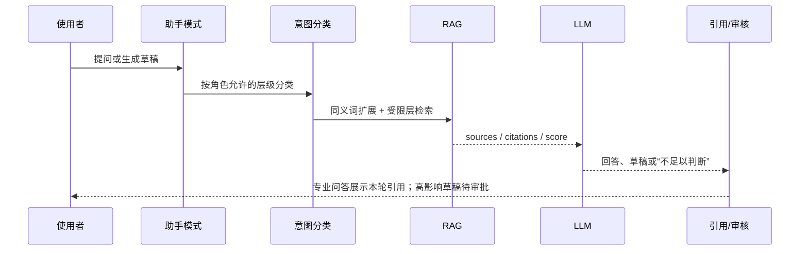
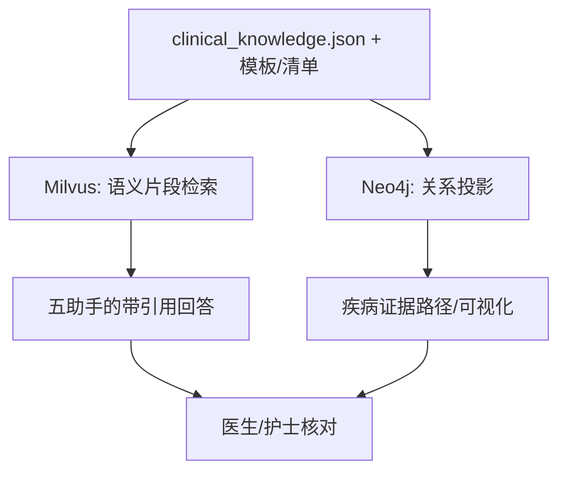
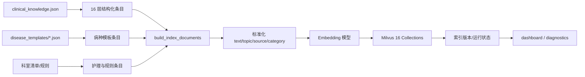
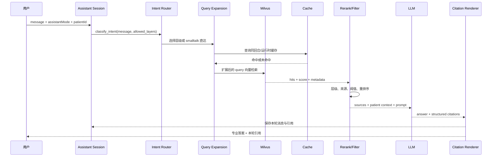
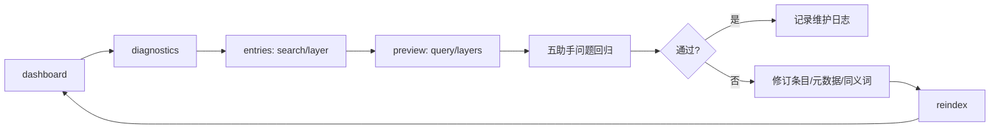

# RAG 知识库维护手册

> 臻护 v2.0 | 2026-07-21 | 385 条知识 · 16 层 · 22 病种模板 · 16 科室 67 项清单 | 适用角色: 知识库管理员 / 运维工程师

> **当前校准**：运行入口、权限和接口语义以 [臻护-代码现状基线.md](臻护-代码现状基线.md) 为准。本文中的 `/inpatient/rag/*` 仅用于兼容/直接诊断；管理端日常维护统一使用 `/admin/rag/*`。

---

## 目录

1. [概述](#一概述)
2. [16 层知识结构速查](#二16-层知识结构速查)
3. [知识条目标准格式](#三知识条目标准格式)
4. [管理端操作指南](#四管理端操作指南)
5. [标准操作流程](#五标准操作流程)
6. [故障排查](#六故障排查)
7. [各层维护要点](#七各层维护要点)
8. [质量基准](#八质量基准)
9. [快速命令参考](#九快速命令参考)
10. [检索管线详解](#十检索管线详解)
11. [RAG 痛点与解决机制](#十一rag-痛点与解决机制)
12. [五个助手与 RAG 协同](#十二五个助手与-rag-协同)
13. [Neo4j 证据图谱联动](#十三neo4j-证据图谱联动)
14. [召回率与证据质量优化](#十四召回率与证据质量优化)
15. [知识治理验收闭环](#十五知识治理验收闭环)
16. [RAG 流程详解](#十六rag-流程详解)

---

## 一、概述

臻护的 RAG 知识库由 **16 层、385 条结构化知识** + **22 个病种模板 JSON** + **16 科室 67 条核查清单** 组成。

### 1.1 知识存储三源

```
                         ┌────────────────────────────┐
                         │ Milvus 向量库 :19530         │
                         │ 16 Collections · 384-dim    │
                         │ IVF_FLAT 索引 · MiniLM 编码  │
                         └──────────┬─────────────────┘
                                    │ 索引写入
              ┌─────────────────────┼─────────────────────┐
              ▼                     ▼                     ▼
┌──────────────────────┐ ┌──────────────────┐ ┌──────────────────┐
│ clinical_knowledge   │ │ disease_template │ │ DEPT_CHECKLIST   │
│ .json                │ │ s/*.json (22个)   │ │ (constants.py)    │
│ 385 条 16 层         │ │ 出院标准/并发症/   │ │ 16 科室 67 项     │
│                      │ │ 护理清单/SOAP模板  │ │                  │
└──────────────────────┘ └──────────────────┘ └──────────────────┘
```

| 源 | 路径 | 条目 | 修改方式 |
|------|------|:--:|------|
| 结构化知识 JSON | `config/clinical_knowledge.json` | 385 条 | 编辑 JSON → 管理端重建索引 |
| 病种模板 JSON | `src/zhenhu/inpatient/disease_templates/*.json` | 22 个 | 编辑 JSON → seed-all 导入 |
| 科室清单常量 | `src/zhenhu/inpatient/agent/constants.py` | 67 项 | 编辑 Python dict → 重启后端 + seed-all |

### 1.2 数据流转

```
编辑源 JSON → 管理端"重新索引知识库" → Milvus 清空 16 集合
                                      → MiniLM 重新编码 385 条
                                      → IVF_FLAT 索引创建
                                      → 前端助手立即可检索
```

**耗时**: 约 30-60 秒 (CPU 编码, 385 条 × 384 维)

---

## 二、16 层知识结构速查

### 2.1 全层一览

| 层 | Milvus Collection | 条目 | 类型 | 影响助手 | 来源 |
|:--:|------|:--:|------|------|------|
| L1 | clinical_scoring | 6 | 评分规则 | 全部 | JSON |
| L2 | disease_keypoints | 18 | 疾病要点 | 全部 | JSON |
| L3 | disease_templates | 22 | 病种模板 | 全部 | 独立 JSON 文件 |
| L4 | dept_protocols | 67 | 科室清单 | 全部 | constants.py |
| L5 | drug_interactions | 25 | 药物交互 | doctor / pharmacist | JSON |
| L6 | lab_reference | 25 | 检验参考 | 全部 | JSON |
| L7 | emergency_protocols | 13 | 急症处置 | doctor / pharmacist | JSON |
| L8 | nursing_protocols | 30 | 护理操作 | nurse | JSON |
| L9 | self_care | 51 | 患教自护 | patient / integrative / nurse | JSON |
| L10 | surgical_protocols | 15 | 外科协议 | doctor / nurse | JSON |
| L11 | medication_dosing | 24 | 用药剂量 | pharmacist / doctor | JSON |
| L12 | infection_control | 13 | 感染控制 | nurse | JSON |
| L13 | nutrition_support | 16 | 营养支持 | nurse / patient | JSON |
| L14 | obgyn_basics | 15 | 妇产知识 | nurse / integrative | JSON |
| L15 | tcm_knowledge | 95 | 中医知识 | integrative / patient | JSON |
| L16 | tcm_assessment | 0 | 中医体质 | integrative (预留) | JSON |
| **计** | | **385** | | | |

### 2.2 层间交互关系

```
L1+L2+L3 ──→ DDx 鉴别诊断 (Agent node_ddx)
L1+L5+L6 ──→ 用药安全 (Agent node_medication_reconciliation)
L1+L7    ──→ 急诊评估 (Agent node_triage)
L4+L8    ──→ 护理计划 (Agent node_nursing)
L9+L13+L15 ──→ 患教生成 (node_discharge + DischargeEducationPanel)
L5+L11  ──→ 用药剂量调整 (node_medication_adjust)
L10+L12+L13 ──→ 围手术期管理
```

---

## 三、知识条目标准格式

### 3.1 clinical_knowledge.json 条目格式

```json
{
  "drug_interactions": [
    {
      "topic": "抗凝+抗血小板 出血风险叠加",
      "category": "出凝血交互",
      "content": "华法林+阿司匹林 → INR↑+出血风险显著增加..."
    }
  ]
}
```

| 字段 | 必填 | 说明 |
|------|:--:|------|
| `topic` | ✅ | 知识标题, 用于检索排序和前端展示, 建议 10-30 字 |
| `category` | ✅ | 分类标签, 用于管理端分组筛选, 建议 4-8 字 |
| `content` | ✅ | 知识正文, 建议 100-400 字, 超长会被截断 (索引限制 500 字) |
| `disease_id` | — | 关联病种 ID, 用于自护层 (L9), 可选 |

### 3.2 病种模板格式 (disease_templates/*.json)

```json
{
  "disease_id": "heart_failure",
  "name": "心力衰竭",
  "department": "心内科",
  "discharge_criteria": [
    { "condition": "血流动力学稳定≥48h", "description": "..." }
  ],
  "complication_monitoring": [
    { "complication": "心源性休克", "monitor": "HR/BP/UO/q1h" }
  ],
  "nursing_checklist": ["出入量记录", "体重每日", "..."],
  "round_template": {
    "subjective": "呼吸困难/水肿...",
    "objective": "HR/BP/SpO2/JVP...",
    "assessment": "容量状态/心功能分级...",
    "plan": "利尿剂调整..."
  }
}
```

### 3.3 科室清单格式 (constants.py)

```python
DEPT_CHECKLIST = {
    "心内科": [
        "心电监护持续",
        "出入量记录每班",
        "体重每日晨起",
        "抗凝药物观察",
    ],
    "骨科": [
        "VTE 预防措施确认",
        "伤口敷料观察 q8h",
        "翻身 q2h",
        "末梢血运观察 q4h (5P)",
    ],
    # ... 14 more
}
```

### 3.4 内容编写规范

| 规则 | 说明 |
|------|------|
| 中文为主, 英文缩写在首次出现时加全称 | 示例: `CLABSI (导管相关血流感染)` |
| 数值范围用 `-` 连接, 单位紧跟 | 示例: `SPO2 88-92%` |
| 避免超长句子, 用 `;` 或 `。` 分隔要点 | 便于向量模型检索 |
| 药物交互标注严重程度 | 示例: `严重 ⚠️` / `中等` / `轻微` |
| 危急值/禁忌用加粗标注 | Markdown `**` 语法会被索引保留 |

---

## 四、管理端操作指南

### 4.1 知识库总览页面

访问路径: **管理控制台 → 知识库治理 Tab** (科主任/护士长身份)

```
┌─────────────────────────────────────────────────────────┐
│ [健康仪表板] [知识条目] [校验] [维护]                      │
│                                                         │
│ ┌─────────┬─────────┬─────────┬─────────┐               │
│ │ 385     │ 16      │ 2026-   │ Milvus  │               │
│ │ 知识条目 │ 分层数量 │ 07-21   │ 已连接  │               │
│ └─────────┴─────────┴─────────┴─────────┘               │
│                                                         │
│ 分层健康状态 (16 层热力图)                                 │
│ ┌──────────────┬──────────────┬──────────────┐         │
│ │ L1 ✅ 6/6   │ L2 ✅ 18/18 │ L3 ✅ 22/22  │         │
│ │ L4 ✅ 67/67 │ L5 ✅ 25/25 │ L6 ✅ 25/25  │         │
│ │ L7 ✅ 13/13 │ L8 ✅ 30/30 │ L9 ✅ 51/51  │         │
│ │ ...          │ ...          │ ...          │         │
│ └──────────────┴──────────────┴──────────────┘         │
│                                                         │
│ 知识条目搜索 ── [按主题/内容检索] ── [按层级筛选 ▼]       │
│ ┌───────────────────────────────────────────────────┐   │
│ │ L5 | 抗凝+抗血小板 | 出凝血交互     | 25 字      │   │
│ │ L5 | 他汀+大环内酯 | CYP3A4交互     | 18 字      │   │
│ │ ...                                               │   │
│ └───────────────────────────────────────────────────┘   │
│                                                         │
│ 维护任务 ── 重新索引知识库 [执行]                         │
│           ── 检验完整性     [校验]                       │
└─────────────────────────────────────────────────────────┘
```

**关键操作:**

| 操作 | 位置 | 效果 |
|------|------|------|
| 点击层级卡片 | 分层健康状态区 | 筛选该层知识条目列表 |
| 搜索框输入 | 知识条目搜索区 | 按 topic、正文、来源、分类、病种、科室搜索；支持含引号的关键词 |
| 层级下拉 | 搜索区右侧 | 限定搜索范围 |
| 语义预览 | 搜索区 | 通过 `/admin/rag/preview` 预览向量召回与引用；首次请求可能有模型冷启动 |
| "重新索引" 按钮 | 维护任务区 | 二次确认 → 清空 16 集合 → 重建 |
| "校验完整性" 按钮 | 维护任务区 | 检测缺失/重复/过期条目 |

### 4.2 系统运维面板

访问路径: **管理控制台 → 系统运维 Tab**

| 操作 | 影响 |
|------|------|
| **重新索引知识库** | 清空 Milvus 全部 16 集合 → 重新编码 385 条 → 建 IVF_FLAT 索引。检索暂时降级 30-60 秒 |
| **导入组织人员** | 从 constants.py 同步 54 人到 org_staff 表 |
| **导入全部基础数据** | 同步人员 + 22 病种模板 + 67 清单项到数据库 |
| **清理过期热状态** | 删除超过 TTL 的患者状态缓存, 不删除有效事务记录 |

### 4.3 等效命令行

```bash
# 重建索引 (等同于管理端按钮；推荐入口)
curl -X POST http://127.0.0.1:8000/admin/rag/reindex \
  -H "x-role: doctor" -H "x-title: %E7%A7%91%E4%B8%BB%E4%BB%BB"

# 查看诊断与层级完整性
curl http://127.0.0.1:8000/admin/rag/diagnostics \
  -H "x-role: doctor"

# 查看仪表板
curl http://127.0.0.1:8000/admin/rag/dashboard \
  -H "x-role: doctor"

# 搜索知识条目
curl "http://127.0.0.1:8000/admin/rag/entries?layer=L8&search=%E5%BF%83%E8%A1%B0&page=1&page_size=20" \
  -H "x-role: doctor"

# 种子数据
curl -X POST http://127.0.0.1:8000/inpatient/seed-all \
  -H "x-role: doctor" -H "x-title: %E7%A7%91%E4%B8%BB%E4%BB%BB"
```

---

## 五、标准操作流程

### SOP-01: 新增知识条目

```
1. 编辑 config/clinical_knowledge.json
   → 找到对应层 (如 drug_interactions)
   → 追加 JSON 条目, 确保 topic + category + content 齐全

2. 部署到服务器 (scp / git pull)

3. 管理端 → 系统运维 → "重新索引知识库" → 确认
   (或: curl -X POST /admin/rag/reindex)

4. 验证: 搜索框测试新增 topic, 检查召回
       或: curl "/inpatient/rag/search?query=新topic&layer=L5"
```

### SOP-02: 修改现有知识条目

```
1. 编辑 config/clinical_knowledge.json
   → 找到目标条目 (按 topic 搜索)
   → 修改 content 字段

2. 管理端 → 重新索引知识库 (全量重建)
   注意: 目前不支持单条增量更新,
   每次修改都需要全量重建 (30-60s)

3. 验证: 搜索测试
```

### SOP-03: 删除知识条目

```
1. 编辑 config/clinical_knowledge.json
   → 删除目标 JSON 条目 (整条移除)

2. 检查是否有重复条目:
   python -c "
   import json; kb = json.load(open('config/clinical_knowledge.json'))
   from collections import Counter
   dups = [(k,v) for (k,v),c in Counter(
     (section, item['topic']) for section in kb if isinstance(kb[section],list)
     for item in kb[section]).items() if c > 1
   ]
   print(dups)
   "

3. 管理端 → 重新索引知识库

4. 验证: 搜索原 topic, 确认不再召回
```

### SOP-04: 新增病种模板

```
1. 新建 disease_templates/xxx.json
   → 参照现有模板格式
   → 必填: disease_id, name, department, discharge_criteria,
            complication_monitoring, nursing_checklist, round_template

2. 重启后端 (使新 JSON 文件可被加载)
   或热重载: touch main.py

3. 管理端 → 系统运维 → "导入全部基础数据"
   (模板同时写入 disease_templates 表和 RAG L3 层)

4. 补充该病种的自护知识 (SOP-01 → L9 self_care)
   补充该病种的科室清单 (SOP-05 → constants.py)
```

### SOP-05: 新增科室清单

```
1. 编辑 src/zhenhu/inpatient/agent/constants.py
   → DEPT_CHECKLIST dict 追加新科室条目

2. 重启后端 (uvicorn --reload 会自动检测)

3. 管理端 → "导入全部基础数据"
   → dept_checklists 表写入新条目
   → RAG L4 层自动纳入

4. 验证: GET /nurse/department-checklist?department=新科室
```

---

## 六、故障排查

### 6.1 索引重建失败 (HTTP 500)

**症状**: 管理端 `POST /admin/rag/reindex` 返回 `INTERNAL_ERROR`

**排查:**

```bash
# 1. 检查 Milvus 是否运行
docker ps --filter "name=milvus" | grep milvus
# 预期: milvus-standalone Up

# 2. 检查集合状态
curl http://127.0.0.1:8000/admin/rag/dashboard -H "x-role: doctor"
# 预期: total_layers=16, 各层 actual 与 expected 一致

# 3. 检查 JSON 有效性
python -c "
import json
with open('config/clinical_knowledge.json') as f:
    kb = json.load(f)
print(f'OK: {sum(len(v) for v in kb.values() if isinstance(v,list))} entries')
"
# 预期: "OK: 385 entries"

# 4. 记录 /admin/rag/diagnostics 的 failed_layers 和维护日志后再重试
# curl -X POST http://127.0.0.1:8000/admin/rag/reindex

# 5. 如果 Milvus 集合损坏, 手动删除重建
# docker exec -it milvus-standalone bash
# → 通过 Milvus CLI 删除集合 → 重启后端 → 重建索引
```

### 6.2 检索召回率下降

**症状**: 助手回答缺少某领域的知识

**排查:**

```bash
# 1. 确认该层知识已索引
curl http://127.0.0.1:8000/admin/rag/dashboard -H "x-role: doctor"
# 检查目标层的 actual vs expected

# 2. 管理端语义预览（首次调用可能需要加载嵌入模型）
curl "http://127.0.0.1:8000/admin/rag/preview?query=%E5%BF%83%E8%A1%B0%E5%87%BA%E5%85%A5%E9%87%8F&layers=L8&top_k=5" \
  -H "x-role: doctor"
# 检查返回的 score 和 topic

# 3. 如果 score < 0.3, 可能是向量模型对中文临床术语覆盖不足
#    解决方案: 在条目 content 中增加更多同义词/变体表述

# 4. 如果 score 正常但助手不用, 检查助手模式 layer 白名单
grep -A5 "ROLE_CONFIG" src/zhenhu/inpatient/agent/assistant.py
# 确认目标层在对应助手的 layers 列表中

# 5. 检查同义词字典是否覆盖了常见口语
grep -A50 "SYNONYMS" src/zhenhu/inpatient/agent/assistant.py
# 当前 50 组, 覆盖心内/呼吸/神内/内分泌/产科/外科/肾内/检验/症状
```

### 6.3 管理端灰显/无法操作

**症状**: 知识库 Tab 存在但按钮 disabled

**排查:**

```bash
# 1. 检查管理权限
curl http://127.0.0.1:8000/inpatient/whoami -H "x-role: doctor"
# 确认 role=doctor 且 title 为管理角色 (科主任/护士长)

# 2. 检查环境
curl http://127.0.0.1:8000/inpatient/admin-capabilities -H "x-role: doctor"
# 确认 operations.rag_reindex 为 true
# 注意: APP_ENV=production 时写操作需显式授权

# 3. 开发环境的管理者可执行；生产环境还必须设置 MANAGEMENT_OPERATIONS_ENABLED=true
#    且令牌 claims 包含 zhenhu:admin:write 或 zhenhu:admin:*
```

---

## 七、各层维护要点

### 7.1 维护频率总览

| 层 | 变更频率 | 触发条件 | 负责人 |
|------|:--:|------|------|
| L1-L3 (评分+疾病+模板) | 低 | 新增病种 | 临床专家 |
| L4 (科室清单) | 低 | 新增科室 / 护理规范变更 | 护理部 |
| L5 (药物交互) | 中 | 新药上市 / 新交互发现 | 药师 |
| L6 (检验参考) | 低 | 检验科更新参考范围 | 检验科 |
| L7 (急症处置) | 低 | 指南更新 (ACLS/脓毒症等) | 急诊科 |
| L8 (护理操作) | 中 | 新技术/新规范/护理工具更新 | 护理部 |
| L9 (患教自护) | 中 | 新增病种 / 患者反馈 | 健康管理师 |
| L10 (外科协议) | 中 | 新增手术种类 | 外科 |
| L11 (用药剂量) | 中 | 新药剂量指南 / TDM 更新 | 药师 |
| L12 (感染控制) | 低 | 院感新规 / 新耐药菌防控 | 院感科 |
| L13 (营养支持) | 低 | ESPEN/ASPEN 指南更新 | 营养科 |
| L14 (妇产知识) | 低 | 新产程标准 / 新生儿指南 | 妇产科 |
| L15 (中医知识) | 低 | 新增证型 / 中药交互 | 中医科 |

### 7.2 版本过期检测

```bash
# 每月检查一次: 是否有指南更新的条目
# 1. 列出所有含指南引用的条目
grep -r "指南\|guideline\|ERS\|ACC\|AHA\|ESMO\|NCCN\|KDIGO" \
  config/clinical_knowledge.json | wc -l

# 2. 检查上次索引时间
curl http://127.0.0.1:8000/admin/rag/dashboard -H "x-role: doctor" \
  | python -c "import json,sys; print(json.load(sys.stdin)['data']['last_indexed'])"

# 3. 如果 last_indexed > 90 天, 建议审查更新
```

### 7.3 内容质量审查清单

每季度审查:

| 检查项 | 方法 |
|------|------|
| 重复条目 | `python` 脚本 (见 SOP-03) |
| 过期内容 (引用过时指南) | 人工审查 content 中的年份/版本号 |
| 缺失字段 (topic/content 为空) | `python -c` 遍历 JSON |
| 超长条目 (>500 字, 可能被截断) | `python -c` 统计字符数 |
| 同义词覆盖不足 | 查看助手日志中 score<0.3 的查询 |

---

## 八、质量基准

### 8.1 基础指标

| 指标 | 当前值 | 目标值 |
|------|:--:|:--:|
| 知识条目 | 385 | 持续扩充 |
| 病种模板 | 22 | 覆盖高发住院病种 |
| 科室清单 | 16 科 67 项 | 覆盖全部住院科室 |
| Recall@1 | 48% | ≥70% |
| Recall@3 | 67% | ≥85% |
| Precision@5 (score≥0.4) | 0.76 | ≥0.80 |
| 平均检索延迟 | ~2100ms | <500ms (GPU) |
| 向量库存储 | ~0.8 MB | — |
| 源文件大小 | ~280 KB | — |
| 重复条目 | 0 (已去重 VAP) | 0 |
| 缺必要字段 | 0 | 0 |
| 平均条目长度 | 134 字 | 100-400 字 |

### 8.2 检索管线

```
用户提问
    │
    ├── ① 同义词改写 (50 组临床同义词, 零 LLM 延迟)
    │
    ├── ② 多查询向量检索 (top_k=12, 去重合并)
    │
    ├── ③ 按层过滤 (只保留当前助手模式允许的层)
    │
    ├── ④ 分数阈值 score ≥ 0.35 (低于视为噪声)
    │
    ├── ⑤ 重排序 (关键词覆盖 + 长度适中性 → top 3)
    │
    └── ⑥ 注入 Prompt → DeepSeek V4-Pro → 带引用回答
```

### 8.3 查询向量缓存

```
_enc_cache: OrderedDict (最大 512 条)
  ├── MD5(query) → 384-dim vector
  ├── 命中: <10ms
  ├── 未命中: ~2000ms (MiniLM CPU 编码)
  └── LRU 淘汰: 最旧条目自动清除
```

---

## 九、快速命令参考

```bash
# 服务状态
curl http://127.0.0.1:8000/health                          # 后端健康
docker ps --filter "name=milvus" | grep milvus              # Milvus 状态
docker ps --filter "name=redis" | grep redis                # Redis 状态
docker ps --filter "name=neo4j" | grep neo4j                # Neo4j 状态

# 索引管理
curl -s -X POST http://127.0.0.1:8000/admin/rag/reindex \
  -H "x-role: doctor" -H "x-title: %E7%A7%91%E4%B8%BB%E4%BB%BB"
# 重建全库索引

curl -s "http://127.0.0.1:8000/admin/rag/dashboard" \
  -H "x-role: doctor" -H "x-title: %E7%A7%91%E4%B8%BB%E4%BB%BB" \
  | python -m json.tool | head -20
# 查看仪表板

# 语义预览（管理端推荐）
curl -s "http://127.0.0.1:8000/admin/rag/preview?query=%E5%BF%83%E8%A1%B0%E5%87%BA%E5%85%A5%E9%87%8F%E7%AE%A1%E7%90%86&layers=L8&top_k=3" \
  -H "x-role: doctor" | python -m json.tool

# 知识浏览
curl -s "http://127.0.0.1:8000/admin/rag/entries?layer=L5&page=1&page_size=50" \
  -H "x-role: doctor" | python -c \
  "import json,sys; d=json.load(sys.stdin); print(f'L5: {len(d[\"data\"][\"entries\"])} 条')"

# 数据校验
curl -s "http://127.0.0.1:8000/admin/rag/diagnostics" \
  -H "x-role: doctor" -H "x-title: %E7%A7%91%E4%B8%BB%E4%BB%BB"
# 检查缺失/重复/过期

# 数据种子
curl -s -X POST http://127.0.0.1:8000/inpatient/seed-all \
  -H "x-role: doctor" -H "x-title: %E7%A7%91%E4%B8%BB%E4%BB%BB" \
  | python -c "import json,sys; d=json.load(sys.stdin)['data']; \
    print(f'人员: {d.get(\"org\",\"?\")}人, 模板: {d.get(\"templates\",\"?\")}, 清单: {d.get(\"checklist\",\"?\")}条')"

# JSON 有效性检查
python -c "
import json; kb = json.load(open('config/clinical_knowledge.json','r',encoding='utf-8'))
total = sum(len(v) for k,v in kb.items() if isinstance(v,list))
print(f'JSON valid · {len(kb)} sections · {total} entries')
"
```

---

## 十、检索管线详解

### 10.1 完整流程

```
POST /inpatient/rag/search?query=心衰出入量管理&layer=L8&top_k=5

  ┌─ rag_engine.py: search()
  │
  ├─ ① _enc(query) ── 文本向量化
  │    ├─ MD5(query) 缓存命中 → <10ms
  │    └─ MiniLM CPU 编码 → ~2000ms
  │
  ├─ ② Milvus.search(collection, vector, top_k)
  │    ├─ IVF_FLAT 索引 (nlist=128)
  │    └─ L2 距离 → score 归一化
  │
  ├─ ③ 结果合并 + 按 layer 过滤
  │
  └─ 返回: [{topic, text, score, layer, category}, ...]
```

### 10.2 同义词改写 (assistant.py _expand_query)

**当前覆盖 50 组, 零 LLM 延迟:**

| 领域 | 组数 | 示例 |
|------|:--:|------|
| 心内科 | 8 | 心衰→心力衰竭, 房颤→心房颤动, 心梗→心肌梗死 |
| 呼吸科 | 3 | 喘→呼吸困难, 吸氧→氧疗 |
| 内分泌 | 3 | 血糖低→低血糖, 糖尿病→消渴 |
| 神内科 | 2 | 中风→脑卒中, 头晕→眩晕 |
| 肾内科 | 2 | 透析→血液透析, 小便少→少尿 |
| 产科 | 3 | 生孩子→分娩, 剖腹产→剖宫产 |
| 外科 | 2 | 开刀→手术, 拆线→拆除缝线 |
| 检验 | 2 | 血气→血气分析, 心电图→ECG |
| 症状 | 7 | 疼痛/NRS, 抽筋/癫痫, 出血, 过敏, 恶心, 便血 |
| 护理通用 | 10 | 褥疮→压疮, 管子→导管, 三查七对→查对制度 |
| 感染 | 2 | 感染→发炎, 消毒→杀菌 |
| 通用 | 6 | 怎么办→处理, 预防→防止, 伤口→创口, 发烧→发热 |

### 10.3 重排序逻辑 (assistant.py _rerank_hits)

```
输入: Milvus 返回的候选列表 (score 降序)
算法: 无 LLM 调用, 纯启发式:
  ① 关键词覆盖: query 中每个词在 topic+text 中出现的比例 → 0-1
  ② 长度适中性: 内容长度在 80-300 字为最优 → 0-1
  ③ 综合得分 = 关键词覆盖 × 0.6 + 长度 × 0.4
输出: 重排后 top 3
```

### 10.4 期望的未来改进

| 改进 | 优先级 | 预期效果 |
|------|:--:|------|
| 换用中文医学专用模型 (如 M3E-base) | P2 | Recall +10-15% |
| GPU 推理加速 | P2 | 延迟 2000ms → <50ms |
| 混合检索 (BM25 + 向量融合) | P3 | 精确查询命中率 +20% |
| LLM 查询改写 (替代静态同义词) | P3 | 召回覆盖率 +10% |
| 增量索引 (替代全量重建) | P3 | 更新知识无需 30-60s 中断 |
| FAQ 层 (高频问题直接匹配) | P3 | 常见口语问题 100% 命中 |

---

## 十一、RAG 痛点与解决机制

### 11.1 医疗知识检索不是普通站内搜索

临床场景中的问题通常是自然语言、缩写、同义词、指标趋势和工作流上下文的混合。例如“心衰出入量怎么管”“NT-proBNP 下降能出院吗”“螺内酯和 ARNI 要注意什么”分别涉及护理、出院标准和用药安全。单靠关键词匹配，会出现找不到、找错层、没有来源或回答看似通顺但不可追溯的问题。

| 痛点 | 典型表现 | 当前解决机制 | 仍需人工关注 |
|------|------|------|------|
| 术语表达不统一 | “心衰/CHF/容量负荷”“GLP-1RA/胰高糖素样肽”召回不同 | 意图识别、同义词扩展、向量检索、条目多字段搜索 | 维护本院常用简称、药品别名和科室口语 |
| 知识异构 | 评分、模板、护理、用药、患教混在一起 | 16 层集合和助手层级白名单 | 条目必须标注主题、来源、病种/科室 |
| 只给结论不见依据 | LLM 回答无法审阅来源 | RAG sources/citations、患者证据面板、Harness 证据检查 | 医生仍需判断来源是否适用于当前患者 |
| 低质量或过期召回 | 低相似结果被当作强证据 | 最低证据分、来源类型检查、dashboard/diagnostics | 定期审阅指南版本与失效条目 |
| 首次检索慢 | 嵌入模型冷启动、Milvus 连接建立慢 | Redis/运行时缓存、前端 Agent 超时、健康面板 | 区分冷启动、索引丢失和网络故障 |
| 回答跨越权限或责任 | 患者助手给出临床处方式语言 | 五助手的角色/层级限制、草稿审批、人工审核 | 不把助手输出当作医嘱或诊断结论 |

### 11.2 当前 RAG 解决了什么


它解决的是“让模型基于当前知识源回答，并把可检查的证据回传”的问题：

1. 将 385 条结构化临床知识划分为 16 个可治理层，而不是把所有文本混入单一长上下文。
2. 让不同助手只取其职责相关的知识范围，减少护理问题被药物条目淹没、患者问题被专业处置细节误导。
3. 通过引用层级、主题、片段和来源，使医生能回看模型答案依据。
4. 让管理者可用条目搜索、语义预览、诊断、重建和维护日志追踪索引健康。
5. 在模型不可用或证据不足时，保留规则/模板结果和“不足以判断”的降级状态，而不是强行编造结论。

RAG **不解决**真实病历完整性、临床指南最终解释权、药物处方责任或跨医院知识授权问题。这些仍由临床人员、正式病历、审核机制和医院制度承担。

## 十二、五个助手与 RAG 协同

### 12.1 五助手的职责与位置

五个助手是“按角色和任务切换的能力模式”，不是五个彼此隔离的登录身份。医生可在患者页根据任务使用查房、用药或中西医协同模式；管理端可治理共同知识源；护理和公共助手分别受更严格的上下文边界限制。

| 模式 | 主要位置 | 服务对象 | RAG 的主要用途 | 输出边界 |
|------|------|------|------|------|
| `doctor` 查房助手 | 医生工作台、患者页、查房专区 | 医生 | 病种要点、评分、检验、出院条件、临床证据 | 生成解释/摘要/建议，不自动诊断或签发医嘱 |
| `nurse` 护理助手 | 护理工作台、患者护理详情、交班区 | 护士、护士长 | 护理操作、科室清单、感控、营养、交班与患教 | 不替代实际护理执行与任务完成记录 |
| `pharmacist` 用药助手 | 医生患者页的用药任务、助手模式切换 | 医生/药学协作 | 药物相互作用、剂量、检验监测、禁忌 | 只形成待确认建议，处方仍需医生审核 |
| `patient` 健康小助手 | 登录首页/公共问答、出院后知识说明 | 患者、家属 | 患教、自护、营养、康复及中医调养参考 | 不访问住院病历，不提供个体化处方或急诊替代建议 |
| `integrative` 中西医协同助手 | 医生患者页的协同模式 | 医生 | 西医病种/用药/患教与中医知识层的并列检索 | 中医内容仅为康复调养参考，不覆盖西医出院标准 |

### 12.2 五助手的统一处理链



当前助手会话保存在 Redis/运行时缓存中，支持会话列表、历史恢复和显式重置：

```powershell
# 当前登录身份下查看自己的会话列表
curl.exe "http://127.0.0.1:8000/assistant/sessions" `
  -H 'x-role: doctor' `
  -H 'x-title: %E7%A7%91%E4%B8%BB%E4%BB%BB'

# 查看某次会话（仅可访问自己的会话）
curl.exe "http://127.0.0.1:8000/assistant/session/<session_id>" `
  -H 'x-role: doctor'
```

### 12.3 助手与行动草稿

助手的专业回答和行动草稿是两条不同链：

```text
专业问答：问题 -> RAG -> 带引用回答 -> 会话历史
行动草稿：问题/患者上下文 -> RAG/规则 -> 草稿 -> 医生编辑 -> 批准或驳回 -> 审计
```

当回答涉及检查、用药、随访或出院行动时，系统应生成“待确认草稿”，不能把模型文本直接转为正式动作。草稿链使用 `/inpatient/{id}/assistant-action-drafts` 的读取、生成、编辑、审批和驳回接口，并受患者版本、角色和审计保护。

## 十三、Neo4j 证据图谱联动

### 13.1 RAG 与 Neo4j 的分工

Milvus 和 Neo4j 均服务于临床证据，但解决的问题不同：

| 组件 | 最擅长的问题 | 当前数据形态 | 前端呈现 |
|------|------|------|------|
| Milvus RAG | “针对这句话，哪些知识片段最相关？” | 向量、topic、text、source、层级、病种/科室元数据 | 助手引用、EvidencePanel、知识条目/语义预览 |
| Neo4j 图谱 | “疾病、症状、检查、药物、规则和来源之间如何相连？” | 节点、边、病种规则、证据来源 | 患者证据路径、管理端图谱画布与病种规则 |



### 13.2 当前“联动”与未来 GraphRAG 的边界

**当前已实现的联动：**同一病种模板、结构化知识和临床规则可同时进入 RAG 索引与 Neo4j 投影；患者页/管理端可分别查看本轮 RAG 引用和证据关系路径；管理者可独立检查、重建和验证两类知识服务。

**当前不应声称已经实现：**五个助手的每一次回答都会自动执行 Cypher 图遍历，并将图路径融合进 Prompt。当前助手的主检索链以 Milvus RAG 为主，Neo4j 主要提供可解释关系投影和前端证据路径。若未来引入 GraphRAG，应先定义图查询白名单、病种/患者访问范围、路径长度限制、性能预算和临床验证集。

### 13.3 图谱管理与 RAG 联合验证

```powershell
# 1. 检查图谱可达性与节点/关系统计
curl.exe "http://127.0.0.1:8000/admin/evidence-graph/status" `
  -H 'x-role: doctor' `
  -H 'x-title: %E7%A7%91%E4%B8%BB%E4%BB%BB'

# 2. 查看病种关系和可视化投影
curl.exe "http://127.0.0.1:8000/admin/evidence-graph/diseases/diabetes/visualization" `
  -H 'x-role: doctor' `
  -H 'x-title: %E7%A7%91%E4%B8%BB%E4%BB%BB'

# 3. 对同一病种做 RAG 语义预览，比较主题、来源和规则是否一致
curl.exe "http://127.0.0.1:8000/admin/rag/preview?query=GLP-1RA&layers=L2,L5,L11&top_k=5" `
  -H 'x-role: doctor' `
  -H 'x-title: %E7%A7%91%E4%B8%BB%E4%BB%BB'
```

发现图谱有节点但 RAG 无对应条目时，优先检查数据源层级、索引版本和条目元数据；发现 RAG 有条目但图谱缺关系时，检查图谱投影规则和 rebuild 结果。不要用其中一方的成功掩盖另一方的失败。

## 十四、召回率与证据质量优化

### 14.1 先定义“召回率”而不是只追求更多结果

临床 RAG 的高质量不是返回越多越好，而是：对一个明确问题，前 `k` 个结果中能否出现可用、可信、适用于该任务的条目，并且不混入足以误导决策的噪声。

| 指标 | 含义 | 建议使用方式 |
|------|------|------|
| Recall@k | 标准答案是否出现在前 k 个结果 | 按病种、助手模式、问题类型分别统计 |
| Precision@k | 前 k 个中真正相关的比例 | 防止“召回很多但噪声很大” |
| Citation coverage | 专业回答中有可映射来源的比例 | 不把闲聊回答强行要求临床引用 |
| Low-score rate | 低于最低证据分的命中占比 | 观察知识缺口或查询表达问题 |
| No-hit rate | 无合格结果的比例 | 区分真实知识缺口与索引故障 |
| Freshness | 条目来源/版本是否仍有效 | 用于知识治理，不由模型自行判断 |

### 14.2 当前可直接执行的优化顺序

```text
条目质量 -> 元数据 -> 同义词 -> 意图/层级 -> 查询扩展 -> 向量召回
        -> 轻量重排序 -> 分数/来源过滤 -> 引用呈现 -> 人工评测回流
```

| 优先级 | 优化动作 | 当前是否可做 | 预期收益 | 风险/注意事项 |
|:--:|------|:--:|------|------|
| P0 | 补齐 topic、正文、source、category、disease、department | ✅ | 提升条目检索与可追溯性 | 需要临床内容复核 |
| P0 | 用 `/admin/rag/entries?search=` 检查词组、别名和引号搜索 | ✅ | 快速发现元数据/同义词缺口 | 这是关键词治理，不等于语义质量 |
| P0 | 用 `/admin/rag/preview?query=&layers=` 做真实语义预览 | ✅ | 验证实际召回链 | 首次调用可能冷启动 |
| P0 | 按助手任务限制层级 | ✅ | 降低跨域噪声和不当建议 | 不要把层级白名单缩得过窄 |
| P1 | 持续维护同义词、药品通用名/商品名、缩写和科室口语 | ✅ | 对中文临床表达收益高 | 每条变更需回归典型问题 |
| P1 | 建立问题-标准条目评测集 | ✅ | 让 Recall@k/Precision@k 可量化 | 标准答案需临床专家确认 |
| P1 | 调整最低证据分与 top_k | ✅ | 平衡空回答和噪声 | 阈值不能一刀切用于所有任务 |
| P2 | 混合检索（BM25 + 向量） | ❌（规划项） | 改善精确术语/药品名召回 | 需要新索引、融合策略和回归验证 |
| P2 | Cross-encoder 重排序 | ❌（规划项） | 改善前 k 结果排序 | 增加延迟和模型运维成本 |
| P2 | GraphRAG Prompt 融合 | ❌（规划项） | 利用关系路径做复杂因果解释 | 需要严格图查询/性能/临床验证 |

### 14.3 一条问题的调优示例

以“糖尿病患者使用 GLP-1RA，有哪些出院用药注意事项？”为例：

1. 在条目搜索中检查 `GLP-1RA`、中文全称、相关病种和用药分类是否齐全。
2. 在语义预览中限制 `L2,L5,L11,L9`，确认疾病要点、用药安全/剂量与患教是否进入前 k。
3. 若只召回疾病定义而没有监测/患教，优先补充相关条目的 topic、病种、来源和同义词，而不是先调低分数阈值。
4. 用药助手的回答应显示来源并生成待确认草稿；公共患者助手只输出一般患教和就医提醒，不输出剂量调整。
5. 在 Neo4j 病种路径中检查疾病、药物规则、监测规则和来源是否有可解释关系；图谱路径不能替代处方审查。

### 14.4 何时重建索引

需要重建的情形：新增/修改知识条目、修改层级映射、变更嵌入模型、Milvus 层数或条目数与期望不一致、diagnostics 明确报告索引问题。

不需要重建的情形：只是修改前端展示文案、用户一次问答未命中但条目仍正常、Neo4j 单独缺关系、权限不足导致管理接口拒绝。

重建前应记录当前 dashboard 与 diagnostics；重建后至少验证：16 层状态、385 条总数、典型 keyword entries、典型 preview、五助手专业问题的引用，以及图谱状态。生产重建必须在低峰窗口、管理授权和审计条件下进行。

## 十五、知识治理验收闭环

### 15.1 每次知识变更的标准流程


### 15.2 最小验收清单

| 检查项 | 通过标准 |
|------|------|
| 内容来源 | 有可追溯指南/制度来源、版本或审核记录 |
| 条目结构 | topic/text/source/category 与病种/科室元数据完整 |
| RAG 索引 | dashboard 各层 `actual >= expected`，无未解释 failed layer |
| 关键词检索 | 别名、缩写、完整术语均能在 entries 中定位 |
| 语义检索 | preview 前 k 包含临床专家认可的目标条目 |
| 助手回归 | 五助手各自只展示其职责范围内的内容和引用 |
| 图谱联动 | 相关病种图谱状态正常，关系路径与知识来源不矛盾 |
| 安全边界 | 不产生无来源结论、自动医嘱、患者侧处方建议或越权访问 |

### 15.3 维护责任建议

| 角色 | 责任 |
|------|------|
| 临床专家/药师/护理质控 | 审核知识正确性、时效性、适用人群与风险提示 |
| 知识库管理员 | 维护条目、元数据、索引和评测集 |
| 科主任/护士长 | 批准高影响知识变更和管理运维操作 |
| 后端/运维 | 保证 Milvus、Neo4j、Redis、日志和备份可用 |
| 前端/QA | 验证引用只属于本轮专业问答，权限、空态和失败态可解释 |

---

## 十六、RAG 流程详解

### 16.1 两条必须区分的 RAG 链

系统里有两种看似相近、但目标不同的检索：

| 链路 | 入口 | 目标 | 返回内容 | 是否调用 LLM |
|------|------|------|------|:--:|
| 在线临床问答链 | `/assistant/chat`、`/assistant/chat/stream`、Agent 节点 | 回答当前用户/患者问题，并保留证据引用 | 答案、sources、citations、会话信息 | 通常是 |
| 管理验证链 | `/admin/rag/entries`、`/admin/rag/preview` | 验证知识条目是否存在、语义召回是否正确 | 条目列表或原始检索结果/分数 | `entries` 否；`preview` 不生成回答 |

管理验证链是调试和知识治理工具，不能拿它的命中结果直接向患者展示；在线临床问答链受角色、患者上下文、意图和引用呈现约束，不能用管理端参数代替。

### 16.2 从知识源到 Milvus 索引



索引阶段的职责：

1. 将知识源拆成可独立检索的文档，而不是把整份 JSON 作为一个向量。
2. 为每条文档保留 `text`、`topic`、`source`、`category`、`disease_id`、`department`、`indexed_at` 等元数据。
3. 依层级写入对应 Milvus collection，避免评分规则、患者患教、用药剂量和中医调养进入同一个无边界集合。
4. 保存索引版本和重建时间，供 dashboard、diagnostics、缓存失效和运维审计使用。

代码结构对应关系：

```python
# 结构示意，代码位置：agent/rag_engine.py
documents_by_layer = build_index_documents()

for layer, documents in documents_by_layer.items():
    # 1) 确保 collection 存在
    # 2) 对 text 做 embedding
    # 3) 写入 vector + metadata
    # 4) 建立或刷新检索索引
    index_layer(layer, documents)
```

当前生产级重建入口是 `POST /admin/rag/reindex`。它先做管理能力校验，再执行索引操作并记录管理审计；若知识源校验失败返回 `422`，索引服务/模型/Milvus 失败返回可解释的 `503`，不再用不可定位的通用 500 表示失败。

### 16.3 在线助手问答的完整执行路径



### 16.4 步骤 1：身份、模式、会话与患者上下文

在线请求至少包含消息和助手模式；患者级模式还会携带 patient ID。服务端先确定：

| 校验/拼装 | 原因 |
|------|------|
| 当前身份与角色 | 医生、护士、公开助手的可用知识范围不同 |
| assistantMode | 决定该次会话角色配置和允许检索层 |
| patientId 访问范围 | 防止把无权限患者上下文注入 Prompt |
| sessionId/历史 | 支持连续问答；每次引用仍应绑定当前助手消息 |
| 患者摘要 | 仅在授权的临床模式下补充病种、趋势、告警、出院准备度等上下文 |

公共 `patient` 助手不读取住院病历。即使用户在公共页面输入姓名、床号或疾病史，也不能将其转成已授权的患者上下文。

### 16.5 步骤 2：意图识别与层级路由

`assistant.py::classify_intent()` 在向量检索之前判断问题类型。目的不是诊断患者，而是决定应该检索什么、是否需要检索。

```text
“你好”
  -> smalltalk
  -> layers=[]
  -> 不做临床 RAG，不展示上一轮引用

“螺内酯和 ARNI 合用注意什么？”
  -> medication intent
  -> 优先用药安全/剂量/检验相关层

“心衰患者出院后体重怎么监测？”
  -> general 或自护相关 intent
  -> 病种、患教、护理/出院相关层
```

层级路由的收益是降低噪声。它不是绝对隔离：当问题跨领域时，允许通过受控的多层检索覆盖病种、药物、检验和患教，而不是只看一个 layer。

### 16.6 步骤 3：查询归一化与扩展

`assistant.py::_expand_query()` 对原问题做同义词和变体扩展。它应补充表达，不应改变临床语义。

```python
# 演示：查询扩展的设计目标，不是独立调用入口
original = "心衰出入量怎么管"
expanded = [
    original,
    "心力衰竭 出入量管理",
    "容量负荷 液体平衡 每日体重",
]

# 每个变体仍在相同的角色/层级约束下检索。
```

建议维护的词典类别：疾病简称、药物通用名/商品名、英文缩写、检验别名、护理操作口语、科室简称和患者常用表达。禁止把“相似但医学含义不同”的词强行合并，例如把不同作用机制药物、不同检验指标或不同严重度等级当作同义词。

### 16.7 步骤 4：Milvus 召回、缓存与重排序

`agent/rag_engine.py::search()` 对选定层执行向量检索。典型的 hit 不只是分数，还应保留可追溯元数据：

```json
{
  "score": 0.72,
  "topic": "心力衰竭出院患教",
  "layer": "L9",
  "source": "clinical_knowledge.json",
  "category": "患教",
  "disease_id": "heart_failure",
  "text": "每日晨起排尿后测体重..."
}
```

处理顺序如下：

1. 在目标 layer 中生成 query embedding 并向量检索。
2. 对候选条目执行轻量重排序，优先主题、病种、术语和原问题更贴近的内容。
3. 过滤不满足最低证据分、来源异常、层级不允许或与上下文冲突的结果。
4. 对相同 query、同回合和运行时可复用的结果使用缓存；索引重建后需要按索引版本失效。
5. 将前 k 条 sources 传给 Prompt，同时保留给 citations 渲染和 Harness 检查。

缓存的正确使用方式：缓存相同知识查询的技术结果，不缓存越权患者上下文，不跨用户泄露会话，不跳过索引版本、状态版本或人工审核。

### 16.8 步骤 5：Prompt 组装、生成与引用回传

`assistant.py::_build_prompt()` 将系统角色约束、当前消息、有限历史和 sources 组成 Prompt。模型必须知道：

- 仅根据提供的知识与明确患者上下文回答。
- 证据不足时说明不确定，不伪造指南、检验值或引用。
- 专业问题返回能映射到 sources 的引用信息。
- 涉及处方、检查、出院或随访行动时形成待确认草稿，而不是自动执行。

```python
# 演示：RAG 回答的最小数据流
intent = classify_intent(message, allowed_layers)
sources = retrieve_and_rerank(message, layers=intent["layers"], top_k=3)
prompt = build_prompt(role=assistant_mode, message=message, sources=sources)
answer = await provider.invoke(prompt)

# 输出需要同时携带可渲染引用，不能只返回 answer 文本。
return {"answer": answer, "sources": sources, "citations": build_citations(sources)}
```

上面的函数名表达流程，具体私有函数签名和 provider 调用以源码为准。任何新实现都应复用现有助手服务/路由，不能由页面自行拼 Prompt、直连 Milvus 或直连 LLM。

### 16.9 步骤 6：Harness、前端渲染与会话保存

专业回答完成后，系统将引用和回答写入当前会话。前端在本轮消息下显示引用，而非在页面底部长期复用上一轮结果。

```text
专业问题 + 合格 sources
  -> 答案下显示 topic / layer / source / 片段

闲聊、无合格证据、模型降级
  -> 不显示伪造临床引用
  -> 显示“无可用证据”或规则/人工复核提示

高影响建议
  -> 生成 action draft
  -> 医生编辑 + 批准/驳回
```

这一步与 Loop Harness 的关系：助手调用的引用必须满足来源和最小分数要求；Agent 节点生成的 DDx、调药、交接和出院结果还要额外经过结构、模板和出院规则校验。

### 16.10 管理端验证流程详解



推荐操作顺序：

```powershell
# 1. 看索引总览
curl.exe "http://127.0.0.1:8000/admin/rag/dashboard" `
  -H 'x-role: doctor' `
  -H 'x-title: %E7%A7%91%E4%B8%BB%E4%BB%BB'

# 2. 看某个术语是否能在原始条目中定位。注意参数名是 search。
curl.exe "http://127.0.0.1:8000/admin/rag/entries?search=GLP-1RA&layer=L2&page=1&page_size=10" `
  -H 'x-role: doctor' `
  -H 'x-title: %E7%A7%91%E4%B8%BB%E4%BB%BB'

# 3. 跑真实语义召回。注意参数名是 query 与 layers。
curl.exe "http://127.0.0.1:8000/admin/rag/preview?query=GLP-1RA&layers=L2,L5,L11&top_k=5" `
  -H 'x-role: doctor' `
  -H 'x-title: %E7%A7%91%E4%B8%BB%E4%BB%BB'

# 4. 有缺层或服务异常再诊断，最后才考虑重建。
curl.exe "http://127.0.0.1:8000/admin/rag/diagnostics" `
  -H 'x-role: doctor' `
  -H 'x-title: %E7%A7%91%E4%B8%BB%E4%BB%BB'
```

### 16.11 RAG 故障定位矩阵

| 现象 | 首先检查 | 常见原因 | 正确处理 |
|------|------|------|------|
| entries 找不到条目 | `search`、layer、topic/text/元数据 | 条目不存在、别名没覆盖、筛错层 | 先补元数据/同义词，不急于重建 |
| preview 无结果/低分 | query、layers、embedding 冷启动、Milvus 状态 | 术语表达差异、知识缺口、索引异常 | 区分知识缺口与服务故障，再调阈值/条目 |
| 助手无引用 | intent、允许层、sources、会话消息绑定 | 闲聊、低分过滤、RAG 无命中或旧 UI 状态 | 不伪造引用；专业问题回归 entries/preview |
| 引用不属于当前问题 | session message reference、前端缓存/状态 | 旧会话引用残留 | 只显示当前 assistant message 的 citations，必要时重置会话 |
| 重建失败 | diagnostics、Milvus、嵌入模型、管理权限 | 服务不可达、模型异常、知识源格式错误 | 查看 422/503 详情与 failed layer，不反复盲重试 |
| 图谱正常但助手效果差 | entries/preview、意图路由 | Neo4j 仅是关系投影，不等于主 RAG 已命中 | 优化 Milvus 条目/层级；不要误判为 GraphRAG 已启用 |

---

> 文档版本 v2.2 · 385 条知识 · 16 层 · 五助手协同 · Milvus RAG、Neo4j 关系投影与在线/管理双检索链详解 · 基于当前代码与运行态校准。
