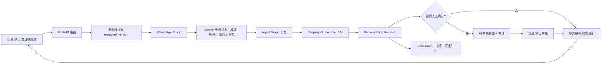
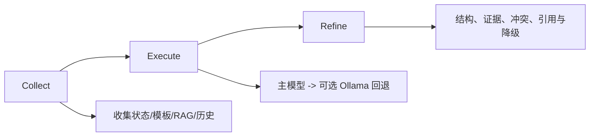
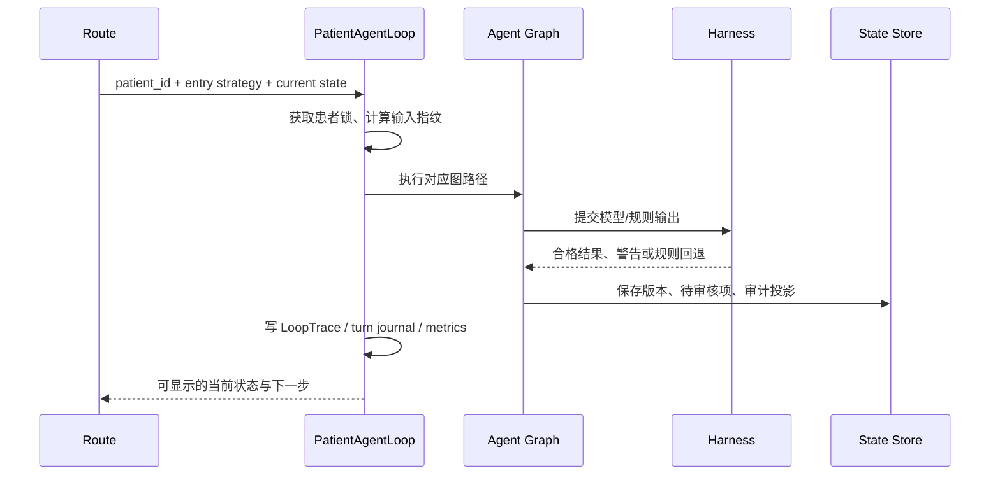

# 臻护 · Agent 全流程、Loop Harness 与 DeepAgent 实战手册

> 代码基线：2026-07-21 | 适用对象：后端开发、前端联调、测试、临床演示与运维 | 运行模式：`GRAPH_MODE=classic`

> **阅读边界**：本手册解释当前实现的工作方式与安全边界，不把 AI 建议描述为医嘱，也不把 `GRAPH_MODE=stateful` 描述为已交付能力。运行端口、权限与依赖状态以 [臻护-代码现状基线.md](臻护-代码现状基线.md) 为准。

---

## 一、目标与术语

臻护不是一个“单次调用 LLM 后返回文字”的助手。它将确定性规则、病种模板、RAG 证据、LLM 生成、结构验证、人工审核、版本控制和审计放在同一条临床协同链中。

| 术语 | 当前代码中的位置 | 作用 | 不应误解为 |
|------|------|------|------|
| Agent 图 | `agent/graph.py` | 串联入院、监测、查房、审核、出院节点 | 可自主完成临床决策的黑盒 |
| DeepAgent | `agent/llm_utils.py::deep_invoke()` | `Collect -> Execute -> Refine` 的单次智能推理管线 | 单独部署的服务或单一模型名称 |
| PatientAgentLoop | `agent/loop.py` | 患者级回合、锁、追踪、输入指纹、冲突收敛 | LangGraph stateful resume |
| Loop Harness | `agent/harness.py` | 模型输出、证据、模板、出院准备度的安全校验 | 只做 JSON 格式化的工具 |
| Human-in-the-loop | 审核、查房核对、签字、交接路由 | 把高影响操作留给有权限的人员确认 | 前端“确认”按钮即可替代临床责任 |
| 热状态 | `routes/state_store.py` | 保存版本、待审核项、工作流投影 | 长期病历或正式归档的唯一来源 |

## 二、总览：一次临床回合如何运行



一次回合的核心原则：

1. **规则先给底座**：评分、阈值、禁忌、出院卡点不会因 LLM 超时而消失。
2. **模型只补充解释或结构化建议**：模型结果要经过 schema、证据、冲突和临床边界检查。
3. **高影响动作必须显式审核**：DDx、用药、出院、查房核对和交接均有人工责任点。
4. **同一患者串行**：循环以患者 ID 维度维护锁，避免并发写入互相覆盖。
5. **每轮可追踪**：输入指纹、回合 trace、节点失败计数、引用和状态版本用于排障。

## 三、入口、前端呈现与后端触发

| 场景 | 前端位置 | 后端入口 | 主要后续链路 |
|------|------|------|------|
| 入院 | 医生工作台/患者工作区 | `POST /inpatient/admissions` | 入院采集 -> DDx -> 用药核对 -> 风险评分 -> 医生确认 |
| 体征、检验 | 医生/护理录入 | `POST /inpatient/monitoring/{id}/vitals`、`/labs` | 监测规则 -> 告警 -> 查房/调药/转科建议 |
| AI 查房 | 患者“查房”专区 | `POST /inpatient/{id}/rounds/generate` | 日常查房摘要 -> 医生编辑 -> 医生核对 |
| 患者助手 | 患者页助手面板 | `POST /assistant/chat` 或 `/assistant/chat/stream` | 意图识别 -> RAG -> LLM -> 引用/草稿 |
| 建议转草稿 | 助手草稿区 | `/inpatient/{id}/assistant-action-drafts/*` | 草稿生成 -> 人工编辑 -> 批准/驳回 |
| 出院 | 出院工作区 | `POST /inpatient/discharge/{id}` | 出院条件 -> 审核 -> 签字 -> 交接 -> 随访 |
| 可视化 | 患者页 Agent 流程面板 | `GET /inpatient/{id}/agent-flow` | 显示当前阶段、路径和审核状态 |

### 3.1 查房生成与人工核对示例

下面是当前接口契约的调用示例。`expected_version` 不是可选装饰，它用于阻止旧页面覆盖新状态。

```bash
curl.exe -X POST "http://127.0.0.1:8000/inpatient/pat-hf-001/rounds/generate" ^
  -H "Content-Type: application/json" ^
  -H "x-role: doctor" ^
  -H "x-title: %E7%A7%91%E4%B8%BB%E4%BB%BB" ^
  -d "{\"expected_version\": 12}"

# 医生修改生成内容，再提交编辑和核对。
curl.exe -X PATCH "http://127.0.0.1:8000/inpatient/pat-hf-001/rounds/3/edit" ^
  -H "Content-Type: application/json" ^
  -d "{\"assessment\":\"容量负荷较昨日改善，继续观察肾功能\",\"expected_version\":13}"

curl.exe -X POST "http://127.0.0.1:8000/inpatient/pat-hf-001/rounds/3/review" ^
  -H "Content-Type: application/json" ^
  -d "{\"expected_version\":14}"
```

示例只说明调用顺序。真实身份头、患者访问范围和版本号应由前端认证层与当前患者状态提供，不能把示例中的身份或 ID 写死到生产脚本。

## 四、27 个核心节点与临床分层

### 4.1 入院与人工确认

```text
admission
  -> history_taking -> physical_exam -> ddx
  -> medication_reconciliation -> triage -> doctor_confirm
```

| 节点 | 核心输入 | 主要输出 | LLM 作用 | Harness/人工边界 |
|------|------|------|------|------|
| `node_admission` | 患者信息、病种模板 | 入院评估、初始状态 | 无 | 模板必须可用 |
| `node_history_taking` | 主诉、既往史 | HPI/ROS 结构 | 生成结构化病史 | 缺信息时返回不足，不虚构 |
| `node_physical_exam` | 病史、体征 | 查体叙事、异常发现 | 生成叙事 | 仅辅助，原始体征优先 |
| `node_ddx` | 病史、查体、模板 | 鉴别诊断、证据 | RAG + LLM | DDx schema、证据质量、医生审核 |
| `node_medication_reconciliation` | 既往用药、过敏、肾功 | 交互/禁忌/遗漏 | 规则为主、LLM 补充 | 药物规则不可被模型覆盖 |
| `node_triage` | 风险、告警、评分 | 风险等级与说明 | 高风险时解释 | 风险阈值和升级规则确定 |
| `node_doctor_confirm` | DDx、用药核对、风险 | 批准/驳回/待审 | 无 | 医生确认后才能进入下一临床阶段 |

### 4.2 评分与风险评估

```text
batch_scoring
  -> NEWS2 / qSOFA / Padua / VTE prophylaxis
  -> stroke_antithrombotic / mdt_trigger
```

| 节点 | 类型 | 安全要求 |
|------|------|------|
| `node_news2` | 规则评分，高分时 LLM 解释 | 评分由表驱动，LLM 不得改分 |
| `node_qsofa` | 规则评分，高分时 LLM 解释 | 阈值触发急症提示 |
| `node_padua_score` | 纯规则 | VTE 风险因子可追溯 |
| `node_vte_prophylaxis` | 纯规则 | 禁忌优先于预防建议 |
| `node_stroke_antithrombotic` | 纯规则 | 仅对适用病种给出受限建议 |
| `node_mdt_trigger` | 纯规则 | 以告警和模板触发会诊建议 |

### 4.3 住院监测、护理和查房

```text
daily_round -> nursing -> shift_summary -> lab_review
  -> monitoring -> medication_adjust -> transfer -> doctor_review
```

| 节点 | 产生内容 | 何时使用 DeepAgent | 人工确认点 |
|------|------|------|------|
| `node_daily_round` | SOAP 摘要、查房计划 | 需要解释趋势和生成摘要时 | 医生编辑/核对 |
| `node_nursing` | 护理计划、执行建议 | 有异常体征、告警或无清单时 | 护士执行、记录完成情况 |
| `node_shift_summary` | SBAR/交班重点 | 复杂病例时补充说明 | 交班人员核对 |
| `node_lab_review` | 异常检验解释、危急提示 | 有新检验时 | 医生核对与处置 |
| `node_monitoring` | 出院准备度、并发症观察 | 规则节点 | 规则结果直接可见 |
| `node_medication_adjust` | 调药建议 | 连续异常或复杂用药时 | 医生批准草稿 |
| `node_transfer` | 转科建议 | 满足严重阈值时解释原因 | 医生决定转科 |
| `node_doctor_review` | 审核备注 | 仅在驳回等情形补充 | 医生最终决定 |

### 4.4 出院、交接和随访

```text
discharge -> handoff -> doctor_discharge_sign -> patient_confirm
```

| 节点 | 输出 | 关键控制 |
|------|------|------|
| `node_discharge` | 出院条件与 bridge 结果 | 旧“直接执行出院”已禁用 |
| `node_handoff` | 交接项、个性化说明 | 模板/规则为底座，LLM 只补充 |
| `node_doctor_discharge_sign` | 签字待办/状态 | 医生签字不能由 Agent 自动完成 |
| `node_doctor_med_confirm` | 用药确认状态 | 用药变更受医生审核控制 |
| `node_patient_confirm` | 交接、回授、签字、bridge 卡点 | 未满足项必须明确展示并跳转处理 |

## 五、DeepAgent：Collect -> Execute -> Refine

### 5.1 为什么不直接调用模型

直接把患者全文病历发给模型有三个问题：缺少来源、难以控制结构、失败后会让临床流程断裂。`deep_invoke()` 将一次智能调用拆为三段：



| 阶段 | 实际职责 | 失败策略 |
|------|------|------|
| Collect | 根据 caller 收集病种模板、患者上下文、RAG 引用和回合缓存 | 上下文不足时保留规则结果，标记信息不足 |
| Execute | 调用 DeepSeek provider；按配置可尝试 Ollama fallback | 超时/失败不阻断规则链，返回可识别降级结果 |
| Refine | 校验返回结构、合并 citations、检查证据矛盾、记录调用指标 | 丢弃不合格模型字段或改用模板/规则结果 |

### 5.2 节点中的调用形态

以下片段是与现有节点调用形态一致的**演示代码**。它展示应由节点提供 prompt、caller 和超时，而不是让页面直接调用模型。

```python
# 示意：nodes_clinical.py / nodes_monitoring.py 的调用方式
from zhenhu.inpatient.agent.llm_utils import deep_invoke, get_provider_for_node
from zhenhu.inpatient.agent.prompts import daily_round_prompt

provider = get_provider_for_node("daily_round")
prompt = daily_round_prompt(
    template_name=state["disease_template"]["name"],
    risk=state.get("risk_level", "unknown"),
    chief_complaint=state["patient_data"].get("chief_complaint", ""),
    # 其他参数由节点从当前 state 提供
)

result = await deep_invoke(
    provider,
    prompt,
    caller="daily_round",
    timeout=15.0,
)

# 节点随后将 result 与规则计算的趋势、模板和 citations 合并，
# 而不是直接把字符串写入正式病历。
```

适合走 DeepAgent 的内容包括：DDx、病史/查体结构化叙事、日常查房摘要、异常检验解释、交班摘要、个体化交接说明和复杂调药建议。评分数值、药物禁忌、出院卡点和最终审批仍由规则/人工控制。

### 5.3 Provider、缓存与度量

```text
get_provider_for_node(caller)
  -> DeepSeek 主 provider
  -> 失败且 OLLAMA_FALLBACK_ENABLED=true 时，可使用本地 Ollama
  -> 两者失败时返回规则/模板降级结果

deep_invoke(...)
  -> cache_get(patient_id, phase, inputs)
  -> 未命中才发起模型调用
  -> cache_set(...)
  -> 记录 total_calls、success/failure、cache_hits、latency
```

缓存只能优化重复计算，不能跳过状态版本、患者权限或人工审核。任何患者数据、模型响应和引用在缓存命中后仍必须以当前 `expected_version` 和访问权限为准。

## 六、Loop：患者级回合、收敛与追踪

### 6.1 PatientAgentLoop 的职责

`PatientAgentLoop` 是领域循环，不是无限自我反思。它的目标是在一次临床触发中把上下文、图执行、校验、待审项和 trace 收敛到一个可解释结果。



| Loop 机制 | 目的 | 临床收益 |
|------|------|------|
| 每患者独立实例与锁 | 同一患者同一时间只处理一个高影响回合 | 降低状态覆盖和重复出院/审核 |
| 输入指纹 | 识别同一轮相同输入 | 避免无意义重复调用模型 |
| turn journal / LoopTrace | 记录入口策略、节点路径和结果 | 前端流程面板、排障和审计可追踪 |
| collect/refine 辅助函数 | 把上下文拼装和冲突收敛标准化 | 降低节点实现漂移 |
| 待审核解析 | 审核后恢复下一允许阶段 | 避免模型自行跳过人工卡点 |

### 6.2 回合示意代码

以下片段用于理解边界，实际路由应继续使用既有 `get_patient_loop()`、状态服务和权限依赖，不应在新代码中创建全局共享 loop。

```python
# 示意：患者级回合的边界
from zhenhu.inpatient.agent.loop import get_patient_loop, get_patient_lock

async def run_patient_turn(patient_id: str, state: dict, entry_strategy: str):
    lock = get_patient_lock(patient_id)
    async with lock:
        loop = get_patient_loop(patient_id)
        # 实际实现会创建 LoopTrace、收集上下文、运行图并做 refine。
        return await loop.run_turn(state, entry_strategy=entry_strategy)
```

重点不是调用名称，而是顺序：先读取并校验当前版本，再取得患者锁，再运行回合，最后用同一版本语义提交状态。发现 `STATE_VERSION_CONFLICT` 时，前端应刷新状态并让用户决定是否重新提交，不能自动盲目重放。

### 6.3 为什么不启用 stateful interrupt/resume

`GRAPH_MODE=stateful` 目前被配置校验拒绝。它缺少经过验收的持久 checkpoint、跨进程恢复、临床待审项恢复语义和故障演练。当前待审核状态通过正式状态库、审核接口和版本控制管理。

```python
# 当前配置边界（与 agent/config.py 一致）
GRAPH_MODE=classic       # 可用
GRAPH_MODE=stateful      # 启动时明确报错，禁止用于演示/生产
```

在没有恢复演练和临床安全验收前，强行开启 stateful 会让“看起来更自动化”变成不可证明的恢复风险，因此不属于优化项。

## 七、Loop Harness：模型结果进入临床链前的闸门

### 7.1 Harness 的四类校验

| Harness 能力 | 对应函数/模型 | 校验对象 | 不通过时的处置 |
|------|------|------|------|
| 结构验证 | `DifferentialDiagnosisSchema`、`MedicationAdjustmentSchema`、`HandoffItemSchema`、`validate_llm_output()` | DDx、调药、交接等结构化输出 | 解析失败、字段缺失则剔除/回退 |
| 证据质量 | `check_source_type()`、`RAG_EVIDENCE_MIN_SCORE` | RAG 命中来源、分数、类型 | 低质量证据不被当作强临床依据 |
| 模板与共病 | `normalize_template()`、`merge_comorbidity_template()`、`validate_template()` | 病种模板、共病合并、科室匹配 | 使用规范模板或发出警告 |
| 出院安全 | `compute_readiness_score()`、`validate_discharge_summary()`、`validate_handoff_items()` | 出院标准、交接项、摘要完整性 | 返回缺失卡点，阻止闭环完成 |

### 7.2 DDx 输出校验示意

```python
# 示意：Harness 要求模型输出可验证的结构，而不是自由文本
raw_ddx = [
    {
        "diagnosis": "急性失代偿性心力衰竭",
        "probability": 0.72,
        "evidence": ["呼吸困难", "NT-proBNP 升高"],
    }
]

# 现有节点通过 validate_llm_output() / Pydantic schema 校验此类数据。
# 任何未经校验的字段都不得直接写入 state 的正式临床结论区。
validated = validate_llm_output("ddx", raw_ddx)
```

该代码块强调数据形状，不是让前端或外部脚本绕过节点直接调用 Harness。真实签名、返回警告和回退结果以 `agent/harness.py` 为准。

### 7.3 证据链最小安全标准

```text
知识命中 -> score / source / layer / topic
       -> Harness 检查来源类型和最低分
       -> DeepAgent 在回答中保留 citation
       -> 前端仅对本轮专业回答展示本轮引用
```

任何以下情况均不应被渲染为“已有证据支持”：无来源、低于阈值、与规则冲突、引用属于上一轮会话、或引用无法映射到本轮答案。助手寒暄/通用问候可以不展示临床引用。

### 7.4 出院卡点示意

```python
# 示意：出院准备度永远先来自规则/模板，再由 LLM 补充解释。
readiness = compute_readiness_score(state)

if readiness["met"] < readiness["total"]:
    # 前端应定位到未满足项和处理入口，而不是显示“可直接出院”。
    state["discharge_blockers"] = readiness["unmet_criteria"]
```

出院小结、患教与交接说明可以由模型帮助整理；是否出院仍由条件、审核、医生签字、交接签收和回授记录共同决定。

## 八、人工审核、版本与审计

### 8.1 不能自动执行的操作

| 操作 | 为什么必须人工确认 | 当前入口 |
|------|------|------|
| DDx 批准 | 涉及临床诊断判断 | 审核队列 / `POST /inpatient/review/{id}` |
| 用药/调药 | 涉及禁忌、剂量与处方责任 | 草稿审批、审核接口 |
| 查房结论 | 必须反映医生实际床旁判断 | rounds edit + review |
| 出院 | 涉及医疗决定、签字、交接与随访 | 出院工作区与审核卡点 |
| 护理任务完成 | 必须对应实际执行 | 护理任务完成接口与备注 |
| 运维重建 | 会影响知识/图谱可用性 | 管理能力检查后执行 |

### 8.2 写操作的共同保护

```text
患者访问范围 -> 角色/职称权限 -> expected_version -> Idempotency-Key
  -> 状态提交 -> 审计记录 / Outbox -> 前端失效刷新
```

- `expected_version` 不匹配时返回 `409 STATE_VERSION_CONFLICT`。
- `Idempotency-Key` 用于防止网络重试导致重复写入。
- 管理写操作还受 `admin-capabilities` 和生产 claim 限制。
- 不将隐藏的 Agent side-store 当作审核恢复主链；正式状态以当前状态库和事务投影为准。

## 九、前端如何演示自动化而不夸大自动决策

### 9.1 推荐演示顺序

1. 以医生身份进入医生工作台，先展示待审核、病区告警和患者优先级。
2. 进入患者“查房”专区，点击生成 AI 查房摘要，展示本轮数据来源和待医生核对状态。
3. 编辑一项医生特别关注的信息，再核对查房记录，证明模型输出可被人工修订。
4. 打开患者助手，询问专业问题，展示本轮 citations；再生成建议草稿，展示“待审批”而非自动执行。
5. 进入出院工作区，展示未满足卡点与跳转入口，完成审核、签字、交接和随访联系人流程。
6. 切换护士身份，展示护理优先级、任务、逾期监测和交班；切换管理者，展示 RAG/图谱健康与权限原因。

### 9.2 前端可观测点

| 组件/区域 | 应显示什么 | 不应显示什么 |
|------|------|------|
| AgentFlowPanel | 当前阶段、已走路径、待审核原因 | “AI 已自动完成诊疗” |
| 查房管理面板 | 生成时间、摘要、医生编辑/核对状态 | 把 AI 摘要当作不可编辑病历 |
| 助手引用区 | 本轮专业问答的来源、层级、片段 | 上一轮问答的残留引用 |
| 草稿面板 | 草稿状态、审批/驳回、版本冲突提示 | 把草稿直接标为正式医嘱 |
| 出院流程 | 进度、阻塞项、处理入口 | 不解释原因的灰色按钮 |
| 管理运维 | capability、失败层、重试结果 | “未授权”但不说明原因 |

## 十、测试与故障演练

### 10.1 必须覆盖的测试场景

| 场景 | 断言 |
|------|------|
| LLM 超时 | 节点保留规则结果，前端有可解释降级状态 |
| RAG 无命中/低分 | 不伪造引用，不把低分内容视为结论 |
| 非法结构输出 | Harness 拒绝或回退，状态不被污染 |
| 同患者并发写入 | 一个请求成功，另一个出现版本冲突并要求刷新 |
| 重复提交 | 幂等键返回可复用结果，不产生重复任务/出院 |
| 待审核恢复 | 审核前不推进，审核后从正确阶段继续 |
| stateful 配置 | 服务启动拒绝 `GRAPH_MODE=stateful` |
| RAG 重建 | 诊断、重建、dashboard、entries、preview 顺序可验证 |
| 权限降级 | 普通人员不能执行管理写操作，生产缺 claim 有明确原因 |

### 10.2 推荐回归命令

```powershell
# 服务目录：services/inpatient-ward
$env:DEEPSEEK_API_KEY=''
$env:OLLAMA_FALLBACK_ENABLED='false'
$env:SKIP_EXTERNAL='true'
pytest -q tests/test_agent_harness.py tests/test_agent_nodes.py tests/test_rag_reindex.py tests/test_management_operations.py

# 前端目录：apps/frontend
npm run test:run
npm run lint
npm run build
```

完整后端测试会受到真实 LLM、Milvus 和外部服务依赖影响。发布验收应使用隔离配置、可控索引数据和单独的结果记录，不能因为一次本机运行耗时就取消安全链测试。

## 十一、排障决策树

```mermaid
flowchart TD
    A[Agent/助手结果异常] --> B{有 409?}
    B -->|是| C[刷新患者状态，保留草稿后重新确认]
    B -->|否| D{有引用/检索问题?}
    D -->|是| E[dashboard -> diagnostics -> entries(search) -> preview(query/layers)]
    D -->|否| F{LLM 超时或空结果?}
    F -->|是| G[检查 provider、超时、fallback、节点失败指标；确认规则回退]
    F -->|否| H{待审核未推进?}
    H -->|是| I[检查审核类型、角色、expected_version、阻塞项]
    H -->|否| J[读取 AgentFlow、LoopTrace、审计与后端结构化日志]
```

排障时禁止的做法：直接修改患者热状态 JSON、跳过版本检查、在生产开启 `DOCTOR_AUTO_APPROVE`、强行启用 stateful、或用重建知识库掩盖模型/权限错误。

## 十二、源码索引

| 主题 | 源码 |
|------|------|
| 图状态、条件路由、状态校验 | `services/inpatient-ward/src/zhenhu/inpatient/agent/graph.py` |
| DeepAgent、provider、缓存与指标 | `services/inpatient-ward/src/zhenhu/inpatient/agent/llm_utils.py` |
| Loop、患者锁、trace 与 journal | `services/inpatient-ward/src/zhenhu/inpatient/agent/loop.py` |
| 结构、证据、模板和出院校验 | `services/inpatient-ward/src/zhenhu/inpatient/agent/harness.py` |
| 节点实现 | `agent/nodes_admission.py`、`nodes_clinical.py`、`nodes_monitoring.py`、`nodes_scoring.py`、`nodes_handoff.py`、`nodes_checkpoints.py` |
| 工作流配置 | `agent/config.py`、`agent/interrupt.py` |
| Agent 可视化接口 | `routes/agent_flow.py` |
| 查房流程接口 | `routes/rounds.py` |
| 助手草稿接口 | `routes/assistant_action_drafts.py` |
| 前端流程面板 | `apps/frontend/src/components/clinical/AgentFlowPanel.tsx` |

---

> 文档版本 v1.0 · 基于当前 classic 图、`deep_invoke()`、`PatientAgentLoop`、Loop Harness 与前端可视化调用链编写。所有高影响临床结论均以人工审核、权限、版本与审计链为准。
