# 臻护 · 数据模型 ER 关系与 Prompt 工程详表

> 臻护 v2.0 | 2026-07-21 | ORM、热状态、外部存储与 Prompt 工程详表 | DBA / 后端 / Agent 开发

> **当前校准**：表模型和 Prompt 数量应以源码为准，不以历史统计做运行时契约。当前存储边界、RAG/图谱状态、`GRAPH_MODE=classic` 限制和验证结论见 [臻护-代码现状基线.md](臻护-代码现状基线.md)。

---

## 目录

1. [存储分层总览](#一存储分层总览)
2. [ORM 17 模型 ER 图](#二orm-17-模型-er-图)
3. [核心临床域](#三核心临床域)
4. [交接与出院域](#四交接与出院域)
5. [体征与随访域](#五体征与随访域)
6. [系统与审计域](#六系统与审计域)
7. [工作流状态域](#七工作流状态域)
8. [State Store 4 表](#八state-store-4-表)
9. [Milvus 向量库](#九milvus-向量库)
10. [Neo4j 证据图谱](#十neo4j-证据图谱)
11. [Redis 缓存](#十一redis-缓存)
12. [索引策略](#十二索引策略)
13. [容量规划](#十三容量规划)
14. [Prompt 工程总览](#十四prompt-工程总览)
15. [5 助手系统提示词](#十五5-助手系统提示词)
16. [RAG 检索 Prompt](#十六rag-检索-prompt)
17. [Agent 节点 Prompt](#十七agent-节点-prompt)
18. [对话与草稿 Prompt](#十八对话与草稿-prompt)
19. [Agent 节点 Prompt 模板全表](#十九agent-节点-18-个-prompt-模板全表)
20. [意图分类与助手路由 Prompt](#二十意图分类与助手路由-prompt)
21. [LLM 缓存与度量](#二十一llm-缓存与度量)
22. [Prompt 总量统计](#二十二prompt-总量统计)
23. [当前实现校准](#二十三当前实现校准)

---

## 一、存储分层总览

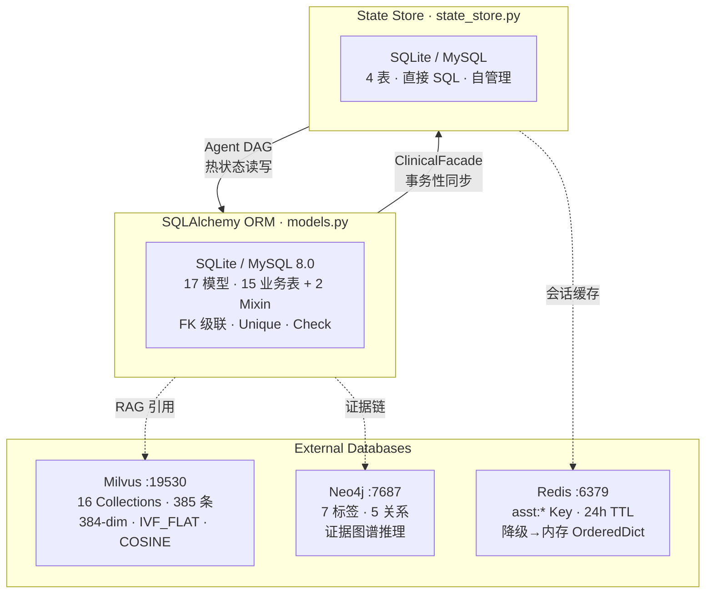
```mermaid
graph TB
    subgraph ORM["SQLAlchemy ORM · models.py"]
        ORM_DB["SQLite / MySQL 8.0<br/>17 模型 · 15 业务表 + 2 Mixin<br/>FK 级联 · Unique · Check"]
    end

    subgraph SS["State Store · state_store.py"]
        SS_DB["SQLite / MySQL<br/>4 表 · 直接 SQL · 自管理"]
    end

    subgraph EXT["External Databases"]
        MIL["Milvus :19530<br/>16 Collections · 385 条<br/>384-dim · IVF_FLAT · COSINE"]
        NEO["Neo4j :7687<br/>7 标签 · 5 关系<br/>证据图谱推理"]
        RED["Redis :6379<br/>asst:* Key · 24h TTL<br/>降级→内存 OrderedDict"]
    end

    ORM -- "ClinicalFacade<br/>事务性同步" --> SS
    SS -- "Agent DAG<br/>热状态读写" --> ORM
    ORM -. "RAG 引用" .-> MIL
    ORM -. "证据链" .-> NEO
    SS -. "会话缓存" .-> RED
```

### 1.1 模型全景

| # | 模型 | 物理表 | 域 | FK 数 | 索引数 | 量级 |
|:--:|------|------|------|:--:|:--:|:--:|
| 1 | Patient | inpatient_patients | 核心临床 | 0 | 4 | 小 |
| 2 | InpatientRecord | inpatient_records | 核心临床 | 1 | 1 | 中 |
| 3 | MedicalHistory | medical_histories | 核心临床 | 1 | 3 | 中 |
| 4 | CurrentCondition | current_conditions | 核心临床 | 1 | 2 | 大 |
| 5 | Attachment | attachments | 核心临床 | 2 | 5 | 中 |
| 6 | HandoffContext | handoff_contexts | 交接出院 | 2 | 5 | 小 |
| 7 | PresentationItem | presentation_items | 交接出院 | 1 | 2 | 中 |
| 8 | ItemFeedback | item_feedbacks | 交接出院 | 2 | 4 | 大 |
| 9 | DischargeInstruction | discharge_instructions | 交接出院 | 1 | 2 | 小 |
| 10 | ManualIntervention | manual_interventions | 交接出院 | 3 | 3 | 小 |
| 11 | BPEntry | vital_sign_entries | 体征随访 | 3 | 3 | 大 |
| 12 | FollowUpContact | follow_up_contacts | 体征随访 | 0 | 0 | 小 |
| 13 | AuditLog | audit_logs | 系统审计 | 0 | 3 | 大 |
| 14 | OutboxEvent | outbox_events | 系统审计 | 0 | 2 | 小 |
| 15 | IdempotencyRecord | idempotency_records | 系统审计 | 0 | 2 | 小 |
| 16 | ClinicalWorkflowState | clinical_workflow_states | 工作流 | 0 | 0 | 小 |
| 17 | TimestampMixin | 全部表 Mixin | 通用 | — | — | — |

---

## 二、ORM 17 模型 ER 图

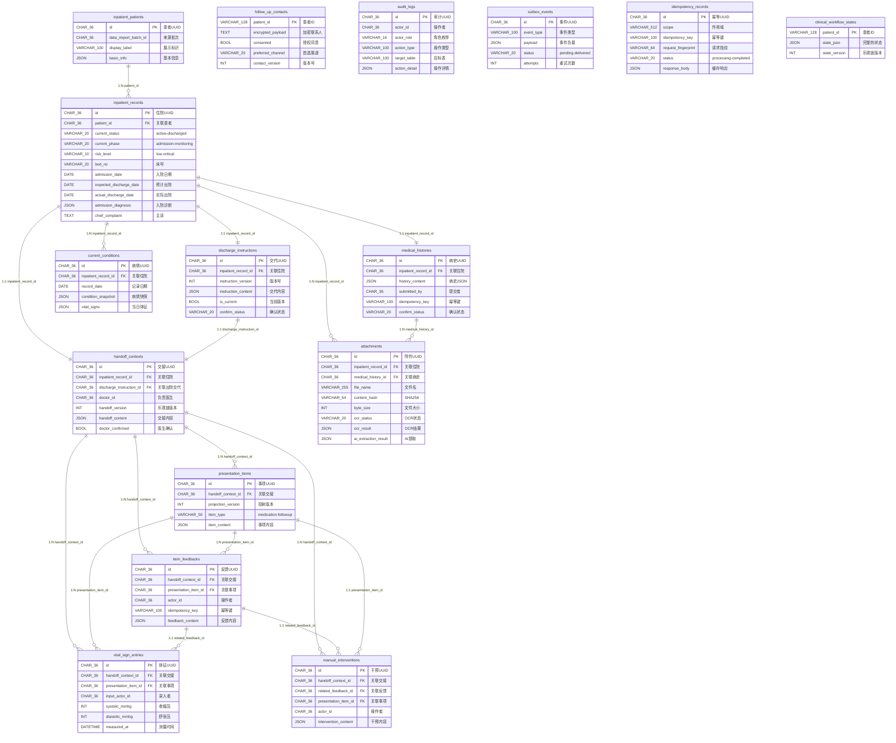
```mermaid
erDiagram
    inpatient_patients ||--o{ inpatient_records : "1:N patient_id"
    inpatient_records ||--|| medical_histories : "1:1 inpatient_record_id"
    inpatient_records ||--o{ current_conditions : "1:N inpatient_record_id"
    inpatient_records ||--|| discharge_instructions : "1:1 inpatient_record_id"
    inpatient_records ||--|| handoff_contexts : "1:1 inpatient_record_id"
    inpatient_records ||--o{ attachments : "1:N inpatient_record_id"
    medical_histories ||--o{ attachments : "1:N medical_history_id"
    discharge_instructions ||--|| handoff_contexts : "1:1 discharge_instruction_id"
    handoff_contexts ||--o{ presentation_items : "1:N handoff_context_id"
    handoff_contexts ||--o{ item_feedbacks : "1:N handoff_context_id"
    handoff_contexts ||--o{ vital_sign_entries : "1:N handoff_context_id"
    handoff_contexts ||--o{ manual_interventions : "1:N handoff_context_id"
    presentation_items ||--o{ item_feedbacks : "1:N presentation_item_id"
    presentation_items ||--o{ vital_sign_entries : "1:N presentation_item_id"
    item_feedbacks ||--o{ vital_sign_entries : "1:1 related_feedback_id"
    item_feedbacks ||--o{ manual_interventions : "1:1 related_feedback_id"
    presentation_items ||--o{ manual_interventions : "1:1 presentation_item_id"

    inpatient_patients {
        CHAR_36 id PK "患者UUID"
        CHAR_36 data_import_batch_id "来源批次"
        VARCHAR_100 display_label "展示标识"
        JSON basic_info "基本信息"
    }

    inpatient_records {
        CHAR_36 id PK "住院UUID"
        CHAR_36 patient_id FK "关联患者"
        VARCHAR_20 current_status "active-discharged"
        VARCHAR_20 current_phase "admission-monitoring"
        VARCHAR_10 risk_level "low-critical"
        VARCHAR_20 bed_no "床号"
        DATE admission_date "入院日期"
        DATE expected_discharge_date "预计出院"
        DATE actual_discharge_date "实际出院"
        JSON admission_diagnosis "入院诊断"
        TEXT chief_complaint "主诉"
    }

    medical_histories {
        CHAR_36 id PK "病史UUID"
        CHAR_36 inpatient_record_id FK "关联住院"
        JSON history_content "病史JSON"
        CHAR_36 submitted_by "提交者"
        VARCHAR_100 idempotency_key "幂等键"
        VARCHAR_20 confirm_status "确认状态"
    }

    current_conditions {
        CHAR_36 id PK "病情UUID"
        CHAR_36 inpatient_record_id FK "关联住院"
        DATE record_date "记录日期"
        JSON condition_snapshot "病情快照"
        JSON vital_signs "当日体征"
    }

    attachments {
        CHAR_36 id PK "附件UUID"
        CHAR_36 inpatient_record_id FK "关联住院"
        CHAR_36 medical_history_id FK "关联病史"
        VARCHAR_255 file_name "文件名"
        VARCHAR_64 content_hash "SHA256"
        INT byte_size "文件大小"
        VARCHAR_20 ocr_status "OCR状态"
        JSON ocr_result "OCR结果"
        JSON ai_extraction_result "AI提取"
    }

    handoff_contexts {
        CHAR_36 id PK "交接UUID"
        CHAR_36 inpatient_record_id FK "关联住院"
        CHAR_36 discharge_instruction_id FK "关联出院交代"
        CHAR_36 doctor_id "负责医生"
        INT handoff_version "乐观锁版本"
        JSON handoff_content "交接内容"
        BOOL doctor_confirmed "医生确认"
    }

    presentation_items {
        CHAR_36 id PK "事项UUID"
        CHAR_36 handoff_context_id FK "关联交接"
        INT projection_version "投射版本"
        VARCHAR_50 item_type "medication-followup"
        JSON item_content "事项内容"
    }

    item_feedbacks {
        CHAR_36 id PK "反馈UUID"
        CHAR_36 handoff_context_id FK "关联交接"
        CHAR_36 presentation_item_id FK "关联事项"
        CHAR_36 actor_id "操作者"
        VARCHAR_100 idempotency_key "幂等键"
        JSON feedback_content "反馈内容"
    }

    discharge_instructions {
        CHAR_36 id PK "交代UUID"
        CHAR_36 inpatient_record_id FK "关联住院"
        INT instruction_version "版本号"
        JSON instruction_content "交代内容"
        BOOL is_current "当前版本"
        VARCHAR_20 confirm_status "确认状态"
    }

    manual_interventions {
        CHAR_36 id PK "干预UUID"
        CHAR_36 handoff_context_id FK "关联交接"
        CHAR_36 related_feedback_id FK "关联反馈"
        CHAR_36 presentation_item_id FK "关联事项"
        CHAR_36 actor_id "操作者"
        JSON intervention_content "干预内容"
    }

    vital_sign_entries {
        CHAR_36 id PK "体征UUID"
        CHAR_36 handoff_context_id FK "关联交接"
        CHAR_36 presentation_item_id FK "关联事项"
        CHAR_36 input_actor_id "录入者"
        INT systolic_mmhg "收缩压"
        INT diastolic_mmhg "舒张压"
        DATETIME measured_at "测量时间"
    }

    follow_up_contacts {
        VARCHAR_128 patient_id PK "患者ID"
        TEXT encrypted_payload "加密联系人"
        BOOL consented "授权同意"
        VARCHAR_20 preferred_channel "首选渠道"
        INT contact_version "版本号"
    }

    audit_logs {
        CHAR_36 id PK "审计UUID"
        CHAR_36 actor_id "操作者"
        VARCHAR_16 actor_role "角色枚举"
        VARCHAR_100 action_type "操作类型"
        VARCHAR_100 target_table "目标表"
        JSON action_detail "操作详情"
    }

    outbox_events {
        CHAR_36 id PK "事件UUID"
        VARCHAR_100 event_type "事件类型"
        JSON payload "事件负载"
        VARCHAR_20 status "pending-delivered"
        INT attempts "重试次数"
    }

    idempotency_records {
        CHAR_36 id PK "幂等UUID"
        VARCHAR_512 scope "作用域"
        VARCHAR_100 idempotency_key "幂等键"
        VARCHAR_64 request_fingerprint "请求指纹"
        VARCHAR_20 status "processing-completed"
        JSON response_body "缓存响应"
    }

    clinical_workflow_states {
        VARCHAR_128 patient_id PK "患者ID"
        JSON state_json "完整热状态"
        INT state_version "乐观锁版本"
    }
```

---

## 三、核心临床域

### 3.1 域内关系

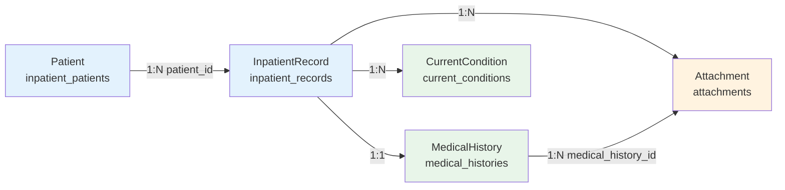
```mermaid
graph LR
    Patient["Patient<br/>inpatient_patients"] -->|"1:N patient_id"| IR["InpatientRecord<br/>inpatient_records"]
    IR -->|"1:1"| MH["MedicalHistory<br/>medical_histories"]
    IR -->|"1:N"| CC["CurrentCondition<br/>current_conditions"]
    IR -->|"1:N"| AT["Attachment<br/>attachments"]
    MH -->|"1:N medical_history_id"| AT

    style Patient fill:#e3f2fd
    style IR fill:#e3f2fd
    style MH fill:#e8f5e9
    style CC fill:#e8f5e9
    style AT fill:#fff3e0
```

### 3.2 各表字段说明

**Patient (inpatient_patients)**

| 列 | 类型 | 约束 | 说明 |
|------|------|------|------|
| id | CHAR(36) | PK NN | UUID v4 |
| data_import_batch_id | CHAR(36) | NN | HIS 导入批次标识 |
| display_label | VARCHAR(100) | NN | 展示标识 (脱敏姓名/MRN) |
| basic_info | JSON | NULL | `{name, gender, dob, mrn, contact, address}` |

| 索引 | 类型 | 列 |
|------|:--:|------|
| uq_patient_batch_label | UNIQUE | (data_import_batch_id, display_label) |
| ix_patient_data_batch | INDEX | data_import_batch_id |
| ck_patient_display_label_not_blank | CHECK | LENGTH(TRIM(display_label)) > 0 |

| 量级 | 年增 | 保留 |
|:--:|:--:|------|
| 小 | 慢 | 永久 |

**InpatientRecord (inpatient_records)**

| 列 | 类型 | 约束 | 说明 |
|------|------|------|------|
| id | CHAR(36) | PK NN | 住院记录 UUID |
| patient_id | CHAR(36) | FK → inpatient_patients.id | 关联患者 |
| current_status | VARCHAR(20) | NULL | `active`/`discharged`/`transferred`/`on_hold` |
| current_phase | VARCHAR(20) | NULL | `admission`/`monitoring`/`discharge`/`completed` |
| risk_level | VARCHAR(10) | NULL | `low`/`medium`/`high`/`critical` |
| bed_no | VARCHAR(20) | NULL | 床号 |
| admission_date | DATE | NULL | 入院日期 |
| expected_discharge_date | DATE | NULL | 预计出院 |
| actual_discharge_date | DATE | NULL | 实际出院 |
| admission_diagnosis | JSON | NULL | `{primary, secondary[]}` |
| chief_complaint | TEXT | NULL | 主诉 |

| 量级 | 年增 | 保留 |
|:--:|:--:|------|
| 中 (40 床科室年约 1500) | 月增 100-200 | 永久 |

**MedicalHistory (medical_histories)**

| 列 | 类型 | 约束 | 说明 |
|------|------|------|------|
| id | CHAR(36) | PK | 病史 UUID |
| inpatient_record_id | CHAR(36) | FK → inpatient_records.id | 关联住院 |
| history_content | JSON | NULL | 病史 JSON (见下方结构) |
| submitted_by | CHAR(36) | NULL | 提交者 (移除 FK) |
| idempotency_key | VARCHAR(100) | NULL | 幂等键 |
| confirm_status | VARCHAR(20) | NULL | `pending`/`confirmed` |
| confirmed_by / confirmed_at | — | NULL | 确认信息 |

**history_content JSON 结构:**

```json
{
  "chronic_diseases": ["高血压 5年", "2型糖尿病 8年", "CKD 3期"],
  "prior_surgeries": [{"procedure": "胆囊切除术", "year": 2018}],
  "allergies": [{"allergen": "青霉素", "reaction": "皮疹", "severity": "mild"}],
  "current_medications": [{"drug": "赖诺普利", "dose": "10mg", "frequency": "qd"}],
  "family_history": {"father": "心肌梗死,65岁"},
  "hpi": "患者72岁男性,因胸闷气促3天...",
  "ros": "心血管:心悸,呼吸困难(+). 呼吸:咳嗽,咳白痰..."
}
```

**CurrentCondition (current_conditions)**

| 列 | 类型 | 约束 | 说明 |
|------|------|------|------|
| id | CHAR(36) | PK | 病情记录 UUID |
| inpatient_record_id | CHAR(36) | FK → inpatient_records.id | 关联住院 |
| record_date | DATE | NN | 记录日期 |
| condition_snapshot | JSON | NULL | 病情快照 (症状/事件/用药变化) |
| vital_signs | JSON | NULL | 当日体征汇总 |
| confirmed_by / confirmed_at | — | NULL | 确认信息 |

| 索引 | 类型 | 列 |
|------|:--:|------|
| uq_current_condition_record_date | UNIQUE | (inpatient_record_id, record_date) |

| 量级 | 年增 |
|:--:|:--:|
| 大 (每日 1 条/患者) | 日增数十至数百 |

**Attachment (attachments)**

| 列 | 类型 | 约束 | 说明 |
|------|------|------|------|
| id | CHAR(36) | PK | 附件 UUID |
| inpatient_record_id | CHAR(36) | FK → inpatient_records.id | 关联住院 |
| medical_history_id | CHAR(36) | FK → medical_histories.id | 关联病史 (可选) |
| file_name / file_type / file_path | — | NULL | 文件元数据 |
| uploaded_by_actor_id | CHAR(36) | NN | 上传者 (移除 FK) |
| source_type | VARCHAR(64) | NN | `his_import`/`manual_upload`/`device_capture` |
| content_hash | VARCHAR(64) | NN | SHA256 去重 |
| upload_idempotency_key | VARCHAR(100) | NN | 上传幂等键 |
| byte_size | INT | NN | 文件大小 (字节) |
| storage_key | VARCHAR(512) | NN | 对象存储 Key |
| ocr_status | VARCHAR(20) | NN | `pending`/`processing`/`completed`/`failed` |
| ocr_result | JSON | NULL | OCR 识别结果 |
| ai_extraction_result | JSON | NULL | AI 提取结果 |

---

## 四、交接与出院域

### 4.1 域内关系

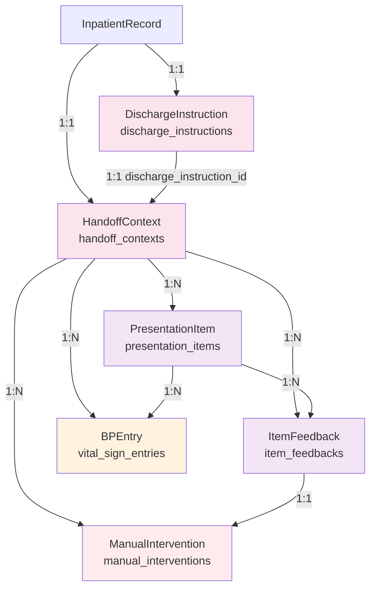
```mermaid
graph TD
    IR["InpatientRecord"] -->|"1:1"| DI["DischargeInstruction<br/>discharge_instructions"]
    IR -->|"1:1"| HC["HandoffContext<br/>handoff_contexts"]
    DI -->|"1:1 discharge_instruction_id"| HC
    HC -->|"1:N"| PI["PresentationItem<br/>presentation_items"]
    HC -->|"1:N"| IF["ItemFeedback<br/>item_feedbacks"]
    HC -->|"1:N"| BP["BPEntry<br/>vital_sign_entries"]
    HC -->|"1:N"| MI["ManualIntervention<br/>manual_interventions"]
    PI -->|"1:N"| IF
    PI -->|"1:N"| BP
    IF -->|"1:1"| MI

    style DI fill:#fce4ec
    style HC fill:#fce4ec
    style PI fill:#f3e5f5
    style IF fill:#f3e5f5
    style BP fill:#fff3e0
    style MI fill:#ffebee
```

### 4.2 各表字段说明

**HandoffContext (handoff_contexts)**

| 列 | 类型 | 约束 | 说明 |
|------|------|------|------|
| id | CHAR(36) | PK | 交接 UUID |
| inpatient_record_id | CHAR(36) | FK → inpatient_records.id | 关联住院 |
| discharge_instruction_id | CHAR(36) | FK → discharge_instructions.id | 关联交代 |
| doctor_id | CHAR(36) | NN | 负责医生 (移除 FK) |
| handoff_version | INT | NN DEFAULT 1 | **乐观锁版本号** |
| handoff_content | JSON | NULL | 交接内容 (见下方) |
| doctor_confirmed | BOOL | NN DEFAULT FALSE | 医生确认 |
| confirmed_at | DATETIME | NULL | 确认时间 |

**handoff_content JSON:**

```json
{
  "ddx_summary": ["急性心力衰竭 (confirmed)", "ACS (rejected)"],
  "medication_plan": [{"drug":"达比加群","dose":"110mg bid"}],
  "followup_schedule": [{"type":"phone","date":"2026-07-28"}],
  "education_topics": ["限水1.5L/日","每日体重","急症识别"],
  "warnings": ["出血风险(抗凝药)","避免剧烈运动"]
}
```

**PresentationItem (presentation_items)**

| 列 | 类型 | 约束 | 说明 |
|------|------|------|------|
| id | CHAR(36) | PK | 事项 UUID |
| handoff_context_id | CHAR(36) | FK → handoff_contexts.id | 关联交接 |
| projection_version | INT | NN DEFAULT 1 | 投射版本号 |
| item_type | VARCHAR(50) | NN | `medication`/`followup`/`education`/`warning` |
| item_content | JSON | NULL | 事项内容 |

**ItemFeedback (item_feedbacks)**

| 列 | 类型 | 约束 | 说明 |
|------|------|------|------|
| id | CHAR(36) | PK | 反馈 UUID |
| handoff_context_id | CHAR(36) | FK → handoff_contexts.id | 关联交接 |
| presentation_item_id | CHAR(36) | FK → presentation_items.id | 关联事项 |
| actor_id | CHAR(36) | NN | 操作者 (移除 FK) |
| idempotency_key | VARCHAR(100) | NN | 幂等键 |
| feedback_content | JSON | NULL | `{decision, comment, edits[]}` |

**DischargeInstruction (discharge_instructions)**

| 列 | 类型 | 约束 | 说明 |
|------|------|------|------|
| id | CHAR(36) | PK | 交代 UUID |
| inpatient_record_id | CHAR(36) | FK → inpatient_records.id | 关联住院 |
| instruction_version | INT | NN DEFAULT 1 | 版本号 |
| instruction_content | JSON | NULL | 交代内容 (见下方) |
| is_current | BOOL | NN DEFAULT TRUE | 当前版本 |
| confirm_status | VARCHAR(20) | NULL | `pending`/`confirmed`/`rejected` |

**instruction_content JSON:**

```json
{
  "medications": [{"drug":"达比加群","dose":"110mg bid","instruction":"餐后服"}],
  "diet": {"sodium_limit":"<3g/日","fluid_limit":"1.5L/日"},
  "activity": {"allowed":["散步","太极拳"],"avoid":["重体力"]},
  "follow_up": [{"dept":"心内科","date":"2026-08-20"}],
  "emergency_signs": ["静息呼吸困难加重","夜间不能平卧","体重3天增>2kg"]
}
```

**ManualIntervention (manual_interventions)**

| 列 | 类型 | 约束 | 说明 |
|------|------|------|------|
| id | CHAR(36) | PK | 干预 UUID |
| handoff_context_id | CHAR(36) | FK → handoff_contexts.id | 关联交接 |
| related_feedback_id | CHAR(36) | FK → item_feedbacks.id | 关联反馈 |
| presentation_item_id | CHAR(36) | FK → presentation_items.id | 关联事项 |
| actor_id | CHAR(36) | NN | 操作者 (移除 FK) |
| intervention_content | JSON | NULL | 干预内容 (类型/原因/操作) |

---

## 五、体征与随访域

### 5.1 域内关系

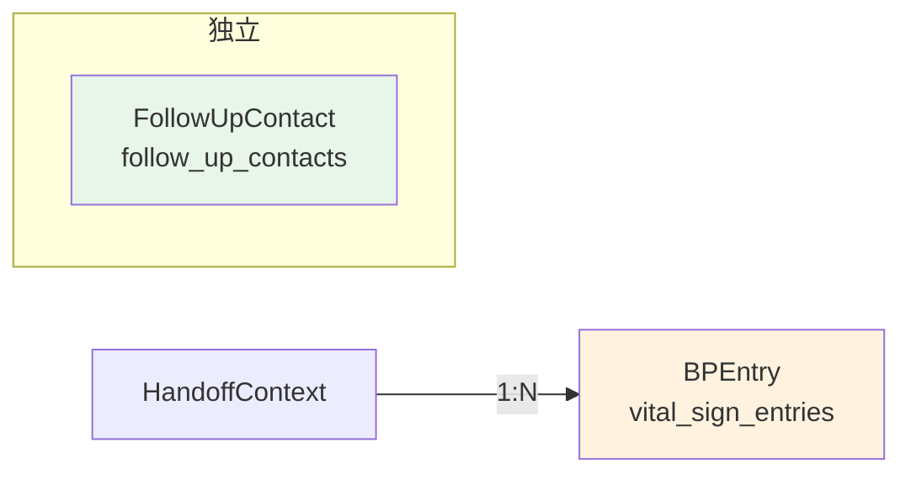
```mermaid
graph LR
    HC["HandoffContext"] -->|"1:N"| BP["BPEntry<br/>vital_sign_entries"]
    subgraph 独立
        FUC["FollowUpContact<br/>follow_up_contacts"]
    end

    style BP fill:#fff3e0
    style FUC fill:#e8f5e9
```

**BPEntry (vital_sign_entries)**

| 列 | 类型 | 约束 | 说明 |
|------|------|------|------|
| id | CHAR(36) | PK | 体征 UUID |
| handoff_context_id | CHAR(36) | FK → handoff_contexts.id | 关联交接 |
| presentation_item_id | CHAR(36) | FK → presentation_items.id | 关联事项 |
| input_actor_id | CHAR(36) | NULL | 录入者 (移除 FK) |
| idempotency_key | VARCHAR(100) | NN | 幂等键 |
| systolic_mmhg | INT | NULL | 收缩压 |
| diastolic_mmhg | INT | NULL | 舒张压 |
| measured_at | DATETIME | NULL | 测量时间 |
| recorded_at | DATETIME | NN DEFAULT now | 录入时间 |

| 量级 | 年增 | 保留 |
|:--:|:--:|------|
| 大 | 日增 150 条 (40 床) | 3 年在线→归档 |

**FollowUpContact (follow_up_contacts)**

| 列 | 类型 | 约束 | 说明 |
|------|------|------|------|
| patient_id | VARCHAR(128) | PK | 患者业务 ID |
| encrypted_payload | TEXT | NN | Fernet 加密的联系人 JSON |
| consented | BOOL | NN DEFAULT FALSE | 授权同意 |
| preferred_channel | VARCHAR(20) | NULL | `phone`/`sms`/`email`/`wechat` |
| contact_version | INT | NN DEFAULT 1 | 版本号 |

| 安全 | 说明 |
|------|------|
| 加密算法 | Fernet (AES-128-CBC + HMAC) |
| 密钥来源 | 环境变量 `CONTACT_ENCRYPTION_KEY` |
| 独立性 | 不存入 clinical_workflow_states, 隐私隔离 |
| 合规 | `consented=FALSE` 时禁止随访联系 |

---

## 六、系统与审计域

### 6.1 域内关系

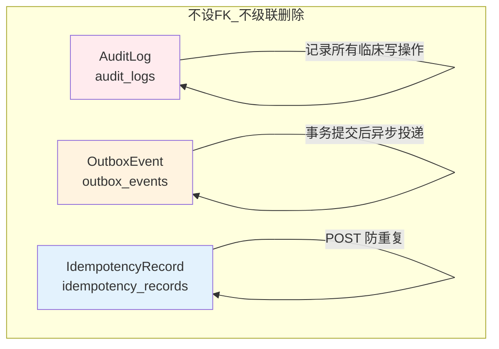
```mermaid
graph TD
    subgraph 不设FK_不级联删除
        AL["AuditLog<br/>audit_logs"]
        OE["OutboxEvent<br/>outbox_events"]
        IR["IdempotencyRecord<br/>idempotency_records"]
    end

    AL -->|"记录所有临床写操作"| AL
    OE -->|"事务提交后异步投递"| OE
    IR -->|"POST 防重复"| IR

    style AL fill:#ffebee
    style OE fill:#fff3e0
    style IR fill:#e3f2fd
```

**AuditLog (audit_logs)**

| 列 | 类型 | 约束 | 说明 |
|------|------|------|------|
| id | CHAR(36) | PK | 审计 UUID |
| actor_id | CHAR(36) | NULL | 操作者 (移除 FK) |
| actor_role | ENUM | NN | patient/family/caregiver/doctor/nurse/coordinator/supervisor/system |
| action_type | VARCHAR(100) | NN | 操作类型 |
| target_table | VARCHAR(100) | NULL | 目标表名 |
| target_record_id | CHAR(36) | NULL | 目标记录 ID |
| action_detail | JSON | NULL | 变更前后对比 |
| session_id | VARCHAR(100) | NULL | 关联助手会话 |

| 设计决策 | 原因 |
|------|------|
| **0 个外键** | 业务记录删除后审计事实保留 |
| action_type 自由文本 | 无需维护枚举表, 覆盖所有操作 |
| 保留 | 5 年在线→归档 |

**OutboxEvent (outbox_events)**

| 列 | 类型 | 约束 | 说明 |
|------|------|------|------|
| id | CHAR(36) | PK | 事件 UUID |
| event_type | VARCHAR(100) | NN | 事件类型 |
| payload | JSON | NN | 事件负载 |
| idempotency_key | VARCHAR(160) | NN UNIQUE | 幂等键 |
| status | VARCHAR(20) | NN DEFAULT pending | `pending`/`processing`/`delivered`/`failed` |
| attempts | INT | NN DEFAULT 0 | 重试次数 |
| next_attempt_at | DATETIME | NULL | 下次重试 |
| delivered_at | DATETIME | NULL | 交付时间 |
| last_error | TEXT | NULL | 最近错误 |

**IdempotencyRecord (idempotency_records)**

| 列 | 类型 | 约束 | 说明 |
|------|------|------|------|
| id | CHAR(36) | PK | 幂等 UUID |
| scope | VARCHAR(512) | NN | 作用域 (端点路径) |
| idempotency_key | VARCHAR(100) | NN | 幂等键 |
| request_fingerprint | VARCHAR(64) | NN | Body SHA256 |
| status | VARCHAR(20) | NN DEFAULT processing | `processing`/`completed` |
| response_status | INT | NULL | 原始 HTTP 状态码 |
| response_body | JSON | NULL | 缓存的响应体 |

| TTL | 24 小时后自动清理 |
|------|------|

---

## 七、工作流状态域

### 7.1 乐观锁机制

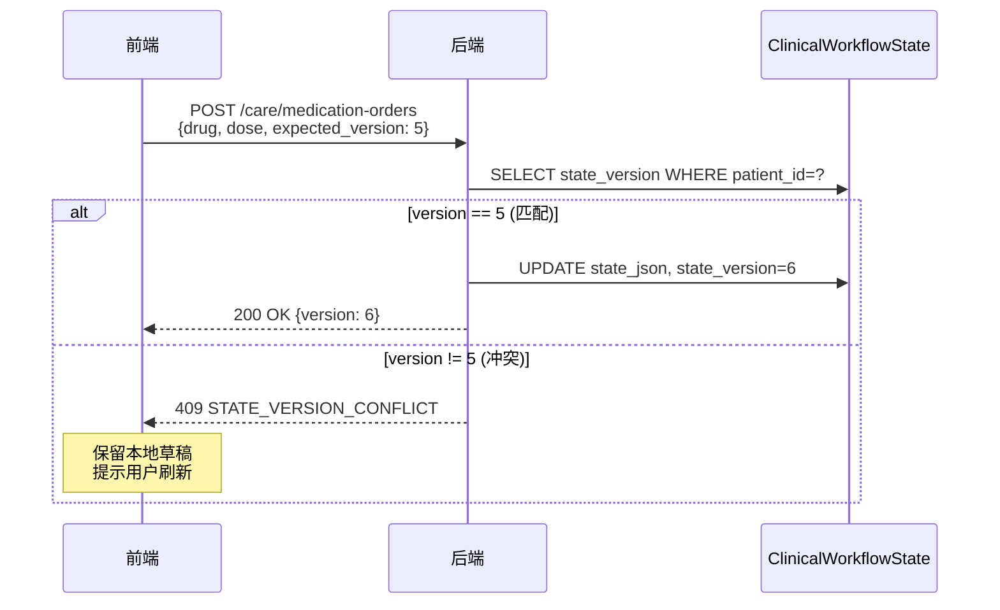
```mermaid
sequenceDiagram
    participant FE as 前端
    participant BE as 后端
    participant DB as ClinicalWorkflowState

    FE->>BE: POST /care/medication-orders<br/>{drug, dose, expected_version: 5}
    BE->>DB: SELECT state_version WHERE patient_id=?
    alt version == 5 (匹配)
        BE->>DB: UPDATE state_json, state_version=6
        BE-->>FE: 200 OK {version: 6}
    else version != 5 (冲突)
        BE-->>FE: 409 STATE_VERSION_CONFLICT
        Note over FE: 保留本地草稿<br/>提示用户刷新
    end
```

**ClinicalWorkflowState (clinical_workflow_states)**

| 列 | 类型 | 约束 | 说明 |
|------|------|------|------|
| patient_id | VARCHAR(128) | PK | 患者业务 ID |
| state_json | JSON | NN | Agent DAG 完整序列化状态 |
| state_version | INT | NN | 乐观锁版本号 |

**state_json 结构:**

```json
{
  "patient_data": {"name":"张建国","mrn":"MRN-001","dob":"1954-03-15","gender":"male"},
  "disease_template": {"disease_id":"heart_failure","name":"心力衰竭","department":"心内科"},
  "current_phase": "monitoring",
  "ddx_list": [{"diagnosis":"急性心力衰竭","probability":0.85,"evidence":["BNP升高","双肺湿啰音"]}],
  "scores": {"news2":2,"qsofa":0,"padua":5,"morse":45,"braden":16},
  "medication_safety": {"interactions":[...],"allergy_contra":[...]},
  "vital_trends": {...},
  "lab_trends": {...},
  "alerts": [...],
  "document_chain": ["admission","history_taking","physical_exam","ddx","doctor_confirm","daily_round"]
}
```

**TimestampMixin (全部表 Mixin)**

| 列 | 类型 | 约束 | 说明 |
|------|------|------|------|
| created_at | DATETIME | NN DEFAULT now | 创建时间 |
| updated_at | DATETIME | NN DEFAULT now ON UPDATE now | 更新时间 |

---

## 八、State Store 4 表

### 8.1 State Store 与 ORM 关系

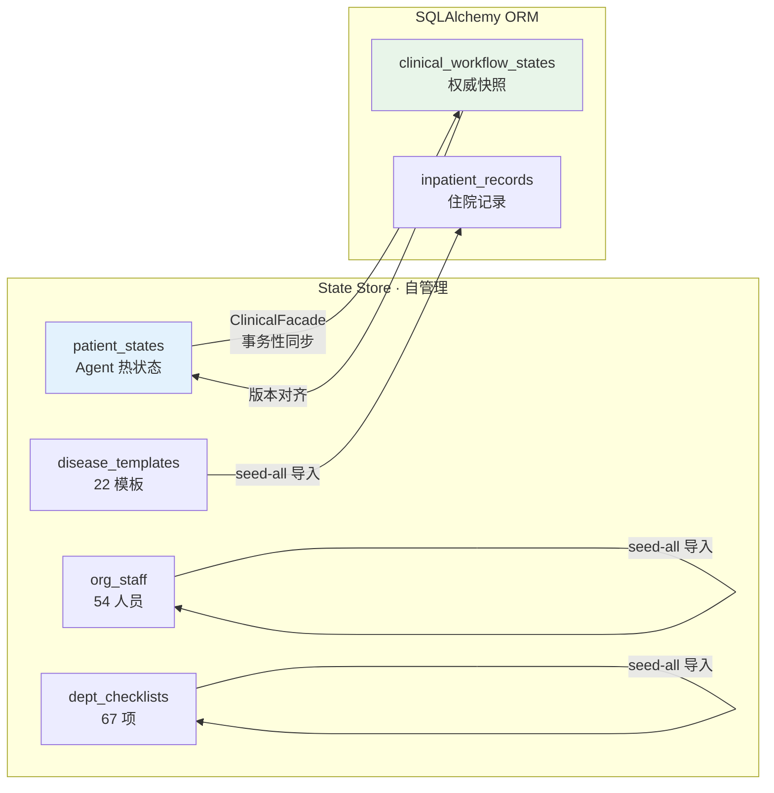
```mermaid
graph LR
    subgraph StateStore["State Store · 自管理"]
        PS["patient_states<br/>Agent 热状态"]
        OS["org_staff<br/>54 人员"]
        DT["disease_templates<br/>22 模板"]
        DC["dept_checklists<br/>67 项"]
    end

    subgraph ORM["SQLAlchemy ORM"]
        CWS["clinical_workflow_states<br/>权威快照"]
        IR["inpatient_records<br/>住院记录"]
    end

    PS -- "ClinicalFacade<br/>事务性同步" --> CWS
    CWS -- "版本对齐" --> PS
    OS -- "seed-all 导入" --> OS
    DT -- "seed-all 导入" --> IR
    DC -- "seed-all 导入" --> DC

    style PS fill:#e3f2fd
    style CWS fill:#e8f5e9
```

### 8.2 四表字段

**patient_states**

| 字段 | MySQL 类型 | SQLite 类型 | 说明 |
|------|------|------|------|
| patient_id | VARCHAR(64) PK | TEXT PK | 患者业务 ID |
| state_json | LONGTEXT NN | TEXT NN | Agent DAG 序列化状态 |
| state_version | BIGINT DEFAULT 0 | INTEGER DEFAULT 0 | 乐观锁版本号 |
| updated_at | DOUBLE NN | REAL NN | Unix 时间戳 |

**org_staff**

| 字段 | 类型 | 说明 | 示例 |
|------|------|------|------|
| id | INT AUTO_INCREMENT PK | 自增主键 | 1 |
| name | VARCHAR(32) NN | 姓名 | 沈仲卫 |
| gender | VARCHAR(4) NN | 性别 | male |
| title | VARCHAR(32) NN | 职称 | 科主任 |
| department | VARCHAR(32) NN | 科室 | 心内科 |
| role | VARCHAR(16) NN | 角色 | doctor |
| job_number | VARCHAR(32) UNIQUE | 工号 | D001 |
| is_manager | TINYINT DEFAULT 0 | 管理角色 | 1 |
| password_hash | VARCHAR(128) | 密码哈希 | (jwt 模式) |

**disease_templates**

| 字段 | 类型 | 说明 |
|------|------|------|
| disease_id | VARCHAR(64) PK | 病种标识 |
| name | VARCHAR(64) NN | 病种名称 |
| department | VARCHAR(32) NN | 主要科室 |
| template_json | LONGTEXT NN | 模板 JSON |
| updated_at | DOUBLE NN | 更新时间 |

**dept_checklists**

| 字段 | 类型 | 说明 |
|------|------|------|
| id | INT AUTO_INCREMENT PK | 自增主键 |
| department | VARCHAR(32) NN | 科室 |
| item | VARCHAR(256) NN | 核查条目 |
| sort_order | INT DEFAULT 0 | 排序号 |

---

## 九、Milvus 向量库

### 9.1 16 Collection 架构

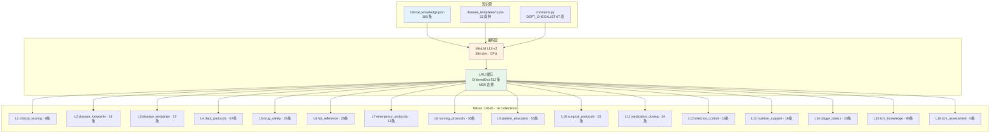
```mermaid
graph TB
    subgraph Sources["知识源"]
        JSON["clinical_knowledge.json<br/>385 条"]
        TPL["disease_templates/*.json<br/>22 病种"]
        CONST["constants.py<br/>DEPT_CHECKLIST 67 项"]
    end

    subgraph Encoder["编码层"]
        MINI["MiniLM L12-v2<br/>384-dim · CPU"]
        CACHE["LRU 缓存<br/>OrderedDict 512 条<br/>MD5 去重"]
    end

    subgraph Milvus["Milvus :19530 · 16 Collections"]
        L1["L1 clinical_scoring · 6条"]
        L2["L2 disease_keypoints · 18条"]
        L3["L3 disease_templates · 22条"]
        L4["L4 dept_protocols · 67条"]
        L5["L5 drug_safety · 25条"]
        L6["L6 lab_reference · 25条"]
        L7["L7 emergency_protocols · 13条"]
        L8["L8 nursing_protocols · 30条"]
        L9["L9 patient_education · 51条"]
        L10["L10 surgical_protocols · 15条"]
        L11["L11 medication_dosing · 24条"]
        L12["L12 infection_control · 13条"]
        L13["L13 nutrition_support · 16条"]
        L14["L14 obgyn_basics · 15条"]
        L15["L15 tcm_knowledge · 95条"]
        L16["L16 tcm_assessment · 0条"]
    end

    JSON --> MINI
    TPL --> MINI
    CONST --> MINI
    MINI --> CACHE
    CACHE --> L1 & L2 & L3 & L4 & L5 & L6 & L7 & L8
    CACHE --> L9 & L10 & L11 & L12 & L13 & L14 & L15 & L16

    style JSON fill:#e3f2fd
    style MINI fill:#fff3e0
    style CACHE fill:#e8f5e9
```

### 9.2 Collection 属性

| 属性 | 值 |
|------|------|
| 维度 | 384 (MiniLM paraphrase-multilingual) |
| 距离度量 | COSINE |
| 索引类型 | IVF_FLAT (nlist=128) |
| 输出字段 | source, category, topic, disease_id, department, version, indexed_at, text |
| 条目总数 | 385 |
| 编码模型 | sentence-transformers (GPU 可用时自动切换) |

### 9.3 5 助手模式 → RAG 层白名单

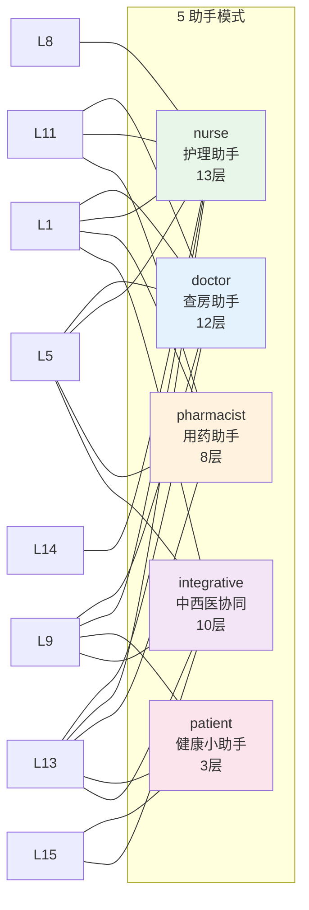
```mermaid
graph LR
    subgraph 助手["5 助手模式"]
        DOC["doctor<br/>查房助手<br/>12层"]
        NUR["nurse<br/>护理助手<br/>13层"]
        PHA["pharmacist<br/>用药助手<br/>8层"]
        PAT["patient<br/>健康小助手<br/>3层"]
        INT["integrative<br/>中西医协同<br/>10层"]
    end

    L1 --- DOC & NUR & PHA & INT
    L5 --- DOC & NUR & PHA & INT
    L8 --- NUR
    L9 --- DOC & NUR & PAT & INT
    L11 --- DOC & NUR & PHA
    L13 --- DOC & NUR & PHA & PAT & INT
    L14 --- NUR
    L15 --- PAT & INT

    style DOC fill:#e3f2fd
    style NUR fill:#e8f5e9
    style PHA fill:#fff3e0
    style PAT fill:#fce4ec
    style INT fill:#f3e5f5
```

| 助手 | 可见层 | 数量 |
|------|------|:--:|
| doctor | L1-L7, L9-L13 | 12 |
| nurse | L1-L14 | 13 |
| pharmacist | L1-L2, L5-L8, L11-L13 | 8 |
| patient | L9, L13, L15 | 3 |
| integrative | L1-L7, L9, L13, L15 | 10 |

---

## 十、Neo4j 证据图谱

### 10.1 图谱结构

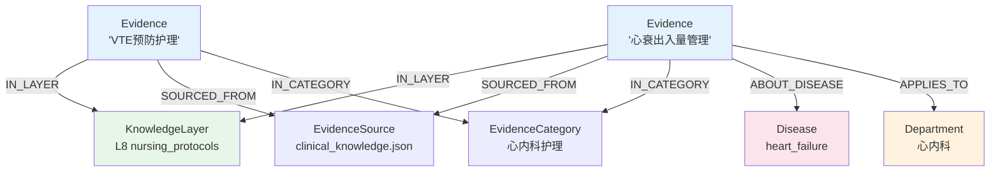
```mermaid
graph TB
    E1["Evidence<br/>'心衰出入量管理'"]
    E2["Evidence<br/>'VTE预防护理'"]

    L["KnowledgeLayer<br/>L8 nursing_protocols"]
    S["EvidenceSource<br/>clinical_knowledge.json"]
    C["EvidenceCategory<br/>心内科护理"]
    D["Disease<br/>heart_failure"]
    DEP["Department<br/>心内科"]

    E1 -->|"IN_LAYER"| L
    E1 -->|"SOURCED_FROM"| S
    E1 -->|"IN_CATEGORY"| C
    E1 -->|"ABOUT_DISEASE"| D
    E1 -->|"APPLIES_TO"| DEP

    E2 -->|"IN_LAYER"| L
    E2 -->|"SOURCED_FROM"| S
    E2 -->|"IN_CATEGORY"| C

    style E1 fill:#e3f2fd
    style E2 fill:#e3f2fd
    style L fill:#e8f5e9
    style D fill:#fce4ec
    style DEP fill:#fff3e0
```

### 10.2 节点标签

| Label | 说明 | 示例 |
|------|------|------|
| Evidence | 证据节点 (来自 RAG) | 心衰出入量管理 |
| Disease | 疾病节点 | heart_failure |
| ClinicalRule | 临床规则节点 | NEWS2>=5 触发预警 |
| KnowledgeLayer | 知识层节点 (L1-L16) | L8 (nursing_protocols) |
| EvidenceSource | 证据来源节点 | clinical_knowledge.json |
| EvidenceCategory | 证据分类节点 | 心内科护理 |
| Department | 科室节点 | 心内科 |
| ZhenhuKnowledge | 所有节点的通用基标签 | — |

### 10.3 关系与约束

| 关系 | 方向 | 说明 |
|------|------|------|
| IN_LAYER | Evidence → KnowledgeLayer | 证据属于哪层 |
| SOURCED_FROM | Evidence → EvidenceSource | 证据来源 |
| IN_CATEGORY | Evidence → EvidenceCategory | 证据分类 |
| ABOUT_DISEASE | Evidence → Disease | 证据关于哪个病种 |
| APPLIES_TO | Evidence → Department | 证据适用于哪个科室 |

| 约束 | Cypher |
|------|------|
| Evidence 唯一 | `CREATE CONSTRAINT ... FOR (node:Evidence) REQUIRE node.id IS UNIQUE` |
| Disease 唯一 | `CREATE CONSTRAINT ... FOR (node:Disease) REQUIRE node.id IS UNIQUE` |
| ClinicalRule 唯一 | `CREATE CONSTRAINT ... FOR (node:ClinicalRule) REQUIRE node.id IS UNIQUE` |

---

## 十一、Redis 缓存

### 11.1 会话生命周期

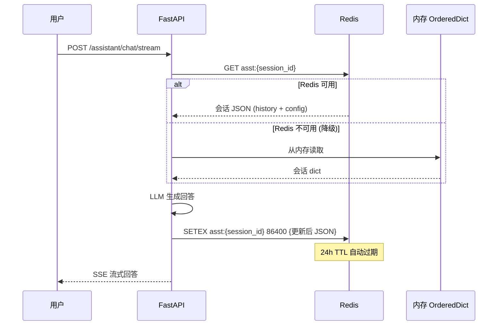
```mermaid
sequenceDiagram
    participant U as 用户
    participant API as FastAPI
    participant R as Redis
    participant M as 内存 OrderedDict

    U->>API: POST /assistant/chat/stream
    API->>R: GET asst:{session_id}
    alt Redis 可用
        R-->>API: 会话 JSON (history + config)
    else Redis 不可用 (降级)
        API->>M: 从内存读取
        M-->>API: 会话 dict
    end
    API->>API: LLM 生成回答
    API->>R: SETEX asst:{session_id} 86400 {更新后 JSON}
    Note over R: 24h TTL 自动过期
    API-->>U: SSE 流式回答
```

### 11.2 Key 规范

| Key Pattern | 类型 | TTL | 说明 |
|------|:--:|:--:|------|
| `asst:{session_id}` | String (JSON) | 24h | 助手会话 (history + config + owner) |
| (降级) 内存 OrderedDict | dict | 进程生命周期 | Redis 不可用时切换, 重启丢失 |

**asst:{session_id} 值结构:**

```json
{
  "role": "doctor",
  "assistant_mode": "doctor",
  "patient_id": "patient-xxx",
  "owner_id": "dev-doc-shen",
  "history": [
    {"role": "user", "content": "心衰出入量管理?", "time": 1711497600},
    {"role": "assistant", "content": "心衰患者出入量管理要点: ...", "time": 1711497602}
  ],
  "created_at": 1711497500,
  "updated_at": 1711497602
}
```

---

## 十二、索引策略

### 12.1 现有索引清单 (43 个)

| 表 | 索引名 | 类型 | 列 |
|------|------|:--:|------|
| inpatient_patients | uq_patient_batch_label | UNIQUE | (data_import_batch_id, display_label) |
| inpatient_patients | ix_patient_data_batch | INDEX | data_import_batch_id |
| inpatient_patients | ck_patient_display_label_not_blank | CHECK | LENGTH(TRIM(display_label)) > 0 |
| inpatient_records | ix_inpatient_records_patient_id | INDEX | patient_id |
| medical_histories | ix_medical_histories_inpatient_record_id | INDEX | inpatient_record_id |
| medical_histories | uq_medical_history_inpatient_record | UNIQUE | inpatient_record_id |
| medical_histories | uq_medical_history_record_idempotency | UNIQUE | (inpatient_record_id, idempotency_key) |
| current_conditions | ix_current_conditions_inpatient_record_id | INDEX | inpatient_record_id |
| current_conditions | uq_current_condition_record_date | UNIQUE | (inpatient_record_id, record_date) |
| attachments | ix_attachments_inpatient_record_id | INDEX | inpatient_record_id |
| attachments | ix_attachments_medical_history_id | INDEX | medical_history_id |
| attachments | ix_attachments_uploaded_by_actor_id | INDEX | uploaded_by_actor_id |
| attachments | uq_attachment_patient_content_hash | UNIQUE | (inpatient_record_id, uploaded_by_actor_id, content_hash) |
| attachments | uq_attachment_patient_upload_idempotency | UNIQUE | (inpatient_record_id, uploaded_by_actor_id, upload_idempotency_key) |
| handoff_contexts | ix_handoff_contexts_inpatient_record_id | INDEX | inpatient_record_id |
| handoff_contexts | ix_handoff_contexts_discharge_instruction_id | INDEX | discharge_instruction_id |
| handoff_contexts | ix_handoff_contexts_doctor_id | INDEX | doctor_id |
| handoff_contexts | uq_handoff_context_inpatient_record | UNIQUE | inpatient_record_id |
| handoff_contexts | uq_handoff_context_discharge_instruction | UNIQUE | discharge_instruction_id |
| presentation_items | ix_presentation_items_handoff_context_id | INDEX | handoff_context_id |
| presentation_items | uq_presentation_item_version_type | UNIQUE | (handoff_context_id, projection_version, item_type) |
| item_feedbacks | ix_item_feedbacks_handoff_context_id | INDEX | handoff_context_id |
| item_feedbacks | ix_item_feedbacks_presentation_item_id | INDEX | presentation_item_id |
| item_feedbacks | ix_item_feedbacks_actor_id | INDEX | actor_id |
| item_feedbacks | uq_item_feedback_actor_idempotency | UNIQUE | (actor_id, idempotency_key) |
| discharge_instructions | ix_discharge_instructions_inpatient_record_id | INDEX | inpatient_record_id |
| discharge_instructions | uq_discharge_instruction_version | UNIQUE | (inpatient_record_id, instruction_version) |
| manual_interventions | ix_manual_interventions_handoff_context_id | INDEX | handoff_context_id |
| manual_interventions | ix_manual_interventions_actor_id | INDEX | actor_id |
| manual_interventions | uq_manual_intervention_actor_idempotency | UNIQUE | (actor_id, idempotency_key) |
| vital_sign_entries | ix_vital_sign_entries_handoff_context_id | INDEX | handoff_context_id |
| vital_sign_entries | ix_vital_sign_entries_presentation_item_id | INDEX | presentation_item_id |
| vital_sign_entries | uq_vital_sign_context_idempotency | UNIQUE | (handoff_context_id, idempotency_key) |
| audit_logs | ix_audit_logs_actor_id | INDEX | actor_id |
| audit_logs | ix_audit_logs_created_at | INDEX | created_at |
| audit_logs | ck_audit_log_actor_role | CHECK | actor_role IN (...) |
| outbox_events | uq_outbox_event_idempotency | UNIQUE | idempotency_key |
| outbox_events | ix_outbox_event_delivery | INDEX | (status, next_attempt_at) |
| idempotency_records | uq_idempotency_scope_key | UNIQUE | (scope, idempotency_key) |
| idempotency_records | ix_idempotency_created_at | INDEX | created_at |
| patient_states | idx_updated | INDEX | updated_at |
| org_staff | idx_org_dept | INDEX | department |
| org_staff | idx_org_role | INDEX | role |
| dept_checklists | idx_checklist_dept | INDEX | department |

### 12.2 建议补充索引

| 优先级 | 表 | 建议索引 | 原因 |
|:--:|------|------|------|
| P0 | inpatient_records | `(current_status, admission_date)` | 活跃患者列表最高频查询 |
| P0 | vital_sign_entries | `(handoff_context_id, measured_at)` | 体征时序查询 |
| P1 | audit_logs | `(action_type, created_at)` | 按操作类型审计 |
| P1 | item_feedbacks | `(handoff_context_id, created_at)` | 交接审核时序 |
| P2 | current_conditions | `(inpatient_record_id, record_date DESC)` | 病情变化倒序 |

---

## 十三、容量规划

### 13.1 单科室 (40 床) 年度

| 表 | 平均行大小 | 年增 (行) | 年存储 |
|------|:--:|:--:|:--:|
| inpatient_patients | ~300 B | 1,500 | ~450 KB |
| inpatient_records | ~400 B | 1,800 | ~720 KB |
| medical_histories | ~3 KB | 1,800 | ~5.4 MB |
| current_conditions | ~1 KB | 14,000 | ~14 MB |
| attachments | ~2 KB | 8,000 | ~16 MB |
| handoff_contexts | ~1 KB | 1,800 | ~1.8 MB |
| presentation_items | ~500 B | 15,000 | ~7.5 MB |
| item_feedbacks | ~800 B | 20,000 | ~16 MB |
| discharge_instructions | ~1 KB | 1,800 | ~1.8 MB |
| manual_interventions | ~500 B | 500 | ~250 KB |
| vital_sign_entries | ~200 B | 40,000 | ~8 MB |
| follow_up_contacts | ~500 B | 1,500 | ~750 KB |
| audit_logs | ~500 B | 50,000 | ~25 MB |
| **单科年合计** | | **~157,000** | **~98 MB** |

### 13.2 全院 (1000 床) 3 年

| 表 | 3 年行数 | 3 年存储 |
|------|:--:|:--:|
| 全部 17 业务表 | ~12,000,000 | ~3 GB |
| audit_logs (5 年在线) | ~20,000,000 | ~10 GB |
| vital_sign_entries (3 年在线) | ~5,000,000 | ~1 GB |
| **全院总在线** | | **~15 GB** |

### 13.3 清理策略

| 表 | 策略 | 频率 |
|------|------|------|
| patient_states | 清理过期 TTL | 每日 |
| idempotency_records | 清理 24h 前 | 每日 |
| outbox_events | 清理已交付 7 天前 | 每日 |
| clinical_workflow_states | 清理出院 30 天后 | 每日 |
| vital_sign_entries | 按月分区→DROP PARTITION | 月度 |
| audit_logs | 按年分区→DROP PARTITION | 年度 |
| 其他业务表 | 永久保留 | — |

---

## 十四、Prompt 工程总览

### 14.1 Prompt 在系统中的三个位置

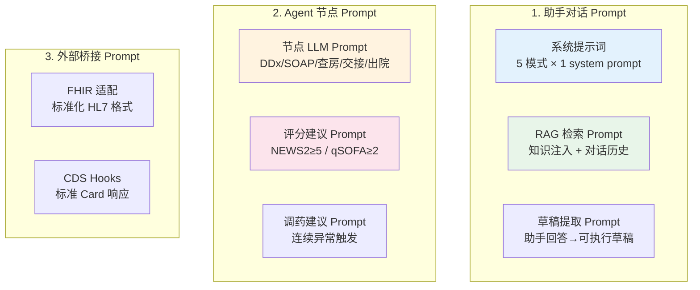
```mermaid
graph TB
    subgraph 助手["1. 助手对话 Prompt"]
        SYS["系统提示词<br/>5 模式 × 1 system prompt"]
        RAG["RAG 检索 Prompt<br/>知识注入 + 对话历史"]
        ACT["草稿提取 Prompt<br/>助手回答→可执行草稿"]
    end

    subgraph Agent["2. Agent 节点 Prompt"]
        CLIN["节点 LLM Prompt<br/>DDx/SOAP/查房/交接/出院"]
        SCORE["评分建议 Prompt<br/>NEWS2≥5 / qSOFA≥2"]
        ADJ["调药建议 Prompt<br/>连续异常触发"]
    end

    subgraph Bridge["3. 外部桥接 Prompt"]
        FHIR["FHIR 适配<br/>标准化 HL7 格式"]
        CDS["CDS Hooks<br/>标准 Card 响应"]
    end

    style SYS fill:#e3f2fd
    style RAG fill:#e8f5e9
    style CLIN fill:#fff3e0
    style SCORE fill:#fce4ec
```

### 14.2 Prompt 调用统计

| 位置 | Prompt 数量 | 调用方式 | 降级策略 |
|------|:--:|------|------|
| 助手系统提示词 | 5 | safe_llm_invoke | 失败→空结构体 |
| RAG 检索 | 2 | safe_llm_invoke (有/无知识两种模板) | 失败→开放对话 |
| 草稿提取 | 1 | safe_llm_invoke | 失败→不生成草稿 |
| Agent 节点 | 18 | deep_invoke / safe_llm_invoke / provider.invoke | 失败→规则结果 |
| **总计** | **26** | | |

---

## 十五、5 助手系统提示词

### 15.1 助手模式路由

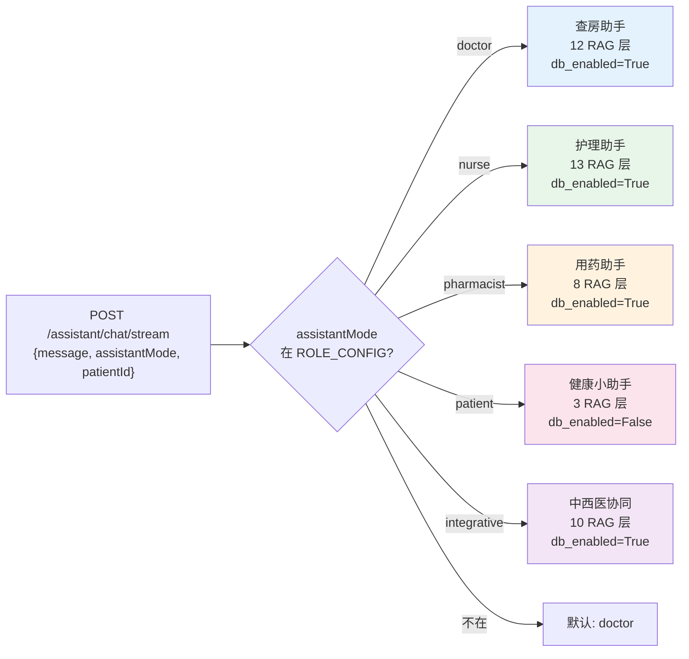
```mermaid
graph LR
    REQ["POST /assistant/chat/stream<br/>{message, assistantMode, patientId}"]

    REQ --> CHECK{"assistantMode<br/>在 ROLE_CONFIG?"}

    CHECK -->|"doctor"| DOC["查房助手<br/>12 RAG 层<br/>db_enabled=True"]
    CHECK -->|"nurse"| NUR["护理助手<br/>13 RAG 层<br/>db_enabled=True"]
    CHECK -->|"pharmacist"| PHA["用药助手<br/>8 RAG 层<br/>db_enabled=True"]
    CHECK -->|"patient"| PAT["健康小助手<br/>3 RAG 层<br/>db_enabled=False"]
    CHECK -->|"integrative"| INT["中西医协同<br/>10 RAG 层<br/>db_enabled=True"]
    CHECK -->|"不在"| DEF["默认: doctor"]

    style DOC fill:#e3f2fd
    style NUR fill:#e8f5e9
    style PHA fill:#fff3e0
    style PAT fill:#fce4ec
    style INT fill:#f3e5f5
```

### 15.2 五模式系统提示词

| 模式 | 名称 | system prompt 要点 | db_enabled |
|------|------|------|:--:|
| doctor | 查房助手 | 为医生提供循证决策支持。能力:DDx/治疗方案/检验解读/用药安全/术后管理/出院标准/急症处置/营养/感染。回答含核心建议+证据来源(LAYER标签)+注意事项。 | ✅ |
| nurse | 护理助手 | 为护士提供全方位护理支持。能力:护理操作(压疮/跌倒/导管/PCA)/病情观察/用药安全/急诊识别/交接班/营养/感染/妇产/患教。回答含操作步骤+观察要点+注意事项。 | ✅ |
| pharmacist | 用药助手 | 提供药物全周期安全管理。能力:药物相互作用/剂量调整/特殊人群/TDM/不良反应/抗生素/营养药物/中西药联用。严重交互标记⚠️。 | ✅ |
| patient | 健康小助手 | 友善温暖的AI伙伴。能力:日常闲聊/健康问答(用药/饮食/康复/指标/中医)/平台介绍。用简单中文像朋友对话。不确定时建议咨询医生。 | ❌ |
| integrative | 中西医协同 | 为出院评估提供中西医双视角。能力:六经辨证/体质评估/中药-西药交互/中医调养/西医出院标准/患教/营养。标注来源(西医L1-L14/中医L15)。 | ✅ |

---

## 十六、RAG 检索 Prompt

### 16.1 检索管线

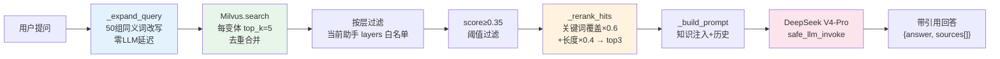
```mermaid
graph LR
    Q["用户提问"] --> EXP["_expand_query<br/>50组同义词改写<br/>零LLM延迟"]
    EXP --> SEARCH["Milvus.search<br/>每变体 top_k=5<br/>去重合并"]
    SEARCH --> FILTER["按层过滤<br/>当前助手 layers 白名单"]
    FILTER --> SCORE["score≥0.35<br/>阈值过滤"]
    SCORE --> RERANK["_rerank_hits<br/>关键词覆盖×0.6<br/>+长度×0.4 → top3"]
    RERANK --> PROMPT["_build_prompt<br/>知识注入+历史"]
    PROMPT --> LLM["DeepSeek V4-Pro<br/>safe_llm_invoke"]
    LLM --> OUT["带引用回答<br/>{answer, sources[]}"]

    style EXP fill:#e3f2fd
    style SEARCH fill:#e8f5e9
    style RERANK fill:#fff3e0
    style LLM fill:#fce4ec
```

### 16.2 两种 Prompt 模板

**有知识命中 (专业模式):**

```
{config['system']}

【循证依据】
[L8] 心衰出入量管理: 每日晨起排尿后测体重...
[L9] 心力衰竭患者自我管理: 限水1.5-2L/日...

【对话历史】
用户: 心衰出入量管理?
助手: 心衰患者出入量管理要点: ...

【当前问题】
{message}

请基于循证依据给出专业回答，标注信息来源。如依据不足请说明。
最终仅返回 JSON 对象，必须包含 answer 字段，answer 的值为完整中文回答。
```

**无知识命中 (开放对话模式):**

```
{config['system']}

【对话历史】
用户: 今天天气怎么样?
助手: 我不太了解天气情况...

【当前问题】
{message}

请友善自然地回答。如果是健康问题就坦诚说需要更多信息并建议咨询医生，
如果是日常闲聊就轻松回应。

最终仅返回 JSON 对象，必须包含 answer 字段。
```

### 16.3 同义词改写示例

```
输入: "心衰病人喝水太多怎么办"

_expand_query → 3 个查询变体:
  ① "心衰病人喝水太多怎么办"          (原始)
  ② "心力衰竭病人喝水太多怎么办"       (心衰→心力衰竭)
  ③ "心脏功能不全病人喝水太多怎么办"    (心衰→心脏功能不全)

每个变体 → Milvus top_k=5 → 去重合并 (最多 15 条候选)
```

---

## 十七、Agent 节点 Prompt

### 17.1 LLM 节点调用流程

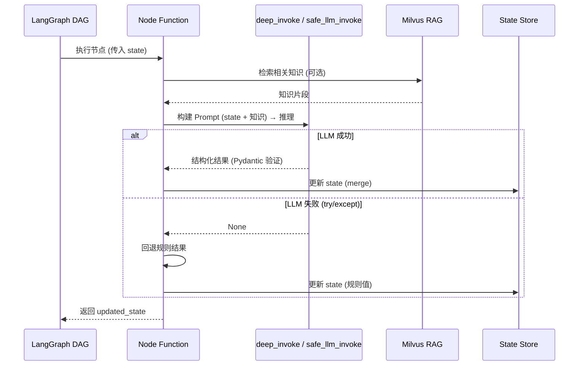
```mermaid
sequenceDiagram
    participant DAG as LangGraph DAG
    participant NODE as Node Function
    participant LLM as deep_invoke / safe_llm_invoke
    participant RAG as Milvus RAG
    participant STATE as State Store

    DAG->>NODE: 执行节点 (传入 state)
    NODE->>RAG: 检索相关知识 (可选)
    RAG-->>NODE: 知识片段
    NODE->>LLM: 构建 Prompt (state + 知识) → 推理
    alt LLM 成功
        LLM-->>NODE: 结构化结果 (Pydantic 验证)
        NODE->>STATE: 更新 state (merge)
    else LLM 失败 (try/except)
        LLM-->>NODE: None
        NODE->>NODE: 回退规则结果
        NODE->>STATE: 更新 state (规则值)
    end
    NODE-->>DAG: 返回 updated_state
```

### 17.2 27 节点 LLM 使用分类

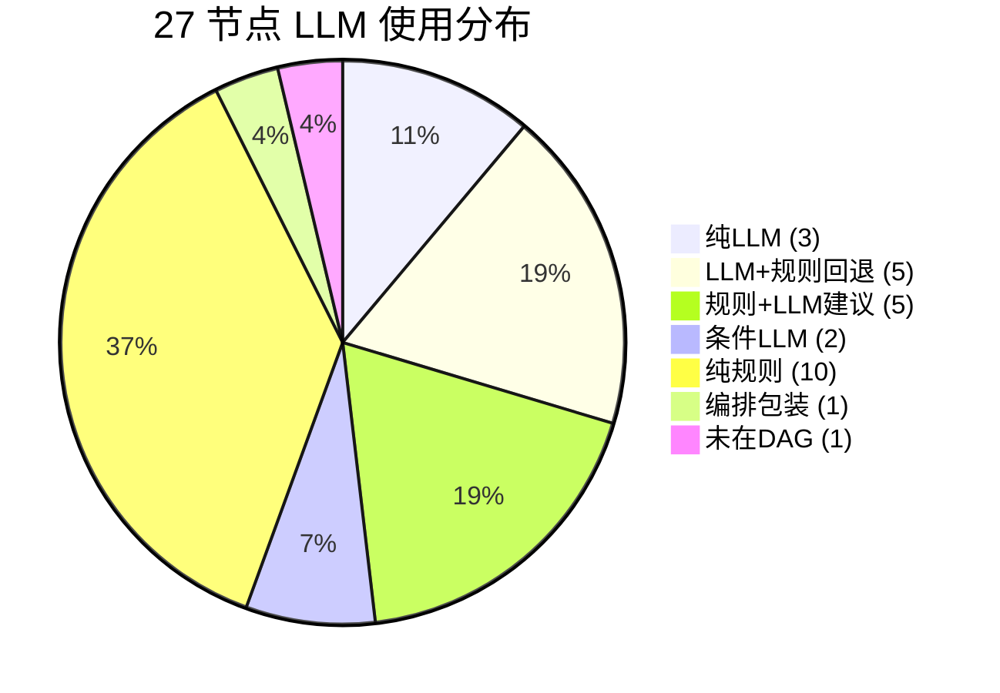
```mermaid
pie title 27 节点 LLM 使用分布
    "纯LLM (3)" : 3
    "LLM+规则回退 (5)" : 5
    "规则+LLM建议 (5)" : 5
    "条件LLM (2)" : 2
    "纯规则 (10)" : 10
    "编排包装 (1)" : 1
    "未在DAG (1)" : 1
```

### 17.3 关键节点 Prompt 示例

**node_ddx (鉴别诊断):**

```
你是一位 {department} 的资深临床医生。
患者信息:
  姓名: {patient_name}, 性别: {gender}, 年龄: {age}
  主诉: {chief_complaint}
  病史: {history_content}
  体检: {pe_narrative}
  病种模板: {disease_template.name}

请生成 3-5 条鉴别诊断, 每条包含:
  - diagnosis: 诊断名称
  - probability: 可能性 (0-1)
  - evidence: 支持证据列表
  - against: 反对证据列表

返回 JSON: {"ddx_list": [...], "ddx_unavailable": false}
```

**node_daily_round (SOAP 查房):**

```
基于以下信息生成 SOAP 查房笔记:

患者: {patient_name}, 诊断: {primary_dx}
昨日评分: NEWS2={news2}, 出入量={io_balance}
今日体征: {vital_signs}
今日检验: {lab_results}
当前用药: {medications}

请按 S-O-A-P 格式输出:
  S (Subjective): 患者主观症状
  O (Objective): 客观体征和检验
  A (Assessment): 评估和变化趋势
  P (Plan): 计划 (用药调整/检查/会诊)

返回 JSON: {"soap_summary": {"subjective":"...", "objective":"...", "assessment":"...", "plan":"..."}}
```

---

## 十八、对话与草稿 Prompt

### 18.1 流式对话流程

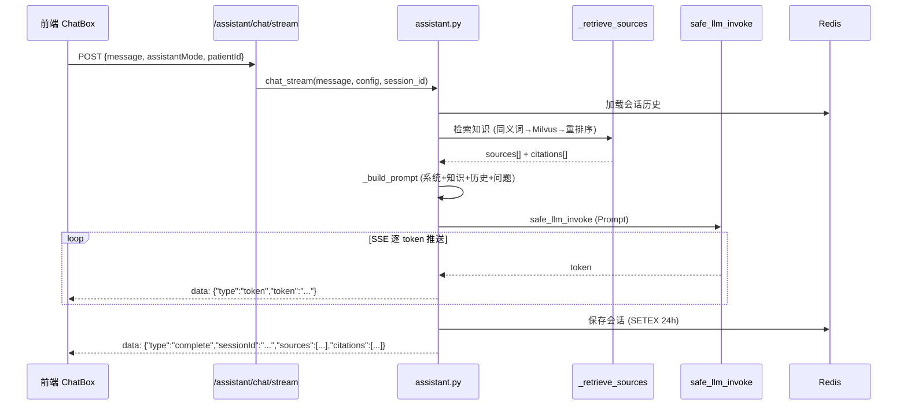
```mermaid
sequenceDiagram
    participant FE as 前端 ChatBox
    participant API as /assistant/chat/stream
    participant AST as assistant.py
    participant RAG as _retrieve_sources
    participant LLM as safe_llm_invoke
    participant REDIS as Redis

    FE->>API: POST {message, assistantMode, patientId}
    API->>AST: chat_stream(message, config, session_id)
    AST->>REDIS: 加载会话历史
    AST->>RAG: 检索知识 (同义词→Milvus→重排序)
    RAG-->>AST: sources[] + citations[]
    AST->>AST: _build_prompt (系统+知识+历史+问题)
    AST->>LLM: safe_llm_invoke (Prompt)

    loop SSE 逐 token 推送
        LLM-->>AST: token
        AST-->>FE: data: {"type":"token","token":"..."}
    end

    AST->>REDIS: 保存会话 (SETEX 24h)
    AST-->>FE: data: {"type":"complete","sessionId":"...","sources":[...],"citations":[...]}
```

### 18.2 草稿提取 Prompt

当用户点击"转为操作草稿"时:

```
从以下助手对话中提取可执行的临床操作草案:

助手回答:
{assistant_answer}

请提取其中的可执行操作, 每条包含:
  - action_type: 操作类型 (medication_order/investigation_order/discharge_initiate/...)
  - title: 操作标题
  - payload: 具体内容 (药物/剂量/检查名/...)
  - confidence: 置信度 (0-1)
  - rationale: 推荐理由

返回 JSON: {"drafts": [...]}
```

**草稿状态机:**

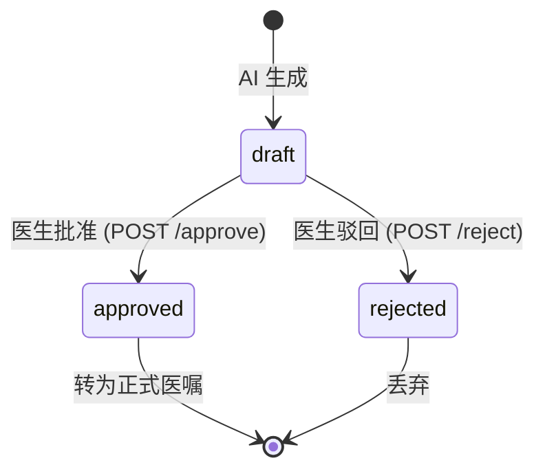
```mermaid
stateDiagram-v2
    [*] --> draft: AI 生成
    draft --> approved: 医生批准 (POST /approve)
    draft --> rejected: 医生驳回 (POST /reject)
    approved --> [*]: 转为正式医嘱
    rejected --> [*]: 丢弃
```

---

## 十九、Agent 节点 18 个 Prompt 模板全表

### 19.1 prompts.py 函数清单

`agent/prompts.py` 集中管理所有 Agent 节点的 LLM Prompt，按临床阶段分为 6 类 18 个函数：

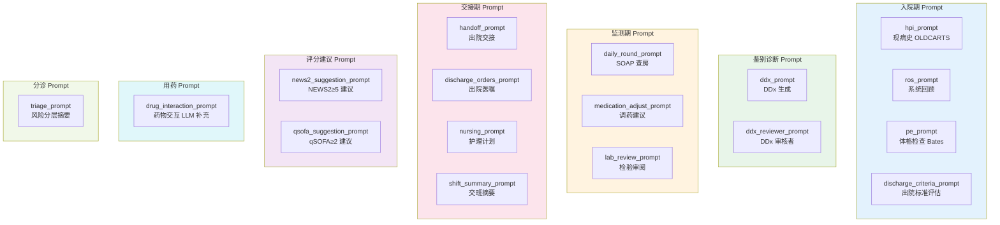
```mermaid
graph TB
    subgraph 入院["入院期 Prompt"]
        HPI["hpi_prompt<br/>现病史 OLDCARTS"]
        ROS["ros_prompt<br/>系统回顾"]
        PE["pe_prompt<br/>体格检查 Bates"]
        DC["discharge_criteria_prompt<br/>出院标准评估"]
    end

    subgraph 诊断["鉴别诊断 Prompt"]
        DDX["ddx_prompt<br/>DDx 生成"]
        DRE["ddx_reviewer_prompt<br/>DDx 审核者"]
    end

    subgraph 监测["监测期 Prompt"]
        DR["daily_round_prompt<br/>SOAP 查房"]
        MA["medication_adjust_prompt<br/>调药建议"]
        LR["lab_review_prompt<br/>检验审阅"]
    end

    subgraph 交接["交接期 Prompt"]
        HO["handoff_prompt<br/>出院交接"]
        DO["discharge_orders_prompt<br/>出院医嘱"]
        NU["nursing_prompt<br/>护理计划"]
        SS["shift_summary_prompt<br/>交班摘要"]
    end

    subgraph 评分["评分建议 Prompt"]
        NE["news2_suggestion_prompt<br/>NEWS2≥5 建议"]
        QS["qsofa_suggestion_prompt<br/>qSOFA≥2 建议"]
    end

    subgraph 用药["用药 Prompt"]
        DI["drug_interaction_prompt<br/>药物交互 LLM 补充"]
    end

    subgraph 分诊["分诊 Prompt"]
        TR["triage_prompt<br/>风险分层摘要"]
    end

    style 入院 fill:#e3f2fd
    style 诊断 fill:#e8f5e9
    style 监测 fill:#fff3e0
    style 交接 fill:#fce4ec
    style 评分 fill:#f3e5f5
    style 用药 fill:#e0f7fa
    style 分诊 fill:#f1f8e9
```

### 19.2 18 个 Prompt 函数详表

| # | 函数名 | 调用节点 | 输入参数 | 输出结构 | 框架 |
|:--:|------|------|------|------|------|
| 1 | `hpi_prompt` | node_history_taking | chief_complaint, hpi_focus[], pmh_text | `{hpi_narrative: "..."}` | OLDCARTS |
| 2 | `ros_prompt` | node_history_taking | chief_complaint, ros_systems[] | `{ros: {呼吸系统: "...", ...}}` | 系统回顾 |
| 3 | `pe_prompt` | node_physical_exam | chief_complaint, hpi_narrative, vs_text, required_systems[], focus_items[] | `{pe_narrative: "...", abnormal_findings: [...]}` | Bates 指南 |
| 4 | `discharge_criteria_prompt` | node_monitoring | cond_key, age, comorbidities, current_status | `{met: bool, details: [...]}` | 病种模板标准 |
| 5 | `triage_prompt` | node_triage | risk_type, matched_factors[], patient_data_str | `{risk_summary: "..."}` | 风险分层 |
| 6 | `ddx_prompt` | node_ddx | cc, hpi, pe, allergies, medications, disease_template | `{ddx_list: [{diagnosis, probability, evidence[], against[]}], ddx_unavailable: false}` | — |
| 7 | `ddx_reviewer_prompt` | node_ddx | ddx_list[] | `{reviewed_ddx: [...], issues: [...]}` | 二次审核 |
| 8 | `daily_round_prompt` | node_daily_round | template_name, risk, chief_complaint, vital_signs, lab_results, medications | `{soap_summary: {S, O, A, P}}` | SOAP |
| 9 | `medication_adjust_prompt` | node_medication_adjust | template_name, alerts[], lab_trends, current_meds | `{adjustments: [{drug, action, reason}]}` | — |
| 10 | `lab_review_prompt` | node_lab_review | template_name, new_labs[] | `{interpretation: "...", abnormal: [...], critical: [...]}` | — |
| 11 | `handoff_prompt` | node_handoff | template_name, risk, chief_complaint, discharge_instructions, handoff_items[] | `{personalized_notes: "..."}` | — |
| 12 | `discharge_orders_prompt` | node_discharge | template_name, handoff_items[], medications[], follow_up_plan | `{discharge_orders: {...}}` | — |
| 13 | `nursing_prompt` | node_nursing | latest_vs, medications_administered[], alerts[], dept_checklist | `{nursing_plan: [...], nursing_actions: [...]}` | — |
| 14 | `shift_summary_prompt` | node_shift_summary | template_name, round_count, bp_now, alert_count, news2 | `{shift_report: {high_focus: [...], stable: [...], ai_report: "..."}}` | SBAR |
| 15 | `news2_suggestion_prompt` | node_news2 | total, risk, rr, spo2, supplemental_o2, sbp, hr, avpu, temp | `{suggestion: "..."}` | NEWS2 指南 |
| 16 | `qsofa_suggestion_prompt` | node_qsofa | total, rr, sbp, gcs | `{suggestion: "..."}` | qSOFA 指南 |
| 17 | `drug_interaction_prompt` | node_medication_reconciliation | all_med_names[], pre_admission_meds[], allergies[] | `{interactions: [{drug_a, drug_b, severity, mechanism, recommendation}]}` | — |
| 18 | `triage_prompt` | node_triage | risk_type, matched_factors[], patient_data_str | `{risk_summary: "..."}` | 风险分层 |

### 19.3 LLM 调用层 (llm_utils.py)

```mermaid
graph TB
    NODE["Agent 节点"]

    NODE -->|"deep_invoke"| DEEP["DeepAgent 管线<br/>多步骤推理 + 工具调用<br/>超时 30s · 3 次重试"]
    NODE -->|"safe_llm_invoke"| SAFE["安全调用<br/>单步推理<br/>超时可配 · 含缓存"]
    NODE -->|"provider.invoke"| PROV["Provider 直调<br/>LLMProvider.invoke()"

    DEEP --> FALL{"成功?"}
    FALL -->|"是"| OK1["结构化结果"]
    FALL -->|"否"| RULE1["规则回退"]

    SAFE --> CACHE{"cache_get()"}
    CACHE -->|"命中"| RET["返回缓存"]
    CACHE -->|"未命中"| CALL["LLM 调用"]
    CALL --> SET["cache_set()"]
    SET --> OK2["结构化结果"]

    PROV --> PRIMARY{"主 Provider"}
    PRIMARY -->|"失败"| FB{"备用 Provider<br/>(Ollama?)"}
    FB -->|"有"| OK3["本地模型结果"]
    FB -->|"无"| RULE2["规则回退"]

    style DEEP fill:#e3f2fd
    style SAFE fill:#e8f5e9
    style PROV fill:#fff3e0
```

**三种 LLM 调用方式对比:**

| 方式 | 函数 | 用途 | 缓存 | 超时 | 重试 | 降级 |
|------|------|------|:--:|:--:|:--:|------|
| deep_invoke | DeepAgent 管线 | 复杂推理 (DDx/查房) | ✅ | 30s | 3 次 | 规则结果 |
| safe_llm_invoke | 安全单步 | 简单生成 (建议/摘要) | ✅ | 可配 | 可配 | None → 规则 |
| provider.invoke | Provider 直调 | 直接调用 | ❌ | — | — | 备用 Provider |

---

## 二十、意图分类与助手路由 Prompt

### 20.1 意图分类流程

`classify_intent()` 在 RAG 检索之前执行，决定是否走知识检索还是直接闲聊：

```mermaid
flowchart TD
    MSG["用户消息"] --> NORM["normalize + 去标点"]
    NORM --> CHECK{"是寒暄?"}
    CHECK -->|"是 (你好/谢谢/再见等)"| SMALL["intent=smalltalk<br/>layers=[] 空集<br/>confidence=0.99<br/>直接 LLM 闲聊"]
    CHECK -->|"否"| MATCH["关键词匹配<br/>INTENT_RULES 逐条"]
    MATCH --> FOUND{"有匹配?"}
    FOUND -->|"否"| GEN["intent=general<br/>layers=全部允许层<br/>confidence=0.35<br/>走 RAG 检索"]
    FOUND -->|"是"| SORT["按匹配数排序<br/>取最高"]
    SORT --> RESULT["intent=name<br/>layers=该意图关联层<br/>confidence=匹配数/总关键词"]
    RESULT --> RAG["走 RAG 检索<br/>(限定 layers)"]

    style SMALL fill:#e8f5e9
    style GEN fill:#fff3e0
    style RAG fill:#e3f2fd
```

### 20.2 三种意图类型

| 意图 | 名称 | layers | confidence | 处理方式 |
|------|------|------|:--:|------|
| smalltalk | 日常寒暄 | `[]` 空集 | 0.99 | 跳过 RAG，直接 LLM 闲聊 |
| general | 通用咨询 | 全部允许层 | 0.35 | 走完整 RAG 检索 |
| (具体意图) | 如 "用药咨询" | 该意图关联层 | 匹配数/总数 | 限定层 RAG 检索 |

### 20.3 意图分类 vs RAG 检索 vs LLM 生成

```mermaid
sequenceDiagram
    participant U as 用户
    participant C as classify_intent
    participant R as _retrieve_sources
    participant L as LLM

    U->>C: "你好"
    C->>C: 匹配 SMALLTALK_MESSAGES
    C-->>L: intent=smalltalk, layers=[]
    L-->>U: 闲聊回答 (跳过 RAG)

    U->>C: "心衰出入量管理"
    C->>C: 匹配 INTENT_RULES → general
    C->>R: intent=general, layers=全部允许
    R->>R: 同义词改写 → Milvus → 重排序
    R-->>L: sources[] (top 3)
    L-->>U: 专业回答 + 引用来源

    U->>C: "这个药怎么吃"
    C->>C: 匹配 INTENT_RULES → 用药咨询
    C->>R: intent=用药, layers=[L5, L11]
    R->>R: 仅检索 L5 + L11 两层
    R-->>L: sources[] (限定层 top 3)
    L-->>U: 用药指导 + 引用
```

---

## 二十一、LLM 缓存与度量

### 21.1 LLM 响应缓存

`llm_utils.py` 的 `cache_get()` / `cache_set()` 为 LLM 调用提供结果缓存：

```mermaid
graph LR
    REQ["safe_llm_invoke(prompt, context)"] --> KEY["cache_key(patient_id, phase, inputs)"]
    KEY --> GET{"cache_get(key)?"}
    GET -->|"命中"| RET["返回缓存结果<br/>~0ms"]
    GET -->|"未命中"| CALL["LLM 调用<br/>~2-5s"]
    CALL --> SET["cache_set(key, result)"]
    SET --> OUT["返回结果"]
    OUT --> METRIC["_record_llm_call(success, latency, prompt_len)"]

    style RET fill:#e8f5e9
    style CALL fill:#fff3e0
    style METRIC fill:#e3f2fd
```

### 21.2 LLM 度量指标

`get_llm_metrics()` 返回运行时统计：

| 指标 | 说明 |
|------|------|
| total_calls | 总调用次数 |
| successful_calls | 成功次数 |
| failed_calls | 失败次数 |
| cache_hits | 缓存命中次数 |
| cache_misses | 缓存未命中次数 |
| avg_latency_s | 平均延迟 (秒) |
| avg_prompt_length | 平均 Prompt 长度 |
| avg_response_length | 平均响应长度 |

### 21.3 Provider 容错链

```mermaid
graph TD
    CALL["节点调用 LLM"] --> PRIMARY{"主 Provider<br/>(DeepSeek API)"}
    PRIMARY -->|"成功"| OK["返回结果"]
    PRIMARY -->|"失败/超时"| CHECK{"_ollama_fallback_enabled?"}
    CHECK -->|"是"| OLLAMA["备用 Provider<br/>(本地 Ollama)"]
    OLLAMA -->|"成功"| OK
    OLLAMA -->|"失败"| RULE["规则回退"]
    CHECK -->|"否"| RULE

    style OK fill:#e8f5e9
    style RULE fill:#ffebee
    style OLLAMA fill:#fff3e0
```

---

## 二十二、Prompt 总量统计

```mermaid
pie title 26 个 Prompt 调用分布
    "Agent 节点 Prompt (prompts.py)" : 18
    "助手系统提示词 (ROLE_CONFIG)" : 5
    "RAG 检索 Prompt (_build_prompt)" : 2
    "草稿提取 Prompt (extract_action_draft)" : 1
```

| 类别 | 数量 | 位置 | 降级策略 |
|------|:--:|------|------|
| Agent 节点 Prompt | 18 | prompts.py | 规则回退 |
| 助手系统提示词 | 5 | assistant.py ROLE_CONFIG | — |
| RAG 检索 Prompt | 2 | assistant.py _build_prompt | 开放对话 |
| 草稿提取 Prompt | 1 | assistant.py extract_action_draft_suggestions | 不生成草稿 |
| **总计** | **26** | | |

---

## 二十三、当前实现校准

### 23.1 事务状态、版本与事件

临床写入不应只依赖页面内存状态。当前实现同时使用事务模型与热状态投影：写操作携带 `expected_version` 时执行乐观锁校验，冲突返回 `409 STATE_VERSION_CONFLICT`；具有重放语义的写入使用 `Idempotency-Key` 复用结果；事务性业务事件由 `OutboxEvent` 记录后异步重试。审计记录与临床状态分开保存，避免以删除热状态代替审计清理。

SQLite 是当前本地开发的可用后端；生产状态库应配置 MySQL，并通过既有迁移/部署流程管理。不能因为同一份代码支持 SQLite 就把它描述为生产并发方案。

### 23.2 联系方式、随访与助手草稿

`FollowUpContact` 中的联系方式由随访联系人服务使用 `CONTACT_ENCRYPTION_KEY` 加密处理。生产部署必须提供独立密钥，禁止把开发回退密钥、真实手机号或 API 密钥写入文档和版本库。

助手的会话、引用和待确认操作草稿属于临床辅助元数据：会话可通过 `/assistant/sessions`、`/assistant/session/{id}`、`/reset` 恢复或清理；草稿通过 `/inpatient/{id}/assistant-action-drafts` 生成、编辑、批准或驳回。批准动作仍受角色、审核和状态版本约束，草稿不是医嘱的旁路。

### 23.3 RAG、图谱与缓存

Milvus 的 `16` 层、`385` 条知识是当前索引基线。管理端使用 `/admin/rag/entries` 做条目检索，使用 `/admin/rag/preview` 做语义预览，使用 `/admin/rag/reindex` 重建；旧 `/inpatient/rag/*` 路由保留作兼容/直接诊断。

Redis/运行时缓存承担助手会话、查询与部分嵌入结果的加速职责；缓存未命中或嵌入模型首次加载会增加首个语义请求的时间。Neo4j 图谱通过管理端 status、disease 与 visualization 接口暴露节点和关系，不与 Milvus 条目索引混为一类数据源。

### 23.4 Agent 持久化边界

`LANGGRAPH_CHECKPOINT_DB` 是预留配置，不会使状态图进入可恢复模式。当前只允许 `GRAPH_MODE=classic`；设置 `GRAPH_MODE=stateful` 会被显式拒绝，直到 durable checkpoint 与 interrupt/resume 的临床恢复验收完成。待审核状态由当前状态库和审核接口管理，不能把未实现的 stateful 恢复能力写成已交付功能。

---

> 文档版本 v2.2 · 23 章 · 数据、状态、RAG、图谱与 Prompt 工程 · 2026-07-21 · 当前运行边界见《臻护-代码现状基线》
