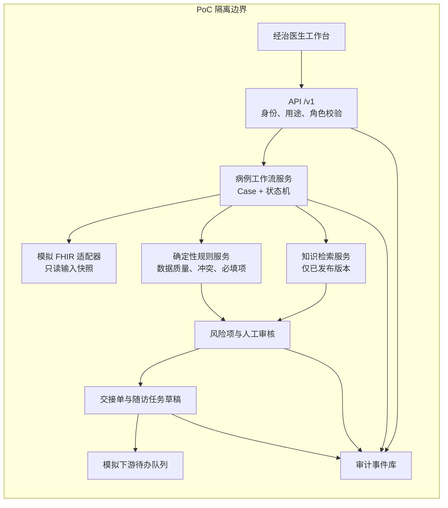

# 臻护 PoC 工程基线

## 目标与边界

本基线只实现一条可重复演示的闭环：经治医生在已登录工作台查看脱敏模拟病例，对系统产生的风险项进行确认、驳回或编辑；所有风险项处理完成后，系统生成交接与随访任务草稿，并仅可模拟发布到 PoC 待办队列。

- 不接入真实患者、HIS、EMR、LIS、通知或写回接口。
- 不自动诊断、开立医嘱、修改病历或向患者发送建议。
- 所有页面数据都必须由模拟适配器提供，并标示为 PoC 数据。
- 所有业务动作都以 `case_id` 串联并产生不可覆盖的审计事件。

## 模块图

## 角色与职责

| 角色 | PoC 可执行动作 | 明确禁止 |
| --- | --- | --- |
| 经治医生 | 发起模拟分析；确认、驳回、编辑风险项；生成并模拟发布草稿 | 真实签署、真实写回、绕过证据确认 |
| 护士/个案管理师 | 查看模拟发布待办；补充模拟执行信息 | 确认临床风险结论 |
| 接收方医护人员 | 查看被授权的模拟交接摘要和任务 | 获取完整病例快照 |
| 知识管理员 | 维护模拟知识版本和发布状态 | 修改病例或临床审核结论 |
| 审计员 | 按 `case_id` 查询审计事件 | 变更工作流数据 |

服务端在每个请求上验证角色、用途、病例权限、资源权限与状态机前置条件；前端隐藏按钮不是授权控制。

## 工程分层

| 层 | 初始目录 | 责任 |
| --- | --- | --- |
| 工作台 | `poc/web` | 医生审核、任务查看、证据呈现；不持有授权判断 |
| API 与工作流域 | `poc/api` | 模拟会话、权限、输入校验、状态机、草稿与审计事件 |
| 模拟临床数据 | `poc/api/workflow.mjs` | 固定脱敏案例、模拟 FHIR 资源、输入快照映射 |
| PoC 测试 | `poc/tests` | 从状态机与权限到下游模拟待办的自动化验证 |

## 实现顺序

1. 初始化 TypeScript workspace 与共享契约包。
2. 实现模拟病例读取、工作流状态机和审计事件的内存持久化版本。
3. 实现风险审核和草稿生成 API，并为拒绝、重复提交、错误状态补充单元测试。
4. 接入医生工作台和模拟待办视图。
5. 运行端到端用例与失败依赖演练；再评估是否进入真实接口适配设计。
