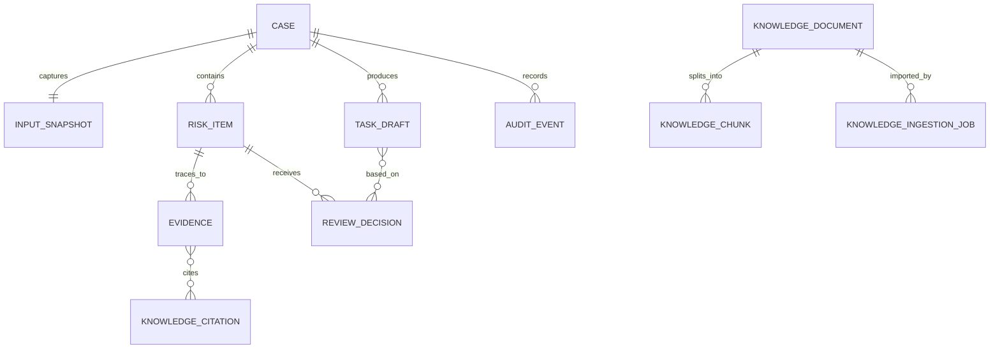

# PoC 数据模型

## 设计原则

- `Case` 是全链路聚合根，任何风险、任务、决策和审计记录都必须关联一个 `case_id`。
- 输入快照为只读事实记录，草稿和任务不能覆盖它。
- 引用和审计记录是可追溯证据，不随页面状态清除。
- PoC 采用内存或本地文件持久化实现；接口与字段按后续可替换数据库的方式定义。

## 核心实体

| 实体 | 主键 | 关键字段 | 所有者 |
| --- | --- | --- | --- |
| `Case` | `case_id` | `patient_ref`、`encounter_ref`、`state`、`workflow_version`、`input_snapshot_id`、`created_by` | 工作流服务 |
| `InputSnapshot` | `snapshot_id` | `case_id`、`mapping_version`、`captured_at`、`source_records[]`、`data_quality_flags[]` | 模拟 FHIR 适配器 |
| `RiskItem` | `risk_id` | `case_id`、`category`、`severity`、`status`、`summary`、`evidence_ids[]`、`rule_version` | 规则/检索服务 |
| `Evidence` | `evidence_id` | `case_id`、`kind`、`resource_type`、`resource_ref`、`field_path`、`snippet`、`captured_at` | 输入快照或知识服务 |
| `KnowledgeCitation` | `citation_id` | `document_id`、`version`、`chunk_id`、`location`、`coordinates`、`excerpt`、`retrieved_at`、`retrieval_strategy_version` | 知识服务 |
| `KnowledgeDocument` | `document_id` | `title`、`version`、`owner`、`status`（`review_pending`/`published`/`expired`/`withdrawn`/`superseded`/`archived`/`review_rejected`）、`effective_from`、`effective_until`、`content_hash`、`source_format`、`source_mime`、`source_hash`、`source_byte_length` | 知识管理员 |
| `KnowledgeIngestionJob` | `job_id` | `status`、`attempt`、`input`、`started_at`、`completed_at`、`document_id`、`error.code`、`error.message`、`error.retryable` | 知识管理员 |
| `KnowledgeRuntimeState` | `schema_version` | `documents[]`、`audit_events[]`、`ingestion_jobs[]`、`next_ingestion_job` | PoC 本地运行时存储 |
| `KnowledgeChunk` | `document_id + chunk_id` | `location`、`text`、`chunking_version` | 知识服务 |
| `KnowledgeLifecycleEvent` | `audit_id` | `document_id`、`event_type`、`actor`、`occurred_at`、`detail` | 知识服务 |
| `ReviewDecision` | `decision_id` | `risk_id`、`action`、`note`、`actor_id`、`decided_at` | 工作流服务 |
| `TaskDraft` | `task_draft_id` | `case_id`、`status`、`tasks[]`（含 `task_type`、`assignee_role`、`due`、`escalation`、`status`=`simulated_pending`/`simulated_supplemented`、`execution_result`）、`based_on_decisions[]`、`sop_version` | 工作流服务 |
| `AuditEvent` | `audit_id` | `case_id`、`event_type`、`actor`、`occurred_at`、`request_id`、`before`、`after`、`reason` | 审计服务 |

## 关系图



## 最小字段契约

```ts
type CaseState =
  | "draft"
  | "analysing"
  | "review_pending"
  | "confirmed"
  | "rejected"
  | "task_draft"
  | "simulated_published"
  | "failed"
  | "cancelled"
  | "closed"
  | "knowledge_changed"; // 阻断态（§4.4）：须经 reconcile 恢复至 review_pending

type IngestionJobState = "queued" | "parsing" | "review_pending" | "failed";

interface Case {
  caseId: string;
  patientRef: string; // PoC 使用伪标识，不包含真实姓名/身份证号
  encounterRef: string;
  state: CaseState;
  workflowVersion: string;
  inputSnapshotId: string;
  createdBy: string;
  createdAt: string;
  updatedAt: string;
}

interface RiskItem {
  riskId: string;
  caseId: string;
  category: "medication_allergy" | "followup_window" | "missing_field";
  severity: "high" | "medium" | "low";
  status: "pending" | "confirmed" | "rejected";
  summary: string;
  evidenceIds: string[];
  citationIds: string[];
  ruleVersion: string;
  review?: { action: "confirm" | "reject" | "edit_confirm"; note?: string; actorId: string; decidedAt: string };
}

interface KnowledgeIngestionJob {
  jobId: string;
  status: IngestionJobState;
  attempt: number;
  input: {
    title: string;
    version: string;
    owner: string;
    sourceFileName: string;
    sourceFormat: "txt" | "md" | "pdf" | "docx";
    sourceMime: string;
    effectiveFrom: string;
    effectiveUntil: string;
  };
  startedAt: string | null;
  completedAt: string | null;
  documentId: string | null;
  error: null | { code: string; message: string; retryable: boolean };
}
```

## 数据保留与脱敏

- 模拟病例使用伪姓名、掩码住院号和预置临床字段；禁止将真实病例复制入 mock 文件。
- `AuditEvent` 附加请求和变更摘要，不复制完整病历正文。
- 缓存不是事实来源。后续加入缓存时，键必须至少包含角色权限范围、`case_id`、知识版本、检索策略版本和输出契约版本。
- 文件导入 PoC 接受 `.txt`、`.md`、`.pdf`、`.docx`，在服务端校验元数据、日期、扩展名、MIME、5 MiB 大小上限、文件签名、源文件 SHA-256 和解析正文长度；异步入库完成后进入 `review_pending`，不参与索引。
- 知识文档、入库任务和知识生命周期事件会写入 `poc/data/runtime/knowledge-state.json`，用于 PoC 重启恢复；知识管理员也可主动清空运行时状态并恢复预置样例。
- 病例工作流、病例审计和模拟待办仍仅驻留当前进程。生产实现须替换为对象存储、关系库、审计库和持久化异步任务队列。
