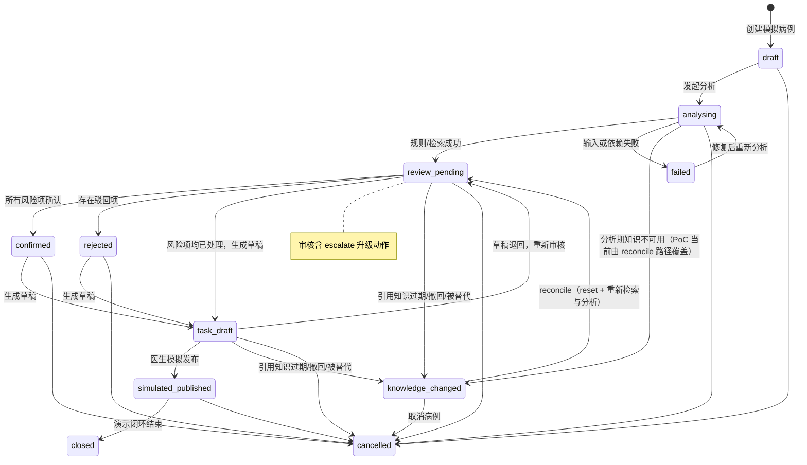
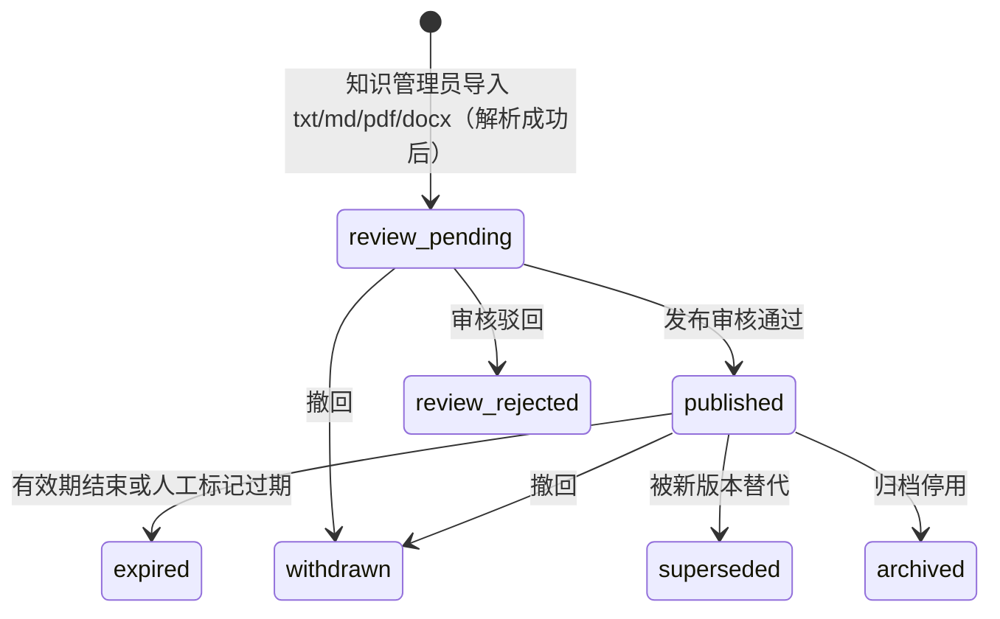
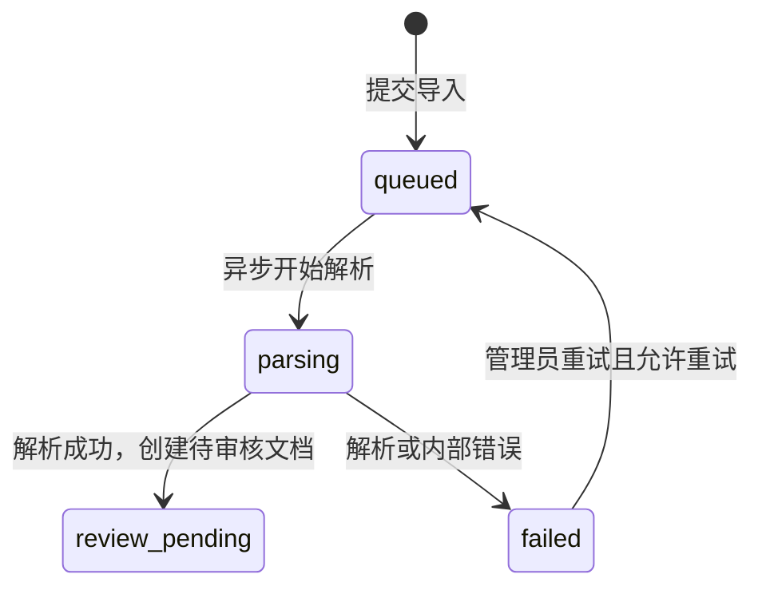

# PoC 工作流状态机

> 本文档对照《需求规格说明书 v0.2》§3.4 / §4.4，并以 `packages/clinical-contracts/src/index.mjs` 为唯一事实来源。转移表与不变量须与契约包的 `assertCaseTransition` / 知识版本状态机保持一致。

## 病例状态机

`knowledge_changed` 为阻断态：进入后禁止 `publish` / `createTaskDraft`，须经 `reconcile` 重新检索与分析后回到 `review_pending`，或由医生 `cancel` 终止。阻断态与终态（`closed`/`cancelled`/`failed`）见契约包 `CASE_BLOCKING_STATES`。

## 转移规则

| 当前状态 | 动作 | 责任人 | 目标状态 | 服务端前置条件 |
| --- | --- | --- | --- | --- |
| `draft` | `start_analysis` | 经治医生 | `analysing` | 病例授权、模拟快照完整、幂等键有效 |
| `analysing` | `analysis_completed` | 系统 | `review_pending` | 确定性规则执行成功；每个临床风险有输入证据；知识引用仅来自已发布版本 |
| `analysing` | `analysis_failed` | 系统 | `failed` | 记录失败节点、原因和可重试性；不得产生任务草稿 |
| `review_pending` | `review_risk` | 经治医生 | 不变 / `confirmed` / `rejected`（可升级为 `escalated`） | 单项决策为确认/驳回/编辑确认/升级；全部处理完后按是否存在驳回项转入 `confirmed` 或 `rejected` |
| `confirmed` / `rejected` | `create_task_draft` | 经治医生 | `task_draft` | 全部风险项已处理；草稿必填字段齐全；非 `knowledge_changed` |
| `task_draft` | `simulate_publish` | 经治医生 | `simulated_published` | 仍为 PoC 模式；所有关联决策可追溯；只写入模拟队列；非 `knowledge_changed` |
| `simulated_published` | `close` | 经治医生 | `closed` | 演示闭环结束；不触发真实通知或写回 |
| 任一非终态 | `cancel` | 经治医生 | `cancelled` | 填写取消原因；保留既有记录 |
| `review_pending` / `task_draft` | `on_knowledge_unavailable` | 系统 | `knowledge_changed` | 引用该知识的已发布版本被判过期/撤回/被替代；清空草稿与任务，阻断发布 |
| `knowledge_changed` | `reconcile` | 经治医生 | `review_pending` | reset 病例并重新执行分析；重新校验角色、快照与知识版本 |
| `task_draft` / `simulated_published` | `supplement_task` | 护士/个案管理师 | 不变 | 仅补充指派给本人的任务执行信息；记审计；任务状态置 `simulated_supplemented` |

## 不变量

1. 未处理风险项存在时，禁止进入 `task_draft`。
2. `failed` 状态下，禁止生成或模拟发布任何任务。
3. `simulated_published` 不得调用真实通知、签署、病历写回或生产接口。
4. 每次转移必须写入一条审计事件，不能覆盖已存在的决策或事件。
5. 从中断、失败或恢复路径重新执行时，必须重新校验角色权限、病例权限、输入快照版本和知识版本。
6. `knowledge_changed` 期间禁止 `simulate_publish` 与 `create_task_draft`；须经 `reconcile` 恢复至 `review_pending`，或 `cancel` 终止。
7. `supplement_task` 不改变病例状态，仅记录任务执行结果并写审计；跨角色补充须被拒绝（`ACCESS_DENIED`）。
8. `escalated` 风险项不阻止草稿生成，不计入 confirmed/rejected 统计。

## 知识文档版本状态机

终态：`expired`、`withdrawn`、`superseded`、`archived`、`review_rejected` 不可再转移为 `published`；需恢复时通过 `POST /knowledge/runtime/reset` 回到预置样例。`review_pending`、终态均不得进入检索索引；只有 `published` 且处于有效日期内的分块可作为工作流引用。每一次导入或状态切换均生成知识生命周期审计事件。

**反向阻断（§4.4）：** 当已发布知识被判 `expired` / `withdrawn` / `superseded` 时，服务端钩子 `onKnowledgeUnavailable` 会将引用该文档且处于 `review_pending` 或 `task_draft` 的在办病例标记为 `knowledge_changed`，清空其草稿与任务，并阻断发布，直至医生执行 `reconcile` 重新检索与人工复核。引用无关知识的病例不受影响。已审计的历史输出保留原证据及当时版本，但须展示失效状态。

## 入库任务状态机

入库任务与文档版本生命周期分离：任务先完成 `parsing`，成功后才会创建 `review_pending` 文档；失败任务仅在可重试时允许重新入队，重试会增加 `attempt` 计数。`uploaded`/`parsing` 属于入库任务状态机的处理阶段，不属于文档版本状态机（文档版本自 `review_pending` 起）。
