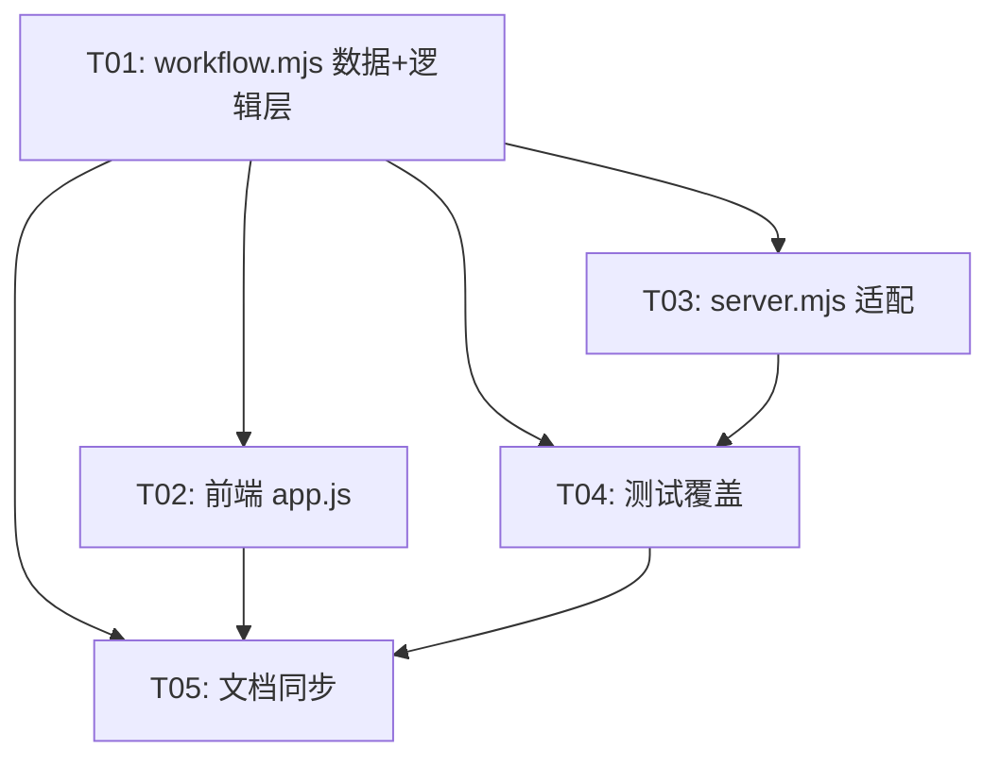

# 臻护 PoC 增量实现方案（需求增强 v0.2）

## Part A: 系统设计

### 1. 实现方案

**P0-1**: `riskItems()` 数组新增第 4 项 `dose_discrepancy`（severity=medium）；`data_conflict` 场景同时追加 `conflictRisk()`，共 5 项。

**P0-2**: `runAnalysis` 末尾添加 `adjustSeverityByDischargeTo()`，规则表：`{ 居家: { high→high, medium→high } }`。已有 `risk-renal-01` (medium) 将被升级为 high。

**P0-3**: `reviewRisk` 新增 `escalate` 分支，设 `status="escalated"` + `decision={action:"escalate",reason}`。`createTaskDraft` 中 `basedOnRiskIds` 过滤 `status!=="escalated"`。

**P0-6**: 每个 `evidence` 对象加 `source_type: "source_ehr"|"source_knowledge"|"source_hybrid"`，前端渲染为彩色标签。

### 2. 受影响文件清单

| 文件 | 修改项 |
|------|--------|
| `poc/api/workflow.mjs` | `riskItems()`: 新增第 4 项 dose_discrepancy；`snapshot()`: 不变；`runAnalysis`: 末尾加 `adjustSeverityByDischargeTo()`；`reviewRisk`: 新增 escalate 分支 + body 参数 reason；`createTaskDraft`: 过滤 escalated；所有 risk 的 evidence 加 source_type |
| `poc/web/app.js` | `renderRisks`: 增加 escalate 按钮、escalated 状态文案、source_type 标签；`statusText`: 加 `escalated: "已升级"`；`reviewRisk()`: 前端调用 escalate action |
| `poc/api/server.mjs` | `reviewMatch` 路由：body 传 `reason` 参数；无结构变更 |
| `poc/tests/workflow-state-machine.test.mjs` | 新增 escalate + dischargeTo + dose_discrepancy 测试用例 |

### 3. 数据结构变更

#### RiskItem 新增字段

```ts
// evidence 内新增
source_type: "source_ehr" | "source_knowledge" | "source_hybrid";

// risk 顶层（仅 escalated 时）
decision: { action: "escalate"; reason: string; actor: string; decidedAt: string };
status: "escalated"; // 新增枚举值
```

#### dose_discrepancy 风险项结构

```js
{
  riskId: "risk-dose-01",
  category: "dose_discrepancy",
  severity: "medium",
  severityLabel: "中风险",
  severityClass: "medium",
  type: "剂量偏差 · 需核实",
  title: "出院带药剂量与院内用药方案存在偏差",
  summary: "...",
  evidence: {
    label: "用药方案 · MedicationRequest-01",
    resourceType: "MedicationRequest",
    resourceRef: "MedicationRequest-01",
    fieldPath: "dosageInstruction.doseAndRate",
    snippet: "...",
    capturedAt: "...",
    source_type: "source_ehr"
  },
  citation: { ... }
}
```

#### 严重度调整规则

```js
const DISCHARGE_SEVERITY_RULES = {
  "居家": { high: "high", medium: "high", low: "low" }
};
```

### 4. 程序调用流

#### escalate 流程

```
医生 → POST /risks/:id/review {action:"escalate", reason:"..."}
  → workflow.reviewRisk("doctor", riskId, "escalate", reason)
    → risk.status = "escalated"
    → risk.decision = {action:"escalate", reason, actor, decidedAt}
    → 不触发状态转移（escalated 项不计入 pending/confirmed/rejected 统计）
```

#### createTaskDraft 变更

```
createTaskDraft →
  basedOnRiskIds = risks.filter(r => r.status === "confirmed").map(r => r.riskId)
  // escalated 项被忽略，不阻止草稿生成
```

### 5. 待明确事项

1. **escalate 是否计入 review 完成判定**：当前设计 escalated 不参与 pending 计数，即全部 review_pending 项处理完后（含 escalated），即使有 escalated 项也进入 confirmed/rejected。需确认。
2. **dischargeTo 扩展规则**：当前仅"居家"触发升级，是否需要其他去向（康复医院、社区）的规则？
3. **escalate 后能否回退**：设计上 escalated 项不可再次 review，需确认是否需要 de-escalate 操作。

## Part B: 任务分解

### 6. Required Packages

无需新增依赖。

### 7. 任务列表

| Task ID | 任务名 | 源文件 | 依赖 | 优先级 |
|---------|--------|--------|------|--------|
| T01 | workflow.mjs 数据与逻辑层：新增 dose_discrepancy + source_type + dischargeTo 严重度调整 + escalate 动作 | `poc/api/workflow.mjs` | 无 | P0 |
| T02 | 前端 app.js：escalate 按钮 + escalated 状态 + source_type 标签 | `poc/web/app.js` | T01 | P0 |
| T03 | server.mjs 适配：review 路由传 reason 参数 | `poc/api/server.mjs` | T01 | P0 |
| T04 | 测试覆盖：escalate 状态机 + dischargeTo 升级 + dose_discrepancy + source_type | `poc/tests/workflow-state-machine.test.mjs` | T01, T03 | P0 |
| T05 | 文档同步：03-状态机 + 04-e2e-cases + 05-验证结果 + CONTEXT | `poc/docs/architecture/03-状态机.md` 等 4 份 | T01-T04 | P1 |

### 8. Shared Knowledge

- escalate 后的项 `status === "escalated"`，不参与 `createTaskDraft` 的 `basedOnRiskIds` 收集
- `dischargeTo` 调整在 `runAnalysis` 中 `riskItems()` 赋值后立即执行，不依赖外部状态
- `source_type` 为手工构造字段，值固定为 `"source_ehr"` / `"source_knowledge"` / `"source_hybrid"`
- 所有新增代码沿用 `copy()` / `at()` 工具函数，不引入新工具方法

### 9. 任务依赖图



### 10. 测试用例增量

| ID | 测试名 | 覆盖 P0 |
|----|--------|---------|
| TC-01 | escalate 风险项后不计入 confirmed，草稿正常生成 | P0-3 |
| TC-02 | escalate 后 createTaskDraft 的 basedOnRiskIds 不包含 escalated 项 | P0-3 |
| TC-03 | dischargeTo="居家" 时 medium 风险升级为 high | P0-2 |
| TC-04 | data_conflict 场景含 5 个风险项（4 基础 + 1 冲突） | P0-1 |
| TC-05 | 每个风险项 evidence 含 source_type 字段且值合法 | P0-6 |

### 11. 架构文档更新清单

| 文档 | 更新内容 |
|------|----------|
| `03-状态机.md` | escalate 状态新增；dischargeTo 调整规则说明 |
| `04-e2e-cases.md` | 新增 E2E-16 escalate 审核 + E2E-17 dischargeTo 严重度调整 |
| `05-poc-validation-results.md` | 更新测试计数 (39→44+) 与新功能验证结论 |
| `CONTEXT.md` | 更新"当前可运行能力"列表，补充 P0-1~P0-6 中实现的功能项 |
